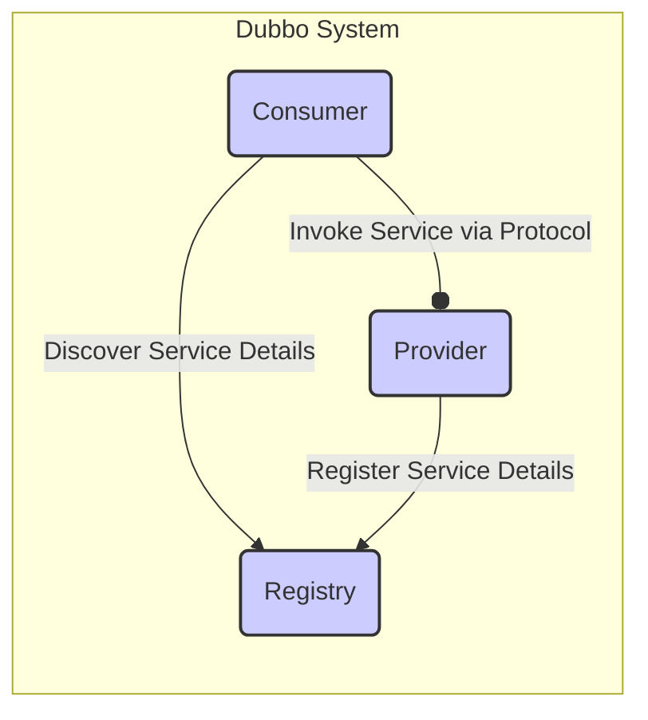
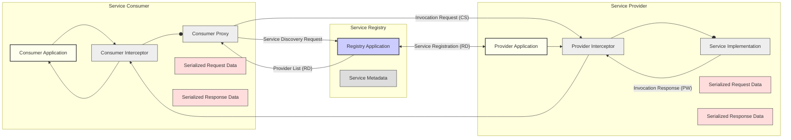

# Project Design Document: Apache Dubbo Framework (Improved for Threat Modeling)

**Version:** 1.1
**Date:** October 26, 2023
**Author:** AI Software Architect

## 1. Introduction

This document provides an enhanced design overview of the Apache Dubbo framework, specifically tailored for threat modeling. It aims to clearly describe the system architecture, key components, and their interactions with a strong emphasis on security-relevant aspects. This document will serve as the foundation for identifying potential security vulnerabilities and designing appropriate mitigations.

### 1.1. Purpose

The primary purpose of this document is to provide a comprehensive and security-focused understanding of the Apache Dubbo framework's design. It highlights components, their relationships, and data flows that are critical for identifying potential threats and vulnerabilities.

### 1.2. Scope

This document covers the core architectural components and functionalities of the Apache Dubbo framework, focusing on aspects relevant to security analysis. This includes interactions between key entities involved in service registration, discovery, and invocation, with particular attention to communication protocols, data serialization, and access control points.

### 1.3. Audience

This document is intended for:

* Security engineers and architects responsible for threat modeling, security assessments, and penetration testing.
* Development teams building and maintaining applications using the Apache Dubbo framework.
* Operations teams responsible for deploying, configuring, and monitoring Dubbo-based applications, with a focus on security.

## 2. System Overview

Apache Dubbo is a high-performance, lightweight Java RPC framework designed for building distributed microservice applications. It facilitates transparent remote procedure calls between service consumers and providers, offering features like service discovery, load balancing, and fault tolerance.

### 2.1. Key Components

* **Provider:** Exposes services for consumption. Registers service details with the registry.
* **Consumer:** Discovers and invokes services offered by providers, retrieving service information from the registry.
* **Registry:** A central directory maintaining a list of available services and their provider locations (e.g., ZooKeeper, Nacos, Redis). This is a critical component for service discovery.
* **Monitor (Optional):** Collects and aggregates service invocation metrics, potentially exposing sensitive performance data.
* **Invocation:** The process of a consumer calling a method on a provider, involving data serialization and network communication.
* **Protocol:** Defines the communication method used for service invocation (e.g., Dubbo, gRPC, HTTP), each with different security characteristics.
* **Serialization:** The mechanism for converting objects into a transmittable format (e.g., Hessian, Protobuf, JSON), a key area for potential vulnerabilities.

### 2.2. High-Level Architecture

## 3. Detailed Design

### 3.1. Service Registration

This process involves the provider informing the registry about the services it offers, a critical point for ensuring only legitimate providers are registered.

* The provider starts and initializes its service implementation.
* The provider establishes a connection to the configured registry.
* The provider registers its service interface, version, group, and other metadata, including its network address and supported protocol. **Security Implication:** Lack of authentication here allows malicious providers to register.
* The registry stores this information, making it available for consumers. **Security Implication:** Compromised registry can provide incorrect or malicious provider information.

### 3.2. Service Discovery

This process allows consumers to find available providers, a potential point for redirection attacks if the registry is compromised.

* The consumer starts and connects to the configured registry.
* The consumer subscribes to specific services based on interface, version, and group.
* The registry sends the consumer a list of matching providers, including their network addresses. **Security Implication:**  A compromised registry could return malicious provider addresses.
* The consumer typically caches this list.
* The registry may push updates to the consumer if the provider list changes.

### 3.3. Service Invocation

This is the core communication path and a primary target for attacks.

* The consumer selects a provider from the discovered list, potentially using a load balancing strategy. **Security Implication:** Load balancing algorithms might be exploitable to target specific providers.
* The consumer creates an invocation request containing the service interface, method name, parameters, and other metadata.
* The invocation request is serialized using the configured serialization mechanism. **Security Implication:** Insecure deserialization vulnerabilities can be exploited here.
* The serialized request is sent to the selected provider over the configured protocol. **Security Implication:** The chosen protocol's security features (or lack thereof) are critical.
* The provider receives the request, deserializes it. **Security Implication:** Provider is vulnerable to deserialization attacks.
* The provider invokes the corresponding service method.
* The provider serializes the result of the method invocation.
* The serialized result is sent back to the consumer.
* The consumer receives the response and deserializes it. **Security Implication:** Consumer is also vulnerable to deserialization attacks from the provider.

### 3.4. Communication Protocols

The choice of protocol significantly impacts security.

* **Dubbo Protocol:** A binary protocol over TCP. Security features like encryption and authentication need to be explicitly configured. **Security Implication:** Default configuration might be insecure.
* **gRPC:** Uses HTTP/2 and often employs TLS for encryption and authentication. **Security Implication:** Requires proper TLS configuration.
* **HTTP/REST:** Can leverage HTTPS for secure communication. **Security Implication:** Security depends on proper HTTPS implementation.

### 3.5. Data Serialization

Serialization mechanisms have inherent security risks.

* **Hessian:** A binary serialization protocol. Known for deserialization vulnerabilities. **Security Implication:** Requires careful handling of untrusted data.
* **Fastjson/Jackson (JSON):** Text-based, but still susceptible to deserialization vulnerabilities if not configured correctly. **Security Implication:**  Need to restrict class types allowed for deserialization.
* **Protobuf:** Generally considered safer against deserialization attacks due to its schema-based nature. **Security Implication:**  Schema validation is crucial.
* **Kryo:** A fast binary serializer, also known for potential deserialization issues. **Security Implication:**  Requires careful usage and security considerations.

### 3.6. Configuration

Configuration management is crucial for security.

* **XML Configuration:** Sensitive information might be stored in plain text. **Security Implication:** Requires secure storage and access control for XML files.
* **Annotation-based Configuration:** Configuration is embedded in code, potentially making it harder to manage secrets.
* **API Configuration:** Offers more programmatic control but still requires secure handling of sensitive data.
* **Properties Files:** Similar security concerns to XML configuration.
* **Environment Variables:** Can be a more secure way to manage secrets if the environment is properly secured.

### 3.7. Monitoring

While optional, the monitor can expose sensitive data.

* Providers and consumers send invocation statistics to the monitor. **Security Implication:** This data might include sensitive information about service usage and performance.
* The monitor aggregates this data, potentially storing it in a database. **Security Implication:** The monitor itself needs to be secured.
* Access to monitoring data needs to be controlled.

## 4. Data Flow Diagram (Security Focused)

This diagram highlights the flow of data and potential interception points.

## 5. Security Considerations (Detailed for Threat Modeling)

This section expands on potential security threats based on the design.

* **Registry Security:**
    * **Threat:** Unauthorized service registration by malicious actors. **Mitigation:** Implement strong authentication and authorization for registry access.
    * **Threat:** Tampering with service metadata, leading consumers to malicious providers. **Mitigation:** Ensure registry data integrity and use secure communication channels.
    * **Threat:** Denial-of-service attacks against the registry, disrupting service discovery. **Mitigation:** Implement rate limiting and robust infrastructure for the registry.
* **Communication Security:**
    * **Threat:** Man-in-the-middle attacks intercepting or modifying communication between consumers and providers. **Mitigation:** Enforce encryption using TLS/SSL for all communication.
    * **Threat:** Replay attacks where captured requests are re-sent. **Mitigation:** Implement nonce or timestamp-based protection mechanisms.
    * **Threat:** Lack of mutual authentication allowing unauthorized consumers or providers to interact. **Mitigation:** Implement mutual TLS or other strong authentication methods.
* **Serialization Security:**
    * **Threat:** Remote code execution through insecure deserialization of malicious payloads. **Mitigation:** Avoid vulnerable serialization libraries, sanitize input, and restrict deserialization to expected classes.
    * **Threat:** Denial-of-service by sending large or complex serialized payloads. **Mitigation:** Implement size limits and validation for serialized data.
* **Access Control:**
    * **Threat:** Unauthorized access to services by consumers. **Mitigation:** Implement robust authentication and authorization mechanisms at the service level.
    * **Threat:** Privilege escalation if access control is not properly enforced. **Mitigation:** Follow the principle of least privilege.
* **Configuration Security:**
    * **Threat:** Exposure of sensitive configuration data (e.g., credentials). **Mitigation:** Use secure storage mechanisms for configuration data, such as encrypted files or secrets management tools.
    * **Threat:** Unauthorized modification of configuration leading to security breaches. **Mitigation:** Implement access control for configuration management.
* **Monitoring Security:**
    * **Threat:** Unauthorized access to monitoring data, potentially revealing sensitive information. **Mitigation:** Implement authentication and authorization for accessing monitoring data.
    * **Threat:** Tampering with monitoring data, hiding malicious activity. **Mitigation:** Ensure the integrity of monitoring data.
* **Dependency Management:**
    * **Threat:** Vulnerabilities in third-party libraries used by Dubbo. **Mitigation:** Regularly scan dependencies for vulnerabilities and update them promptly.

## 6. Assumptions and Constraints

* It is assumed that the underlying network infrastructure provides a basic level of security.
* This document focuses on the core Dubbo framework; application-specific security measures are the responsibility of the application developers.
* Threat modeling will involve deeper analysis of specific attack vectors and potential vulnerabilities based on this design.

## 7. Future Considerations (Security Enhancements)

* Explore tighter integration with security frameworks like Spring Security for centralized authentication and authorization.
* Investigate more advanced authentication and authorization protocols like OAuth 2.0 and OpenID Connect.
* Enhance auditing and logging capabilities to provide better visibility into security-related events.
* Consider incorporating features for rate limiting and request throttling to mitigate denial-of-service attacks.
* Provide clearer guidance and best practices for secure configuration and deployment of Dubbo applications.

This improved document provides a more detailed and security-focused understanding of the Apache Dubbo framework, serving as a strong foundation for comprehensive threat modeling activities.
