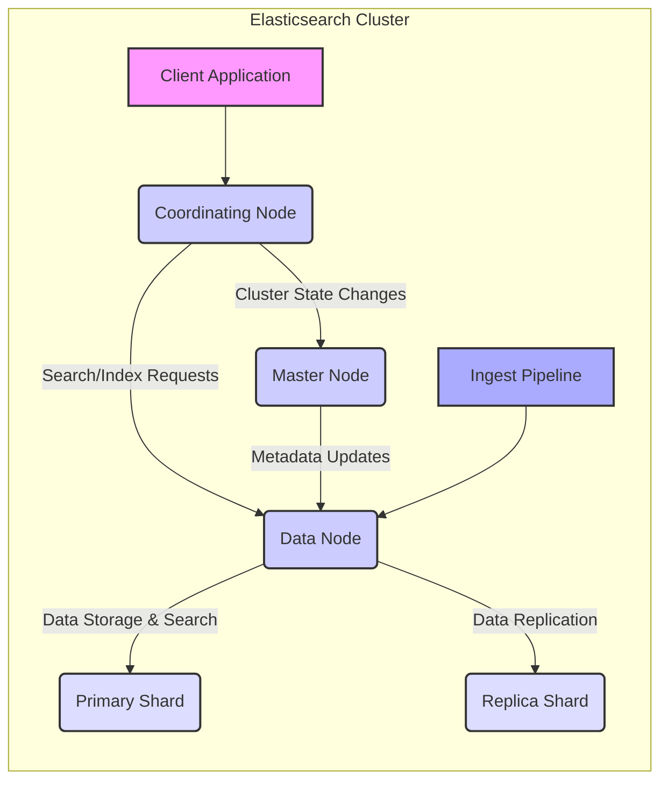

# Project Design Document: Elasticsearch

**Version:** 1.1
**Date:** October 26, 2023
**Author:** AI Software Architect

## 1. Introduction

This document provides a detailed architectural design of the Elasticsearch system, based on the project available at [https://github.com/elastic/elasticsearch](https://github.com/elastic/elasticsearch). This document is specifically crafted to serve as a comprehensive foundation for subsequent threat modeling activities. It meticulously outlines the key components, their interactions, data flow, and security considerations, providing the necessary context for identifying potential vulnerabilities and attack vectors.

## 2. System Overview

Elasticsearch is a distributed, RESTful search and analytics engine designed for scalability, high availability, and near real-time data exploration. As a central component of the Elastic Stack, it facilitates the storage, search, and analysis of large volumes of diverse data.

**Key Characteristics:**

*   **Distributed Architecture:** Operates across multiple nodes, enabling horizontal scaling and fault tolerance.
*   **Schema-on-Write (with Inference):** While flexible, Elasticsearch infers data types during indexing, which impacts search and analysis.
*   **Near Real-time Operations:**  Data is typically searchable within one second of being indexed.
*   **Comprehensive REST API:**  Provides a well-defined interface for all interactions, including data ingestion, search, and cluster management.
*   **Inverted Indexing:**  Utilizes inverted indices for efficient full-text search capabilities.
*   **Powerful Aggregations:**  Supports complex data aggregations for analytical purposes.

## 3. Architectural Design

The fundamental building block of Elasticsearch is the cluster, a collection of interconnected nodes working collaboratively to store and process data.

### 3.1. High-Level Architecture Diagram

### 3.2. Key Components

*   **Nodes:** Individual running instances of Elasticsearch. Each node performs specific roles within the cluster:
    *   **Master Node:** Manages the cluster state, including index creation/deletion, shard allocation, and node tracking. A stable master node is critical for cluster health. Compromise of the master node can have significant impact.
    *   **Data Node:** Stores indexed data in shards and performs search and indexing operations on that data. Data nodes are resource-intensive and their security is paramount for data integrity and confidentiality.
    *   **Coordinating Node:** Acts as a request router, receiving client requests, forwarding them to the appropriate data nodes, and aggregating the results. It doesn't hold data itself. Can be a point of attack for gaining access to the cluster.
    *   **Ingest Node:**  Optionally preprocesses documents before indexing, performing transformations and enrichments. Malicious ingest pipelines could introduce vulnerabilities or compromise data integrity.
    *   **Machine Learning Node:** Executes machine learning jobs for anomaly detection, forecasting, etc. Compromise could lead to inaccurate analysis or unauthorized data access.
    *   **Tribe Node (Deprecated):**  Connected to multiple clusters, acting as a federated client. *Note: While deprecated, understanding its potential presence in older deployments is important for threat modeling legacy systems.*
*   **Cluster:** A unified collection of nodes that collectively hold and manage the data. The cluster name identifies the group of nodes.
*   **Indices:** Logical groupings of documents that share similar characteristics. Indices are identified by a unique name.
*   **Documents:** The fundamental unit of data within Elasticsearch, represented in JSON format. Each document has a unique ID within an index.
*   **Shards:**  Indices are horizontally partitioned into shards. This allows for distributing the data across multiple nodes.
    *   **Primary Shards:** The original, authoritative copy of the data. Loss of primary shards without replicas leads to data loss.
    *   **Replica Shards:** Copies of primary shards, providing redundancy for high availability and increased read performance. Replicas enhance resilience against data node failures.
*   **Mappings:** Define the schema for documents within an index, including data types and indexing options for each field. Incorrect or overly permissive mappings can introduce vulnerabilities.
*   **Settings:**  Configuration parameters for the cluster, indices, and nodes, controlling various aspects of their behavior. Misconfigured settings can create security loopholes.
*   **Plugins:** Extend Elasticsearch's core functionality, adding features like security, analysis, and discovery. Vulnerabilities in plugins can expose the system to risks.

### 3.3. Data Flow

Understanding how data moves through the system is crucial for identifying potential interception points and vulnerabilities.

1. **Ingestion:** Data enters the Elasticsearch cluster through various methods:
    *   **REST API (HTTP/HTTPS):** Clients send HTTP requests (POST, PUT) to specific endpoints to index documents. This is a primary entry point and requires careful security considerations.
    *   **Logstash/Beats:** Data shippers collect, process, and forward data to Elasticsearch. Compromised shippers can inject malicious data.
    *   **Kafka Connect:** Integrates Elasticsearch with Apache Kafka, enabling streaming data ingestion. Security of the Kafka pipeline is also relevant.
    *   **Application Code (Direct Clients):** Applications can directly interact with the Elasticsearch API. Security depends on the client implementation.
2. **Routing:** When a request arrives, the coordinating node determines the target index and routes the request to the data node(s) hosting the relevant primary shard(s). This routing decision is based on the document ID (for indexing) or the search query.
3. **Ingest Pipeline Processing (Optional):** If configured, the ingest node processes the document according to the defined pipeline, performing transformations and enrichments before indexing.
4. **Indexing:** The data node hosting the primary shard receives the document and indexes it, creating entries in the inverted index.
5. **Replication:** The primary shard then replicates the indexed document to its replica shards on other data nodes. This ensures data durability and availability.
6. **Search:** Clients send search requests via the REST API, specifying the index and search criteria.
7. **Query Processing:** The coordinating node analyzes the search request and identifies the shards that need to be queried.
8. **Distributed Search:** The coordinating node forwards the query to the data nodes hosting the relevant primary and replica shards.
9. **Local Search Execution:** Each data node executes the search query on its local shards.
10. **Result Aggregation:** The coordinating node receives the results from the queried shards, aggregates them, and ranks them according to relevance.
11. **Response:** The coordinating node returns the final search results to the client.

### 3.4. Communication Protocols

*   **REST API (HTTP/HTTPS):**  The primary interface for client interaction, cluster management, and monitoring. HTTPS is crucial for securing communication.
*   **Transport Protocol (TCP):** Used for internal communication between nodes within the cluster. Encryption (TLS) for the transport layer is essential for securing inter-node communication.

## 4. Security Considerations

Security in Elasticsearch is multifaceted and requires careful configuration and ongoing management.

*   **Authentication:** Verifying the identity of users or systems attempting to access the cluster. Without proper authentication, unauthorized access is possible.
    *   **Basic Authentication:** Username and password-based authentication. Susceptible to brute-force attacks if not combined with other security measures.
    *   **API Keys:**  Tokens for authenticating requests. Proper storage and rotation of API keys are critical.
    *   **Token-based Authentication (e.g., JWT):**  Using tokens for authentication, often integrated with external identity providers. Token validation and secure key management are important.
    *   **SAML/Kerberos/OIDC:** Integration with enterprise identity providers for centralized authentication. Requires proper configuration and trust relationships.
*   **Authorization:** Controlling what authenticated users or systems are permitted to do within the cluster. Insufficient authorization can lead to data breaches or unauthorized modifications.
    *   **Role-Based Access Control (RBAC):** Assigning roles with specific privileges to users. Proper role definition and assignment are crucial.
    *   **Attribute-Based Access Control (ABAC):** Granting access based on user and resource attributes. Offers finer-grained control but can be more complex to manage.
    *   **Document-Level Security:** Restricting access to specific documents within an index based on user roles or attributes. Important for multi-tenant environments.
    *   **Field-Level Security:** Restricting access to specific fields within documents. Useful for protecting sensitive information.
*   **Network Security:** Securing the network infrastructure surrounding the Elasticsearch cluster.
    *   **TLS/SSL:** Encrypting communication between clients and the cluster (HTTPS) and between nodes within the cluster (transport layer encryption). Essential for protecting data in transit.
    *   **Firewalls:** Restricting network access to the cluster to only authorized sources and ports. Limits the attack surface.
    *   **Network Segmentation:** Isolating the Elasticsearch cluster within a dedicated network segment to limit the impact of breaches in other areas.
*   **Audit Logging:**  Tracking user actions and system events for security monitoring, compliance, and incident response. Detailed logs are crucial for investigating security incidents.
*   **Data at Rest Encryption:** Encrypting data stored on disk to protect against unauthorized access if storage media is compromised.
*   **Security Auditing:**  Regularly reviewing security configurations and logs to identify potential vulnerabilities and suspicious activity.
*   **IP Filtering:** Restricting access to the cluster based on source IP addresses. Can be useful for limiting access from known locations.
*   **Security Realms:**  Configurable mechanisms for authenticating users, such as file-based, LDAP, Active Directory, or PKI. The choice of realm impacts the authentication process and security.

## 5. Deployment Models

The chosen deployment model significantly impacts the security considerations and the overall threat landscape.

*   **Self-Managed:** Installing and managing Elasticsearch on your own infrastructure (on-premises or in the cloud). Requires the organization to handle all aspects of security, including patching, hardening, and access control.
*   **Elastic Cloud (Elasticsearch Service):** A managed service offered by Elastic. Elastic handles infrastructure security and some aspects of application security, but users are still responsible for configuring access control and securing their data.
*   **Cloud Provider Managed Services (e.g., Amazon OpenSearch Service, Azure Cognitive Search, Google Cloud):** Managed Elasticsearch offerings from cloud providers. Security responsibilities are shared between the provider and the user. Understanding the shared responsibility model is crucial.
*   **Containerized Deployments (Docker, Kubernetes):** Deploying Elasticsearch within containers offers portability and scalability but introduces container security considerations.

## 6. External Dependencies

Elasticsearch relies on and interacts with various external systems, which can introduce additional security considerations.

*   **Client Applications:** Applications that send data to and query data from Elasticsearch. Vulnerabilities in client applications can be exploited to compromise the Elasticsearch cluster.
*   **Logstash/Beats:** For data ingestion and processing. Compromised shippers can inject malicious data or expose sensitive information.
*   **Kibana:** For data visualization and exploration. Security vulnerabilities in Kibana can provide access to Elasticsearch data.
*   **Apache Kafka/Message Queues:** For asynchronous data ingestion. The security of the message queue infrastructure is important to ensure data integrity and confidentiality.
*   **Databases:** As a source of data for indexing. The security of the source databases is crucial to prevent the ingestion of compromised data.
*   **Identity Providers (SAML, LDAP, OIDC):** For authentication. The security of the identity provider directly impacts the security of the Elasticsearch cluster.
*   **Monitoring Systems (e.g., Prometheus, Grafana):** For monitoring cluster health and performance. Access to monitoring data should be controlled to prevent information leakage.

## 7. Assumptions and Constraints

*   This design document focuses on the core Elasticsearch system and does not delve into the specifics of every available plugin.
*   The security features described are available but require explicit configuration and ongoing management to be effective.
*   The specific deployment model chosen will significantly influence the applicable security controls and the overall security posture.
*   The underlying network infrastructure is assumed to have basic security measures in place (e.g., routing, switching security).

## 8. Threat Modeling Considerations

This design document highlights several key areas that are critical for effective threat modeling:

*   **Authentication and Authorization Boundaries:**  Weaknesses in authentication mechanisms (e.g., default credentials, weak passwords) or authorization policies (e.g., overly permissive roles) can lead to unauthorized access and data breaches (Confidentiality, Integrity).
*   **REST API Endpoints as Attack Vectors:**  Unsecured or vulnerable API endpoints can be exploited for data injection, data retrieval, or denial-of-service attacks (Confidentiality, Integrity, Availability). Consider input validation and rate limiting.
*   **Inter-Node Communication Security:** Lack of encryption or authentication for inter-node communication can allow attackers to eavesdrop on sensitive data or manipulate cluster operations (Confidentiality, Integrity, Availability).
*   **Data Ingestion Pipeline Vulnerabilities:**  Compromised data sources or insecure ingestion pipelines can introduce malicious data, leading to data corruption or the execution of arbitrary code (Integrity, Availability).
*   **Plugin Security Risks:**  Vulnerabilities in installed plugins can provide attackers with entry points to the system or allow them to escalate privileges (Confidentiality, Integrity, Availability).
*   **Configuration Management Weaknesses:**  Misconfigurations, such as open ports, default settings, or overly permissive access controls, can create significant security vulnerabilities (Confidentiality, Integrity, Availability).
*   **External Dependency Risks:**  Vulnerabilities in external systems that interact with Elasticsearch can be exploited to gain access to the cluster or compromise its data (Confidentiality, Integrity, Availability).
*   **Deployment Environment Specific Threats:**  The chosen deployment model introduces specific threats. For example, in self-managed deployments, the organization is responsible for OS and infrastructure security, while managed services have different shared responsibility models (Confidentiality, Integrity, Availability).
*   **Data Storage Security:**  Lack of encryption at rest can expose sensitive data if storage media is compromised (Confidentiality). Insufficient access controls to the underlying storage can also be a risk.

This document provides a comprehensive architectural overview of Elasticsearch, specifically designed to facilitate thorough threat modeling. The identified components, data flows, and security considerations serve as a foundation for systematically identifying potential threats, vulnerabilities, and appropriate mitigation strategies. A dedicated threat model document should further elaborate on these considerations, applying specific threat modeling methodologies.