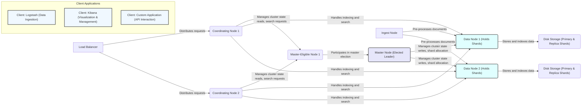
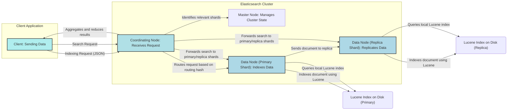

# Project Design Document: Elasticsearch

**Version:** 1.1
**Date:** October 26, 2023
**Author:** AI Software Architect

## 1. Introduction

This document provides an enhanced architectural design of the Elasticsearch project, building upon the initial version and incorporating more detailed explanations. It is based on the information available in the provided GitHub repository (https://github.com/elastic/elasticsearch). This document serves as a robust foundation for future threat modeling activities, offering a clear understanding of the system's components, interactions, data flows, and security considerations.

## 2. Goals

*   Provide a comprehensive and detailed overview of the Elasticsearch architecture.
*   Clearly define the roles and functionalities of key components.
*   Illustrate the data flow within the system with enhanced clarity.
*   Highlight relevant security aspects, potential vulnerabilities, and mitigation strategies.
*   Serve as a well-defined basis for conducting thorough and effective threat modeling exercises.

## 3. System Overview

Elasticsearch is a highly scalable and resilient distributed search and analytics engine built on Apache Lucene. It offers near real-time search and analysis of various data types. Its RESTful API and schema-free nature make it versatile for a wide range of applications.

Here's a more detailed high-level architectural diagram:

## 4. Detailed Component Design

The Elasticsearch architecture is built upon several interacting components, each with specific responsibilities:

*   **Nodes:**  Individual instances of the Elasticsearch service. They collaborate to form a cluster.
    *   **Master-Eligible Nodes:**  Can participate in the election process to become the Master Node. They hold the current cluster state and are crucial for cluster stability.
    *   **Master Node:**  A single elected node responsible for managing cluster-wide metadata, such as index creation/deletion, shard allocation, and node tracking. It's the central authority for cluster configuration.
    *   **Data Nodes:**  Store the actual indexed data. They perform CPU and I/O intensive operations related to indexing, searching, and data retrieval. Performance and storage capacity are key considerations for data nodes.
    *   **Coordinating Nodes (Client Nodes):**  Act as intelligent load balancers and request routers. They handle incoming client requests, route them to the appropriate data nodes, and aggregate the results. They don't hold data themselves, offloading data management tasks.
    *   **Ingest Nodes:**  Provide a way to pre-process documents before they are indexed. They execute a series of processors (e.g., grok, date, set, remove) to transform and enrich data, reducing the load on data nodes.
    *   **Machine Learning Nodes:** Execute machine learning jobs within the Elasticsearch cluster, enabling anomaly detection, forecasting, and other analytical tasks.

*   **Cluster:** A collection of interconnected nodes working together as a single, logical unit. The cluster provides horizontal scalability and high availability.

*   **Indices:**  Logical groupings of documents that share similar characteristics. Think of them as analogous to databases in a relational database system. Index names are always lowercase.

*   **Documents:** The fundamental unit of information in Elasticsearch, represented in JSON format. Each document has a set of fields with associated values.

*   **Shards:**  Horizontal partitions of an index. Sharding distributes the data across multiple nodes, allowing for parallel processing and increased capacity.
    *   **Primary Shards:** The original shards where documents are initially indexed. The number of primary shards is defined at index creation and cannot be easily changed later.
    *   **Replica Shards:**  Copies of primary shards. They provide redundancy for data safety (in case of node failure) and increase read performance by allowing search requests to be served from multiple copies.

*   **Mappings:**  Define the schema for the documents within an index. They specify the data type of each field and how it should be indexed and analyzed. Mappings can be defined explicitly or dynamically inferred by Elasticsearch.

*   **Analyzers:**  Process text fields during indexing and search. They break down text into tokens, apply transformations (e.g., lowercase, stemming), and remove stop words to make the text searchable.

*   **REST API:** The primary interface for interacting with Elasticsearch. It provides a comprehensive set of endpoints for tasks such as:
    *   Indexing documents (`PUT /<index>/_doc/<id>`)
    *   Searching documents (`POST /<index>/_search`)
    *   Managing indices (`PUT /<index>`)
    *   Retrieving cluster health (`GET /_cluster/health`)
    *   Managing nodes (`GET /_cat/nodes`)

*   **Transport Layer:**  Facilitates internal communication between nodes within the cluster. It uses a binary protocol for efficient data exchange.

*   **Discovery Mechanisms:** Enable nodes to find and connect with each other to form a cluster. Common discovery methods include:
    *   **Unicast:** Nodes explicitly list the addresses of other nodes to connect to.
    *   **Zen Discovery (Deprecated):**  A legacy discovery module.
    *   **Elasticsearch Service Discovery:** Integrates with cloud provider services for automatic node discovery.

*   **Plugins:** Extend Elasticsearch's core functionality. Examples include:
    *   **Security Plugins (e.g., Open Distro for Elasticsearch Security, Search Guard):**  Provide authentication, authorization, and encryption features.
    *   **Analysis Plugins:**  Add new analyzers and tokenizers for different languages or data types.
    *   **Mapper Plugins:**  Introduce new field data types.

## 5. Data Flow

The data flow within Elasticsearch involves distinct stages for indexing and searching:

*   **Indexing Data Flow:**
    *   A client sends an indexing request containing a JSON document to a Coordinating Node.
    *   The Coordinating Node uses a routing algorithm (typically based on the document ID's hash) to determine the target Data Node and Primary Shard for the document.
    *   The document is sent to the designated Data Node.
    *   The Data Node indexes the document on its Primary Shard using the underlying Lucene library.
    *   The Primary Shard then replicates the document to its assigned Replica Shards on other Data Nodes, ensuring data redundancy.

*   **Searching Data Flow:**
    *   A client sends a search request to a Coordinating Node.
    *   The Coordinating Node analyzes the search request to identify the relevant indices and shards that need to be queried.
    *   The search request is forwarded to the Primary or Replica Shards of the relevant indices, distributed across the Data Nodes.
    *   Each shard executes the search query locally against its Lucene index.
    *   The results from each shard are returned to the Coordinating Node.
    *   The Coordinating Node aggregates and reduces the results from all the queried shards, performing tasks like sorting and ranking, before returning the final result set to the client.

## 6. Security Considerations

Security is paramount for any Elasticsearch deployment. Here are key considerations with examples:

*   **Authentication and Authorization:**  Verifying user identity and controlling access to resources.
    *   **Threat:** Unauthorized access to sensitive data or cluster management functions.
    *   **Controls:**
        *   Enable built-in security features or use security plugins like the Elastic Stack Security features (formerly X-Pack Security).
        *   Implement strong password policies and multi-factor authentication.
        *   Utilize API keys for programmatic access with specific privileges.
        *   Configure Role-Based Access Control (RBAC) to grant granular permissions based on user roles.
        *   Consider Attribute-Based Access Control (ABAC) for more dynamic and context-aware access control.
        *   Integrate with external authentication providers like LDAP, Active Directory, or SAML using security realms.

*   **Network Security:**  Protecting the network communication and access to the cluster.
    *   **Threat:** Man-in-the-middle attacks, unauthorized network access.
    *   **Controls:**
        *   Enforce TLS/SSL encryption for all communication between nodes (transport layer) and between clients and the cluster (HTTP layer).
        *   Use firewalls to restrict network access to only necessary ports and IP addresses.
        *   Implement network segmentation to isolate the Elasticsearch cluster within a secure network zone.

*   **Data Security:**  Protecting the confidentiality and integrity of the data stored in Elasticsearch.
    *   **Threat:** Data breaches, unauthorized data modification.
    *   **Controls:**
        *   Enable encryption at rest to protect data stored on disk.
        *   Implement field-level security to control access to specific fields within documents.
        *   Utilize document-level security to restrict access to specific documents based on user permissions.
        *   Consider data masking or redaction techniques to obscure sensitive information.

*   **Auditing:**  Tracking user actions and system events for security monitoring and compliance.
    *   **Threat:**  Lack of visibility into security-related events.
    *   **Controls:**
        *   Enable the Elasticsearch audit log to record events like authentication attempts, index modifications, and search queries.
        *   Integrate audit logs with security information and event management (SIEM) systems for analysis and alerting.

*   **Input Validation:**  Sanitizing and validating user inputs to prevent injection attacks.
    *   **Threat:**  Malicious code injection through API requests.
    *   **Controls:**
        *   Implement strict input validation on all API endpoints to prevent injection attacks (e.g., Elasticsearch Query DSL injection).
        *   Follow the principle of least privilege when granting permissions to users and applications.

*   **Plugin Security:**  Managing the security risks associated with installed plugins.
    *   **Threat:** Vulnerabilities in third-party plugins.
    *   **Controls:**
        *   Only install plugins from trusted sources.
        *   Regularly review and update installed plugins to patch security vulnerabilities.
        *   Consider the security implications of each plugin before installation.

*   **Operating System and Java Security:**  Securing the underlying infrastructure.
    *   **Threat:** Exploitation of vulnerabilities in the OS or JVM.
    *   **Controls:**
        *   Keep the operating system and Java Virtual Machine (JVM) up-to-date with the latest security patches.
        *   Harden the operating system according to security best practices.

*   **Resource Limits:**  Protecting against resource exhaustion and denial-of-service attacks.
    *   **Threat:**  Overloading the cluster with excessive requests.
    *   **Controls:**
        *   Configure appropriate resource limits (e.g., memory, CPU) for Elasticsearch nodes.
        *   Implement request rate limiting to prevent abuse.

## 7. External Dependencies

Elasticsearch relies on and integrates with several external components:

*   **Java Virtual Machine (JVM):** Elasticsearch is a Java-based application and requires a compatible JVM to run. The specific JVM version can impact performance and stability.
*   **Operating System:**  Elasticsearch can be deployed on various operating systems, each with its own security considerations and configurations.
*   **File System:**  The underlying file system is crucial for storing the Lucene indices. Disk performance and available space directly impact Elasticsearch performance.
*   **Network Infrastructure:**  A stable and reliable network is essential for communication between nodes and with clients. Network latency can affect cluster performance.
*   **Kibana:** A powerful visualization and analytics platform designed to work seamlessly with Elasticsearch. It provides a user interface for exploring and managing Elasticsearch data.
*   **Logstash:** A data processing pipeline that can collect, transform, and forward data to Elasticsearch. It's often used for log management and data ingestion.
*   **Beats:** Lightweight data shippers that collect data from various sources and send it to Logstash or Elasticsearch. Examples include Filebeat, Metricbeat, and Auditbeat.
*   **Security Plugins (Optional):**  As mentioned earlier, plugins like the Elastic Stack Security features or third-party alternatives enhance security capabilities.
*   **Cloud Provider Services (for cloud deployments):**  Managed Elasticsearch services or underlying infrastructure components provided by cloud platforms like AWS, Azure, or GCP.

## 8. Deployment Considerations

The deployment model significantly impacts the management, scalability, and security of Elasticsearch:

*   **On-Premise:**  Offers maximum control over the infrastructure and security but requires significant operational overhead for setup, maintenance, and scaling. Security is the responsibility of the deploying organization.
*   **Cloud (Managed Services):**  Reduces operational overhead as the cloud provider manages the underlying infrastructure, patching, and scaling. Security is a shared responsibility model. Examples include Elastic Cloud, AWS Elasticsearch Service, and Google Cloud Elasticsearch.
*   **Cloud (Self-Managed on VMs):** Provides more control than managed services but requires more manual configuration and management of the underlying virtual machines. Security configuration is primarily the user's responsibility.
*   **Containers (Docker, Kubernetes):** Enables portability, scalability, and efficient resource utilization. Requires expertise in container orchestration. Security considerations include container image security and orchestration platform security.

## 9. Future Considerations

*   **Regular Security Assessments:**  Conduct periodic vulnerability scans and penetration testing to identify potential weaknesses.
*   **Adherence to Security Best Practices:**  Continuously review and implement security best practices recommended by Elastic and the security community.
*   **Stay Informed about Security Updates:**  Monitor security advisories and promptly apply necessary patches and updates to Elasticsearch and its dependencies.
*   **Disaster Recovery Planning:**  Implement strategies for data backup and recovery to ensure business continuity in case of failures.
*   **Performance Monitoring and Optimization:**  Continuously monitor cluster performance and optimize configurations to maintain efficiency and responsiveness.

This enhanced design document provides a more detailed and comprehensive understanding of the Elasticsearch architecture, serving as a valuable resource for in-depth threat modeling and security analysis.