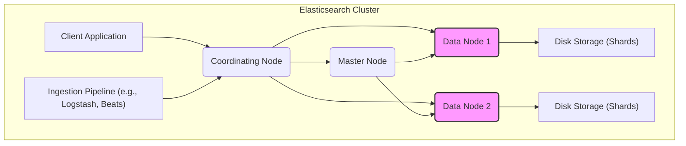
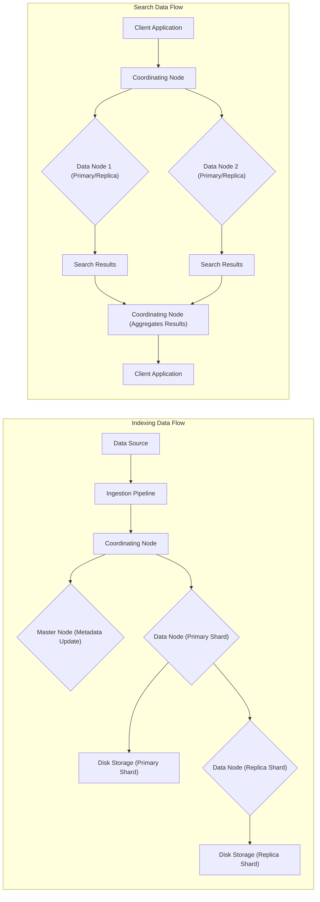

## Project Design Document: Elasticsearch (Improved)

**1. Introduction**

This document provides a detailed architectural design of the Elasticsearch project, based on the information available in the public GitHub repository: [https://github.com/elastic/elasticsearch](https://github.com/elastic/elasticsearch). This document is specifically tailored to serve as a foundation for subsequent threat modeling activities. It outlines the key components, data flows, interactions, and security boundaries within the Elasticsearch system.

**2. System Overview**

Elasticsearch is a distributed, RESTful search and analytics engine designed for scalability, high availability, and near real-time data access. As a core component of the Elastic Stack, it centralizes data storage, enabling powerful search, analysis, and visualization capabilities.

Key characteristics of Elasticsearch include:

*   **Distributed, Shared-Nothing Architecture:** Data is distributed across multiple nodes, with each node owning a subset of the data (shards). This provides scalability and resilience.
*   **Document-Oriented Storage:** Data is stored as JSON documents within indices.
*   **Inverted Index:**  Utilizes an inverted index structure for efficient full-text searching.
*   **Near Real-Time (NRT) Search:** Changes to documents are typically searchable within one second.
*   **Extensible Plugin Architecture:** Allows for extending functionality through plugins (e.g., security, analysis).
*   **RESTful API:**  Primary interaction is through a comprehensive RESTful API over HTTP.

**3. Architectural Diagram**

**4. Key Components**

*   **Client Application:** Any external system or application that interacts with the Elasticsearch cluster. This includes applications performing indexing, search queries, administrative tasks, or data analysis. Examples include web applications, monitoring dashboards, and data ingestion tools.
*   **Ingestion Pipeline (e.g., Logstash, Beats):**  External components responsible for collecting, optionally transforming, and enriching data from various sources before sending it to Elasticsearch for indexing. These pipelines often act as the entry point for data into the system.
*   **Coordinating Node:**  A node that acts as a request router and result aggregator. It receives client requests, identifies the relevant Data Nodes, forwards the requests, and consolidates the responses. Coordinating Nodes do not hold data themselves but manage the interaction with Data Nodes.
*   **Master Node:**  A specialized node responsible for cluster-level management and maintaining the cluster state. Key responsibilities include:
    *   Managing the cluster topology and metadata (indices, mappings, settings).
    *   Handling index creation and deletion.
    *   Shard allocation and relocation across Data Nodes.
    *   Monitoring the health and status of nodes within the cluster.
    *   Electing a new master if the current one fails.
*   **Data Node:**  The workhorse of the cluster, responsible for storing data (in shards) and performing data-related operations. This includes:
    *   Indexing incoming documents.
    *   Executing search queries against local shards.
    *   Performing aggregations and analytics on local data.
    *   Managing the local shards stored on its disk.
*   **Disk Storage (Shards):** Persistent storage on each Data Node where the actual indexed data is stored. Data is divided into shards, which are the units of data distribution and replication. Each shard can have multiple replicas for redundancy.

**5. Data Flow Diagram**

**6. Data Flow Description**

*   **Indexing Data Flow:**
    *   Data originates from a `Data Source` (e.g., application logs, metrics, documents).
    *   The `Ingestion Pipeline` (like Logstash or Beats) collects, optionally transforms, and enriches the data.
    *   The processed data is sent to a `Coordinating Node` via the Elasticsearch API (typically HTTP).
    *   The `Coordinating Node` communicates with the `Master Node` to determine the location of the primary shard for the document being indexed.
    *   The `Coordinating Node` forwards the indexing request to the appropriate `Data Node` hosting the primary shard.
    *   The `Data Node` hosting the primary shard indexes the document and stores it in its local `Disk Storage`.
    *   The primary shard then replicates the indexed document to the `Data Node(s)` hosting the replica shards.
    *   Replica shards store the data in their local `Disk Storage`, providing redundancy.

*   **Search Data Flow:**
    *   A `Client Application` sends a search request to a `Coordinating Node` via the Elasticsearch API.
    *   The `Coordinating Node` analyzes the search request and identifies the `Data Nodes` that hold the relevant shards (primary or replica).
    *   The `Coordinating Node` forwards the search request to the relevant `Data Nodes`.
    *   Each `Data Node` executes the search query against its local shards and returns the `Search Results`.
    *   The `Coordinating Node` aggregates the `Search Results` from the `Data Nodes`.
    *   The aggregated `Search Results` are sent back to the `Client Application`.

**7. Security Considerations and Boundaries**

*   **Authentication and Authorization:** Elasticsearch provides robust mechanisms to control access:
    *   **Built-in Basic Authentication:** Username/password-based authentication.
    *   **Token-Based Authentication:** Using API keys or bearer tokens for authentication.
    *   **Role-Based Access Control (RBAC):** Defining roles with specific privileges and assigning users or API keys to these roles. This controls access to indices, documents, and cluster operations.
    *   **Attribute-Based Access Control (ABAC):**  More granular control based on attributes of the user, resource, and environment.
    *   **Integration with External Authentication Providers:** Support for LDAP, Active Directory, SAML, and Kerberos for centralized user management.
    *   **Security Realms:**  Configurable authentication and authorization systems.
*   **Network Security:** Protecting communication channels:
    *   **Transport Layer Security (TLS/SSL):** Encrypting communication between nodes within the cluster and between clients and the cluster. This protects data in transit.
    *   **Network Segmentation and Firewalls:** Restricting network access to Elasticsearch nodes based on IP addresses and ports.
*   **Data at Rest Encryption:** Protecting stored data:
    *   **Encryption of Indices:** Encrypting the data stored on disk for indices, preventing unauthorized access if storage is compromised.
    *   **Keystore Management:** Securely managing encryption keys.
*   **Audit Logging:** Tracking security-related events:
    *   **Audit Logs:** Recording user actions, authentication attempts, and security-related configuration changes for monitoring and compliance.
*   **Input Validation and Sanitization:** While Elasticsearch performs some input validation, applications interacting with it should also implement robust input sanitization to prevent injection attacks.
*   **Plugin Security:**  Careful consideration should be given to the security of installed plugins, as they can introduce vulnerabilities.
*   **Node Roles and Security Zones:**  Separating node roles (Master, Data, Coordinating) can help in implementing security zones and limiting the impact of a compromised node.
*   **Security Boundaries:**
    *   **Cluster Boundary:** The logical grouping of Elasticsearch nodes. Access control mechanisms are primarily enforced at this level.
    *   **Node Boundary:** Each Elasticsearch node is a separate process with its own security context.
    *   **Index Boundary:** Access control can be applied at the index level, restricting which users can access specific indices.
    *   **Document and Field Level Security:**  Fine-grained access control to specific documents or fields within documents.

**8. Deployment Model**

Elasticsearch offers flexible deployment options:

*   **Self-Managed (On-Premise or Cloud Infrastructure as a Service - IaaS):**  Organizations have full control over the infrastructure and management of the Elasticsearch cluster. This requires expertise in deployment, configuration, and maintenance.
*   **Managed Services (Platform as a Service - PaaS):** Cloud providers offer managed Elasticsearch services (e.g., Elastic Cloud, AWS OpenSearch Service, Google Cloud Elasticsearch). The provider handles infrastructure management, scaling, and often security aspects.
*   **Containerized Deployments (e.g., Docker, Kubernetes):**  Deploying Elasticsearch within containers provides portability, scalability, and easier management in container orchestration environments.

**9. External Dependencies and Integrations**

Elasticsearch commonly integrates with other systems:

*   **Kibana:** A powerful data visualization and exploration tool designed to work seamlessly with Elasticsearch. It provides dashboards, visualizations, and management interfaces.
*   **Logstash:** A server-side data processing pipeline that ingests data from various sources, transforms it, and sends it to Elasticsearch.
*   **Beats:** Lightweight data shippers installed on edge servers to collect and forward operational data to Logstash or Elasticsearch. Examples include Filebeat, Metricbeat, and Auditbeat.
*   **Application Databases (Relational and NoSQL):** Elasticsearch can index data from various databases for search and analytics purposes.
*   **Monitoring Systems (e.g., Prometheus, Grafana):** Used to monitor the health, performance, and resource utilization of the Elasticsearch cluster.
*   **Authentication and Authorization Providers (e.g., LDAP, Active Directory, SAML):** For integrating with existing identity management systems.
*   **Custom Applications:**  Applications built to interact with Elasticsearch for specific use cases.

This improved document provides a more detailed and security-focused overview of the Elasticsearch architecture, making it a more effective foundation for threat modeling activities. The added details on security boundaries and specific security features will aid in identifying potential vulnerabilities and attack vectors.