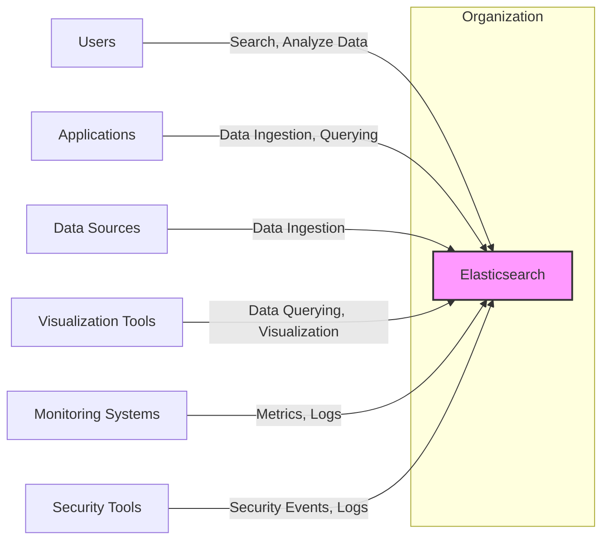
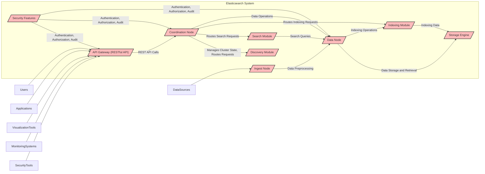
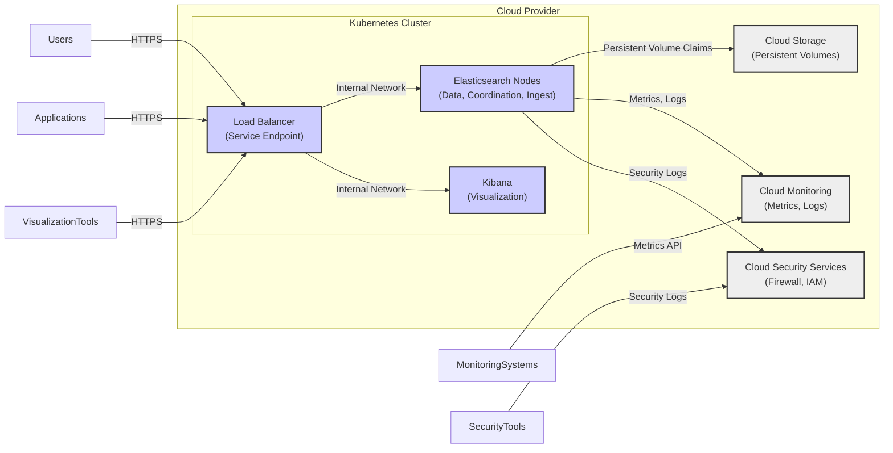

# BUSINESS POSTURE

This project, Elasticsearch, aims to provide a distributed, RESTful search and analytics engine capable of solving a growing number of use cases. It is designed to store, search, and analyze large volumes of data in near real-time.

Business priorities for Elasticsearch include:
- Scalability: Ability to handle increasing data volumes and user traffic.
- Reliability: Ensuring high availability and data durability.
- Performance: Providing fast search and analytics capabilities.
- Flexibility: Supporting diverse data types and use cases.
- Ease of Use: Offering a user-friendly interface and APIs for developers and operators.
- Community Growth: Fostering a strong open-source community and ecosystem.

Key business goals are:
- To be the leading search and analytics engine in the market.
- To enable users to derive valuable insights from their data.
- To support a wide range of applications, from enterprise search to observability and security analytics.
- To maintain a vibrant open-source community and encourage contributions.

Most important business risks to address:
- Data loss or corruption: Could lead to business disruption and loss of trust.
- Security breaches: Unauthorized access to sensitive data can result in financial and reputational damage.
- Performance degradation: Slow search and analytics can impact user experience and business operations.
- Availability issues: Downtime can disrupt critical business processes relying on Elasticsearch.
- Vendor lock-in: Dependence on a single technology provider can limit flexibility and increase costs in the long term.
- Community health: A decline in community engagement can slow down development and innovation.

# SECURITY POSTURE

Existing security controls:
- security control: Access control lists (ACLs) for indices and APIs. Implemented within Elasticsearch security features.
- security control: Role-Based Access Control (RBAC) to manage user permissions. Implemented within Elasticsearch security features.
- security control: Encryption in transit using TLS for communication between nodes and clients. Configurable in Elasticsearch settings.
- security control: Encryption at rest for data stored on disk. Configurable in Elasticsearch settings.
- security control: Audit logging to track security-related events. Configurable in Elasticsearch settings.
- security control: Security realms for authentication against various identity providers (e.g., native, LDAP, Active Directory, SAML, Kerberos). Configurable in Elasticsearch security features.
- security control: Secure software development lifecycle (SSDLC) practices are likely followed by Elastic, including code reviews, static and dynamic analysis, and penetration testing, although specific details are not publicly documented in the repository.
- security control: Regular security updates and patches are released by Elastic. Documented on the Elastic security website and release notes.
- security control: Public disclosure of security vulnerabilities and CVE assignments. Documented on the Elastic security website and security advisories.

Accepted risks:
- accepted risk: Complexity of security configuration can lead to misconfigurations if not properly managed.
- accepted risk: Performance overhead of security features (encryption, authentication, authorization) might be noticeable in high-throughput environments.
- accepted risk: Reliance on users to properly configure and manage security features.
- accepted risk: Potential for zero-day vulnerabilities despite security measures.

Recommended security controls:
- security control: Implement and enforce strong password policies and multi-factor authentication (MFA) for administrative access.
- security control: Regularly perform security audits and penetration testing to identify and address vulnerabilities.
- security control: Implement a robust vulnerability management process to promptly patch and update Elasticsearch deployments.
- security control: Employ security information and event management (SIEM) systems to monitor Elasticsearch logs and detect security incidents.
- security control: Implement network segmentation to isolate Elasticsearch clusters from untrusted networks.
- security control: Utilize infrastructure-as-code (IaC) for consistent and secure deployment configurations.
- security control: Conduct regular security training for developers and operators working with Elasticsearch.

Security requirements:
- Authentication:
    - Requirement: Elasticsearch must support various authentication mechanisms to verify user identities.
    - Requirement: Authentication should be integrated with existing identity providers where possible.
    - Requirement: Strong authentication protocols should be used to prevent credential compromise.
- Authorization:
    - Requirement: Elasticsearch must enforce granular authorization controls to restrict access to data and operations based on user roles and permissions.
    - Requirement: Authorization policies should be centrally managed and auditable.
    - Requirement: Least privilege principle should be applied to user permissions.
- Input Validation:
    - Requirement: Elasticsearch must validate all user inputs to prevent injection attacks (e.g., query injection, script injection).
    - Requirement: Input validation should be performed at multiple layers, including API endpoints and internal processing.
    - Requirement: Error handling for invalid inputs should be secure and not reveal sensitive information.
- Cryptography:
    - Requirement: Elasticsearch must use strong cryptography for data encryption in transit and at rest.
    - Requirement: Cryptographic keys should be securely managed and rotated.
    - Requirement: Cryptographic algorithms and protocols should be regularly reviewed and updated to maintain security.

# DESIGN

## C4 CONTEXT

Context Diagram Elements:

- Element:
    - Name: Elasticsearch
    - Type: Software System
    - Description: Distributed search and analytics engine. Core component of the project.
    - Responsibilities: Indexing, searching, and analyzing data. Providing APIs for data ingestion and querying. Managing data storage and retrieval. Ensuring scalability, reliability, and performance.
    - Security controls: Access control lists, Role-Based Access Control, Encryption in transit, Encryption at rest, Audit logging, Security realms, Input validation, Secure API design.

- Element:
    - Name: Users
    - Type: Person
    - Description: End-users who interact with applications that use Elasticsearch for search and data analysis. Can also include developers and operators managing Elasticsearch.
    - Responsibilities: Performing searches, analyzing data, developing applications that use Elasticsearch, managing Elasticsearch clusters.
    - Security controls: Authentication to access Elasticsearch or applications using Elasticsearch, Authorization to perform specific actions, Secure handling of credentials.

- Element:
    - Name: Applications
    - Type: Software System
    - Description: Applications that integrate with Elasticsearch for data ingestion, search, and analytics functionalities. Examples include e-commerce platforms, logging dashboards, security information and event management (SIEM) systems.
    - Responsibilities: Ingesting data into Elasticsearch, querying Elasticsearch for search and analytics, presenting data to users, enforcing application-level security controls.
    - Security controls: Authentication and authorization of users, Input validation before sending data to Elasticsearch, Secure communication with Elasticsearch, Protection of sensitive data within the application.

- Element:
    - Name: Data Sources
    - Type: Software System
    - Description: External systems that provide data to be indexed and analyzed by Elasticsearch. Examples include databases, web servers, application logs, social media feeds.
    - Responsibilities: Generating and providing data to Elasticsearch, ensuring data integrity and availability.
    - Security controls: Access control to data sources, Secure data transmission to Elasticsearch, Data sanitization before ingestion.

- Element:
    - Name: Visualization Tools
    - Type: Software System
    - Description: Tools used to visualize and explore data stored in Elasticsearch. Examples include Kibana, Grafana, custom dashboards.
    - Responsibilities: Querying Elasticsearch for data, presenting data visualizations, allowing users to explore and analyze data.
    - Security controls: Authentication and authorization to access visualization tools, Secure communication with Elasticsearch, Protection of sensitive data in visualizations.

- Element:
    - Name: Monitoring Systems
    - Type: Software System
    - Description: Systems used to monitor the health and performance of Elasticsearch clusters and applications using Elasticsearch. Examples include Prometheus, Elasticsearch Monitoring, cloud provider monitoring services.
    - Responsibilities: Collecting metrics and logs from Elasticsearch, alerting on performance issues, providing insights into system behavior.
    - Security controls: Secure access to monitoring data, Protection of sensitive monitoring information, Secure communication with Elasticsearch.

- Element:
    - Name: Security Tools
    - Type: Software System
    - Description: Security information and event management (SIEM) systems, security analytics platforms, and other security tools that consume security-related data from Elasticsearch for threat detection and incident response.
    - Responsibilities: Analyzing security logs and events from Elasticsearch, detecting security threats, generating security alerts, supporting incident response activities.
    - Security controls: Secure ingestion of security data from Elasticsearch, Secure analysis and storage of security data, Access control to security tools and data.

## C4 CONTAINER

Container Diagram Elements:

- Element:
    - Name: API Gateway (RESTful API)
    - Type: Container
    - Description: Provides the primary interface for interacting with Elasticsearch via RESTful APIs. Handles incoming requests from users, applications, visualization tools, monitoring systems, and security tools.
    - Responsibilities: API request handling, routing requests to appropriate internal components, input validation, output formatting, implementing security controls like authentication and authorization at the API level.
    - Security controls: API authentication (e.g., basic auth, API keys, OAuth), API authorization, input validation, rate limiting, TLS encryption for API communication, protection against common web application vulnerabilities (OWASP Top 10).

- Element:
    - Name: Coordination Node
    - Type: Container
    - Description: Manages the Elasticsearch cluster state, including cluster topology, shard allocation, and request routing. Coordinates operations across data nodes.
    - Responsibilities: Cluster state management, request routing, query coordination, managing node joins and leaves, shard allocation and rebalancing.
    - Security controls: Authentication and authorization for internal communication, secure cluster communication, access control to cluster management APIs, protection against denial-of-service attacks targeting cluster management.

- Element:
    - Name: Data Node
    - Type: Container
    - Description: Stores data shards and performs data-related operations like indexing, search, and aggregation.
    - Responsibilities: Data storage, indexing, search, data replication, shard management, data retrieval.
    - Security controls: Encryption at rest for data storage, access control to data files, secure inter-node communication, data sanitization, protection against data breaches and data corruption.

- Element:
    - Name: Ingest Node
    - Type: Container
    - Description: Preprocesses data before indexing. Performs operations like parsing, filtering, enriching, and transforming data.
    - Responsibilities: Data preprocessing, data transformation, data enrichment, routing data to data nodes for indexing.
    - Security controls: Input validation for ingested data, data sanitization, secure data transformation pipelines, protection against injection attacks through data processing.

- Element:
    - Name: Discovery Module
    - Type: Container
    - Description: Handles cluster discovery and node membership. Manages the process of nodes joining and leaving the cluster.
    - Responsibilities: Cluster discovery, node membership management, leader election, cluster topology maintenance.
    - Security controls: Secure cluster discovery process, authentication and authorization for node communication, protection against unauthorized nodes joining the cluster, prevention of cluster split-brain scenarios.

- Element:
    - Name: Search Module
    - Type: Container
    - Description: Executes search queries against data stored in data nodes. Coordinates search operations across multiple shards and nodes.
    - Responsibilities: Query parsing, query execution, result aggregation, relevance scoring, search performance optimization.
    - Security controls: Query input validation, authorization checks for search queries, protection against query injection attacks, secure handling of search results.

- Element:
    - Name: Indexing Module
    - Type: Container
    - Description: Handles the process of indexing data into Elasticsearch. Manages indexing pipelines and data structures.
    - Responsibilities: Data indexing, index management, schema management, indexing performance optimization.
    - Security controls: Input validation for indexing data, authorization checks for indexing operations, protection against injection attacks during indexing, secure index management.

- Element:
    - Name: Storage Engine
    - Type: Container
    - Description: Provides the underlying storage mechanism for Elasticsearch. Manages data persistence, retrieval, and storage optimization.
    - Responsibilities: Data persistence, data retrieval, storage management, data compression, storage performance optimization.
    - Security controls: Encryption at rest, access control to storage media, data integrity checks, protection against data loss and corruption.

- Element:
    - Name: Security Features
    - Type: Container
    - Description: Provides security functionalities for Elasticsearch, including authentication, authorization, audit logging, and encryption.
    - Responsibilities: Authentication, authorization, audit logging, encryption in transit, encryption at rest, security configuration management.
    - Security controls: Implements various security controls mentioned in the Security Posture section, including authentication mechanisms, authorization policies, audit logging, and encryption algorithms.

## DEPLOYMENT

Deployment Solution: Cloud-based deployment on Kubernetes using a managed Kubernetes service (e.g., AWS EKS, Google GKE, Azure AKS).

Deployment Diagram Elements:

- Element:
    - Name: Kubernetes Cluster
    - Type: Infrastructure
    - Description: Managed Kubernetes cluster provided by a cloud provider. Provides the container orchestration platform for deploying and managing Elasticsearch and Kibana.
    - Responsibilities: Container orchestration, resource management, scaling, high availability, service discovery.
    - Security controls: Kubernetes RBAC, network policies, pod security policies, security updates, integration with cloud provider security services.

- Element:
    - Name: Elasticsearch Nodes (Data, Coordination, Ingest)
    - Type: Infrastructure (Containers)
    - Description: Docker containers running Elasticsearch nodes (data, coordination, and ingest roles). Deployed and managed within the Kubernetes cluster.
    - Responsibilities: Running Elasticsearch services, data storage, indexing, search, cluster coordination, data ingestion.
    - Security controls: Container image security scanning, resource limits, network segmentation within Kubernetes, Elasticsearch security features (authentication, authorization, encryption).

- Element:
    - Name: Kibana (Visualization)
    - Type: Infrastructure (Containers)
    - Description: Docker container running Kibana for data visualization and management. Deployed and managed within the Kubernetes cluster.
    - Responsibilities: Data visualization, dashboarding, Elasticsearch management UI.
    - Security controls: Container image security scanning, resource limits, network segmentation within Kubernetes, Kibana security features (authentication, authorization), secure communication with Elasticsearch.

- Element:
    - Name: Load Balancer (Service Endpoint)
    - Type: Infrastructure
    - Description: Cloud provider load balancer that provides a public endpoint for accessing Elasticsearch and Kibana services. Distributes traffic across Elasticsearch and Kibana pods.
    - Responsibilities: Traffic distribution, load balancing, service endpoint exposure, SSL termination.
    - Security controls: HTTPS termination, DDoS protection, access control lists, integration with cloud provider security services.

- Element:
    - Name: Cloud Storage (Persistent Volumes)
    - Type: Infrastructure
    - Description: Cloud-based persistent storage (e.g., AWS EBS, Google Persistent Disk, Azure Disks) used by Elasticsearch nodes for persistent data storage.
    - Responsibilities: Persistent data storage, data durability, data backup and recovery.
    - Security controls: Encryption at rest, access control policies, data backup and recovery mechanisms, data replication for durability.

- Element:
    - Name: Cloud Monitoring (Metrics, Logs)
    - Type: Infrastructure
    - Description: Cloud provider monitoring service (e.g., AWS CloudWatch, Google Cloud Monitoring, Azure Monitor) used to collect and monitor metrics and logs from Elasticsearch and Kubernetes.
    - Responsibilities: Metrics collection, log aggregation, alerting, performance monitoring.
    - Security controls: Secure access to monitoring data, encryption in transit and at rest for monitoring data, audit logging of monitoring activities.

- Element:
    - Name: Cloud Security Services (Firewall, IAM)
    - Type: Infrastructure
    - Description: Cloud provider security services (e.g., AWS Security Groups, Google Cloud Firewall, Azure Network Security Groups, IAM) used to enhance the security of the Kubernetes cluster and Elasticsearch deployment.
    - Responsibilities: Network security, access control, identity and access management, threat detection.
    - Security controls: Network firewalls, security groups, IAM policies, intrusion detection and prevention systems, vulnerability scanning.

## BUILD

```mermaid
graph LR
    Developer["Developer\n(Code Changes)"] --> GitRepository["Git Repository\n(GitHub)"]
    GitRepository -- "Code Push" --> CI["CI System\n(GitHub Actions)"]
    CI -- "Build, Test, Scan" --> BuildArtifacts["Build Artifacts\n(Docker Images, Packages)"]
    BuildArtifacts -- "Publish" --> ArtifactRegistry["Artifact Registry\n(Container Registry, Package Registry)"]
    ArtifactRegistry -- "Deploy" --> DeploymentEnvironment["Deployment Environment\n(Kubernetes Cluster)"]

    subgraph "CI System (GitHub Actions)"
        CodeCheckout["Code Checkout"]
        BuildStep["Build"]
        TestStep["Automated Tests"]
        SAST["SAST Scanner"]
        DependencyScan["Dependency Scanner"]
        ContainerScan["Container Image Scanner"]
        PublishArtifacts["Publish Artifacts"]
    end
    CI --> CodeCheckout
    CodeCheckout --> BuildStep
    BuildStep --> TestStep
    TestStep --> SAST
    SAST --> DependencyScan
    DependencyScan --> ContainerScan
    ContainerScan --> PublishArtifacts

    style Developer fill:#cdf,stroke:#333,stroke-width:2px
    style GitRepository fill:#cdf,stroke:#333,stroke-width:2px
    style CI fill:#ccf,stroke:#333,stroke-width:2px
    style BuildArtifacts fill:#ccf,stroke:#333,stroke-width:2px
    style ArtifactRegistry fill:#ccf,stroke:#333,stroke-width:2px
    style DeploymentEnvironment fill:#ccf,stroke:#333,stroke-width:2px
    style CodeCheckout fill:#eee,stroke:#333,stroke-width:2px
    style BuildStep fill:#eee,stroke:#333,stroke-width:2px
    style TestStep fill:#eee,stroke:#333,stroke-width:2px
    style SAST fill:#eee,stroke:#333,stroke-width:2px
    style DependencyScan fill:#eee,stroke:#333,stroke-width:2px
    style ContainerScan fill:#eee,stroke:#333,stroke-width:2px
    style PublishArtifacts fill:#eee,stroke:#333,stroke-width:2px
```

Build Process Description:

The build process for Elasticsearch is likely automated using a CI/CD system like GitHub Actions, based on the GitHub repository.

Build Process Steps:
1. Developer makes code changes and pushes them to the Git repository (GitHub).
2. GitHub Actions CI pipeline is triggered by code push.
3. CI pipeline performs the following steps:
    - Code Checkout: Checks out the latest code from the Git repository.
    - Build: Compiles the code and builds the Elasticsearch project.
    - Automated Tests: Runs automated unit tests, integration tests, and other tests to ensure code quality and functionality.
    - SAST Scanner (Static Application Security Testing): Performs static code analysis to identify potential security vulnerabilities in the code.
    - Dependency Scanner: Scans project dependencies for known vulnerabilities.
    - Container Image Scanner: Scans Docker images for vulnerabilities if containerization is used for distribution.
    - Publish Artifacts: Builds and publishes build artifacts, such as Docker images and packages, to an artifact registry (e.g., Docker Hub, GitHub Packages, cloud provider container registry).
4. Artifact Registry stores the build artifacts securely.
5. Deployment process retrieves build artifacts from the artifact registry and deploys them to the deployment environment (e.g., Kubernetes cluster).

Security Controls in Build Process:
- security control: Secure code repository (GitHub) with access controls and audit logging.
- security control: CI/CD pipeline automation to ensure consistent and repeatable builds.
- security control: Automated testing to catch bugs and vulnerabilities early in the development cycle.
- security control: Static Application Security Testing (SAST) to identify code-level vulnerabilities.
- security control: Dependency scanning to detect vulnerable dependencies.
- security control: Container image scanning to identify vulnerabilities in container images.
- security control: Secure artifact registry with access controls to protect build artifacts.
- security control: Code signing and artifact verification to ensure integrity and authenticity of build artifacts.
- security control: Build environment security hardening to prevent build system compromise.
- security control: Audit logging of build process activities.

# RISK ASSESSMENT

Critical business processes protected by Elasticsearch:
- Search functionality for applications and users.
- Data analytics and reporting for business insights.
- Logging and monitoring for system observability.
- Security event analysis for threat detection and incident response.

Data being protected and its sensitivity:
- Operational logs: Can contain sensitive information like user activity, system events, and application errors. Sensitivity: Medium to High, depending on the context and regulations.
- Application data: Varies widely depending on the application using Elasticsearch. Can include personally identifiable information (PII), financial data, health records, and other sensitive data. Sensitivity: Low to High, depending on the data type and regulations (GDPR, HIPAA, PCI DSS, etc.).
- Security events and alerts: Contain sensitive security-related information. Sensitivity: High, as compromise can lead to security breaches.
- System metrics and performance data: Generally less sensitive, but can reveal information about system infrastructure and usage patterns. Sensitivity: Low to Medium.

Data sensitivity classification should be performed based on specific use cases and data types stored in Elasticsearch. Appropriate security controls should be implemented based on the data sensitivity level.

# QUESTIONS & ASSUMPTIONS

Questions:
- What specific regulations and compliance standards (e.g., GDPR, HIPAA, PCI DSS) are relevant to Elasticsearch deployments?
- What are the specific data sensitivity classifications for data stored in Elasticsearch in different use cases?
- What are the detailed security policies and procedures followed by Elastic for secure software development lifecycle (SSDLC)?
- What specific security tools and technologies are used in the build process (SAST, DAST, dependency scanning, container scanning)?
- What are the disaster recovery and business continuity plans for Elasticsearch deployments?
- What are the incident response procedures for security incidents related to Elasticsearch?

Assumptions:
- BUSINESS POSTURE: Elasticsearch is used for mission-critical applications requiring high availability, scalability, and security. Data stored in Elasticsearch can be sensitive and requires protection.
- SECURITY POSTURE: Elasticsearch implements various security features, but proper configuration and management are crucial. Secure software development lifecycle practices are followed by Elastic. Security is a high priority for the Elasticsearch project.
- DESIGN: Elasticsearch is deployed in a cloud-based environment on Kubernetes for scalability and manageability. The build process is automated and includes security checks. Standard security best practices are followed for infrastructure and application security.