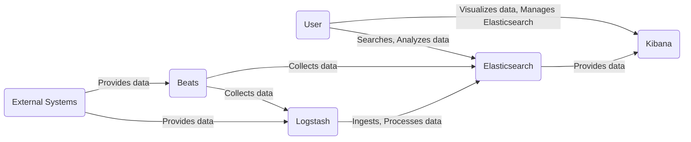
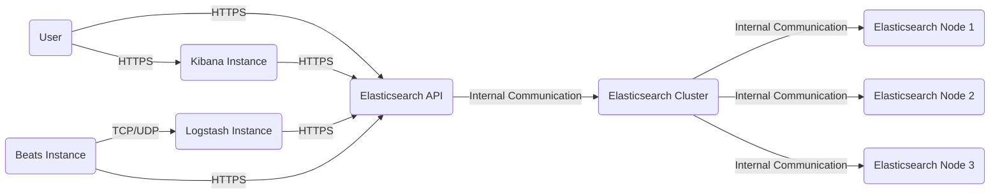
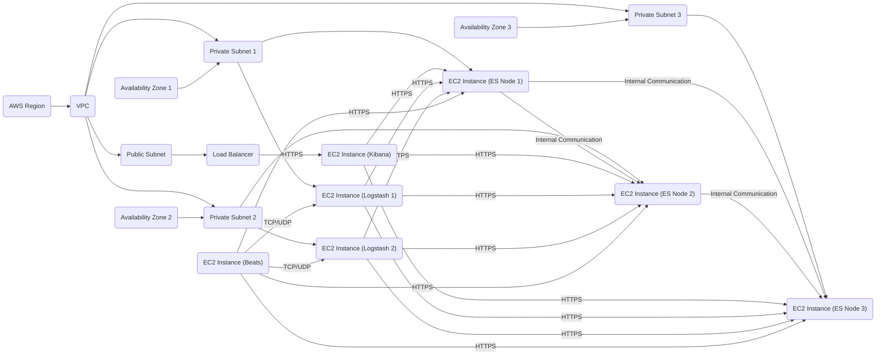
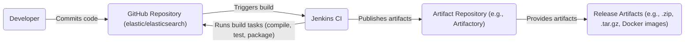

# BUSINESS POSTURE

Business Priorities and Goals:

*   Provide a scalable, high-performance search and analytics engine.
*   Enable users to store, search, and analyze large volumes of data.
*   Offer a flexible and extensible platform for building search-based applications.
*   Maintain a strong open-source community and ecosystem.
*   Provide commercial offerings and support for enterprise customers.

Most Important Business Risks:

*   Data breaches or unauthorized access to sensitive data stored in Elasticsearch.
*   Service disruptions or downtime impacting users' ability to access and analyze data.
*   Performance degradation or scalability issues affecting search and analytics capabilities.
*   Vulnerabilities in Elasticsearch or its dependencies leading to exploits.
*   Reputational damage due to security incidents or data breaches.
*   Competition from other search and analytics solutions.

# SECURITY POSTURE

Existing Security Controls:

*   security control: Role-Based Access Control (RBAC) to manage user permissions and access to data. (Described in Elasticsearch documentation and implemented in the code.)
*   security control: Encryption in transit using TLS/SSL to protect data transmitted between nodes and clients. (Described in Elasticsearch documentation and implemented in the code.)
*   security control: Encryption at rest for data stored on disk. (Described in Elasticsearch documentation and implemented in the code.)
*   security control: Authentication mechanisms, including native realm, LDAP, Active Directory, and API keys. (Described in Elasticsearch documentation and implemented in the code.)
*   security control: Auditing capabilities to track user activity and security-related events. (Described in Elasticsearch documentation and implemented in the code.)
*   security control: IP filtering to restrict network access to Elasticsearch clusters. (Described in Elasticsearch documentation and implemented in the code.)
*   security control: Security realms to manage users and roles from different sources. (Described in Elasticsearch documentation and implemented in the code.)
*   security control: Field and document-level security to control access to specific data within indices. (Described in Elasticsearch documentation and implemented in the code.)
*   security control: Regular security updates and patches to address vulnerabilities. (Provided by Elastic.)
*   security control: Security hardening guides and recommendations. (Provided by Elastic.)

Accepted Risks:

*   accepted risk: Complexity of configuring and managing security features, potentially leading to misconfigurations.
*   accepted risk: Potential performance overhead associated with enabling certain security features, such as encryption and auditing.
*   accepted risk: Reliance on third-party dependencies, which may introduce vulnerabilities.

Recommended Security Controls:

*   security control: Implement a robust vulnerability management program, including regular penetration testing and code reviews.
*   security control: Enforce strong password policies and multi-factor authentication for all users.
*   security control: Regularly review and update security configurations to ensure they align with best practices.
*   security control: Monitor security logs and alerts for suspicious activity.
*   security control: Implement a comprehensive data loss prevention (DLP) strategy.
*   security control: Use a dedicated security information and event management (SIEM) system to aggregate and analyze security logs.

Security Requirements:

*   Authentication:
    *   Support multiple authentication mechanisms, including native realm, LDAP, Active Directory, and API keys.
    *   Enforce strong password policies.
    *   Provide options for multi-factor authentication.
*   Authorization:
    *   Implement Role-Based Access Control (RBAC) to manage user permissions.
    *   Provide granular control over access to indices, documents, and fields.
    *   Support integration with external authorization systems.
*   Input Validation:
    *   Validate all user inputs to prevent injection attacks.
    *   Sanitize data to remove potentially harmful characters or code.
    *   Implement appropriate data validation rules based on data types and formats.
*   Cryptography:
    *   Use TLS/SSL for all network communication.
    *   Provide options for encryption at rest.
    *   Use strong cryptographic algorithms and key management practices.
    *   Regularly update cryptographic libraries and protocols.

# DESIGN

## C4 CONTEXT

Element Descriptions:

*   Element:
    *   Name: User
    *   Type: Person
    *   Description: Represents a person who interacts with Elasticsearch to search, analyze, and visualize data.
    *   Responsibilities: Searching data, analyzing data, visualizing data, managing Elasticsearch (depending on role).
    *   Security controls: Authentication, Authorization (RBAC), Auditing.

*   Element:
    *   Name: Elasticsearch
    *   Type: Software System
    *   Description: The core search and analytics engine.
    *   Responsibilities: Storing data, indexing data, searching data, providing APIs for data access and management.
    *   Security controls: RBAC, TLS/SSL, Encryption at rest, Authentication, Auditing, IP filtering, Security realms, Field and document-level security.

*   Element:
    *   Name: Kibana
    *   Type: Software System
    *   Description: A visualization and management platform for Elasticsearch.
    *   Responsibilities: Providing a user interface for interacting with Elasticsearch, visualizing data, managing Elasticsearch clusters.
    *   Security controls: Authentication, Authorization (relies on Elasticsearch's security features), Auditing.

*   Element:
    *   Name: Logstash
    *   Type: Software System
    *   Description: A data processing pipeline that ingests, transforms, and sends data to Elasticsearch.
    *   Responsibilities: Ingesting data from various sources, transforming data, sending data to Elasticsearch.
    *   Security controls: Authentication (to Elasticsearch), TLS/SSL, Input validation.

*   Element:
    *   Name: Beats
    *   Type: Software System
    *   Description: Lightweight data shippers that collect data from various sources and send it to Logstash or Elasticsearch.
    *   Responsibilities: Collecting data from various sources, sending data to Logstash or Elasticsearch.
    *   Security controls: Authentication (to Elasticsearch/Logstash), TLS/SSL.

*   Element:
    *   Name: External Systems
    *   Type: Software System
    *   Description: Represents external systems that provide data to Logstash or Beats.
    *   Responsibilities: Providing data to the Elasticsearch ecosystem.
    *   Security controls: Dependent on the specific external system.

## C4 CONTAINER

Element Descriptions:

*   Element:
    *   Name: User
    *   Type: Person
    *   Description: Represents a person who interacts with Elasticsearch.
    *   Responsibilities: Searching data, analyzing data, visualizing data, managing Elasticsearch (depending on role).
    *   Security controls: Authentication, Authorization (RBAC), Auditing.

*   Element:
    *   Name: Elasticsearch API
    *   Type: API
    *   Description: The REST API exposed by Elasticsearch for interacting with the cluster.
    *   Responsibilities: Handling requests from users and applications, routing requests to the appropriate nodes, returning responses.
    *   Security controls: TLS/SSL, Authentication, Authorization (RBAC), Input validation.

*   Element:
    *   Name: Elasticsearch Cluster
    *   Type: Container (Group of Nodes)
    *   Description: A collection of one or more Elasticsearch nodes that work together to store and process data.
    *   Responsibilities: Managing the cluster state, distributing data and search requests across nodes, ensuring high availability and fault tolerance.
    *   Security controls: RBAC, TLS/SSL, Encryption at rest, Authentication, Auditing, IP filtering, Security realms, Field and document-level security, Inter-node communication security.

*   Element:
    *   Name: Elasticsearch Node 1, Elasticsearch Node 2, Elasticsearch Node 3
    *   Type: Container (Elasticsearch Instance)
    *   Description: Individual instances of Elasticsearch that form the cluster.
    *   Responsibilities: Storing data, indexing data, executing search requests, performing other data processing tasks.
    *   Security controls: RBAC, TLS/SSL, Encryption at rest, Authentication, Auditing, IP filtering, Security realms, Field and document-level security.

*   Element:
    *   Name: Kibana Instance
    *   Type: Container (Web Application)
    *   Description: An instance of the Kibana web application.
    *   Responsibilities: Providing a user interface for interacting with Elasticsearch, visualizing data, managing Elasticsearch clusters.
    *   Security controls: Authentication, Authorization (relies on Elasticsearch's security features), Auditing, Session management.

*   Element:
    *   Name: Logstash Instance
    *   Type: Container (Data Processing Pipeline)
    *   Description: An instance of the Logstash data processing pipeline.
    *   Responsibilities: Ingesting data from various sources, transforming data, sending data to Elasticsearch.
    *   Security controls: Authentication (to Elasticsearch), TLS/SSL, Input validation, Data sanitization.

*   Element:
    *   Name: Beats Instance
    *   Type: Container (Data Shipper)
    *   Description: An instance of a Beats data shipper.
    *   Responsibilities: Collecting data from various sources, sending data to Logstash or Elasticsearch.
    *   Security controls: Authentication (to Elasticsearch/Logstash), TLS/SSL.

## DEPLOYMENT

Possible Deployment Solutions:

1.  Self-managed on-premises: Deploying Elasticsearch, Kibana, Logstash, and Beats on physical or virtual servers within an organization's own data center.
2.  Self-managed on cloud infrastructure (IaaS): Deploying Elasticsearch, Kibana, Logstash, and Beats on virtual machines provided by a cloud provider (e.g., AWS EC2, Azure VMs, Google Compute Engine).
3.  Managed service (PaaS/SaaS): Utilizing a managed Elasticsearch service provided by a cloud provider (e.g., Elastic Cloud, AWS OpenSearch Service, Azure Cognitive Search).

Chosen Deployment Solution (for detailed description): Self-managed on cloud infrastructure (AWS EC2).

Element Descriptions:

*   Element:
    *   Name: AWS Region
    *   Type: Infrastructure
    *   Description: A geographical region where AWS resources are located.
    *   Responsibilities: Providing a physical location for AWS services.
    *   Security controls: AWS infrastructure security controls.

*   Element:
    *   Name: Availability Zone 1, Availability Zone 2, Availability Zone 3
    *   Type: Infrastructure
    *   Description: Isolated locations within an AWS Region.
    *   Responsibilities: Providing high availability and fault tolerance.
    *   Security controls: AWS infrastructure security controls.

*   Element:
    *   Name: VPC
    *   Type: Infrastructure
    *   Description: A virtual private cloud within AWS.
    *   Responsibilities: Providing a logically isolated network for AWS resources.
    *   Security controls: Network ACLs, Security Groups.

*   Element:
    *   Name: Public Subnet
    *   Type: Infrastructure
    *   Description: A subnet that has a route to the internet.
    *   Responsibilities: Hosting resources that need to be publicly accessible.
    *   Security controls: Network ACLs, Security Groups.

*   Element:
    *   Name: Private Subnet 1, Private Subnet 2, Private Subnet 3
    *   Type: Infrastructure
    *   Description: Subnets that do not have a direct route to the internet.
    *   Responsibilities: Hosting resources that should not be directly accessible from the internet.
    *   Security controls: Network ACLs, Security Groups.

*   Element:
    *   Name: Load Balancer
    *   Type: Infrastructure
    *   Description: Distributes traffic across multiple EC2 instances.
    *   Responsibilities: Improving availability and scalability.
    *   Security controls: TLS/SSL termination, Access control lists.

*   Element:
    *   Name: EC2 Instance (Kibana)
    *   Type: Infrastructure (Virtual Machine)
    *   Description: A virtual machine running the Kibana application.
    *   Responsibilities: Hosting the Kibana application.
    *   Security controls: Operating system security, Application security, Security Groups.

*   Element:
    *   Name: EC2 Instance (ES Node 1), EC2 Instance (ES Node 2), EC2 Instance (ES Node 3)
    *   Type: Infrastructure (Virtual Machine)
    *   Description: Virtual machines running Elasticsearch nodes.
    *   Responsibilities: Hosting Elasticsearch nodes.
    *   Security controls: Operating system security, Elasticsearch security features, Security Groups.

*   Element:
    *   Name: EC2 Instance (Logstash 1), EC2 Instance (Logstash 2)
    *   Type: Infrastructure (Virtual Machine)
    *   Description: Virtual machines running Logstash instances.
    *   Responsibilities: Hosting Logstash instances.
    *   Security controls: Operating system security, Logstash security features, Security Groups.

*   Element:
    *   Name: EC2 Instance (Beats)
    *   Type: Infrastructure (Virtual Machine)
    *   Description: A virtual machine running a Beats data shipper.
    *   Responsibilities: Hosting the Beats data shipper.
    *   Security controls: Operating system security, Beats security features, Security Groups.

## BUILD

The Elasticsearch build process is complex and involves multiple tools and stages. It uses Gradle as the build system.

Build Process Description:

1.  Developers commit code changes to the Elasticsearch repository on GitHub.
2.  The GitHub repository is configured to trigger builds in Jenkins CI upon new commits.
3.  Jenkins clones the repository and executes the build tasks defined in the Gradle build scripts.
4.  Build tasks include:
    *   Compiling the Java code.
    *   Running unit tests, integration tests, and other types of tests.
    *   Performing static code analysis (SAST) using tools like SpotBugs and Error Prone.
    *   Checking for license compliance.
    *   Packaging the software into various formats (e.g., .zip, .tar.gz, Docker images).
    *   Generating documentation.
5.  Jenkins publishes the build artifacts to an artifact repository (e.g., Artifactory).
6.  Release artifacts are made available for download and deployment.

Security Controls in Build Process:

*   security control: Source Code Management (SCM) with access control and audit trails (GitHub).
*   security control: Continuous Integration (CI) system (Jenkins) to automate builds and testing.
*   security control: Static Application Security Testing (SAST) tools integrated into the build process.
*   security control: Dependency management to track and manage third-party libraries.
*   security control: License compliance checks.
*   security control: Artifact signing and verification (not explicitly mentioned in the provided information, but a common practice).
*   security control: Build environment security (e.g., securing Jenkins servers, restricting access to build agents).

# RISK ASSESSMENT

Critical Business Processes:

*   Data ingestion: Ensuring data can be reliably ingested into Elasticsearch from various sources.
*   Data storage: Protecting the integrity and confidentiality of data stored in Elasticsearch.
*   Search and analytics: Providing fast and accurate search and analytics capabilities.
*   Data visualization: Enabling users to effectively visualize and understand their data.
*   System availability: Maintaining high availability and uptime of the Elasticsearch cluster.

Data Sensitivity:

Elasticsearch can store a wide variety of data, ranging from publicly available information to highly sensitive data, including:

*   Personally Identifiable Information (PII)
*   Financial data
*   Healthcare data
*   Security logs
*   Application logs
*   Business intelligence data

The sensitivity of the data stored in Elasticsearch depends on the specific use case and the organization's data classification policies. It is crucial to identify the sensitivity of the data stored in each Elasticsearch cluster and implement appropriate security controls to protect it.

# QUESTIONS & ASSUMPTIONS

Questions:

*   What specific types of data will be stored in Elasticsearch (e.g., PII, financial data, logs)?
*   What are the specific regulatory requirements or compliance standards that apply to the data?
*   What are the performance and scalability requirements for the Elasticsearch cluster?
*   What is the expected growth rate of the data?
*   What are the existing security policies and procedures within the organization?
*   What is the organization's risk tolerance?
*   Are there any specific security concerns or threats that need to be addressed?
*   What level of access will different users have to the data?
*   What are the backup and disaster recovery requirements?
*   What monitoring and alerting systems are in place?
*   What is the process for managing security incidents?
*   What are the specific deployment environments (e.g., cloud provider, on-premises)?
*   What are the specific versions of Elasticsearch, Kibana, Logstash, and Beats being used?

Assumptions:

*   BUSINESS POSTURE: The organization prioritizes data security and availability.
*   BUSINESS POSTURE: The organization has a moderate risk tolerance.
*   SECURITY POSTURE: The organization has some existing security controls in place, but there is room for improvement.
*   SECURITY POSTURE: The organization is willing to invest in additional security measures.
*   DESIGN: The Elasticsearch cluster will be deployed in a highly available configuration.
*   DESIGN: The Elasticsearch cluster will be accessed by multiple users with different roles and permissions.
*   DESIGN: The data stored in Elasticsearch will include sensitive information.
*   DESIGN: The build process will include automated security checks.
*   DESIGN: The deployment will follow best practices for security and availability.