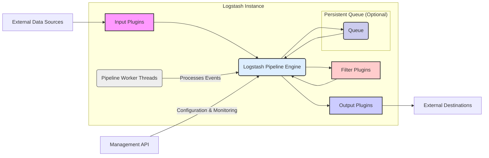

# Project Design Document: Logstash

**Version:** 1.1
**Date:** October 26, 2023
**Author:** AI Software Architect

## 1. Introduction

This document provides an enhanced architectural design of the Logstash project, an open-source, server-side data processing pipeline that ingests data from multiple sources simultaneously, transforms it, and then sends it to your favorite "stash." This document builds upon the previous version, offering greater clarity and detail for threat modeling and overall system understanding.

## 2. Goals

*   Present a refined and more detailed overview of Logstash's architecture and internal workings.
*   Clearly define the roles and interactions of core components within the Logstash ecosystem.
*   Provide an in-depth description of the data flow, highlighting potential points of interest for security analysis.
*   Elaborate on security considerations, categorizing potential threats and vulnerabilities more explicitly.
*   Serve as a robust and comprehensive foundation for effective threat modeling activities.

## 3. Architectural Overview

Logstash operates as a configurable pipeline, processing events through three core stages: Inputs, Filters, and Outputs. Its plugin-based architecture allows for extensive customization and integration with various data sources and destinations.

## 4. Key Components

*   **Input Plugins:**
    *   Function: Responsible for collecting data from diverse sources.
    *   Examples: `"file"`, `"tcp"`, `"udp"`, `"kafka"`, `"beats"`, `"http"`, `"jdbc"`.
    *   Mechanism: Each plugin establishes a connection or listener to the data source.
    *   Event Creation:  Parses raw data and transforms it into a structured Logstash event (a JSON-like structure with fields).
    *   Configuration: Settings include connection details, data formats, and polling intervals.

*   **Filter Plugins:**
    *   Function: Process and modify events as they traverse the pipeline.
    *   Operations: Parsing, enriching, transforming, and routing events based on conditions.
    *   Examples: `"grok"` (pattern matching), `"date"` (timestamp parsing), `"mutate"` (field manipulation), `"json"` (JSON parsing), `"xml"` (XML parsing), `"geoip"` (geolocation enrichment).
    *   Chaining: Filters are executed sequentially based on their configuration order.
    *   Conditional Logic: Allows for applying filters only to events that meet specific criteria.

*   **Output Plugins:**
    *   Function: Write processed events to various destinations.
    *   Examples: `"elasticsearch"`, `"file"`, `"kafka"`, `"stdout"`, `"http"`, `"redis"`, `"cloudwatch"`.
    *   Mechanism: Establishes connections to output destinations and formats events for delivery.
    *   Configuration: Includes destination addresses, authentication credentials, and data formatting options.
    *   Error Handling: Some output plugins offer mechanisms for handling delivery failures (e.g., retries).

*   **Logstash Pipeline Engine:**
    *   Function: The central orchestrator managing the flow of events through the pipeline stages.
    *   Responsibilities:  Event queuing, plugin execution, and overall pipeline management.
    *   Configuration: Defines the sequence of input, filter, and output plugins.
    *   Performance:  Optimized for efficient event processing.

*   **Persistent Queue (Optional):**
    *   Function: Provides at-least-once delivery guarantees by buffering events on disk.
    *   Purpose: Enhances reliability by preventing data loss during system disruptions or backpressure.
    *   Mechanism: Events are written to disk before being processed by output plugins.
    *   Configuration: Settings include queue size limits and storage location.

*   **Management API:**
    *   Function: Offers an HTTP-based interface for monitoring and managing Logstash instances.
    *   Capabilities: Retrieving statistics, viewing configuration details, and (potentially) triggering actions.
    *   Security: Requires proper authentication and authorization to prevent unauthorized access.

*   **Pipeline Worker Threads:**
    *   Function: Execute the input, filter, and output plugins concurrently.
    *   Concurrency:  Allows Logstash to process multiple events in parallel, improving throughput.
    *   Configuration: The number of worker threads can be configured to optimize performance based on available resources.

## 5. Data Flow

The journey of a log event through the Logstash pipeline involves the following steps:

1. **Data Ingestion:** External data sources generate events.
2. **Input Collection:** An appropriate input plugin connects to the data source and receives the raw data.
3. **Event Construction:** The input plugin parses the raw data and constructs a structured Logstash event. This event typically includes:
    *   `@timestamp`: The timestamp of the event.
    *   `message`: The raw data or a primary piece of information.
    *   `host`: Information about the source host.
    *   Additional fields extracted or added by the input plugin.
4. **Pipeline Entry:** The newly created event enters the Logstash Pipeline Engine.
5. **Filter Processing (Sequential):** The event is passed through the configured filter plugins in the order defined in the configuration.
    *   Each filter plugin examines the event and applies its specific logic.
    *   Filters can modify existing fields, add new fields, or remove fields.
    *   Conditional logic within filters determines if a filter is applied to a specific event.
6. **Persistent Queue (Conditional):** If the persistent queue is enabled, the event is written to the queue on disk. This ensures durability.
7. **Output Processing:** The processed event reaches the configured output plugins.
8. **Data Delivery:** The output plugin formats the event according to the destination's requirements and sends it to the specified external destination.

## 6. Configuration

Logstash's behavior is defined through configuration files, typically written in a `.conf` format. These files specify the plugins to be used and their respective settings.

*   **Configuration Structure:**
    *   `input {}` block: Defines input plugins and their configurations (e.g., port numbers, file paths, codec settings).
    *   `filter {}` block: Defines filter plugins and their configurations (e.g., grok patterns, conditional statements, field mappings).
    *   `output {}` block: Defines output plugins and their configurations (e.g., Elasticsearch connection details, file output paths, Kafka topic names).

*   **Configuration Management Practices:**
    *   Local Files: Configuration files are typically stored on the Logstash server's filesystem.
    *   Version Control: Using version control systems (like Git) for configuration files is crucial for tracking changes and enabling rollbacks.
    *   Centralized Management: Tools and techniques exist for managing configurations across multiple Logstash instances (e.g., configuration management tools like Ansible or Puppet).
    *   Hot Reloading (with limitations): Logstash supports reloading configuration files without a full restart, but this may have limitations depending on the changes.

## 7. Security Considerations

This section elaborates on security considerations, categorizing potential threats for a more structured threat modeling approach.

*   **Confidentiality:** Protecting sensitive data processed by Logstash.
    *   **Data in Transit:**  Ensure secure communication channels (TLS/SSL) for inputs, outputs, and the Management API.
    *   **Data at Rest (Persistent Queue):** Consider encryption for data stored in the persistent queue.
    *   **Configuration Secrets:** Securely manage sensitive credentials (passwords, API keys) used in configurations, potentially using secrets management tools.
    *   **Over-Collection:** Avoid collecting and storing more data than necessary.

*   **Integrity:** Ensuring the accuracy and completeness of the data processed by Logstash.
    *   **Input Validation:** Implement robust input validation to prevent injection attacks and malformed data from corrupting the pipeline.
    *   **Filter Logic Security:**  Carefully design and test filter logic to prevent unintended data manipulation or bypasses. Be wary of potential vulnerabilities in filter plugins (e.g., regex injection in `grok`).
    *   **Immutable Logging:** If Logstash is used for security logging, ensure the output destination provides mechanisms for data immutability.

*   **Availability:** Maintaining the operational readiness of the Logstash pipeline.
    *   **Resource Exhaustion:** Protect against denial-of-service attacks that could overload Logstash instances (e.g., excessive input rates). Implement rate limiting or queuing mechanisms.
    *   **Dependency Management:** Regularly update Logstash and its plugins to patch security vulnerabilities.
    *   **Failure Handling:** Implement proper error handling and monitoring to detect and recover from failures in input/output connections or plugin execution.
    *   **High Availability Deployment:** Consider clustered deployments for increased resilience.

*   **Authentication and Authorization:** Controlling access to Logstash and its resources.
    *   **Management API Security:** Enforce strong authentication and authorization for the Management API (e.g., API keys, basic authentication, OAuth). Use HTTPS.
    *   **Input/Output Credentials:** Securely manage credentials used by input and output plugins to connect to external systems.
    *   **Configuration Access Control:** Restrict access to Logstash configuration files to authorized personnel.

*   **Plugin Security:**
    *   **Trusted Sources:** Obtain plugins from trusted sources and verify their integrity.
    *   **Vulnerability Scanning:** Regularly scan installed plugins for known vulnerabilities.
    *   **Minimal Necessary Plugins:** Only install and enable the plugins that are required for the specific use case.

## 8. Deployment Considerations

*   **Standalone Instance:** A single Logstash instance processes data. Suitable for smaller deployments or when data volume is low. Simpler to manage but represents a single point of failure.
*   **Clustered Deployment:** Multiple Logstash instances work collaboratively, often behind a load balancer. Provides increased throughput, scalability, and high availability. Requires more complex configuration and management.
*   **Integration with Beats:**  Lightweight data shippers (Beats) collect data at the source and forward it to one or more Logstash instances. This architecture offloads data collection from Logstash, making it more efficient at processing.
*   **Logstash as a Forwarder:** A Logstash instance can act as a lightweight forwarder, receiving data and forwarding it to another, more powerful Logstash instance for further processing.

## 9. Future Enhancements (Potential Areas for Future Design Changes)

*   **Enhanced Centralized Configuration Management:** Explore integrations with configuration management tools or dedicated Logstash management platforms for streamlined configuration across environments.
*   **Improved Monitoring and Observability:** Integrate with monitoring systems (e.g., Prometheus, Grafana) to provide richer insights into pipeline performance, resource utilization, and error rates.
*   **Dynamic Plugin Management:** Investigate mechanisms for dynamically installing, updating, and managing plugins without requiring restarts, improving operational agility.
*   **More Granular Security Policies:** Implement more fine-grained security controls at the pipeline level, allowing for specific security policies to be applied to different data flows.
*   **Standardized Audit Logging:** Implement comprehensive audit logging of administrative actions and configuration changes within Logstash.

This revised document provides a more detailed and structured understanding of Logstash's architecture, emphasizing security considerations relevant for thorough threat modeling. The enhanced descriptions of components, data flow, and potential threats will facilitate a more effective security analysis of the project.