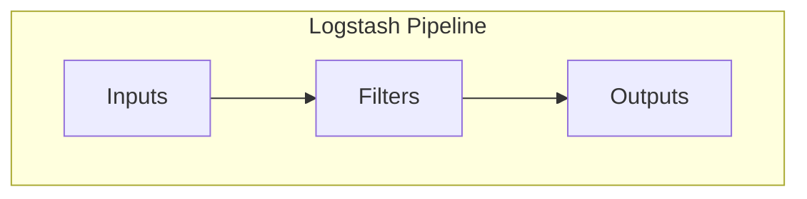
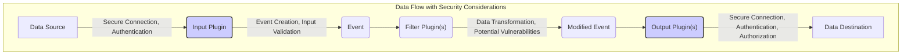

# Project Design Document: Logstash

**Version:** 1.1
**Date:** October 26, 2023
**Author:** AI Software Architect

## 1. Introduction

This document provides an enhanced architectural design of Logstash, an open-source, server-side data processing pipeline that dynamically ingests data from a multitude of sources, transforms it in-flight, and then ships it to a chosen repository or system. This document aims to provide a more in-depth understanding of Logstash's components, data flow, and key functionalities, with a stronger emphasis on security considerations, serving as a robust foundation for subsequent threat modeling activities.

## 2. Goals and Objectives

The primary goals of this design document are to:

*   Clearly and comprehensively articulate the architecture of Logstash, including internal workings and external interactions.
*   Identify the key components and their specific responsibilities and interactions, with a focus on security boundaries.
*   Describe the detailed data flow through the Logstash pipeline, highlighting potential points of vulnerability.
*   Elaborate on important configuration aspects relevant to security hardening and best practices.
*   Provide a solid and detailed basis for identifying potential security vulnerabilities, attack vectors, and mitigation strategies during threat modeling.

## 3. Architectural Overview

Logstash operates as a pipeline, processing events sequentially through three core and configurable stages: Inputs, Filters, and Outputs. Its modular design, driven by a rich plugin ecosystem, allows for significant customization and extensibility.

## 4. Detailed Component Description

### 4.1. Inputs

*   **Purpose:** Input plugins are the entry points for data into the Logstash pipeline, responsible for acquiring data from diverse sources.
*   **Functionality:** They actively listen for incoming data streams or passively poll data sources, decode the raw data into a structured internal Logstash representation (an "event"), and subsequently pass this event to the filter stage.
*   **Security Considerations:** Input plugins are critical security boundaries. Improperly configured or vulnerable input plugins can be exploited to inject malicious data or gain unauthorized access.
*   **Examples:**
    *   `file`: Reads events from files, supporting various encoding and file rotation strategies. **Security:** Requires careful management of file permissions and access controls.
    *   `tcp`: Listens for events over TCP. **Security:**  Consider using TLS/SSL for encrypted communication and implementing client authentication.
    *   `udp`: Listens for events over UDP. **Security:**  UDP is connectionless and stateless, making it susceptible to spoofing. Implement appropriate validation and consider alternative protocols where security is paramount.
    *   `http`: Receives events via HTTP requests. **Security:** Implement authentication (e.g., Basic Auth, API keys), authorization, and use HTTPS to protect data in transit. Validate request bodies to prevent injection attacks.
    *   `kafka`: Consumes messages from Kafka topics. **Security:** Leverage Kafka's security features like ACLs and TLS encryption. Ensure Logstash has the necessary permissions to access the topics.
    *   `beats`: Receives events from the Elastic Beats family of shippers (e.g., Filebeat, Metricbeat). **Security:** Beats typically use a shared secret token for authentication. Ensure secure distribution and management of these tokens. Consider TLS encryption.
    *   `jdbc`: Reads data from relational databases. **Security:** Securely manage database credentials. Use read-only accounts where possible. Be mindful of potential SQL injection vulnerabilities if data is used in dynamic queries within Logstash.
*   **Configuration:** Input plugins require specific configuration parameters detailing the source location, protocol, authentication credentials, and decoding options. Securely manage these configurations.

### 4.2. Filters

*   **Purpose:** Filter plugins act as the transformation and enrichment layer within the Logstash pipeline, modifying and processing events.
*   **Functionality:** They perform a wide range of operations, including parsing unstructured data, transforming fields, enriching events with additional information, and conditionally dropping or tagging events. Filters are applied sequentially based on their order in the configuration.
*   **Security Considerations:** Filter plugins can introduce security risks if they contain vulnerabilities or are misconfigured. Malicious patterns in `grok` filters or insecure code in custom filter plugins could lead to denial-of-service or information disclosure.
*   **Examples:**
    *   `grok`: Parses unstructured text into structured fields using regular expressions. **Security:** Carefully craft regular expressions to avoid catastrophic backtracking (ReDoS) and ensure they don't inadvertently expose sensitive information.
    *   `date`: Parses date and time strings into a standard timestamp format.
    *   `mutate`: Performs general event manipulations like renaming, removing, or replacing fields. **Security:** Use with caution when redacting sensitive data, ensuring the redaction is effective and irreversible.
    *   `json`: Parses JSON data within an event field. **Security:** Be aware of potential vulnerabilities in the JSON parsing library.
    *   `xml`: Parses XML data within an event field. **Security:** Be aware of potential XML External Entity (XXE) injection vulnerabilities if processing untrusted XML data.
    *   `geoip`: Enriches events with geographical information based on IP addresses.
    *   `useragent`: Parses user agent strings.
    *   `ruby`: Executes embedded Ruby code for complex transformations. **Security:**  Use with extreme caution. Running arbitrary Ruby code introduces significant security risks. Sanitize inputs thoroughly if using external data within Ruby filters.
*   **Configuration:** Filter plugins require configuration specifying the transformation rules, parsing patterns, and conditional logic.

### 4.3. Outputs

*   **Purpose:** Output plugins are the exit points of the Logstash pipeline, responsible for delivering the processed events to their designated destinations.
*   **Functionality:** They take the transformed events and transmit them to various storage, analysis, or alerting systems.
*   **Security Considerations:** Output plugins handle the final delivery of data, making secure communication and proper authorization crucial. Misconfigured outputs could lead to data breaches or unauthorized access to sensitive information.
*   **Examples:**
    *   `elasticsearch`: Sends events to an Elasticsearch cluster. **Security:** Use HTTPS for communication, configure authentication and authorization within Elasticsearch, and ensure Logstash has the necessary permissions. Securely manage Elasticsearch credentials.
    *   `file`: Writes events to files. **Security:**  Manage file permissions and access controls carefully. Consider encrypting sensitive data before writing to disk.
    *   `stdout`: Prints events to the standard output. **Security:**  Primarily for debugging; avoid using in production environments with sensitive data.
    *   `kafka`: Sends events to Kafka topics. **Security:** Utilize Kafka's security features like ACLs and TLS encryption. Ensure Logstash has the necessary permissions to publish to the topics.
    *   `redis`: Sends events to a Redis server. **Security:** Configure authentication and consider using TLS for encrypted communication.
    *   `http`: Sends events via HTTP requests (e.g., webhooks). **Security:** Use HTTPS, implement authentication mechanisms at the receiving endpoint, and carefully handle any response data.
    *   `email`: Sends events via email. **Security:**  Avoid sending sensitive information via email if possible. Use secure SMTP configurations and consider encryption.
*   **Configuration:** Output plugins require configuration specifying the destination details, connection parameters, authentication credentials, and data formatting options.

### 4.4. Event

*   **Purpose:** The fundamental unit of data within the Logstash pipeline.
*   **Functionality:** Events are structured data objects, typically represented as key-value pairs (fields). They encapsulate the raw data ingested by the input, along with any fields added or modified by filter plugins. Events are passed sequentially through the pipeline stages.

### 4.5. Configuration File

*   **Purpose:** Defines the entire Logstash pipeline, specifying the input, filter, and output plugins to be used and their respective configurations.
*   **Functionality:** Written in a specific configuration language, it dictates the behavior of the Logstash instance. The configuration file is typically structured into `input`, `filter`, and `output` sections.
*   **Security Considerations:** The configuration file often contains sensitive information, such as credentials and connection details. Secure storage and access control are paramount. Avoid storing sensitive information directly in the configuration file; consider using environment variables or a secrets management system.

### 4.6. Plugin Management

*   **Purpose:** Enables users to extend Logstash's capabilities by installing, updating, and managing plugins.
*   **Functionality:** Logstash provides a command-line interface (`logstash-plugin`) for managing plugins.
*   **Security Considerations:** Only install plugins from trusted sources. Regularly update plugins to patch known security vulnerabilities. Be aware of the permissions required by installed plugins.

### 4.7. Persistent Queue (Optional)

*   **Purpose:** Provides a buffer on disk for events, enhancing data durability and resilience against temporary outages or downstream failures.
*   **Functionality:** When enabled, events are written to a persistent queue before being processed by filters and outputs. This ensures that data is not lost if Logstash or the output destination becomes temporarily unavailable.
*   **Security Considerations:** The persistent queue may contain sensitive data. Ensure the storage location has appropriate access controls and consider encrypting the queue data at rest.

### 4.8. Dead-Letter Queue (DLQ) (Optional)

*   **Purpose:** A designated queue for events that could not be processed successfully by the output stage.
*   **Functionality:** Allows for inspection, analysis, and potential reprocessing of failed events, preventing data loss and providing insights into processing errors.
*   **Security Considerations:** The DLQ may contain sensitive data that failed processing. Implement appropriate access controls and consider encryption.

## 5. Data Flow

The typical data flow through a Logstash pipeline, highlighting potential security touchpoints, is as follows:

1. **Data Source:** Data originates from various sources, each with its own security posture.
2. **Input Plugin:** The configured input plugin receives data, ideally over a secure connection with proper authentication. Input validation is crucial at this stage.
3. **Event Creation:** The input plugin decodes the data and creates a Logstash event.
4. **Filter Plugin(s):** The event is passed through the configured filter plugins sequentially. This stage presents opportunities for data transformation but also potential vulnerabilities if filters are misconfigured or contain malicious patterns.
5. **Modified Event:** The event, potentially modified by filters, proceeds to the output stage.
6. **Output Plugin(s):** The configured output plugin(s) receive the event and send it to the specified destination(s), ensuring secure communication and proper authorization.
7. **Data Destination:** The processed data is stored or analyzed in the target system, which should have its own security measures in place.

## 6. Key Interactions and Dependencies

*   **External Data Sources:** Logstash interacts with numerous external systems for data ingestion, requiring secure communication protocols and authentication mechanisms.
*   **External Data Destinations:** Logstash sends processed data to external systems, necessitating secure connections and proper authorization.
*   **Plugin Ecosystem:** Logstash's functionality is heavily reliant on its plugin ecosystem. Trust and security of these plugins are paramount.
*   **Configuration Management:** Secure management of the Logstash configuration file is critical due to the sensitive information it may contain.
*   **Operating System:** Logstash relies on the underlying OS for security features like file system permissions, network security, and process isolation.
*   **Java Virtual Machine (JVM):** Logstash runs on the JVM. Keeping the JVM updated with the latest security patches is essential.

## 7. Security Considerations (Detailed)

This section expands on the initial security considerations, providing more specific details and potential threats.

*   **Input Security:**
    *   **Threats:** Unauthorized data injection, denial-of-service attacks, credential compromise.
    *   **Mitigations:** Implement strong authentication and authorization mechanisms (e.g., API keys, TLS client certificates). Validate and sanitize input data to prevent injection attacks (e.g., SQL injection, command injection). Use secure communication protocols (e.g., HTTPS, TLS). Securely store and manage credentials used to access input sources, preferably using secrets management solutions. Rate-limit incoming requests to mitigate DoS attacks.
*   **Filter Security:**
    *   **Threats:** Malicious code execution within filter plugins, exposure of sensitive data during filtering, resource exhaustion due to inefficient filters.
    *   **Mitigations:** Thoroughly vet and test custom filter plugins. Avoid using untrusted or outdated plugins. Carefully craft `grok` patterns to prevent ReDoS vulnerabilities. Implement proper data masking and redaction techniques. Monitor resource consumption of filter plugins. Avoid using the `ruby` filter for untrusted data.
*   **Output Security:**
    *   **Threats:** Data breaches due to insecure connections or unauthorized access to output destinations, credential compromise.
    *   **Mitigations:** Enforce secure connections to output destinations (e.g., HTTPS, TLS). Implement authentication and authorization at the output destination. Securely manage credentials used to access output destinations. Restrict output destinations to authorized systems only.
*   **Configuration Security:**
    *   **Threats:** Unauthorized access to or modification of the Logstash configuration, leading to compromised data processing or exposure of sensitive information.
    *   **Mitigations:** Store the Logstash configuration file securely with appropriate access controls. Avoid storing sensitive information directly in the configuration file; use environment variables or a dedicated secrets management system. Implement version control for configuration changes.
*   **Plugin Security:**
    *   **Threats:** Installation of malicious or vulnerable plugins, leading to various security risks.
    *   **Mitigations:** Only install plugins from trusted sources (e.g., the official Elastic plugin repository). Regularly update plugins to patch known vulnerabilities. Review plugin permissions before installation.
*   **Network Security:**
    *   **Threats:** Unauthorized access to the Logstash instance, eavesdropping on network traffic.
    *   **Mitigations:** Restrict network access to the Logstash instance using firewalls. Use network segmentation to isolate Logstash. Encrypt network communication between Logstash and its data sources and destinations using TLS/SSL.
*   **Resource Management:**
    *   **Threats:** Denial-of-service attacks by overwhelming Logstash with excessive data or resource-intensive processing.
    *   **Mitigations:** Implement resource limits for Logstash (e.g., CPU, memory). Monitor resource usage and set up alerts for anomalies. Implement queue size limits to prevent backlog accumulation.
*   **Logging and Auditing:**
    *   **Threats:** Lack of visibility into security events and potential breaches.
    *   **Mitigations:** Enable comprehensive logging of Logstash activities, including configuration changes, plugin installations, and processing errors. Securely store and monitor Logstash logs. Implement auditing mechanisms for critical actions.

## 8. Deployment Considerations

*   Logstash can be deployed in various configurations, including standalone instances, clustered deployments for high availability and scalability, and within containerized environments (e.g., Docker, Kubernetes).
*   Security considerations should be integrated into the deployment process, including secure container image management, network policies, and access control within the deployment environment.

## 9. Future Considerations

*   Exploration of more advanced security features, such as role-based access control within Logstash itself.
*   Integration with security information and event management (SIEM) systems for enhanced security monitoring.
*   Development of more robust mechanisms for secure plugin management and verification.

This enhanced document provides a more detailed and security-focused overview of the Logstash architecture. The information presented here will be invaluable for conducting a comprehensive threat model and implementing appropriate security measures to protect the Logstash pipeline and the data it processes.