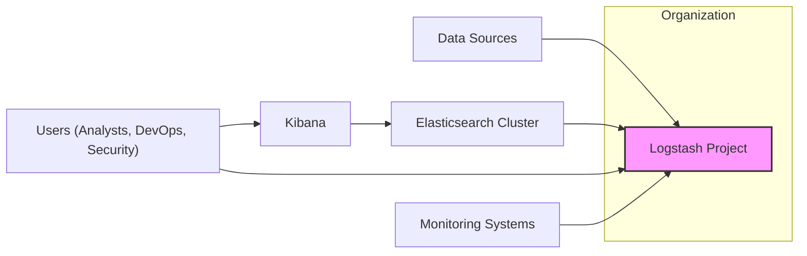
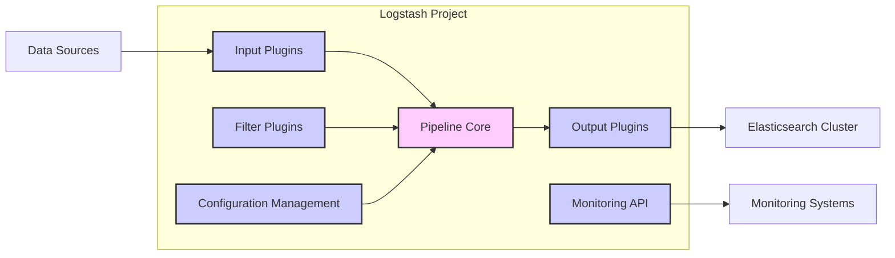
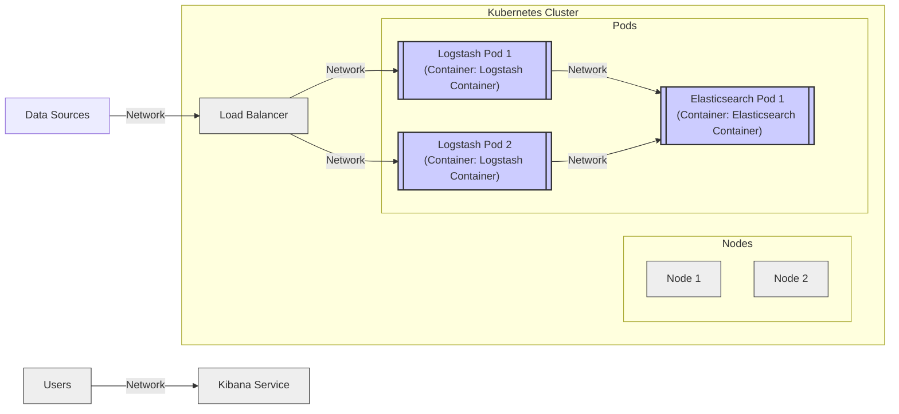

# BUSINESS POSTURE

Logstash is an open-source, server-side data processing pipeline that ingests data from a multitude of sources simultaneously, transforms it, and then sends it to your "stash" like Elasticsearch, or any other system you choose. It is a crucial component in data collection, processing, and analysis pipelines, often used for log management, security information and event management (SIEM), application performance monitoring (APM), and business analytics.

Business Priorities and Goals:
- Reliable and scalable data ingestion and processing: Ensure continuous and efficient data flow from diverse sources.
- Data transformation and enrichment: Enable users to cleanse, normalize, and enrich data for better analysis and insights.
- Support for diverse data sources and destinations: Offer broad compatibility with various input and output systems to cater to different user needs.
- Extensibility and customization: Allow users to extend Logstash functionality through plugins and custom configurations.
- Open-source and community-driven: Leverage community contributions and maintain transparency and flexibility.

Business Risks:
- Data loss or corruption during processing: Failure to reliably process and deliver data can lead to incomplete or inaccurate insights, impacting business decisions.
- Performance bottlenecks and scalability limitations: Inability to handle increasing data volumes can lead to delays in data processing and analysis, affecting real-time monitoring and alerting.
- Security vulnerabilities in data processing pipeline: Compromise of Logstash can lead to data breaches, unauthorized access, and manipulation of critical business information.
- Complexity in configuration and management: Difficulties in setting up and maintaining Logstash pipelines can increase operational costs and reduce efficiency.
- Plugin compatibility and maintenance issues: Reliance on community plugins can introduce instability and security risks if plugins are not well-maintained or have vulnerabilities.

# SECURITY POSTURE

Existing Security Controls:
- security control: Access control to Logstash configuration files and pipelines (implementation described in system administration documentation).
- security control: Network segmentation to isolate Logstash instances (implementation described in network infrastructure documentation).
- security control: TLS/SSL encryption for communication between Logstash and other components like Elasticsearch (implementation described in configuration documentation).
- security control: Input validation and data sanitization within Logstash pipelines (implementation depends on pipeline configuration).
- security control: Security scanning of Logstash codebase (implementation described in development process).
- security control: Dependency scanning for known vulnerabilities in Logstash dependencies (implementation described in development process).

Accepted Risks:
- accepted risk: Potential vulnerabilities in community-contributed plugins due to the open and extensible nature of Logstash.
- accepted risk: Complexity of securing diverse plugin ecosystem and ensuring consistent security practices across all plugins.
- accepted risk: Operational overhead of managing and monitoring security configurations across distributed Logstash instances.

Recommended Security Controls:
- security control: Implement centralized configuration management for Logstash pipelines to ensure consistent security policies.
- security control: Implement automated security testing of Logstash pipelines, including vulnerability scanning and penetration testing.
- security control: Implement security information and event management (SIEM) integration for monitoring Logstash logs and security events.
- security control: Implement role-based access control (RBAC) for managing Logstash configurations and accessing sensitive data.
- security control: Regularly audit and review Logstash configurations and pipelines for security vulnerabilities and misconfigurations.

Security Requirements:
- Authentication:
    - Requirement: Secure authentication mechanisms for accessing Logstash management interfaces and APIs.
    - Requirement: Support for integration with existing authentication systems like LDAP or Active Directory.
- Authorization:
    - Requirement: Role-based access control to manage Logstash configurations, pipelines, and access sensitive data.
    - Requirement: Granular authorization policies to control access to specific Logstash functionalities and resources.
- Input Validation:
    - Requirement: Robust input validation mechanisms within Logstash pipelines to prevent injection attacks and data corruption.
    - Requirement: Support for data sanitization and normalization to mitigate risks from malicious or malformed input data.
- Cryptography:
    - Requirement: Strong encryption for sensitive data in transit and at rest within the Logstash pipeline.
    - Requirement: Secure key management practices for cryptographic keys used by Logstash.
    - Requirement: Support for cryptographic protocols like TLS/SSL for secure communication with data sources and destinations.

# DESIGN

## C4 CONTEXT

Context Diagram Elements:

- Element:
    - Name: Logstash Project
    - Type: Software System
    - Description: The Logstash data processing pipeline, responsible for ingesting, transforming, and shipping data.
    - Responsibilities: Data ingestion from various sources, data transformation and enrichment, data routing to destinations, monitoring and logging of pipeline operations.
    - Security controls: Access control to configuration files, network segmentation, input validation, TLS/SSL encryption for communication, security scanning of codebase and dependencies.

- Element:
    - Name: Data Sources
    - Type: External System
    - Description: Various systems that generate data to be processed by Logstash, such as application logs, system logs, network devices, databases, cloud services, etc.
    - Responsibilities: Generating and providing data to Logstash.
    - Security controls: Authentication and authorization for data access, secure data transmission protocols, data integrity controls.

- Element:
    - Name: Elasticsearch Cluster
    - Type: External System
    - Description: A distributed search and analytics engine used as a primary destination for processed data from Logstash.
    - Responsibilities: Storing, indexing, and searching data received from Logstash.
    - Security controls: Authentication and authorization for data access, data encryption at rest and in transit, network security controls, audit logging.

- Element:
    - Name: Kibana
    - Type: External System
    - Description: A data visualization and exploration tool that works with Elasticsearch, used by users to analyze and visualize data processed by Logstash and stored in Elasticsearch.
    - Responsibilities: Data visualization, dashboard creation, data exploration, user interface for interacting with Elasticsearch data.
    - Security controls: Authentication and authorization for user access, secure communication with Elasticsearch, input validation for user queries and visualizations.

- Element:
    - Name: Users (Analysts, DevOps, Security)
    - Type: Person
    - Description: Various users who interact with Logstash and the data pipeline, including data analysts, DevOps engineers, and security analysts.
    - Responsibilities: Configuring and managing Logstash pipelines, analyzing data, monitoring system performance, investigating security events.
    - Security controls: User authentication and authorization, access control to Logstash configurations and data, audit logging of user activities.

- Element:
    - Name: Monitoring Systems
    - Type: External System
    - Description: Systems used to monitor the health and performance of Logstash and the overall data pipeline, such as Prometheus, Grafana, or Elastic Observability.
    - Responsibilities: Collecting and visualizing metrics, alerting on performance issues, providing insights into system behavior.
    - Security controls: Secure data collection and transmission, access control to monitoring data and dashboards, alerting and notification mechanisms.

## C4 CONTAINER

Container Diagram Elements:

- Element:
    - Name: Input Plugins
    - Type: Container
    - Description: Responsible for collecting data from various sources. Examples include file input, HTTP input, Kafka input, etc.
    - Responsibilities: Establishing connections with data sources, receiving data, parsing data into internal Logstash format.
    - Security controls: Input validation, authentication with data sources, secure communication protocols (TLS/SSL), rate limiting, error handling.

- Element:
    - Name: Filter Plugins
    - Type: Container
    - Description: Responsible for transforming and enriching data. Examples include grok filter, mutate filter, date filter, etc.
    - Responsibilities: Parsing and structuring data, data cleansing and normalization, data enrichment, data routing based on conditions.
    - Security controls: Input validation, data sanitization, secure data transformation logic, protection against injection attacks, logging of filter operations.

- Element:
    - Name: Output Plugins
    - Type: Container
    - Description: Responsible for sending processed data to various destinations. Examples include Elasticsearch output, file output, Kafka output, etc.
    - Responsibilities: Establishing connections with data destinations, formatting data for destination, sending data, handling delivery failures.
    - Security controls: Authentication and authorization with data destinations, secure communication protocols (TLS/SSL), data encryption in transit, output validation, error handling.

- Element:
    - Name: Pipeline Core
    - Type: Container
    - Description: The central engine of Logstash that manages the data processing pipeline, coordinating input, filter, and output plugins.
    - Responsibilities: Pipeline execution management, event queue management, plugin lifecycle management, error handling, monitoring and logging.
    - Security controls: Access control to pipeline configurations, resource management, security logging, internal communication security.

- Element:
    - Name: Configuration Management
    - Type: Container
    - Description: Handles loading, parsing, and managing Logstash pipeline configurations.
    - Responsibilities: Reading configuration files, validating configurations, providing configuration API, managing pipeline updates.
    - Security controls: Access control to configuration files, configuration validation, secure configuration storage, audit logging of configuration changes.

- Element:
    - Name: Monitoring API
    - Type: Container
    - Description: Provides an API for monitoring Logstash health, performance, and pipeline status.
    - Responsibilities: Exposing metrics and status information, providing API endpoints for monitoring tools.
    - Security controls: Authentication and authorization for API access, secure API communication (TLS/SSL), rate limiting, access logging.

## DEPLOYMENT

Deployment Solution: Docker Containerized Deployment on Kubernetes

Deployment Diagram Elements:

- Element:
    - Name: Kubernetes Cluster
    - Type: Environment
    - Description: A container orchestration platform used to deploy and manage Logstash instances.
    - Responsibilities: Container orchestration, resource management, scaling, high availability, service discovery.
    - Security controls: Network policies, RBAC, pod security policies, secrets management, audit logging.

- Element:
    - Name: Nodes
    - Type: Infrastructure
    - Description: Physical or virtual machines that form the Kubernetes cluster and host pods.
    - Responsibilities: Providing compute resources, running container runtime, network connectivity.
    - Security controls: Operating system hardening, security patching, access control, network security, monitoring.

- Element:
    - Name: Logstash Pods
    - Type: Container Instance
    - Description: Instances of Logstash containers running within Kubernetes pods.
    - Responsibilities: Running Logstash pipeline, processing data, communicating with Elasticsearch and other services.
    - Security controls: Container image security scanning, resource limits, network policies, security context constraints, application-level security controls.

- Element:
    - Name: Elasticsearch Pods
    - Type: Container Instance
    - Description: Instances of Elasticsearch containers running within Kubernetes pods.
    - Responsibilities: Storing and indexing data received from Logstash.
    - Security controls: Container image security scanning, resource limits, network policies, security context constraints, Elasticsearch security features.

- Element:
    - Name: Load Balancer
    - Type: Infrastructure
    - Description: Distributes incoming traffic from data sources to Logstash pods.
    - Responsibilities: Traffic distribution, load balancing, health checks, SSL termination.
    - Security controls: Network security, access control, DDoS protection, SSL/TLS configuration.

- Element:
    - Name: Kibana Service
    - Type: Service
    - Description: Kubernetes service exposing Kibana for user access.
    - Responsibilities: Providing access to Kibana UI, load balancing user requests.
    - Security controls: Network security, access control, authentication and authorization for Kibana access.

## BUILD

```mermaid
flowchart LR
    A["Developer"] --> B["Code Repository (GitHub)"]
    B --> C["CI/CD Pipeline (GitHub Actions)"]
    C --> D["Build Stage\n(Compilation, Dependency Resolution)"]
    D --> E["Test Stage\n(Unit Tests, Integration Tests)"]
    E --> F["Security Scan Stage\n(SAST, Dependency Scan, Container Scan)"]
    F --> G["Package Stage\n(Build Artifacts: JAR, Docker Image)"]
    G --> H["Artifact Repository\n(Maven Central, Docker Hub)"]
    style A fill:#eee,stroke:#333,stroke-width:1px
    style B fill:#eee,stroke:#333,stroke-width:1px
    style C fill:#eee,stroke:#333,stroke-width:1px
    style D fill:#ccf,stroke:#333,stroke-width:2px
    style E fill:#ccf,stroke:#333,stroke-width:2px
    style F fill:#ccf,stroke:#333,stroke-width:2px
    style G fill:#ccf,stroke:#333,stroke-width:2px
    style H fill:#eee,stroke:#333,stroke-width:1px
```

Build Process Elements:

- Element:
    - Name: Developer
    - Type: Person
    - Description: Software developers contributing code to the Logstash project.
    - Responsibilities: Writing code, committing changes to the code repository, creating pull requests.
    - Security controls: Secure development practices, code reviews, access control to code repository.

- Element:
    - Name: Code Repository (GitHub)
    - Type: System
    - Description: Git repository hosted on GitHub, used for version control and collaboration.
    - Responsibilities: Storing source code, managing versions, tracking changes, facilitating collaboration.
    - Security controls: Access control, branch protection, audit logging, vulnerability scanning of repository infrastructure.

- Element:
    - Name: CI/CD Pipeline (GitHub Actions)
    - Type: System
    - Description: Automated CI/CD pipeline using GitHub Actions to build, test, and package Logstash.
    - Responsibilities: Automating build process, running tests, performing security scans, packaging artifacts, publishing releases.
    - Security controls: Secure pipeline configuration, access control to pipeline secrets, audit logging of pipeline executions, secure build environment.

- Element:
    - Name: Build Stage
    - Type: Build Process Stage
    - Description: Stage in the CI/CD pipeline responsible for compiling code and resolving dependencies.
    - Responsibilities: Compilation, dependency management, artifact creation.
    - Security controls: Dependency vulnerability scanning, build environment security, secure dependency resolution.

- Element:
    - Name: Test Stage
    - Type: Build Process Stage
    - Description: Stage in the CI/CD pipeline responsible for running automated tests.
    - Responsibilities: Unit testing, integration testing, functional testing, performance testing.
    - Security controls: Secure test environment, test data management, test result analysis.

- Element:
    - Name: Security Scan Stage
    - Type: Build Process Stage
    - Description: Stage in the CI/CD pipeline responsible for performing security scans.
    - Responsibilities: Static Application Security Testing (SAST), Dependency Scanning, Container Image Scanning.
    - Security controls: SAST tools integration, dependency scanning tools integration, container scanning tools integration, vulnerability reporting.

- Element:
    - Name: Package Stage
    - Type: Build Process Stage
    - Description: Stage in the CI/CD pipeline responsible for packaging build artifacts.
    - Responsibilities: Creating JAR files, building Docker images, creating distribution packages.
    - Security controls: Secure packaging process, artifact signing, integrity checks.

- Element:
    - Name: Artifact Repository (Maven Central, Docker Hub)
    - Type: System
    - Description: Repositories for storing and distributing build artifacts.
    - Responsibilities: Storing JAR files, storing Docker images, providing access to artifacts.
    - Security controls: Access control, artifact signing and verification, vulnerability scanning of repository infrastructure, audit logging.

# RISK ASSESSMENT

Critical Business Processes:
- Real-time log aggregation and analysis for operational monitoring and troubleshooting.
- Security event collection and correlation for threat detection and incident response.
- Application performance monitoring data processing for performance optimization.
- Business data ingestion and transformation for analytics and reporting.

Data Sensitivity:
- Logs can contain sensitive information such as user credentials, API keys, personal data, and business secrets depending on the data sources.
- Processed data in Elasticsearch can be used for compliance reporting and audits, requiring data integrity and confidentiality.
- Misconfiguration or compromise of Logstash can lead to exposure of sensitive data and disruption of critical business processes.
- Data sensitivity varies depending on the specific use case and data sources connected to Logstash. It is crucial to classify data sources and pipelines based on sensitivity levels.

# QUESTIONS & ASSUMPTIONS

Questions:
- What are the specific data sources that Logstash will be ingesting in the target environment?
- What are the specific data destinations besides Elasticsearch that Logstash will be sending data to?
- What are the expected data volumes and throughput requirements for Logstash?
- What are the compliance requirements for data processing and storage?
- What existing security infrastructure and tools are available in the target environment?
- What is the organization's risk appetite and security maturity level?

Assumptions:
- Logstash is deployed in a cloud environment using Kubernetes for orchestration.
- Elasticsearch is used as the primary data destination.
- Security is a high priority for the project.
- The organization has some existing security controls in place but needs further enhancements.
- The project aims for a balance between security and operational efficiency.
- The provided GitHub repository represents the core functionality of Logstash, and the design document focuses on these core aspects.