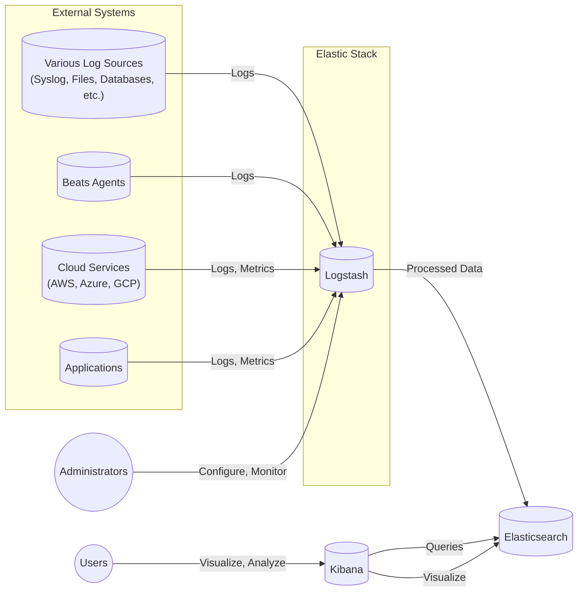
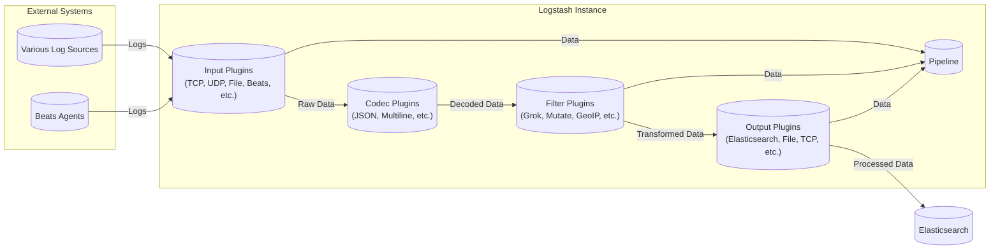
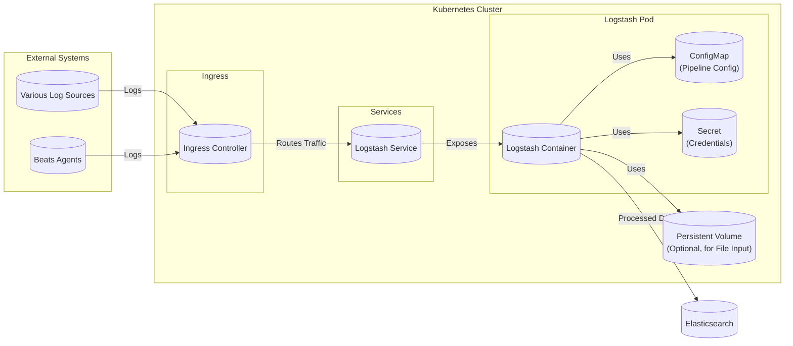
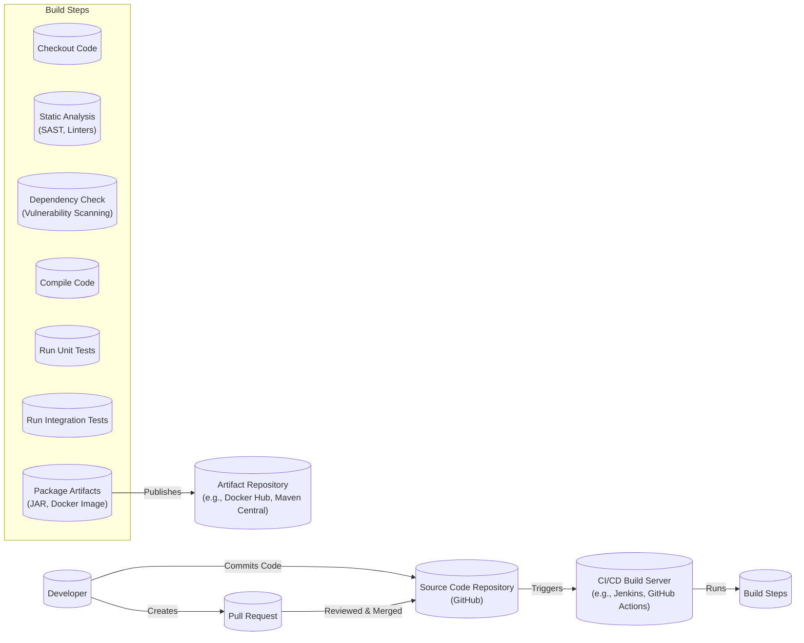

# Project Design Document: Logstash

## BUSINESS POSTURE

Logstash, as part of the Elastic Stack, plays a crucial role in data processing and ingestion. It's a dynamic data collection pipeline with an extensible plugin ecosystem.  The primary business goals and priorities that Logstash addresses are:

*   Centralized Log Management:  Enabling organizations to collect, parse, and transform data from diverse sources, regardless of format or location, into a unified, structured format. This is critical for operational visibility, troubleshooting, and security analysis.
*   Real-time Insights: Facilitating the near real-time analysis of log data, enabling timely responses to operational issues, security threats, and business trends.
*   Scalability and Reliability:  Providing a scalable and reliable data pipeline that can handle large volumes of data with minimal latency and high availability.  This is essential for growing businesses and mission-critical applications.
*   Data Enrichment:  Enhancing raw data with additional context (e.g., geo-location, user agent parsing) to provide richer insights and improve the value of the data.
*   Integration with the Elastic Stack: Seamlessly integrating with Elasticsearch and Kibana to provide a complete solution for log management, search, and visualization.
*   Open Source and Extensible: Offering a flexible and customizable solution through its open-source nature and extensive plugin ecosystem, allowing users to adapt it to their specific needs.

Based on these priorities, the most important business risks that need to be addressed are:

*   Data Loss:  Failure to reliably collect and process log data can lead to loss of critical operational and security information.
*   Performance Bottlenecks:  Inability to handle peak data volumes or complex transformations can result in delays and impact the timeliness of insights.
*   Security Vulnerabilities:  Exposure of sensitive data due to inadequate security controls in the data pipeline.
*   Configuration Errors:  Incorrectly configured pipelines can lead to data corruption, inaccurate analysis, and operational issues.
*   Lack of Auditability:  Inability to track data lineage and changes to the pipeline configuration can hinder troubleshooting and compliance efforts.
*   Downtime: Any downtime of the Logstash pipeline directly impacts the ability to ingest and process logs, leading to potential blind spots in monitoring and security.

## SECURITY POSTURE

Existing security controls and accepted risks (based on a typical Logstash deployment and common practices, as the repository itself doesn't explicitly list all controls):

*   security control: Input Validation: Logstash plugins often include built-in parsing and validation logic to handle different data formats and prevent malformed data from causing issues. Where: Defined within individual input and filter plugins.
*   security control: TLS/SSL Encryption: Logstash supports TLS/SSL encryption for secure communication with input sources (e.g., Beats, TCP, HTTP) and output destinations (e.g., Elasticsearch). Where: Configurable in input and output plugin settings.
*   security control: Authentication: Logstash can be configured to authenticate with various input sources and output destinations using mechanisms like API keys, usernames/passwords, and client certificates. Where: Configurable in input and output plugin settings.
*   security control: Role-Based Access Control (RBAC): When integrated with Elasticsearch and Kibana, RBAC can be used to control access to Logstash pipelines and data. Where: Managed within Elasticsearch and Kibana security features.
*   security control: Pipeline Configuration Management:  Version control of Logstash pipeline configurations (typically stored as files) allows for tracking changes and reverting to previous versions. Where: Managed externally using Git or other version control systems.
*   security control: Regular Updates: Keeping Logstash and its plugins updated is crucial for patching security vulnerabilities. Where: User responsibility, facilitated by Elastic's release process.
*   accepted risk: Plugin Security: While Elastic vets official plugins, community plugins may have varying levels of security scrutiny. Users are responsible for assessing the risk of using third-party plugins.
*   accepted risk: Plaintext Configuration: Logstash pipeline configurations may contain sensitive information (e.g., passwords, API keys) in plaintext.  Users are responsible for securing these configuration files.
*   accepted risk: Limited Built-in Auditing: Logstash itself has limited built-in auditing capabilities.  Auditing often relies on external tools and integration with the Elastic Stack's auditing features.

Recommended Security Controls (High Priority):

*   Secrets Management: Integrate with a secrets management solution (e.g., HashiCorp Vault, AWS Secrets Manager, Azure Key Vault) to securely store and retrieve sensitive configuration values, rather than storing them in plaintext.
*   Enhanced Auditing: Implement more comprehensive auditing of Logstash pipeline events, including data lineage, configuration changes, and user activity. This could involve leveraging the Elastic Stack's auditing features or integrating with external auditing tools.
*   Input Sanitization: Implement robust input sanitization and validation to prevent injection attacks and other vulnerabilities that could exploit Logstash plugins.
*   Regular Security Audits: Conduct regular security audits of Logstash deployments, including penetration testing and vulnerability scanning.
*   Network Segmentation: Isolate Logstash instances from other network segments to limit the impact of potential breaches.

Security Requirements:

*   Authentication:
    *   All communication channels (inputs, outputs) should require authentication where applicable.
    *   Support for strong authentication mechanisms (e.g., multi-factor authentication) should be prioritized.
    *   Credentials should never be stored in plaintext within configuration files.

*   Authorization:
    *   Access to Logstash pipelines and data should be controlled through RBAC.
    *   Principle of least privilege should be applied, granting users only the necessary permissions.

*   Input Validation:
    *   All input data should be validated against expected formats and schemas.
    *   Input sanitization should be performed to prevent injection attacks.
    *   Malformed or unexpected data should be handled gracefully (e.g., logged and rejected).

*   Cryptography:
    *   TLS/SSL encryption should be used for all sensitive communication channels.
    *   Strong cryptographic algorithms and key lengths should be used.
    *   Regular key rotation should be implemented.

*   Data Protection:
     *  Sensitive data at rest should be encrypted.
     *  Data masking or redaction should be applied to sensitive fields where appropriate.

## DESIGN

### C4 CONTEXT

C4 Context Element Descriptions:

*   Element:
    *   Name: Logstash
    *   Type: System
    *   Description: The core data processing pipeline.
    *   Responsibilities: Collects, parses, transforms, and enriches data from various sources and sends it to Elasticsearch.
    *   Security controls: Input validation, TLS/SSL encryption, Authentication, Pipeline configuration management.

*   Element:
    *   Name: Various Log Sources
    *   Type: External System
    *   Description: Represents diverse sources of log data, such as syslog servers, application log files, database logs, etc.
    *   Responsibilities: Generate log data.
    *   Security controls: Dependent on the specific log source.

*   Element:
    *   Name: Beats Agents
    *   Type: External System
    *   Description: Lightweight data shippers from Elastic that send data to Logstash or Elasticsearch.
    *   Responsibilities: Collect and forward data from various sources (e.g., servers, containers).
    *   Security controls: TLS/SSL encryption, Authentication.

*   Element:
    *   Name: Cloud Services
    *   Type: External System
    *   Description: Cloud platforms (AWS, Azure, GCP) that generate logs and metrics.
    *   Responsibilities: Provide cloud infrastructure and services.
    *   Security controls: Dependent on the specific cloud service and its configuration.

*   Element:
    *   Name: Applications
    *   Type: External System
    *   Description: Custom applications that generate logs and metrics.
    *   Responsibilities: Perform application-specific tasks.
    *   Security controls: Dependent on the application's design and implementation.

*   Element:
    *   Name: Elasticsearch
    *   Type: System
    *   Description: The search and analytics engine that stores and indexes data processed by Logstash.
    *   Responsibilities: Store, index, and search data.
    *   Security controls: RBAC, TLS/SSL encryption, Authentication, Index lifecycle management, Data encryption at rest.

*   Element:
    *   Name: Kibana
    *   Type: System
    *   Description: The visualization and management platform for the Elastic Stack.
    *   Responsibilities: Provide a user interface for searching, visualizing, and managing data in Elasticsearch.
    *   Security controls: RBAC, TLS/SSL encryption, Authentication, Session management.

*   Element:
    *   Name: Administrators
    *   Type: User
    *   Description: Users responsible for configuring and monitoring Logstash.
    *   Responsibilities: Manage Logstash pipelines, configure security settings, monitor performance.
    *   Security controls: Strong authentication, RBAC.

*   Element:
    *   Name: Users
    *   Type: User
    *   Description: Users who interact with Kibana to visualize and analyze data.
    *   Responsibilities: Analyze data, create dashboards, generate reports.
    *   Security controls: Strong authentication, RBAC.

### C4 CONTAINER

C4 Container Element Descriptions:

*   Element:
    *   Name: Input Plugins
    *   Type: Container
    *   Description: Plugins that receive data from various sources.
    *   Responsibilities: Connect to data sources, receive data, and pass it to codec plugins or the pipeline.
    *   Security controls: Authentication, TLS/SSL encryption (depending on the plugin).

*   Element:
    *   Name: Filter Plugins
    *   Type: Container
    *   Description: Plugins that transform and enrich data.
    *   Responsibilities: Parse, filter, modify, and enrich data.
    *   Security controls: Input validation, data sanitization (depending on the plugin).

*   Element:
    *   Name: Output Plugins
    *   Type: Container
    *   Description: Plugins that send processed data to destinations like Elasticsearch.
    *   Responsibilities: Connect to output destinations and send data.
    *   Security controls: Authentication, TLS/SSL encryption (depending on the plugin).

*   Element:
    *   Name: Codec Plugins
    *   Type: Container
    *   Description: Plugins that decode and encode data.
    *   Responsibilities: Decode raw data into a structured format and encode structured data into a specific format.
    *   Security controls: Input validation (depending on the plugin).

*   Element:
    *   Name: Pipeline
    *   Type: Container
    *   Description: The core processing unit that orchestrates the flow of data through input, filter, and output plugins.
    *   Responsibilities: Manage the execution of plugins, handle errors, and ensure data flow.
    *   Security controls:  Configuration validation.

### DEPLOYMENT

Possible deployment solutions:

1.  Standalone: Logstash instances running on dedicated servers or virtual machines.
2.  Clustered: Multiple Logstash instances working together for high availability and scalability.
3.  Containerized: Logstash instances running in Docker containers, often orchestrated by Kubernetes.
4.  Cloud-based: Using managed Logstash services offered by cloud providers (e.g., AWS Elastic Container Service, Azure Container Instances, Google Kubernetes Engine).

Chosen solution for detailed description: Containerized deployment using Kubernetes.

Deployment Element Descriptions:

*   Element:
    *   Name: Logstash Container
    *   Type: Container
    *   Description: The Logstash application running inside a Docker container.
    *   Responsibilities: Execute the Logstash pipeline.
    *   Security controls:  Container image security scanning, minimal base image, read-only filesystem (where possible).

*   Element:
    *   Name: ConfigMap
    *   Type: Kubernetes Resource
    *   Description: Stores the Logstash pipeline configuration.
    *   Responsibilities: Provide configuration data to the Logstash container.
    *   Security controls: Access control via Kubernetes RBAC.

*   Element:
    *   Name: Secret
    *   Type: Kubernetes Resource
    *   Description: Stores sensitive information like passwords and API keys.
    *   Responsibilities: Provide secrets to the Logstash container.
    *   Security controls: Encryption at rest, access control via Kubernetes RBAC.

*   Element:
    *   Name: Persistent Volume
    *   Type: Kubernetes Resource
    *   Description: Optional persistent storage for file input plugins.
    *   Responsibilities: Provide persistent storage for Logstash.
    *   Security controls: Access control via Kubernetes RBAC, encryption at rest (depending on the storage provider).

*   Element:
    *   Name: Logstash Service
    *   Type: Kubernetes Resource
    *   Description: Exposes the Logstash container to other services within the cluster.
    *   Responsibilities: Provide a stable endpoint for accessing Logstash.
    *   Security controls: Network policies.

*   Element:
    *   Name: Ingress Controller
    *   Type: Kubernetes Resource
    *   Description: Manages external access to the Logstash service.
    *   Responsibilities: Route external traffic to the Logstash service.
    *   Security controls: TLS/SSL termination, authentication, web application firewall (WAF).

*   Element:
    *   Name: Kubernetes Cluster
    *   Type: Deployment Environment
    *   Description: The Kubernetes cluster where Logstash is deployed.
    *   Responsibilities: Orchestrate and manage the Logstash containers.
    *   Security controls: Kubernetes RBAC, network policies, pod security policies, node security.

### BUILD

The Logstash build process is managed by Elastic and involves several steps, including code compilation, testing, packaging, and distribution.  While the GitHub repository provides the source code, the official build process is handled internally by Elastic. However, we can describe a typical secure build process for a project like Logstash, incorporating best practices.

Build Process Description:

1.  Code Commit: Developers commit code changes to the source code repository (GitHub).
2.  Pull Request: Changes are submitted via pull requests, which are reviewed and merged by other developers.
3.  CI/CD Trigger:  A commit or merge to the main branch triggers the CI/CD build server (e.g., Jenkins, GitHub Actions).
4.  Build Steps:
    *   Checkout Code: The build server checks out the latest code from the repository.
    *   Static Analysis: Static analysis tools (SAST) and linters are run to identify potential security vulnerabilities and code quality issues.
    *   Dependency Check:  Dependencies are scanned for known vulnerabilities.
    *   Compile Code: The Logstash code is compiled.
    *   Unit Tests: Unit tests are executed to verify the functionality of individual components.
    *   Integration Tests: Integration tests are run to verify the interaction between different components.
    *   Package Artifacts: The compiled code and dependencies are packaged into artifacts (e.g., JAR files, Docker images).
5.  Artifact Repository: The build artifacts are published to an artifact repository (e.g., Docker Hub, Maven Central).

Security Controls in Build Process:

*   security control: Code Review:  All code changes are reviewed by at least one other developer before being merged.
*   security control: Static Analysis (SAST):  Static analysis tools are used to identify potential security vulnerabilities in the code.
*   security control: Dependency Scanning:  Dependencies are scanned for known vulnerabilities.
*   security control: Software Composition Analysis (SCA): Used to identify and manage open-source components and their licenses.
*   security control: Build Automation: The entire build process is automated to ensure consistency and repeatability.
*   security control: Immutable Artifacts:  Build artifacts are immutable, meaning they cannot be changed after they are created.
*   security control: Signed Artifacts: Artifacts can be digitally signed to verify their authenticity and integrity.

## RISK ASSESSMENT

*   Critical Business Processes:
    *   Centralized Log Management: Collecting, processing, and storing logs from various sources is critical for operational visibility, troubleshooting, security monitoring, and compliance.
    *   Real-time Analysis:  The ability to analyze log data in near real-time is crucial for timely incident response and decision-making.
    *   Data Enrichment: Enhancing log data with contextual information improves the value of the data for analysis and reporting.

*   Data Sensitivity and Protection:
    *   Log Data: Log data can contain sensitive information, including:
        *   Personally Identifiable Information (PII): Usernames, IP addresses, email addresses, etc.
        *   Authentication Credentials: Passwords, API keys (if improperly logged).
        *   Financial Data: Transaction details, account numbers (if improperly logged).
        *   Health Information: Medical records, patient data (if improperly logged).
        *   Proprietary Information: Source code, internal documents (if improperly logged).
        *   System Configuration: Server names, network configurations.
    *   Sensitivity Levels:
        *   High: PII, authentication credentials, financial data, health information.
        *   Medium: Proprietary information, system configuration.
        *   Low: General operational logs.
    *   Data Protection Measures:
        *   Encryption: Encrypting log data at rest and in transit.
        *   Access Control: Restricting access to log data based on the principle of least privilege.
        *   Data Masking/Redaction: Masking or redacting sensitive fields in log data.
        *   Data Loss Prevention (DLP): Implementing measures to prevent sensitive data from being leaked.
        *   Auditing: Monitoring access to and use of log data.
        *   Retention Policies: Defining policies for how long log data should be retained.

## QUESTIONS & ASSUMPTIONS

*   Questions:
    *   What specific compliance requirements (e.g., GDPR, HIPAA, PCI DSS) apply to the organization using Logstash?
    *   What are the expected data volumes and growth rates?
    *   What are the specific security policies and procedures of the organization?
    *   What is the existing infrastructure and tooling environment?
    *   What level of expertise is available within the organization for managing Logstash and the Elastic Stack?
    *   Are there any specific performance requirements or SLAs for log processing?
    *   What are the specific types of log sources and their formats?
    *   What are the specific data retention requirements?
    *   What are the organization's disaster recovery and business continuity plans?
    *   What is organization's risk appetite?

*   Assumptions:
    *   BUSINESS POSTURE: The organization has a need for centralized log management and real-time analysis.
    *   BUSINESS POSTURE: The organization values data security and compliance.
    *   SECURITY POSTURE: The organization has basic security controls in place (e.g., firewalls, access control).
    *   SECURITY POSTURE: The organization is willing to invest in additional security measures.
    *   DESIGN: Logstash will be integrated with Elasticsearch and Kibana.
    *   DESIGN: The deployment environment will be reasonably secure.
    *   DESIGN: Developers follow secure coding practices.
    *   DESIGN: Regular updates and patching will be performed.
    *   DESIGN: The build process will be automated and secure.