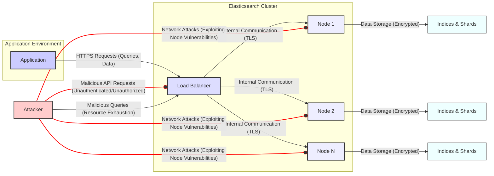

Here's the updated threat list focusing on high and critical threats directly involving Elasticsearch:

### High and Critical Elasticsearch Threats

*   **Threat:** Unauthorized Data Access via API
    *   **Description:** An attacker exploits weak or missing authentication/authorization on the Elasticsearch API to directly query and retrieve sensitive data stored in indices. This could involve using tools like `curl` or scripting languages to send requests to the Elasticsearch API endpoints.
    *   **Impact:** Confidentiality breach, exposure of sensitive user data, potential regulatory fines (e.g., GDPR), reputational damage.
    *   **Affected Component:** Elasticsearch REST API, Security features (if enabled, but misconfigured or bypassed).
    *   **Risk Severity:** Critical
    *   **Mitigation Strategies:**
        *   Enable and enforce authentication for the Elasticsearch API using built-in security features or a security plugin (e.g., Open Distro for Elasticsearch Security, Search Guard).
        *   Implement role-based access control (RBAC) to restrict API access based on user roles and privileges.
        *   Ensure strong password policies for Elasticsearch users.
        *   Regularly review and audit API access logs.

*   **Threat:** Data Tampering through Unsecured API
    *   **Description:** An attacker gains unauthorized write access to Elasticsearch indices due to lack of authentication or authorization. They can then modify, delete, or corrupt data, potentially disrupting application functionality or causing data integrity issues.
    *   **Impact:** Data integrity compromise, application malfunction, financial loss due to incorrect data, reputational damage.
    *   **Affected Component:** Elasticsearch REST API, Indexing and Document APIs.
    *   **Risk Severity:** High
    *   **Mitigation Strategies:**
        *   Implement strong authentication and authorization for all write operations on Elasticsearch indices.
        *   Utilize RBAC to restrict write access to authorized users and applications only.
        *   Consider implementing data validation and sanitization on the application side before indexing data.
        *   Regularly back up Elasticsearch data to facilitate recovery from data corruption.

*   **Threat:** Denial of Service through Malicious Queries
    *   **Description:** An attacker crafts complex or resource-intensive queries that overwhelm the Elasticsearch cluster, consuming excessive CPU, memory, or I/O resources, leading to performance degradation or service unavailability.
    *   **Impact:** Application downtime, degraded performance, impact on other applications sharing the Elasticsearch cluster.
    *   **Affected Component:** Elasticsearch Query Engine, Search API.
    *   **Risk Severity:** High
    *   **Mitigation Strategies:**
        *   Implement query timeouts and circuit breakers in Elasticsearch to prevent runaway queries.
        *   Monitor Elasticsearch cluster performance and resource utilization.
        *   Educate developers on writing efficient and optimized Elasticsearch queries.
        *   Consider using the Elasticsearch Task Manager to monitor and control long-running tasks.
        *   Implement rate limiting on API requests.

*   **Threat:** Node Compromise due to Unsecured Configuration
    *   **Description:** An attacker exploits misconfigurations or vulnerabilities in individual Elasticsearch nodes (e.g., exposed JMX ports, default credentials for internal services) to gain unauthorized access to the underlying server, potentially leading to data breaches, cluster takeover, or further attacks on the infrastructure.
    *   **Impact:** Complete compromise of the Elasticsearch cluster, data breach, service disruption, potential lateral movement within the network.
    *   **Affected Component:** Elasticsearch Node, Operating System (as it relates to Elasticsearch configuration), Network Configuration (as it relates to Elasticsearch).
    *   **Risk Severity:** Critical
    *   **Mitigation Strategies:**
        *   Harden the operating system and network configuration of Elasticsearch nodes.
        *   Disable unnecessary services and ports on Elasticsearch servers.
        *   Secure internal communication between Elasticsearch nodes using TLS.
        *   Regularly apply security patches to Elasticsearch and the underlying operating system.
        *   Follow Elasticsearch security best practices for deployment and configuration.

*   **Threat:** Plugin Vulnerabilities
    *   **Description:** An attacker exploits known vulnerabilities in installed Elasticsearch plugins to gain unauthorized access, execute arbitrary code, or cause denial of service within the Elasticsearch cluster.
    *   **Impact:** Node compromise, data breach, service disruption, potential for lateral movement within the Elasticsearch environment.
    *   **Affected Component:** Elasticsearch Plugins.
    *   **Risk Severity:** High
    *   **Mitigation Strategies:**
        *   Only install necessary plugins from trusted sources.
        *   Keep all installed plugins up-to-date with the latest security patches.
        *   Regularly review the list of installed plugins and remove any unused or outdated ones.
        *   Monitor security advisories for installed plugins.

*   **Threat:** Lack of Encryption at Rest
    *   **Description:** Sensitive data stored in Elasticsearch indices is not encrypted at rest. If an attacker gains physical access to the server or storage media hosting the Elasticsearch data, they can directly access and read the data.
    *   **Impact:** Confidentiality breach, exposure of sensitive data, potential regulatory fines.
    *   **Affected Component:** Elasticsearch Data Storage.
    *   **Risk Severity:** High
    *   **Mitigation Strategies:**
        *   Enable encryption at rest for Elasticsearch indices using built-in features or security plugins.
        *   Ensure proper key management practices for encryption keys.

*   **Threat:** Lack of Encryption in Transit
    *   **Description:** Communication between the application and the Elasticsearch cluster, or between nodes within the cluster, is not encrypted. An attacker performing a man-in-the-middle (MITM) attack can intercept and potentially read or modify the data being transmitted.
    *   **Impact:** Confidentiality breach, data tampering, potential for credential theft related to Elasticsearch authentication.
    *   **Affected Component:** Elasticsearch Transport Layer, REST API.
    *   **Risk Severity:** High
    *   **Mitigation Strategies:**
        *   Enable TLS/HTTPS for all communication between the application and Elasticsearch.
        *   Enable TLS for inter-node communication within the Elasticsearch cluster.

### Data Flow Diagram with High and Critical Threats Highlighted

**High and Critical Threats Illustrated in the Diagram:**

*   **Malicious API Requests (Unauthenticated/Unauthorized) (F --o B):** Represents threats related to unauthorized access and data manipulation via the Elasticsearch API.
*   **Network Attacks (Exploiting Node Vulnerabilities) (F --o C/D/E):**  Highlights the risk of direct attacks on Elasticsearch nodes due to misconfigurations or vulnerabilities within Elasticsearch or its environment.
*   **Malicious Queries (Resource Exhaustion) (F --> B):** Shows how attackers can overload the Elasticsearch cluster with crafted queries.