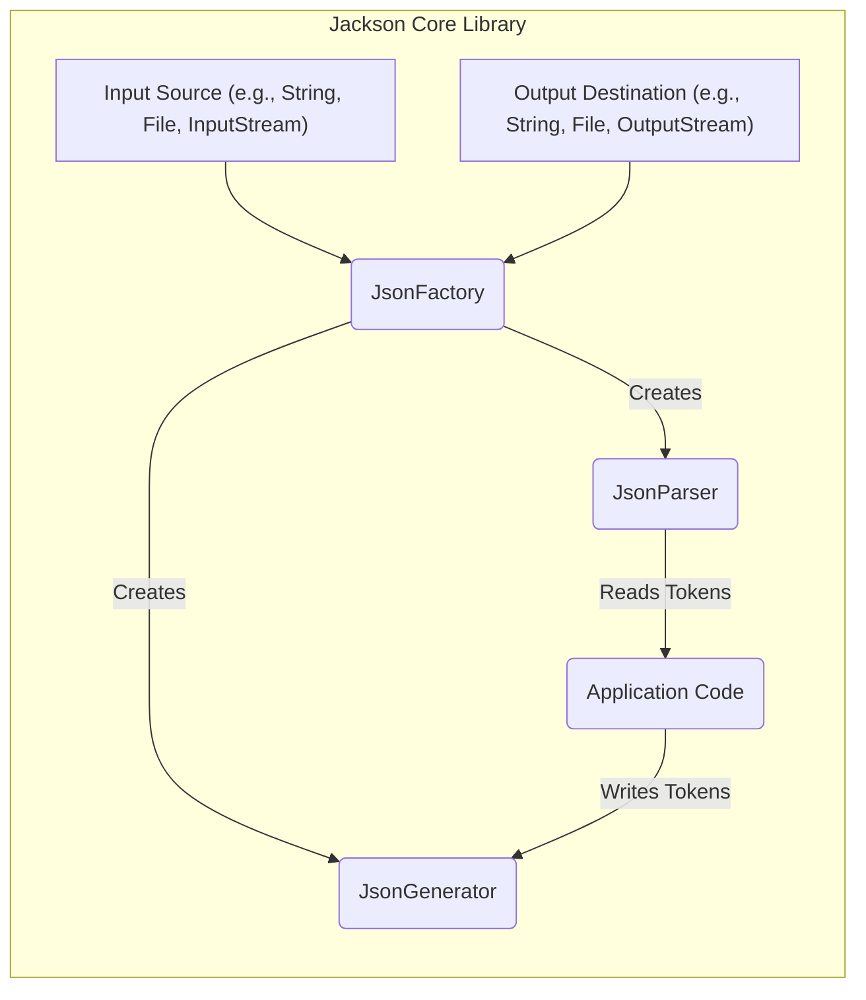
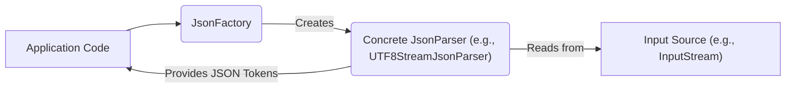
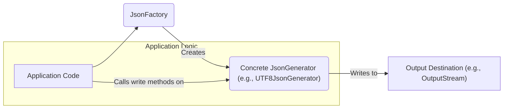

# Project Design Document: Jackson Core Library

**Version:** 1.1
**Date:** October 26, 2023
**Author:** AI Software Architect

## 1. Introduction

This document provides an enhanced architectural design of the Jackson Core library, a foundational component within the Jackson data processing ecosystem for Java. This detailed design aims to facilitate comprehensive threat modeling by offering a clear understanding of the library's internal structure, key components, and data flow mechanisms.

## 2. Project Overview

Jackson Core serves as the bedrock for high-performance and versatile JSON (and other data format) processing in Java. It exposes a low-level streaming API, enabling efficient manipulation of JSON data as a sequence of discrete tokens. This core library is a fundamental dependency for higher-level Jackson modules, such as `jackson-databind` (for object-to-JSON mapping and vice versa) and the various `jackson-dataformat-*` modules (for handling formats like XML, YAML, CSV, etc.).

**Key Goals:**

*   Achieve optimal performance in JSON parsing and serialization operations.
*   Offer a memory-efficient, event-driven (streaming) API suitable for processing large JSON documents without loading the entire structure into memory.
*   Serve as a robust and extensible foundation for the broader Jackson library ecosystem.
*   Maintain a stable, well-documented, and backward-compatible API to minimize disruption for users.

**Scope:**

The focus of this design document remains exclusively on the `jackson-core` library itself. Functionality provided by other Jackson modules like `jackson-databind` or specific data format modules is explicitly outside the scope of this document.

## 3. Architectural Design

Jackson Core employs a producer-consumer pattern for both reading (parsing) and writing (generating) JSON data. The central abstractions are:

*   **JsonFactory:** The primary entry point for creating `JsonParser` and `JsonGenerator` instances. It also handles format detection and configuration.
*   **JsonParser:**  An abstract class defining the API for reading JSON data as a stream of tokens. Concrete implementations handle different input sources.
*   **JsonGenerator:** An abstract class defining the API for writing JSON data as a stream of tokens. Concrete implementations handle different output destinations.
*   **FormatFactory (Implicit):** While not a direct class users typically interact with, the `JsonFactory` acts as a `FormatFactory`, responsible for determining the data format (e.g., JSON) and selecting the appropriate parser/generator.

**Detailed Explanation of Components:**

*   **Input Source:** Represents the origin of the JSON data being processed. Common examples include strings, files, input streams, byte arrays, etc.
*   **Output Destination:** Represents the target where the generated JSON data will be written. Examples include string builders, files, output streams, byte arrays, etc.
*   **JsonFactory:**  A pivotal factory class responsible for:
    *   Detecting the data format (typically JSON, but extensible).
    *   Configuring and instantiating concrete `JsonParser` and `JsonGenerator` implementations based on the input/output source and desired features.
    *   Managing codec configurations and default settings.
*   **JsonParser:** The core abstraction for reading JSON. Key aspects include:
    *   Iterating through the input source.
    *   Identifying and extracting JSON tokens (e.g., `START_OBJECT`, `FIELD_NAME`, `VALUE_STRING`, `END_ARRAY`).
    *   Providing methods to access the value associated with the current token.
    *   Concrete implementations include:
        *   `UTF8StreamJsonParser`: For reading from byte streams encoded in UTF-8.
        *   `ReaderBasedJsonParser`: For reading from character streams (Readers).
        *   `ByteSourceJsonBootstrapper`:  Used internally to detect encoding and create the appropriate parser.
*   **JsonGenerator:** The core abstraction for writing JSON. Key aspects include:
    *   Providing methods to write various JSON tokens, allowing programmatic construction of JSON structures.
    *   Handling formatting options (e.g., indentation).
    *   Concrete implementations include:
        *   `UTF8JsonGenerator`: For writing to byte streams encoded in UTF-8.
        *   `WriterBasedJsonGenerator`: For writing to character streams (Writers).
*   **Application Code:** The user-defined code that interacts with `JsonParser` to consume JSON data and with `JsonGenerator` to produce JSON data.

## 4. Data Flow

The flow of data within Jackson Core can be distinctly separated into read (parsing) and write (generation) operations.

### 4.1. Reading (Parsing) JSON Data

1. **Initialization:** The application provides an input source (e.g., an `InputStream`) to the `JsonFactory`.
2. **Parser Creation:** The `JsonFactory` analyzes the input source (e.g., by inspecting the first few bytes for encoding) and instantiates the appropriate concrete `JsonParser` implementation.
3. **Tokenization:** The `JsonParser` reads data from the input source sequentially, breaking it down into a stream of individual JSON tokens.
4. **Token Consumption:** The application code iteratively calls methods on the `JsonParser` (e.g., `nextToken()`) to advance through the token stream and retrieve token values using methods like `getText()`, `getIntValue()`, etc.
5. **Data Processing:** The application logic processes the extracted data based on the identified tokens and their values.

### 4.2. Writing (Generating) JSON Data

1. **Initialization:** The application provides an output destination (e.g., an `OutputStream`) to the `JsonFactory`.
2. **Generator Creation:** The `JsonFactory` instantiates the appropriate concrete `JsonGenerator` implementation based on the output destination type and configured features.
3. **Token Generation:** The application code calls methods on the `JsonGenerator` (e.g., `writeStartObject()`, `writeFieldName("name")`, `writeString("value")`, `writeEndObject()`) to emit JSON tokens, effectively building the JSON structure programmatically.
4. **Output to Destination:** The `JsonGenerator` writes the generated JSON tokens to the specified output destination.
5. **Finalization:** The application typically calls `flush()` to ensure all buffered data is written and `close()` to release resources associated with the generator and the underlying output destination.

## 5. Key Components and Interfaces (Detailed)

This section provides a more in-depth look at the core classes and interfaces within Jackson Core.

*   **com.fasterxml.jackson.core.JsonFactory:**
    *   Central factory for creating `JsonParser` and `JsonGenerator` instances.
    *   Configurable with various `Feature` enums to control parsing/generation behavior (e.g., `ALLOW_COMMENTS`, `QUOTE_FIELD_NAMES`).
    *   Provides methods like:
        *   `createParser(File f)`
        *   `createParser(InputStream in)`
        *   `createGenerator(OutputStream out, JsonEncoding enc)`
        *   `getFormatName()`
    *   Manages `JsonFactory.Feature` settings.

*   **com.fasterxml.jackson.core.JsonParser:**
    *   Abstract base class for all JSON parsers.
    *   Provides methods for navigating the JSON structure and accessing token information.
    *   Key methods include:
        *   `nextToken()`: Advances to the next token.
        *   `getCurrentToken()`: Returns the current token type (`JsonToken`).
        *   `getText()`: Returns the text value of the current token (if applicable).
        *   `getIntValue()`, `getLongValue()`, `getDoubleValue()`: Returns the numeric value of the current token.
        *   `getValueAsBoolean()`: Returns the boolean value of the current token.
        *   `getTokenLocation()`: Returns the location of the current token in the input source.
    *   Concrete implementations handle different input types and encodings.

*   **com.fasterxml.jackson.core.JsonGenerator:**
    *   Abstract base class for all JSON generators.
    *   Provides methods for writing JSON tokens to the output destination.
    *   Key methods include:
        *   `writeStartObject()`, `writeEndObject()`: Writes object start and end markers.
        *   `writeStartArray()`, `writeEndArray()`: Writes array start and end markers.
        *   `writeFieldName(String name)`: Writes a field name.
        *   `writeString(String text)`: Writes a string value.
        *   `writeNumber(int num)`, `writeNumber(double num)`: Writes numeric values.
        *   `writeBoolean(boolean state)`: Writes a boolean value.
        *   `writeNull()`: Writes a null value.
        *   `flush()`: Flushes any buffered output.
        *   `close()`: Closes the generator and the underlying output destination.
    *   Concrete implementations handle different output types and encodings.

*   **com.fasterxml.jackson.core.JsonToken:**
    *   An enumeration defining all possible JSON token types (e.g., `START_OBJECT`, `END_OBJECT`, `FIELD_NAME`, `VALUE_STRING`, `VALUE_NUMBER_INT`, `VALUE_TRUE`, `VALUE_FALSE`, `VALUE_NULL`).

*   **com.fasterxml.jackson.core.JsonLocation:**
    *   Represents the precise location of a token within the input source, including line number, column number, and character offset. Crucial for accurate error reporting and debugging.

*   **com.fasterxml.jackson.core.JsonProcessingException:**
    *   The base class for all exceptions thrown by Jackson Core during JSON processing (parsing or generation).

## 6. Security Considerations (Detailed)

This section expands on potential security considerations, providing more specific examples and categorizations.

*   **Input Validation and Malicious Input:**
    *   **Malformed JSON:**  Input that violates the JSON specification can lead to parsing errors or unexpected behavior.
    *   **Deeply Nested Structures:**  Extremely nested JSON objects or arrays can consume excessive stack space, potentially leading to `StackOverflowError`.
    *   **Large Strings/Arrays:**  Very large string or array values can lead to excessive memory allocation and potential `OutOfMemoryError`.
    *   **Integer Overflow/Underflow:** Parsing extremely large or small numeric values might exceed the limits of Java's integer or long types, leading to incorrect data interpretation.
    *   **Arbitrary Code Execution (Indirect):** While Jackson Core itself doesn't directly execute code from JSON, vulnerabilities in higher-level modules using Jackson Core might be exploitable through crafted JSON that triggers unintended actions in those modules.

*   **Denial of Service (DoS):**
    *   **Resource Exhaustion:**  Processing extremely large or complex JSON documents can consume excessive CPU time and memory, potentially causing a DoS.
    *   **Algorithmic Complexity Attacks:**  Crafted JSON input might exploit inefficiencies in the parsing algorithm, leading to disproportionately high processing times.

*   **Configuration Vulnerabilities:**
    *   **Feature Misconfiguration:**  Disabling default security features (e.g., limits on nesting depth) can increase vulnerability to malicious input.
    *   **Default Settings:**  Relying on default configurations without understanding their security implications can be risky.

*   **Dependency Management:**
    *   **Transitive Dependencies:** Jackson Core relies on other libraries. Vulnerabilities in these transitive dependencies could indirectly impact Jackson Core's security. Regularly updating dependencies is crucial.

*   **Information Disclosure:**
    *   **Error Messages:** Verbose error messages containing sensitive information about the application's internal structure or data could be unintentionally exposed.

## 7. Deployment Considerations (Elaborated)

Jackson Core's deployment is typically as an embedded library within Java applications. Specific deployment contexts can influence the attack surface and potential impact of vulnerabilities.

*   **Web Applications (REST APIs):**
    *   Jackson Core is heavily used for serializing and deserializing JSON data in RESTful APIs (e.g., using frameworks like Spring MVC, Jakarta REST).
    *   Vulnerabilities could allow attackers to manipulate data exchanged with the server or cause server-side issues.
    *   Exposure to untrusted input from external clients is a significant concern.

*   **Microservices Architectures:**
    *   Used for inter-service communication, often involving the exchange of JSON messages.
    *   Compromise of one microservice could potentially be leveraged to attack other services through malicious JSON payloads.

*   **Data Processing Pipelines (e.g., Apache Spark, Apache Kafka):**
    *   Used for processing large volumes of data, including JSON data.
    *   Vulnerabilities could lead to data corruption, processing failures, or resource exhaustion within the pipeline.

*   **Command-Line Interface (CLI) Tools:**
    *   Used for processing JSON data provided as input or for generating JSON output.
    *   Attackers might provide malicious JSON input to cause unexpected behavior or compromise the system running the CLI tool.

*   **Desktop Applications:**
    *   Used for reading and writing configuration files or application data in JSON format.
    *   Vulnerabilities could be exploited by manipulating these local JSON files.

## 8. Future Considerations

*   **Continued Support for Evolving JSON Standards:**  Adapting to new features and specifications within the JSON standard (e.g., new data types or syntax).
*   **Performance Enhancements:** Ongoing efforts to optimize parsing and generation speed and reduce memory footprint.
*   **Security Audits and Hardening:**  Proactive security reviews and implementation of mitigations for potential vulnerabilities.
*   **Integration with Emerging Data Formats:**  Exploring potential for closer integration or support for new data formats at the core level, while maintaining a focus on JSON.
*   **Improved Error Handling and Reporting:**  Providing more informative and actionable error messages for developers.

This improved design document provides a more detailed and nuanced understanding of the Jackson Core library's architecture, specifically tailored for threat modeling activities. The enhanced information regarding components, data flow, and security considerations will be invaluable for identifying potential weaknesses and implementing appropriate security measures.