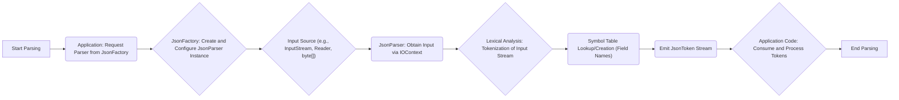
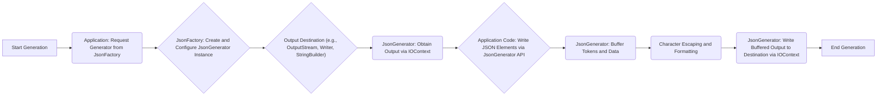

# Project Design Document: Jackson Core Library

**Version:** 1.1
**Date:** October 26, 2023
**Author:** AI Software Architect

## 1. Introduction

This document provides an enhanced and more detailed design overview of the Jackson Core library (fasterxml/jackson-core), a fundamental component within the Jackson data processing suite for Java. This document is specifically crafted to facilitate subsequent threat modeling activities by offering a comprehensive understanding of the library's architecture, key components, and data flow mechanisms.

Jackson Core delivers a low-level, stream-based API for highly efficient and flexible parsing and generation of JSON data. Serving as the bedrock for higher-level Jackson modules such as `databind` (for object-to-JSON mapping and vice-versa) and `dataformat` (for handling diverse data formats beyond JSON), a deep understanding of its internal operations is paramount for proactively identifying and mitigating potential security vulnerabilities.

## 2. Goals and Non-Goals

**Goals:**

*   Precisely define the architectural components that constitute the Jackson Core library.
*   Thoroughly describe the data flow pathways during both JSON parsing and generation processes.
*   Clearly identify the critical interfaces and classes that underpin the core functionality of the library.
*   Provide illustrative visual representations of the library's structural organization and data flow dynamics.
*   Establish a robust and detailed foundation upon which comprehensive threat modeling can be effectively conducted.

**Non-Goals:**

*   In-depth design specifications for higher-level Jackson modules (databind, dataformat, etc.).
*   Performance benchmarking metrics or detailed optimization analysis of the library.
*   Granular implementation details of individual methods or algorithms within the codebase.
*   Comparative analysis against other JSON processing libraries available in the Java ecosystem.
*   Exhaustive explanation of every configurable option or feature offered by the library.

## 3. Architectural Overview

The architectural design of Jackson Core revolves around the principles of streaming processing for both parsing and generation of JSON. This approach provides a low-level API enabling developers to interact with JSON data as a sequential stream of discrete tokens.

The primary components of Jackson Core can be broadly categorized as follows:

*   **Token Abstraction Layer:** Defines the fundamental, atomic units of JSON data, such as 'start object', 'field name', 'string value', and 'end array'. This provides a consistent way to represent the structure of JSON.
*   **Parser (`JsonParser`):** The engine responsible for reading raw JSON input and emitting a structured stream of tokens representing that input.
*   **Generator (`JsonGenerator`):** The counterpart to the parser, responsible for taking a stream of tokens and writing them out as well-formed JSON output.
*   **Factory (`JsonFactory`):**  The central point for creating instances of both `JsonParser` and `JsonGenerator`. It also plays a crucial role in managing codec configurations and format-specific settings.
*   **Codec (Optional):** Provides basic encoding and decoding functionalities, such as Base64 encoding for binary data within JSON.
*   **Symbol Tables:** Internal data structures (`ByteQuadsCanonicalizer` and `CharsToNameCanonicalizer`) used for efficient management and comparison of field names (symbols) during parsing, improving performance.
*   **Input/Output Context (`IOContext`):** Manages the underlying input and output streams or readers/writers, including buffering and character encoding handling.

## 4. Component Design

### 4.1. `JsonFactory`

*   **Responsibilities:**
    *   Acts as the factory for instantiating concrete implementations of `JsonParser` and `JsonGenerator`.
    *   Manages global configuration settings that influence parsing and generation behavior, including feature flags and character encoding.
    *   Dynamically determines the appropriate parser or generator implementation to use based on the provided input or output source type (e.g., `InputStream`, `OutputStream`, `String`, `byte[]`).
    *   Offers specialized methods for creating binary JSON (Smile) parsers and generators.
    *   Manages recycling of parser and generator instances for performance optimization.

### 4.2. `JsonParser`

*   **Responsibilities:**
    *   Consumes raw JSON input from a designated source (e.g., file, network stream, string).
    *   Performs lexical analysis, breaking down the input stream into a sequence of meaningful `JsonToken` instances.
    *   Provides a set of methods to access the type and value of the currently processed token.
    *   Handles the interpretation of various JSON data types, including strings, numbers (integers, decimals), booleans, and the null value.
    *   Maintains the current parsing state, tracking the context of nested objects and arrays.
    *   Offers methods for navigating the token stream, such as `nextToken()` to advance to the next token and `skipChildren()` to bypass the contents of the current object or array.
    *   Implements error handling mechanisms to manage malformed JSON input and report parsing exceptions.

### 4.3. `JsonGenerator`

*   **Responsibilities:**
    *   Produces JSON output and writes it to a specified destination (e.g., file, network stream, string builder).
    *   Provides a comprehensive API for writing different JSON constructs, including `writeStartObject()`, `writeFieldName()`, `writeString()`, `writeEndArray()`, and others.
    *   Manages output formatting options, such as indentation for readability and line separators.
    *   Performs character escaping to ensure that special characters are correctly represented in the JSON output.
    *   Offers methods for writing raw JSON fragments directly into the output stream.
    *   Maintains the current generation state, ensuring proper nesting of objects and arrays.
    *   Implements error handling for issues encountered during the output process.

### 4.4. `JsonToken`

*   **Responsibilities:**
    *   Represents the discrete units of JSON data identified during parsing. Examples include `START_OBJECT`, `FIELD_NAME`, `VALUE_STRING`, `END_ARRAY`, `VALUE_NUMBER_INT`, etc.
    *   Provides a standardized enumeration for identifying the current element being processed by the `JsonParser`.

### 4.5. `IOContext`

*   **Responsibilities:**
    *   Manages the input and output buffers used by the parser and generator.
    *   Handles character encoding and decoding between byte streams and character streams.
    *   Provides access to the underlying input/output streams or readers/writers.
    *   Manages the allocation and deallocation of resources associated with input and output operations.

### 4.6. Symbol Tables (`ByteQuadsCanonicalizer`, `CharsToNameCanonicalizer`)

*   **Responsibilities:**
    *   Optimize the process of comparing and storing field names encountered during parsing.
    *   `ByteQuadsCanonicalizer` is used for byte-based input, while `CharsToNameCanonicalizer` is used for character-based input.
    *   Employ a canonicalization process to ensure that identical field names are represented by the same object instance, reducing memory usage and improving comparison speed.
    *   Implement mechanisms to prevent excessive memory consumption due to a large number of unique field names in the input.

## 5. Data Flow

The following diagrams illustrate the detailed data flow during JSON parsing and generation.

### 5.1. JSON Parsing Data Flow

**Detailed Description of Parsing Data Flow:**

*   The parsing process is initiated when the application requests a `JsonParser` instance from the `JsonFactory`.
*   The `JsonFactory` creates and configures a specific `JsonParser` implementation based on the input source and configured features.
*   The raw JSON input is provided through a source like an `InputStream`, `Reader`, or a byte array.
*   The `JsonParser` utilizes the `IOContext` to access and manage the input data.
*   The core of the parsing process involves lexical analysis, where the input stream is broken down into individual `JsonToken` instances.
*   During tokenization, when field names are encountered, the parser interacts with the symbol tables (`ByteQuadsCanonicalizer` or `CharsToNameCanonicalizer`) to efficiently manage and compare these names.
*   The `JsonParser` emits a stream of `JsonToken` objects, representing the structure and data of the JSON input.
*   The application code iterates through and consumes these tokens, extracting the relevant information.
*   The parsing process concludes when the entire input has been processed or an error occurs.

### 5.2. JSON Generation Data Flow

**Detailed Description of Generation Data Flow:**

*   The generation process begins when the application requests a `JsonGenerator` instance from the `JsonFactory`.
*   The `JsonFactory` creates and configures a specific `JsonGenerator` implementation based on the output destination and configured features.
*   The output destination is specified, such as an `OutputStream`, `Writer`, or `StringBuilder`.
*   The `JsonGenerator` utilizes the `IOContext` to manage the output stream or writer.
*   The application code uses the `JsonGenerator`'s API methods (e.g., `writeStartObject()`, `writeStringField()`) to specify the JSON structure and data to be written.
*   The `JsonGenerator` internally buffers the tokens and data to be written.
*   Character escaping is performed as needed to ensure the generated JSON is valid. Formatting rules (like indentation) are applied at this stage.
*   The `JsonGenerator` writes the buffered output to the specified destination via the `IOContext`.
*   The generation process is completed when all JSON data has been written.

## 6. Key Interfaces and Classes

*   `com.fasterxml.jackson.core.JsonFactory`: Abstract factory class responsible for creating `JsonParser` and `JsonGenerator` instances.
*   `com.fasterxml.jackson.core.JsonParser`: Abstract class defining the core API for JSON parsing.
*   `com.fasterxml.jackson.core.JsonGenerator`: Abstract class defining the core API for JSON generation.
*   `com.fasterxml.jackson.core.JsonToken`: Enumeration representing the different types of JSON tokens.
*   `com.fasterxml.jackson.core.io.IOContext`: Class responsible for managing input and output context, including buffers and encoding.
*   `com.fasterxml.jackson.core.JsonProcessingException`: Base class for exceptions thrown during JSON processing operations.
*   `com.fasterxml.jackson.core.format.DataFormatMatcher`: Interface used for determining the data format of an input source.
*   `com.fasterxml.jackson.core.sym.ByteQuadsCanonicalizer`:  Internal class for efficient handling of byte-based symbols (field names).
*   `com.fasterxml.jackson.core.sym.CharsToNameCanonicalizer`: Internal class for efficient handling of character-based symbols (field names).
*   `com.fasterxml.jackson.core.JsonParser.Feature`: Enumeration defining various configurable features for the `JsonParser`.
*   `com.fasterxml.jackson.core.JsonGenerator.Feature`: Enumeration defining various configurable features for the `JsonGenerator`.

## 7. Security Considerations (Detailed)

Building upon the initial overview, here are more detailed security considerations for Jackson Core:

*   **Denial of Service (DoS) attacks:**
    *   **Large Input Payloads:** Processing extremely large JSON documents can lead to excessive memory consumption, potentially causing `OutOfMemoryError` exceptions and crashing the application. Consider implementing size limits on incoming JSON.
    *   **Deeply Nested Structures:**  Highly nested JSON objects or arrays can exhaust stack space, leading to `StackOverflowError` exceptions. Applications should be designed to handle or reject excessively deep structures. Configure limits on nesting depth if possible.
    *   **String Bomb/Recursive Structures:** Maliciously crafted JSON with deeply nested, self-referential structures can cause infinite loops or excessive recursion during parsing.
    *   **Hash Collision Attacks:** While Jackson uses symbol tables for efficiency, carefully crafted input with a large number of field names that hash to the same value could degrade performance significantly.
*   **Injection vulnerabilities:**
    *   **Raw JSON Injection:** If the application uses `JsonGenerator.writeRawValue()` or similar methods to directly embed unsanitized JSON fragments, it can introduce vulnerabilities if the embedded data originates from an untrusted source. This could lead to script injection or other issues in downstream systems.
*   **Data integrity issues:**
    *   **Character Encoding Mismatches:** Incorrectly configured or handled character encodings can lead to data corruption or misinterpretation of JSON data. Ensure consistent encoding throughout the processing pipeline.
    *   **Number Handling Precision:**  Be aware of potential precision issues when handling very large or very small numbers, especially when mapping to specific Java types.
*   **Information disclosure:**
    *   **Verbose Error Messages:**  Default error messages or stack traces might inadvertently reveal sensitive information about the application's internal workings or data structures. Configure error handling to avoid exposing sensitive details.
*   **Resource exhaustion:**
    *   **Unclosed Parsers/Generators:** Failure to properly close `JsonParser` or `JsonGenerator` instances (e.g., in `finally` blocks) can lead to resource leaks, such as open file handles or network connections.
*   **Billion Laughs Attack (XML Entity Expansion Analogue):** While Jackson processes JSON, extremely large strings or deeply nested structures can have a similar effect to XML entity expansion attacks, consuming excessive resources.

## 8. Deployment Considerations

Jackson Core is typically deployed as a library embedded within Java applications. Its security is intrinsically linked to the security of the host application and the environment in which it operates. Key deployment considerations include:

*   **Dependency Management:** Ensure that you are using the latest stable version of Jackson Core to benefit from bug fixes and security patches. Use a dependency management tool (like Maven or Gradle) to manage dependencies effectively.
*   **Configuration:** Carefully configure Jackson Core's features and settings to align with your application's security requirements. For example, consider setting limits on input size or nesting depth.
*   **Input Validation:** Always validate and sanitize JSON input received from untrusted sources before processing it with Jackson Core.
*   **Secure Coding Practices:** Follow secure coding practices when using Jackson Core's API, especially when dealing with raw JSON or external data.

## 9. Future Considerations

The Jackson project is actively maintained, and future developments might include:

*   Further performance optimizations and reduced memory footprint.
*   Enhanced support for emerging JSON standards and extensions.
*   Improvements to error reporting and debugging capabilities.
*   Potential refactoring of internal components to enhance maintainability and security.
*   Exploration of new security features or mitigations based on emerging threats.

This document serves as a living artifact and will be updated to reflect significant changes or additions to the Jackson Core library.