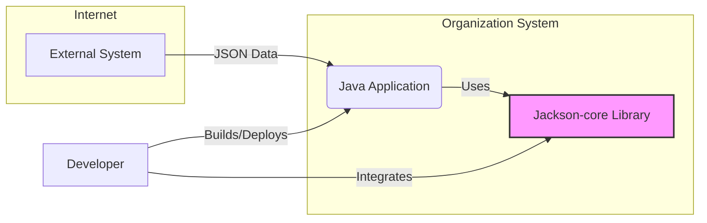
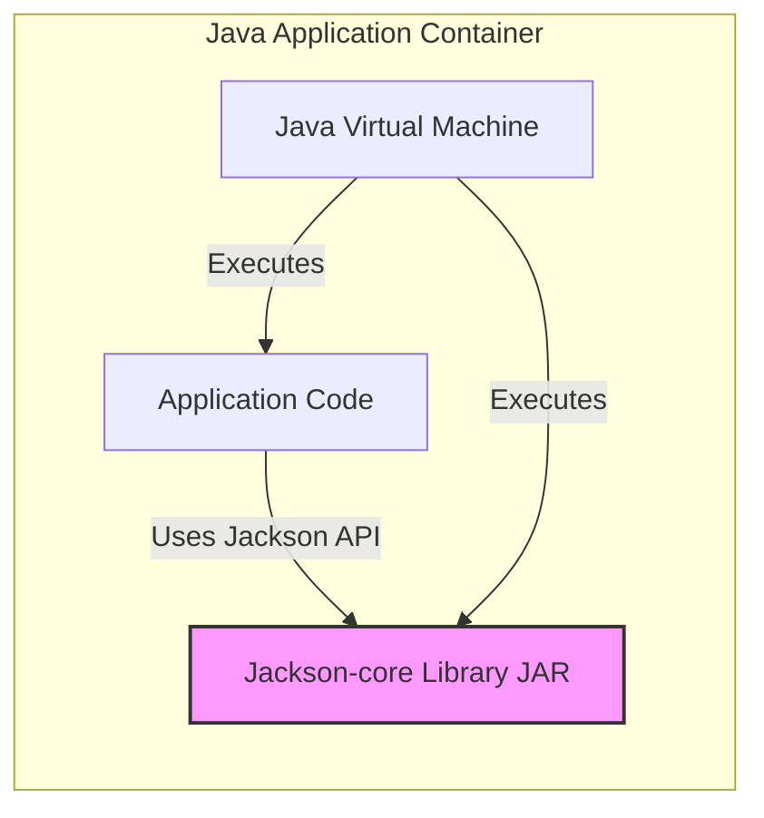
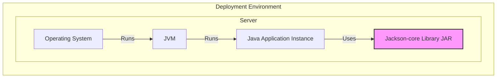

# BUSINESS POSTURE

- Business Priorities and Goals:
  - Provide a high-performance and reliable JSON processing library for Java applications.
  - Ensure broad compatibility and adoption within the Java ecosystem.
  - Maintain a stable and well-documented API for developers.
  - Offer efficient JSON parsing and generation capabilities.
- Business Risks:
  - Security vulnerabilities in Jackson-core could be exploited in applications that depend on it, leading to data breaches, denial of service, or other security incidents.
  - Performance issues or bugs could negatively impact the performance and reliability of applications using Jackson-core.
  - Lack of maintenance or slow response to security issues could erode trust and adoption.
  - Compatibility issues with different Java versions or other libraries could limit usability.

# SECURITY POSTURE

- Existing Security Controls:
  - security control: Code reviews are likely performed by maintainers and contributors (Inferred from open-source project practices).
  - security control: Unit and integration tests are in place to ensure functionality and catch regressions (Inferred from standard software development practices).
  - security control: Public vulnerability reporting mechanisms are available (e.g., GitHub issues, security advisories) (Inferred from open-source project practices).
  - accepted risk:  Complexity of JSON parsing and handling inherently introduces potential vulnerabilities.
  - accepted risk:  Open-source nature implies reliance on community contributions for security fixes.
- Recommended Security Controls:
  - security control: Implement automated Static Application Security Testing (SAST) in the CI/CD pipeline to identify potential vulnerabilities in the code.
  - security control: Integrate Dependency Check tools to identify known vulnerabilities in third-party dependencies.
  - security control: Establish a clear Security Response Policy and process for handling vulnerability reports.
  - security control: Conduct regular security audits and penetration testing, especially before major releases.
  - security control: Promote and enforce secure coding practices among contributors.
- Security Requirements:
  - Authentication: Not applicable for a library. Jackson-core itself does not handle authentication. Applications using Jackson-core are responsible for their own authentication mechanisms.
  - Authorization: Not applicable for a library. Jackson-core itself does not handle authorization. Applications using Jackson-core are responsible for their own authorization mechanisms.
  - Input Validation: Jackson-core must robustly handle malformed or unexpected JSON input to prevent parsing errors or vulnerabilities. Input validation should be performed during JSON parsing to ensure data conforms to expected formats and constraints.
  - Cryptography: Jackson-core itself does not implement cryptographic functions. If applications using Jackson-core need cryptography, they should use dedicated cryptographic libraries. Jackson-core should handle encrypted data passed as JSON without introducing vulnerabilities, assuming the encryption/decryption is handled by the application.

# DESIGN

- C4 CONTEXT



  - C4 Context Elements:
    - - Name: External System
      - Type: External System
      - Description: Any external system that sends JSON data to the Java Application. This could be a web service, database, or another application.
      - Responsibilities: Provides JSON data to be processed by the Java Application.
      - Security controls: Security controls are implemented by the External System itself and are outside the scope of Jackson-core.
    - - Name: Java Application
      - Type: Software System
      - Description: The Java application that uses Jackson-core to process JSON data. This is the system that integrates and utilizes the Jackson-core library.
      - Responsibilities: Processes JSON data received from external systems or internal sources. Uses Jackson-core for parsing and generating JSON. Implements application-specific logic and security controls.
      - Security controls: Input validation, authorization, authentication, error handling, and other application-level security controls.
    - - Name: Jackson-core Library
      - Type: Software System
      - Description: The Jackson-core library itself. A high-performance JSON processing library for Java.
      - Responsibilities: Provides APIs for parsing JSON text into Java objects and generating JSON text from Java objects. Handles low-level JSON processing efficiently.
      - Security controls: Input validation during parsing, protection against buffer overflows and other parsing-related vulnerabilities, secure coding practices in library development.
    - - Name: Developer
      - Type: Person
      - Description: Software developers who use Jackson-core in their Java applications.
      - Responsibilities: Integrate Jackson-core into Java applications. Configure and use Jackson-core APIs correctly. Ensure secure usage of Jackson-core within their applications.
      - Security controls: Secure development practices, code reviews, and understanding of Jackson-core security considerations.

- C4 CONTAINER



  - C4 Container Elements:
    - - Name: Java Virtual Machine
      - Type: Execution Environment
      - Description: The Java Virtual Machine (JVM) that executes the Java Application and Jackson-core. Provides the runtime environment for the application.
      - Responsibilities: Executes Java bytecode. Manages memory and resources. Provides security features like sandboxing and classloader isolation.
      - Security controls: JVM security features, operating system level security controls.
    - - Name: Application Code
      - Type: Application Component
      - Description: The custom code of the Java application that utilizes Jackson-core. Contains the business logic and application-specific functionality.
      - Responsibilities: Implements application logic. Uses Jackson-core API for JSON processing. Handles application-specific security concerns.
      - Security controls: Application-level security controls (authentication, authorization, input validation, etc.), secure coding practices.
    - - Name: Jackson-core Library JAR
      - Type: Library
      - Description: The Jackson-core library packaged as a JAR (Java Archive) file. Contains the compiled Jackson-core classes and resources.
      - Responsibilities: Provides JSON parsing and generation functionality to the Java Application.
      - Security controls: Input validation within the library, secure coding practices during library development, vulnerability management for the library.

- DEPLOYMENT



  - Deployment Diagram Description:
    - This diagram illustrates a typical deployment scenario where a Java application using Jackson-core is deployed on a server.
    - The Java application, along with the Jackson-core library, runs within a JVM on an operating system.
  - Deployment Elements:
    - - Name: Operating System
      - Type: Infrastructure
      - Description: The server operating system (e.g., Linux, Windows Server). Provides the base environment for the JVM and application.
      - Responsibilities: Provides system resources, manages processes, enforces operating system level security.
      - Security controls: Operating system security hardening, access controls, patching, security monitoring.
    - - Name: JVM
      - Type: Runtime Environment
      - Description: The Java Virtual Machine instance running on the server. Executes the Java application and Jackson-core.
      - Responsibilities: Executes Java bytecode, manages memory, provides runtime environment, enforces JVM security features.
      - Security controls: JVM security configurations, security updates, resource management.
    - - Name: Java Application Instance
      - Type: Software Deployment Unit
      - Description: A running instance of the Java application that utilizes Jackson-core. Deployed and running within the JVM.
      - Responsibilities: Executes application logic, processes requests, uses Jackson-core for JSON handling.
      - Security controls: Application-level security controls, configuration management, deployment security practices.
    - - Name: Jackson-core Library JAR
      - Type: Library Deployment Unit
      - Description: The Jackson-core JAR file deployed alongside the Java application. Provides JSON processing capabilities to the application instance.
      - Responsibilities: Provides JSON parsing and generation functionality to the application instance.
      - Security controls:  Library integrity checks during deployment (e.g., checksum verification), secure distribution channels for the JAR file.

- BUILD

```mermaid
flowchart LR
    A[Developer] -->|Code Changes| B(Version Control System);
    B -->|Triggers Build| C[CI/CD System];
    C -->|Checkout Code| B;
    C -->|Build & Test| D[Build Server];
    D -->|SAST & Dependency Check| E[Security Scanners];
    E -->|Reports| C;
    C -->|Package Artifacts| F[Artifact Repository];
    F -->|Publish Artifacts| G[Public Repository (Maven Central)];
    style F fill:#ccf,stroke:#333,stroke-width:2px
    style G fill:#ccf,stroke:#333,stroke-width:2px
```

  - Build Process Description:
    - Developers commit code changes to a Version Control System (e.g., GitHub).
    - A CI/CD system (e.g., GitHub Actions, Jenkins) is triggered by code changes.
    - The CI/CD system checks out the code and performs build and test operations on a Build Server.
    - Security Scanners (SAST, Dependency Check) are integrated into the build pipeline to identify potential vulnerabilities.
    - Build artifacts (JAR files) are packaged and stored in an Artifact Repository.
    - Finally, artifacts are published to a public repository like Maven Central for distribution.
  - Build Elements:
    - - Name: Developer
      - Type: Person
      - Description: Software developers contributing to the Jackson-core project.
      - Responsibilities: Write code, fix bugs, implement features, commit code changes.
      - Security controls: Secure coding practices, code reviews, access control to the repository.
    - - Name: Version Control System
      - Type: Software System
      - Description: System like Git and GitHub used to manage the Jackson-core source code.
      - Responsibilities: Store source code, track changes, manage branches, control access to the codebase.
      - Security controls: Access control, authentication, audit logging, branch protection rules.
    - - Name: CI/CD System
      - Type: Automation System
      - Description: Continuous Integration and Continuous Delivery system that automates the build, test, and release process.
      - Responsibilities: Automate build process, run tests, perform security scans, package artifacts, manage releases.
      - Security controls: Secure pipeline configuration, access control, secret management, audit logging.
    - - Name: Build Server
      - Type: Infrastructure
      - Description: Server environment where the build process is executed.
      - Responsibilities: Provide compute resources for building and testing the software.
      - Security controls: Server hardening, access control, security monitoring, regular patching.
    - - Name: Security Scanners
      - Type: Security Tool
      - Description: SAST and Dependency Check tools used to identify vulnerabilities in the code and dependencies.
      - Responsibilities: Analyze code for security flaws, identify vulnerable dependencies, generate security reports.
      - Security controls: Tool configuration, vulnerability database updates, secure integration with CI/CD.
    - - Name: Artifact Repository
      - Type: Storage System
      - Description: System to store build artifacts (JAR files) before publishing.
      - Responsibilities: Securely store build artifacts, manage versions, control access to artifacts.
      - Security controls: Access control, authentication, integrity checks, secure storage.
    - - Name: Public Repository (Maven Central)
      - Type: Public Distribution System
      - Description: Public repository like Maven Central where Jackson-core JAR files are published for public consumption.
      - Responsibilities: Distribute Jackson-core library to developers worldwide.
      - Security controls: Repository security policies, artifact signing, malware scanning (performed by repository).

# RISK ASSESSMENT

- Critical Business Processes:
  - JSON data processing within Java applications that rely on Jackson-core. This includes parsing JSON data received from external sources and generating JSON data for output.
- Data Sensitivity:
  - The sensitivity of data processed by Jackson-core depends entirely on the applications using it. JSON data can contain highly sensitive information, including personal data, financial data, and confidential business information. Jackson-core itself does not inherently handle sensitive data, but it is a critical component in applications that do. The library must be robust and secure to prevent vulnerabilities that could expose sensitive data processed by applications using it.

# QUESTIONS & ASSUMPTIONS

- Questions:
  - What specific SAST and dependency scanning tools are currently used in the Jackson-core build process?
  - Is there a documented Security Response Policy for Jackson-core? If so, where can it be found?
  - Are regular security audits or penetration testing conducted for Jackson-core?
  - What is the process for managing and patching vulnerabilities in Jackson-core dependencies?
  - Are there specific coding standards or secure coding guidelines followed by Jackson-core developers?
- Assumptions:
  - BUSINESS POSTURE: The primary business goal is to provide a performant and reliable JSON library, with security being a significant but secondary consideration compared to functionality and performance.
  - SECURITY POSTURE: Basic security practices like code reviews and testing are in place, but there might be room for improvement in automated security scanning and formal security processes. The project relies on the open-source community for vulnerability reporting and security contributions.
  - DESIGN: The design is relatively straightforward, focusing on providing efficient JSON processing within the Java ecosystem. Deployment is primarily handled by developers integrating Jackson-core into their applications. The build process includes basic CI/CD but could be enhanced with more comprehensive security checks.