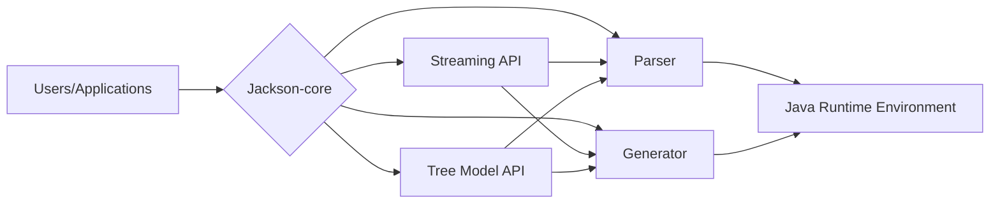
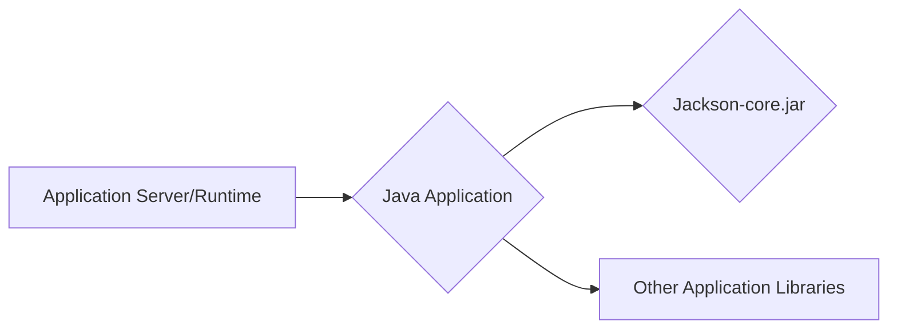

# Project Design Document: Jackson-core

## BUSINESS POSTURE

Business Priorities and Goals:

*   Provide a robust, high-performance, and standards-compliant JSON processing library for Java applications.
*   Serve as a foundational component for the broader Jackson data-binding and dataformat libraries.
*   Maintain backward compatibility while continuously improving performance and adding features.
*   Support a wide range of Java versions and environments.
*   Minimize external dependencies to reduce the risk of conflicts and vulnerabilities.
*   Provide clear and comprehensive documentation and examples.
*   Foster a vibrant open-source community and encourage contributions.

Most Important Business Risks:

*   Security vulnerabilities (e.g., deserialization exploits) that could compromise applications using the library.
*   Performance bottlenecks that could impact the performance of applications relying on Jackson-core.
*   Compatibility issues with different Java versions or environments, limiting adoption.
*   Lack of maintainability, making it difficult to fix bugs, add features, or adapt to evolving standards.
*   Loss of community trust due to unaddressed vulnerabilities or poor communication.

## SECURITY POSTURE

Existing Security Controls:

*   security control: Regular updates and patches to address known vulnerabilities. (GitHub repository, commit history)
*   security control: Fuzz testing to identify potential vulnerabilities. (OSS-Fuzz integration, mentioned in the repository)
*   security control: Code reviews to identify potential security flaws. (GitHub pull request process)
*   security control: Use of static analysis tools (though specifics are not detailed in the README, it's standard practice).
*   security control: Secure coding practices (assumed, but not explicitly documented in the README).
*   security control: Handling of untrusted input (deserialization) is a core concern, and the project has a history of addressing related vulnerabilities.

Accepted Risks:

*   accepted risk: Potential for zero-day vulnerabilities, as with any software.
*   accepted risk: Reliance on the underlying Java platform's security features.
*   accepted risk: Potential for misuse of the library by developers, leading to vulnerabilities in their applications.

Recommended Security Controls:

*   security control: Implement a comprehensive Software Bill of Materials (SBOM) for each release, detailing all dependencies and their versions.
*   security control: Conduct regular penetration testing, in addition to fuzz testing.
*   security control: Provide more explicit documentation on secure coding practices when using Jackson-core, particularly regarding deserialization of untrusted data.
*   security control: Integrate with dependency vulnerability scanners (e.g., Dependabot, Snyk) to proactively identify and address vulnerabilities in dependencies.
*   security control: Implement a clear vulnerability disclosure program.

Security Requirements:

*   Authentication: Not directly applicable to this library, as it's a processing library, not an authentication service.
*   Authorization: Not directly applicable.
*   Input Validation:
    *   Crucial for preventing deserialization vulnerabilities.
    *   Must handle various edge cases and malicious inputs.
    *   Should provide mechanisms for developers to customize validation rules.
    *   Should include whitelisting/blacklisting capabilities for class deserialization.
*   Cryptography:
    *   Not directly used for core JSON processing.
    *   May be relevant for specific data formats or extensions.
    *   If used, must adhere to industry best practices and use strong, up-to-date algorithms.

## DESIGN

### C4 CONTEXT

```mermaid
graph LR
    A[Users/Applications] --> B{"Jackson-core"};
    B --> C[Java Runtime Environment];
    B --> D[Other Jackson Modules];
    B --> E[External Libraries (Optional)];
```

Element Descriptions:

*   Element:
    *   Name: Users/Applications
    *   Type: External Entity
    *   Description: Java applications that utilize Jackson-core for JSON processing.
    *   Responsibilities: Provide JSON data to Jackson-core for parsing and serialization. Consume processed JSON data from Jackson-core.
    *   Security controls: Implement appropriate security measures within their own applications, including input validation and secure handling of sensitive data.

*   Element:
    *   Name: Jackson-core
    *   Type: System
    *   Description: The core Jackson library for JSON processing.
    *   Responsibilities: Parse JSON data into Java objects. Serialize Java objects into JSON data. Provide APIs for streaming and tree-model-based JSON processing.
    *   Security controls: Fuzz testing, code reviews, static analysis, secure coding practices, handling of untrusted input.

*   Element:
    *   Name: Java Runtime Environment
    *   Type: External System
    *   Description: The underlying Java platform on which Jackson-core runs.
    *   Responsibilities: Provide the necessary runtime environment for Jackson-core to execute.
    *   Security controls: Rely on the security features of the JRE, including regular updates and security patches.

*   Element:
    *   Name: Other Jackson Modules
    *   Type: External System
    *   Description: Other modules within the Jackson ecosystem (e.g., jackson-databind, jackson-dataformat-xml).
    *   Responsibilities: Provide higher-level data binding or support for other data formats.
    *   Security controls: Rely on the security of Jackson-core and implement their own security measures.

*   Element:
    *   Name: External Libraries (Optional)
    *   Type: External System
    *   Description: Optional external libraries that Jackson-core might use (e.g., for specific features or extensions).
    *   Responsibilities: Provide specific functionality as required by Jackson-core.
    *   Security controls: Managed through dependency management and vulnerability scanning.

### C4 CONTAINER



Element Descriptions:

*   Element:
    *   Name: Users/Applications
    *   Type: External Entity
    *   Description: Java applications that utilize Jackson-core for JSON processing.
    *   Responsibilities: Provide JSON data to Jackson-core for parsing and serialization. Consume processed JSON data from Jackson-core.
    *   Security controls: Implement appropriate security measures within their own applications, including input validation and secure handling of sensitive data.

*   Element:
    *   Name: Jackson-core
    *   Type: System
    *   Description: The core Jackson library for JSON processing.
    *   Responsibilities: Parse JSON data into Java objects. Serialize Java objects into JSON data. Provide APIs for streaming and tree-model-based JSON processing.
    *   Security controls: Fuzz testing, code reviews, static analysis, secure coding practices, handling of untrusted input.

*   Element:
    *   Name: Streaming API
    *   Type: Container
    *   Description: Provides a low-level, event-based API for reading and writing JSON.
    *   Responsibilities: Offer fine-grained control over JSON processing. Enable efficient handling of large JSON documents.
    *   Security controls: Input validation, secure handling of buffers.

*   Element:
    *   Name: Tree Model API
    *   Type: Container
    *   Description: Provides an in-memory tree representation of JSON data.
    *   Responsibilities: Allow for easy manipulation and traversal of JSON structures.
    *   Security controls: Input validation, protection against excessive memory allocation.

*   Element:
    *   Name: Parser
    *   Type: Container
    *   Description: Responsible for parsing JSON input into tokens or events.
    *   Responsibilities: Handle different JSON syntax variations. Detect and report syntax errors.
    *   Security controls: Input validation, protection against malformed JSON, fuzz testing.

*   Element:
    *   Name: Generator
    *   Type: Container
    *   Description: Responsible for generating JSON output from tokens or events.
    *   Responsibilities: Produce well-formed JSON data. Handle different output formats (e.g., pretty-printing).
    *   Security controls: Secure handling of output buffers.

*   Element:
    *   Name: Java Runtime Environment
    *   Type: External System
    *   Description: The underlying Java platform on which Jackson-core runs.
    *   Responsibilities: Provide the necessary runtime environment for Jackson-core to execute.
    *   Security controls: Rely on the security features of the JRE, including regular updates and security patches.

### DEPLOYMENT

Possible Deployment Solutions:

1.  Embedded within a Java application (most common).
2.  Deployed as a shared library within an application server (e.g., Tomcat, JBoss).
3.  Used within a framework that manages dependencies (e.g., Spring).

Chosen Deployment Solution (most common): Embedded within a Java application.



Element Descriptions:

*   Element:
    *   Name: Application Server/Runtime
    *   Type: Node
    *   Description: The environment in which the Java application runs (e.g., a standalone JVM, a container, an application server).
    *   Responsibilities: Provide the necessary resources for the application to execute.
    *   Security controls: Security of the underlying operating system and runtime environment.

*   Element:
    *   Name: Java Application
    *   Type: Software System
    *   Description: The application that utilizes Jackson-core.
    *   Responsibilities: Perform the application's specific business logic.
    *   Security controls: Application-specific security measures.

*   Element:
    *   Name: Jackson-core.jar
    *   Type: Library
    *   Description: The Jackson-core library packaged as a JAR file.
    *   Responsibilities: Provide JSON processing functionality.
    *   Security controls: Security controls implemented within Jackson-core.

*   Element:
    *   Name: Other Application Libraries
    *   Type: Library
    *   Description: Other libraries used by the application.
    *   Responsibilities: Provide additional functionality to the application.
    *   Security controls: Security of the individual libraries.

### BUILD

The Jackson-core project uses Maven as its build system. The build process is automated and includes several security checks.

```mermaid
graph LR
    A[Developer] --> B[Source Code (GitHub)];
    B --> C[Maven Build];
    C --> D[Unit Tests];
    C --> E[Integration Tests];
    C --> F[Static Analysis (e.g., SpotBugs)];
    C --> G[Dependency Analysis];
    C --> H[Fuzz Testing (OSS-Fuzz)];
    C --> I[Jackson-core.jar (Artifact)];
    H -.-> J[Vulnerability Reports];
    F -.-> J;
    G -.-> J;
    I --> K[Maven Central Repository];
```

Build Process Description:

1.  Developer commits code changes to the GitHub repository.
2.  The Maven build process is triggered (either locally or through a CI system).
3.  Unit tests are executed to verify the correctness of individual components.
4.  Integration tests are executed to verify the interaction between different components.
5.  Static analysis tools (like SpotBugs, although not explicitly mentioned, it's a common practice) are used to identify potential code quality and security issues.
6.  Dependency analysis is performed to identify and manage dependencies (Maven handles this).
7.  Fuzz testing is performed through OSS-Fuzz integration to identify potential vulnerabilities.
8.  The build process produces the Jackson-core.jar artifact.
9.  Vulnerability reports from fuzz testing, static analysis, and dependency analysis are reviewed.
10. The artifact is deployed to the Maven Central Repository.

Security Controls in Build Process:

*   security control: Unit tests and integration tests to ensure code correctness and prevent regressions.
*   security control: Static analysis to identify potential code quality and security issues.
*   security control: Dependency analysis to manage dependencies and identify known vulnerabilities.
*   security control: Fuzz testing (OSS-Fuzz) to proactively discover vulnerabilities.
*   security control: Code reviews (through the GitHub pull request process).
*   security control: Build automation (Maven) to ensure consistency and repeatability.

## RISK ASSESSMENT

Critical Business Processes to Protect:

*   Accurate and reliable JSON processing for applications relying on Jackson-core.
*   Maintaining the integrity and availability of applications using the library.
*   Protecting the reputation and trust of the Jackson project and its maintainers.

Data to Protect and Sensitivity:

*   Jackson-core itself does not store or manage sensitive data directly. It processes JSON data, which *may* contain sensitive information. The sensitivity of the data depends entirely on the application using Jackson-core.
*   The primary concern is to prevent vulnerabilities that could allow attackers to:
    *   Execute arbitrary code (e.g., through deserialization exploits).
    *   Cause denial-of-service (e.g., through excessive memory allocation or infinite loops).
    *   Access or modify sensitive data handled by the application.

## QUESTIONS & ASSUMPTIONS

Questions:

*   What specific static analysis tools are used in the build process?
*   Are there any specific security guidelines or recommendations for developers using Jackson-core, beyond the general advice in the README?
*   What is the process for handling vulnerability reports? Is there a dedicated security contact or mailing list?
*   Are there any plans to implement additional security features, such as built-in support for JSON Schema validation?

Assumptions:

*   BUSINESS POSTURE: The Jackson project prioritizes security and actively addresses reported vulnerabilities.
*   SECURITY POSTURE: Secure coding practices are followed throughout the codebase. Developers using Jackson-core are responsible for implementing appropriate security measures in their own applications.
*   DESIGN: The provided design diagrams are a reasonable representation of the project's architecture, based on the available information. The build process is automated and includes security checks. The deployment model is typically embedding the library within a Java application.