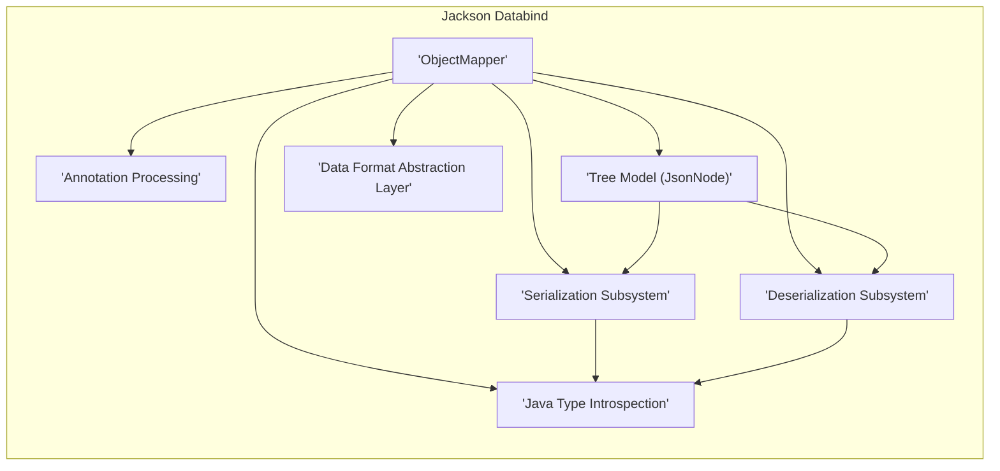
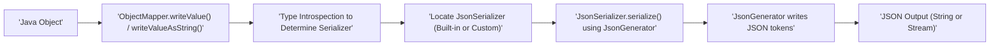

# Project Design Document: Jackson Databind

**Version:** 1.1
**Date:** October 26, 2023
**Author:** AI Software Architect

## 1. Introduction

This document provides an enhanced design overview of the Jackson Databind library, a cornerstone of the Jackson data processing suite for Java. This document is specifically crafted to facilitate subsequent threat modeling exercises by clearly outlining the architecture, key components, data flow, and inherent security considerations of Jackson Databind.

## 2. Project Overview

Jackson Databind is a high-performance Java library enabling seamless data binding (or object mapping) between Java objects and JSON (JavaScript Object Notation). It simplifies the conversion of Java objects to their JSON representation and vice versa, a fundamental requirement for modern Java applications interacting with JSON-based data.

## 3. Goals and Objectives

*   **Serialization:**  Efficiently convert Java objects into well-formed JSON strings.
*   **Deserialization:** Accurately reconstruct Java objects from JSON input.
*   **Type Support:**  Handle a broad spectrum of Java types, including primitives, collections (Lists, Sets, Maps), arrays, and complex custom objects.
*   **Mapping Flexibility:** Offer granular control over the mapping process between JSON structures and Java object fields.
*   **Extensibility:** Provide well-defined extension points for customizing serialization and deserialization behavior.
*   **Performance:** Maintain a high level of performance and minimize overhead during data binding operations.
*   **Maintainability:**  Ensure the codebase is well-structured and easy to maintain and evolve.

## 4. Architecture and Components

The central element of Jackson Databind's architecture is the `ObjectMapper` class, serving as the primary interface for all data binding operations. The library can be conceptually divided into the following key components:

*   **Core Mapping Engine:** The central logic responsible for orchestrating the conversion between Java objects and JSON.
*   **Serialization Subsystem:** Dedicated to the process of transforming Java objects into JSON.
*   **Deserialization Subsystem:** Dedicated to the process of constructing Java objects from JSON.
*   **Annotation Processing:**  Handles the interpretation of Jackson annotations to customize mapping behavior.
*   **Java Type Introspection:**  Analyzes Java types to determine appropriate serialization and deserialization strategies.
*   **Tree Model (`JsonNode`):** Provides an in-memory, tree-like representation of JSON data for programmatic manipulation.
*   **Data Format Abstraction Layer:**  While primarily focused on JSON, this layer allows for potential extension to support other data formats (e.g., XML, YAML) through separate modules.

Here's a refined architectural diagram:

### 4.1. Key Components (Detailed)

*   **`ObjectMapper`:** The main entry point for serialization and deserialization. It manages configuration settings, discovers appropriate serializers and deserializers, and orchestrates the mapping process.
*   **`JsonSerializer` (Interface):** Defines the contract for serializing Java objects of a specific type into JSON. Developers can implement custom serializers to handle specific serialization needs.
*   **`JsonDeserializer` (Interface):** Defines the contract for deserializing JSON into Java objects of a specific type. Custom deserializers allow for fine-grained control over object construction from JSON.
*   **`JsonParser`:** A low-level API for reading JSON input as a stream of tokens. It provides methods to access the current token and its value.
*   **`JsonGenerator`:** A low-level API for writing JSON output as a stream of tokens. It provides methods to write various JSON constructs (objects, arrays, fields, values).
*   **`JsonNode` (Abstract Class):** Represents a node in the JSON abstract syntax tree (AST). Concrete subclasses like `ObjectNode` and `ArrayNode` allow for navigating and manipulating JSON data programmatically.
*   **`JavaType`:** Represents a fully resolved Java type, including generic type parameters. This is crucial for handling complex types during serialization and deserialization.
*   **`TypeFactory`:** Responsible for creating `JavaType` instances, often based on reflection or explicit type specifications.
*   **Annotations (e.g., `@JsonProperty`, `@JsonIgnore`, `@JsonCreator`, `@JsonTypeInfo`):**  Provide a declarative way to customize the serialization and deserialization process, influencing field naming, inclusion/exclusion, constructor usage, and polymorphic type handling.
*   **Modules (e.g., `SimpleModule`, `Jdk8Module`):**  A powerful extensibility mechanism to register custom serializers, deserializers, type modifiers, and other extensions to the core Databind functionality.

## 5. Data Flow (Detailed)

The data flow within Jackson Databind differs significantly between serialization and deserialization operations.

### 5.1. Serialization Data Flow

1. A Java object needs to be serialized into JSON.
2. The application calls a `writeValue()` method on the `ObjectMapper`, providing the object to be serialized.
3. The `ObjectMapper` uses Java type introspection to determine the runtime type of the object.
4. Based on the type, it locates the appropriate `JsonSerializer`. This could be a built-in serializer or a custom serializer registered with the `ObjectMapper`.
5. The `serialize()` method of the chosen `JsonSerializer` is invoked, using a `JsonGenerator` to write the JSON representation of the object's state.
6. The `JsonGenerator` emits a stream of JSON tokens representing the object's structure and data.
7. The final JSON output is produced, either as a String or written to an output stream.

### 5.2. Deserialization Data Flow

```mermaid
graph LR
    A["'JSON Input (String or Stream)'"] --> B["'ObjectMapper.readValue()'"]
    B --> C["'JsonParser reads JSON tokens'"]
    C --> D["'Determine Target Java Type (explicit or inferred)'"]
    D --> E["'Type Introspection to Determine Deserializer'"]
    E --> F["'Locate JsonDeserializer (Built-in or Custom)'"]
    F --> G["'JsonDeserializer.deserialize() using JsonParser'"]
    G --> H["'Construct and Populate Java Object'"]
    H --> I["'Java Object'"]
```

1. JSON input (either a String or an input stream) needs to be deserialized into a Java object.
2. The application calls a `readValue()` method on the `ObjectMapper`, providing the JSON input and the target Java type (which can sometimes be inferred).
3. A `JsonParser` is used to read the JSON input and break it down into a stream of tokens.
4. The `ObjectMapper` determines the target Java type to deserialize into, either explicitly provided or inferred from the JSON structure and annotations.
5. Based on the target type, it locates the appropriate `JsonDeserializer`. This could be a built-in deserializer or a custom deserializer.
6. The `deserialize()` method of the chosen `JsonDeserializer` is invoked, using the `JsonParser` to read the JSON tokens and extract data.
7. The `JsonDeserializer` constructs an instance of the target Java object and populates its fields based on the data in the JSON input.
8. The fully constructed Java object is returned.

## 6. Security Considerations (In-Depth)

Security is a paramount concern when dealing with data binding libraries, especially when handling untrusted input. Jackson Databind has several security considerations:

*   **Insecure Deserialization Vulnerabilities:** This is a critical risk. If an application deserializes JSON from an untrusted source without proper safeguards, malicious JSON payloads can be crafted to exploit vulnerabilities and execute arbitrary code on the server. This often involves manipulating object instantiation and property setting during deserialization.
    *   **Mitigation Strategies:**
        *   **Explicitly Register Allowed Types:** Use `PolymorphicTypeValidator` to restrict the classes that can be deserialized, especially when dealing with polymorphic types or default typing.
        *   **Avoid Default Typing:**  Default typing (`enableDefaultTyping()`) can introduce significant security risks and should be avoided unless absolutely necessary and carefully configured with strict type whitelisting.
        *   **Implement Custom Deserializers with Validation:**  For critical data types, implement custom deserializers that perform thorough validation of the input data before constructing objects.
        *   **Disable Features that Facilitate Exploitation:**  Carefully review and disable potentially dangerous features like `enableDefaultTyping()` or features that allow for arbitrary code execution during deserialization.
        *   **Regularly Update Jackson:** Keep Jackson Databind and its dependencies updated to benefit from security patches that address known vulnerabilities.
*   **Input Validation (Beyond Deserialization):** While Jackson performs basic JSON syntax validation, it's crucial to implement application-level validation of the *deserialized* data to ensure it conforms to expected business rules and constraints. This prevents issues arising from semantically invalid data.
*   **Denial of Service (DoS) Attacks:**  Maliciously crafted, extremely large, or deeply nested JSON payloads can consume excessive memory or processing time, leading to a denial of service.
    *   **Mitigation Strategies:**
        *   **Set Limits on Input Size and Nesting Depth:** Configure `JsonParser` settings to limit the maximum size and nesting depth of incoming JSON.
        *   **Implement Timeouts:** Set timeouts for deserialization operations to prevent indefinite processing.
*   **Information Disclosure through Serialization:**  Careless configuration or use of default serialization settings might inadvertently expose sensitive information in the JSON output that should not be revealed.
    *   **Mitigation Strategies:**
        *   **Use `@JsonIgnore`:**  Annotate fields that should not be included in the serialized JSON output.
        *   **Implement Custom Serializers:**  For sensitive data, implement custom serializers that carefully control the output format and redact sensitive information.
        *   **Review Default Inclusion Strategies:** Understand Jackson's default rules for including fields during serialization and adjust them as needed.
*   **Dependency Vulnerabilities:** Jackson Databind relies on other libraries. Vulnerabilities in these transitive dependencies can also introduce security risks.
    *   **Mitigation Strategies:**
        *   **Use Dependency Scanning Tools:** Regularly scan project dependencies for known vulnerabilities using tools like OWASP Dependency-Check or Snyk.
        *   **Keep Dependencies Updated:**  Maintain up-to-date versions of Jackson Databind and all its dependencies.

## 7. Deployment Considerations

Jackson Databind is typically deployed as a library embedded within Java applications. Its widespread use makes it a critical component in various deployment scenarios:

*   **Web Applications and RESTful APIs:**  For serializing and deserializing JSON data in request and response bodies. This is a primary use case where handling untrusted input is a major security concern.
*   **Microservices Architectures:** For inter-service communication using JSON as the data exchange format. Security considerations are crucial when services communicate over a network.
*   **Data Processing Pipelines:** For reading and writing JSON data from various sources and sinks. Input validation is important to ensure data integrity.
*   **Configuration Management Systems:** For loading and saving application configurations in JSON format. While often internal, security is still relevant to prevent unauthorized modification.

The security considerations outlined in Section 6 are particularly relevant in deployments where Jackson Databind handles data originating from untrusted sources, such as public-facing web applications or when processing data from external systems.

## 8. Future Considerations

*   **Enhanced Default Security Settings:** Explore more secure default configurations to mitigate common deserialization vulnerabilities out-of-the-box.
*   **Improved Vulnerability Detection and Prevention Mechanisms:**  Investigate potential integration with static analysis tools or runtime security checks.
*   **Further Performance Optimizations:** Continuously improve the performance and efficiency of serialization and deserialization processes.
*   **Support for Emerging JSON Standards and Features:**  Adapt to evolving JSON specifications and related technologies.
*   **Simplified Configuration for Common Security Patterns:** Provide more straightforward ways to configure Jackson for common secure usage patterns.

This enhanced design document provides a more detailed and security-focused overview of the Jackson Databind project. It aims to provide a solid foundation for effective threat modeling and the development of secure applications that utilize this powerful library.
