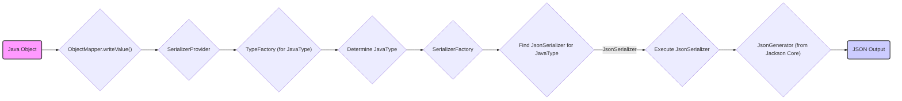
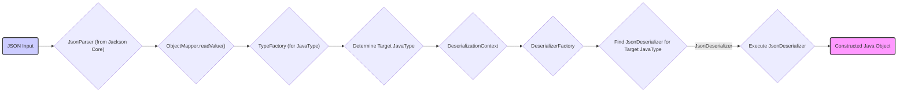

# Project Design Document: Jackson Databind Library

**Version:** 1.1
**Date:** October 26, 2023
**Author:** AI Software Architect

## 1. Introduction

This document details the design of the Jackson Databind library, a core component of the Jackson project. Jackson Databind is a Java library that facilitates the conversion between Java objects and JSON (and other data formats like YAML or XML via extension modules). This document provides an architectural overview, focusing on the components and data flow relevant for understanding the library's functionality and identifying potential security considerations for threat modeling.

## 2. Goals and Objectives

The primary goals of the Jackson Databind library are:

* **Seamless Object Mapping:** To provide an intuitive and efficient way to map Java objects to JSON structures and vice-versa.
* **Data Format Agnostic Abstraction:** To abstract away the underlying data format (primarily JSON) from the object mapping logic.
* **Extensibility and Customization:** To offer robust mechanisms for customizing the serialization and deserialization processes to accommodate diverse data structures, naming conventions, and specific requirements.
* **High Performance:** To achieve optimal performance in both serialization and deserialization operations, crucial for high-throughput applications.
* **Type Safety:** To leverage Java's type system to ensure type-safe conversions whenever possible.

## 3. Scope

This design document focuses on the core data binding capabilities of the Jackson Databind library when working with JSON. Specifically, it covers:

* The central components involved in the standard serialization and deserialization of Java objects to and from JSON.
* The fundamental data flow paths during these conversion processes.
* Key extension points provided by the library for customization (e.g., custom serializers/deserializers, modules, annotations).
* The interaction between Databind and the underlying Jackson Core and Annotations modules.

This document does *not* delve into:

* The low-level details of the Jackson Core library's streaming API (e.g., `JsonParser`, `JsonGenerator`).
* The specifics of every available annotation within the `jackson-annotations` library.
* Detailed performance benchmarks or optimization techniques.
* The Jackson Streaming API or Tree Model (although their interaction with Databind is mentioned where relevant).
* Support for other data formats like YAML or XML, which are handled by separate Jackson modules.

## 4. System Architecture

The Jackson Databind library's architecture revolves around the `ObjectMapper`, which orchestrates the serialization and deserialization processes.

Key components and their roles include:

* **`ObjectMapper`:**
    * The central orchestrator and entry point for serialization and deserialization operations.
    * Configurable with various settings and features affecting the mapping process (e.g., handling of null values, date formats, visibility rules).
    * Responsible for discovering and invoking appropriate serializers and deserializers based on the Java type.
    * Provides core methods like `writeValue()` (and its variants) for serialization and `readValue()` (and its variants) for deserialization.

* **`JsonSerializer`:**
    * An abstract class that defines the interface for converting Java objects of a specific type into JSON.
    * Implementations are provided for common Java types (primitives, collections, maps, etc.).
    * Developers can create custom `JsonSerializer` implementations for specific classes or complex serialization logic.
    * Registered with the `ObjectMapper` to handle specific types.

* **`JsonDeserializer`:**
    * An abstract class defining the interface for converting JSON structures into instances of a specific Java type.
    * Implementations are provided for standard Java types.
    * Custom `JsonDeserializer` implementations can be created for specific deserialization requirements.
    * Registered with the `ObjectMapper`.

* **`SerializerProvider`:**
    * Manages the retrieval and caching of `JsonSerializer` instances during the serialization process.
    * Provides contextual information to serializers, such as configuration settings.

* **`DeserializationContext`:**
    * Manages the retrieval and caching of `JsonDeserializer` instances during deserialization.
    * Provides contextual information to deserializers, including error handling and configuration.

* **`JavaType` (from `TypeFactory`):**
    * Represents the fully resolved type of a Java object, including generic type parameters.
    * The `TypeFactory` is used to create `JavaType` instances, which are crucial for determining the correct serializer or deserializer to use.

* **`JsonNode`:**
    * Represents a node in a JSON tree structure (part of the Tree Model API).
    * While not directly part of the core Databind serialization/deserialization flow described here, `ObjectMapper` can convert between Java objects and `JsonNode` trees.

* **Annotations (from `com.fasterxml.jackson.annotation` and `com.fasterxml.jackson.databind.annotation`):**
    * Provide metadata to guide the serialization and deserialization process without modifying the core Java classes.
    * Examples include:
        * `@JsonProperty`: Specifies the JSON property name.
        * `@JsonIgnore`: Excludes a property from serialization/deserialization.
        * `@JsonCreator`:  Indicates a constructor or static factory method to use for deserialization.
        * `@JsonSerialize`, `@JsonDeserialize`:  Specifies custom serializers or deserializers.
        * `@JsonTypeInfo`, `@JsonSubTypes`:  Used for handling polymorphism during deserialization.

* **Modules (`com.fasterxml.jackson.databind.Module`):**
    * Provide a mechanism to extend the `ObjectMapper`'s functionality in a modular way.
    * Modules can register custom serializers, deserializers, mix-in annotations, type modifiers, and other configurations.

## 5. Data Flow

The following diagrams illustrate the typical data flow during serialization and deserialization using the Jackson Databind library.

### 5.1. Serialization Data Flow

**Steps:**

1. The serialization process begins with a "Java Object" to be converted to JSON.
2. The `ObjectMapper`'s `writeValue()` method is invoked, initiating the process.
3. The `ObjectMapper` interacts with the `SerializerProvider` to obtain the appropriate serializer.
4. The `SerializerProvider` may use the `TypeFactory` to determine the `JavaType` of the object if it's not already known.
5. The `JavaType` of the object is determined.
6. The `SerializerProvider` uses the `SerializerFactory` to locate a suitable `JsonSerializer` based on the `JavaType`.
7. A `JsonSerializer` capable of handling the object's type is found.
8. The `JsonSerializer`'s `serialize()` method is executed, taking the Java object and a `JsonGenerator` as input.
9. The `JsonSerializer` uses the `JsonGenerator` (from the Jackson Core library) to write the JSON representation of the object.
10. The final "JSON Output" is produced.

### 5.2. Deserialization Data Flow

**Steps:**

1. The deserialization process starts with "JSON Input".
2. The `ObjectMapper`'s `readValue()` method is called, along with the target Java type to deserialize into. This method internally uses a `JsonParser` (from Jackson Core) to parse the JSON input.
3. The `ObjectMapper` interacts with the `TypeFactory` to obtain the `JavaType` of the target class.
4. The `JavaType` representing the target class is determined.
5. The `ObjectMapper` delegates to the `DeserializationContext` to find the appropriate deserializer.
6. The `DeserializationContext` uses the `DeserializerFactory` to locate a suitable `JsonDeserializer` based on the target `JavaType`.
7. A `JsonDeserializer` capable of handling the target type is found.
8. The `JsonDeserializer`'s `deserialize()` method is executed, taking the `JsonParser` and the `DeserializationContext` as input.
9. The `JsonDeserializer` reads data from the `JsonParser` and constructs an instance of the target Java object.
10. The "Constructed Java Object" is returned.

## 6. Key Security Considerations (For Threat Modeling)

Understanding the data flow and components is crucial for identifying potential security vulnerabilities. Here are key security considerations relevant to Jackson Databind:

* **Deserialization Vulnerabilities (Object Injection):**
    * **Polymorphic Deserialization without Validation:** If the application deserializes JSON into base classes or interfaces without explicitly specifying or validating the expected concrete types, an attacker can craft malicious JSON payloads that instantiate unexpected and potentially harmful subclasses. This is a significant risk if the classpath contains classes with dangerous side effects in their constructors, setters, or other methods.
        * **Example:** Deserializing into `java.lang.Object` and tricking Jackson into instantiating a class like `org.springframework.context.support.FileSystemXmlApplicationContext` with a malicious configuration URL.
    * **Gadget Chains:** Exploiting known vulnerabilities or unintended side effects within legitimate classes (gadgets) on the classpath. By carefully crafting JSON payloads, attackers can chain together calls to these gadgets during deserialization to achieve arbitrary code execution.
        * **Example:** Using libraries like Commons Collections or Log4j, which have known gadget chains exploitable during deserialization.
    * **Mitigation Strategies:**
        * **Avoid deserializing into base types without explicit type information.** Use concrete classes or explicitly define subtypes using `@JsonTypeInfo` and `@JsonSubTypes`.
        * **Implement robust input validation after deserialization.**
        * **Minimize the dependencies on the classpath** to reduce the attack surface of potential gadget chains.
        * **Consider using security managers or sandboxing environments.**
        * **Utilize Jackson's features for preventing certain class instantiations.**

* **Denial of Service (DoS) Attacks:**
    * **Recursive or Deeply Nested Objects:**  Crafting JSON payloads with excessively deep nesting can consume significant stack space during parsing and deserialization, leading to `StackOverflowError` and application crashes.
    * **Large Strings or Arrays:**  Sending extremely large strings or arrays in the JSON payload can overwhelm memory resources, causing `OutOfMemoryError` or significant performance degradation.
    * **Mitigation Strategies:**
        * **Implement limits on the depth and size of incoming JSON payloads.**
        * **Configure Jackson's parser limits (e.g., maximum string length, maximum array size).**

* **Injection Attacks (Indirect):**
    * While Jackson itself doesn't directly execute code based on the JSON content, if the *deserialized data* is subsequently used in vulnerable contexts (e.g., constructing SQL queries, executing shell commands, or rendering web pages without proper sanitization), it can lead to SQL injection, command injection, or cross-site scripting (XSS) vulnerabilities.
    * **Mitigation Strategies:**
        * **Always sanitize and validate deserialized data before using it in potentially dangerous operations.**
        * **Use parameterized queries or prepared statements for database interactions.**
        * **Encode output properly to prevent XSS.**

* **Configuration Vulnerabilities:**
    * **Insecure Default Settings:** While Jackson has reasonable defaults, misconfigurations can introduce vulnerabilities. For example, enabling features that are not strictly necessary might increase the attack surface.
    * **Visibility Modifiers:** Incorrectly configured visibility modifiers for serialization/deserialization can expose sensitive data or allow modification of internal state.
    * **Mitigation Strategies:**
        * **Carefully review and configure `ObjectMapper` settings based on the application's specific requirements.**
        * **Follow the principle of least privilege when configuring visibility rules.**

* **Dependency Management:**
    * Using outdated versions of Jackson or its dependencies can expose the application to known security vulnerabilities that have been patched in newer versions.
    * **Mitigation Strategies:**
        * **Keep Jackson and its dependencies up-to-date with the latest security patches.**
        * **Use dependency management tools to track and manage dependencies.**
        * **Regularly scan dependencies for known vulnerabilities.**

## 7. Technologies Used

* **Java:** The primary programming language for the library and its users.
* **Jackson Core (`jackson-core`):** Provides the low-level streaming API for reading and writing JSON.
* **Jackson Annotations (`jackson-annotations`):** Defines the standard Jackson annotations used for configuring serialization and deserialization.
* **Potentially other Jackson modules:**  Such as `jackson-databind-yaml` for YAML support, `jackson-dataformat-xml` for XML support, or modules for specific data types (e.g., JSR310 date/time).

## 8. Future Considerations

* **Enhanced Security Features:**  Exploring built-in mechanisms to further mitigate deserialization vulnerabilities, such as stricter type validation or sandboxing capabilities.
* **Performance Optimizations:** Continuously improving the performance of serialization and deserialization, especially for large or complex objects.
* **Improved Error Handling:** Providing more granular and informative error messages during deserialization failures.
* **Support for new Java Language Features:** Adapting to new language features and data types introduced in newer Java versions.

## 9. Glossary

* **Serialization:** The process of converting the state of an object into a format that can be stored or transmitted.
* **Deserialization:** The process of reconstructing an object from its serialized representation.
* **JSON:** JavaScript Object Notation, a lightweight data-interchange format.
* **Annotation:** A form of metadata that provides supplemental information about the code.
* **Module:** A self-contained package of functionality that can be plugged into the `ObjectMapper`.
* **Mix-in:** A technique to apply annotations to classes without modifying their source code, often used for third-party libraries.
* **Gadget Chain:** A sequence of method calls within existing classes that an attacker can trigger during deserialization to achieve a malicious outcome.
* **Polymorphism:** The ability of an object to take on many forms; in the context of deserialization, it refers to handling different subtypes of a base class or interface.
