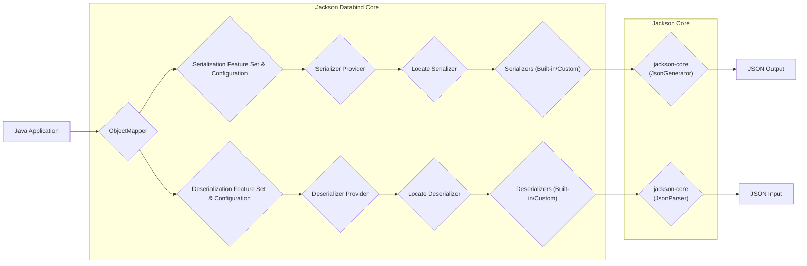
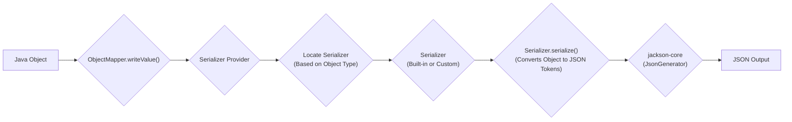
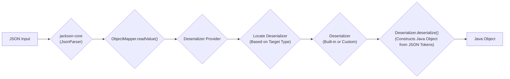

# Project Design Document: Jackson Databind

**Version:** 1.1
**Date:** October 26, 2023
**Author:** AI Software Architect

## 1. Introduction

This document provides an enhanced design overview of the Jackson Databind library, a cornerstone Java library facilitating data binding (serialization and deserialization) between Java objects and JSON (and other data formats). This detailed design serves as a crucial foundation for subsequent threat modeling activities, enabling a thorough security assessment.

## 2. Goals

*   Present a refined and more detailed description of the Jackson Databind library's architecture and its constituent components.
*   Elaborate on the data flow during both serialization and deserialization processes, highlighting key stages.
*   Identify critical areas and components that are particularly relevant for security considerations and potential vulnerabilities, providing concrete examples.
*   Serve as a comprehensive and accurate reference point for security assessments, penetration testing, and threat modeling exercises.

## 3. Non-Goals

*   This document does not aim to provide an exhaustive, line-by-line code-level implementation detail of every class and method within the Jackson Databind library.
*   It does not cover the intricate specifics of all data formats supported by Jackson beyond JSON, focusing primarily on the most common use case.
*   It intentionally omits operational details such as specific deployment configurations, infrastructure setup, or real-time monitoring strategies.
*   It does not delve into the nuanced performance characteristics of the library, such as benchmarking data or optimization techniques.

## 4. High-Level Architecture

Jackson Databind acts as the central engine for transforming data between Java objects and their external representations. It builds upon the foundational `jackson-core` library, which handles the low-level parsing and generation of JSON and other data formats.

**Components:**

*   **Java Application:** The application code that integrates and utilizes Jackson Databind to perform serialization and deserialization tasks.
*   **ObjectMapper:** The pivotal class within Jackson Databind, responsible for the overall orchestration of serialization and deserialization operations, including configuration management.
*   **Serialization Feature Set & Configuration:** Encompasses the various configuration options and features that govern the serialization process, such as inclusion strategies, output formatting, and handling of null values.
*   **Deserialization Feature Set & Configuration:** Includes the configuration options and features that control the deserialization process, such as handling unknown properties, type coercion rules, and dealing with missing data.
*   **Serializer Provider:** A component responsible for locating and providing the appropriate `Serializer` instance for a given Java type during serialization.
*   **Deserializer Provider:** A component responsible for locating and providing the appropriate `Deserializer` instance for a given Java type during deserialization.
*   **Locate Serializer:** The process of identifying the correct `Serializer` (either built-in or custom) based on the Java object's type and configured settings.
*   **Locate Deserializer:** The process of identifying the correct `Deserializer` (either built-in or custom) based on the target Java type and configured settings.
*   **Serializers (Built-in/Custom):** Components that implement the logic for converting Java objects into their corresponding JSON representation. These can be the default serializers provided by Jackson or custom implementations.
*   **Deserializers (Built-in/Custom):** Components that implement the logic for converting JSON input into instances of Java objects. These can be the default deserializers provided by Jackson or custom implementations.
*   **jackson-core (JsonGenerator):** Part of the underlying `jackson-core` library, responsible for the efficient generation of JSON output streams or strings.
*   **jackson-core (JsonParser):** Part of the underlying `jackson-core` library, responsible for the efficient parsing of JSON input streams or strings.
*   **JSON Input:** The incoming JSON data stream or string that needs to be deserialized into a Java object.
*   **JSON Output:** The resulting JSON data stream or string produced after serializing a Java object.

## 5. Detailed Design

### 5.1. ObjectMapper

*   Serves as the central point of interaction with the Jackson Databind library.
*   Highly configurable, allowing customization of serialization and deserialization behavior through various settings.
    *   **Feature Toggles:** Enable or disable specific behaviors, such as `FAIL_ON_UNKNOWN_PROPERTIES`, which is crucial for security.
    *   **Custom Serializers and Deserializers Registration:** Allows developers to register custom logic for handling specific types or complex scenarios.
    *   **Type Factories:** Used for handling generic types and ensuring correct type information during serialization and deserialization.
    *   **Property Naming Strategies:** Defines how Java field names are translated to JSON property names (e.g., camelCase to snake_case).
    *   **Modules:** A powerful extension mechanism for adding new features, serializers, deserializers, and other functionalities to the `ObjectMapper`.
*   Provides core methods for serialization and deserialization:
    *   `writeValueAsString()`: Converts a Java object to a JSON string.
    *   `writeValue()`: Writes a Java object to a `JsonGenerator` or `OutputStream`.
    *   `readValue()`: Reads JSON input from a `JsonParser`, `InputStream`, or `String` and converts it to a Java object.
    *   `treeToValue()`: Converts a `JsonNode` (Jackson's tree model) to a Java object.
    *   `valueToTree()`: Converts a Java object to a `JsonNode`.

### 5.2. Serialization Process

**Detailed Steps:**

*   The Java object intended for serialization is passed as an argument to one of the `writeValue()` methods of the `ObjectMapper`.
*   The `ObjectMapper` delegates to its internal `SerializerProvider` to find the appropriate `Serializer` for the runtime type of the Java object.
*   The `SerializerProvider` searches for a suitable `Serializer`, first checking for registered custom serializers and then falling back to built-in serializers.
*   The identified `Serializer` (either a built-in one for common types or a custom one for specific classes) is invoked.
*   The `serialize()` method of the `Serializer` is executed, which iterates through the object's properties and converts them into a sequence of JSON tokens (e.g., start object, property name, property value).
*   These JSON tokens are then passed to the `JsonGenerator` from the `jackson-core` library.
*   The `JsonGenerator` efficiently writes the JSON tokens to the output stream or string, producing the final JSON output.

### 5.3. Deserialization Process

**Detailed Steps:**

*   The JSON input (as a string, stream, or byte array) is provided to one of the `readValue()` methods of the `ObjectMapper`.
*   The `ObjectMapper` utilizes a `JsonParser` from the `jackson-core` library to parse the incoming JSON input, breaking it down into a stream of JSON tokens.
*   The `ObjectMapper` then consults its internal `DeserializerProvider` to locate the appropriate `Deserializer` for the target Java type that the JSON needs to be deserialized into. This type is typically specified as an argument to the `readValue()` method.
*   The `DeserializerProvider` searches for a suitable `Deserializer`, prioritizing registered custom deserializers and then falling back to built-in deserializers.
*   The identified `Deserializer` is invoked.
*   The `deserialize()` method of the `Deserializer` is executed. This method reads the JSON tokens from the `JsonParser` and uses them to construct an instance of the target Java object. This may involve setting fields, invoking constructors, or using factory methods.
*   The newly constructed Java object is then returned by the `readValue()` method.

### 5.4. Serializers and Deserializers

*   **Built-in:** Jackson provides a comprehensive set of built-in serializers and deserializers for handling primitive types (int, boolean, etc.), common Java classes (String, Date, Collections like List and Map), and types annotated with JAXB annotations.
*   **Custom:** Developers have the flexibility to create custom serializers and deserializers to manage specific data transformations, handle complex object structures, or implement specialized logic. This involves implementing the `JsonSerializer<T>` and `JsonDeserializer<T>` interfaces, respectively.
*   **Module System:** Jackson's module system offers a structured way to bundle and register custom serializers, deserializers, type modifiers, and other extensions, promoting modularity and reusability.

### 5.5. Annotations

Jackson leverages annotations extensively to fine-tune serialization and deserialization behavior directly within the Java classes. Key annotations include:

*   `@JsonProperty`: Explicitly maps Java field names to corresponding JSON property names, allowing for different naming conventions.
*   `@JsonIgnore`: Instructs Jackson to exclude specific fields from both serialization and deserialization processes.
*   `@JsonIgnoreProperties`: Allows ignoring specific unknown properties encountered during deserialization, preventing exceptions when the JSON contains extra fields.
*   `@JsonSerialize`, `@JsonDeserialize`:  Used to specify custom serializers and deserializers to be used for a particular field or class, overriding the default behavior.
*   `@JsonTypeInfo`, `@JsonSubTypes`:  Essential for handling polymorphism, enabling Jackson to correctly serialize and deserialize objects in inheritance hierarchies by including type information in the JSON.
*   `@JsonCreator`:  Designates a specific constructor or static factory method to be used when creating instances of a class during deserialization, offering control over object instantiation.

## 6. Data Flow

The data flow within Jackson Databind represents the transformation of data between Java objects and their JSON representations.

**Serialization:**

1. Java Object -> `ObjectMapper.writeValue()`
2. `ObjectMapper` -> `SerializerProvider` (to locate the appropriate serializer)
3. `SerializerProvider` -> `Serializer` (responsible for object conversion)
4. `Serializer` -> `JsonGenerator` (for writing JSON tokens)
5. `JsonGenerator` -> JSON Output

**Deserialization:**

1. JSON Input -> `JsonParser` (for reading JSON tokens)
2. `JsonParser` -> `ObjectMapper.readValue()`
3. `ObjectMapper` -> `DeserializerProvider` (to locate the appropriate deserializer)
4. `DeserializerProvider` -> `Deserializer` (responsible for object construction)
5. `Deserializer` -> Java Object

## 7. Key Security Considerations

This section delves deeper into the security aspects of Jackson Databind, highlighting potential vulnerabilities and areas requiring careful attention during threat modeling.

*   **Deserialization of Untrusted Data (The Billion-Dollar Bug):**  Deserializing data from untrusted sources remains a paramount security risk. Maliciously crafted JSON payloads can exploit vulnerabilities in deserializers, potentially leading to severe consequences:
    *   **Remote Code Execution (RCE):** Attackers can craft payloads that, when deserialized, cause the instantiation of arbitrary classes containing malicious code, leading to arbitrary code execution on the server. *Example: Exploiting known gadget chains in libraries present on the classpath.*
    *   **Denial of Service (DoS):**  Malicious payloads can be designed to consume excessive system resources (CPU, memory) during deserialization, effectively causing a denial of service. *Example: Deeply nested JSON structures or payloads with extremely large strings.*
    *   **Information Disclosure:**  Carefully crafted payloads can manipulate the deserialization process to extract sensitive information that should not be exposed. *Example: Exploiting vulnerabilities in custom deserializers that inadvertently expose internal state.*
*   **Polymorphic Deserialization Vulnerabilities:** When dealing with inheritance and polymorphism, improper configuration or lack of validation of type information can allow attackers to force the instantiation of unexpected and potentially malicious classes. *Mitigation: Employing whitelisting of allowed types or using `@JsonTypeInfo.As.EXISTING_PROPERTY` with strict validation.*
*   **Risks Associated with Custom Serializers and Deserializers:**  While offering flexibility, custom serializers and deserializers can introduce security vulnerabilities if not implemented carefully. They have direct access to object data and can perform arbitrary actions. *Example: A custom deserializer that directly executes user-provided strings as commands.*
*   **Importance of Configuration Settings:**  Insecure or default configurations of the `ObjectMapper` can weaken security.
    *   **`FAIL_ON_UNKNOWN_PROPERTIES`:** Disabling this feature can allow attackers to inject unexpected data into objects, potentially bypassing validation logic. *Recommendation: Keep this enabled, and handle specific cases with `@JsonIgnoreProperties` if needed.*
    *   **Default Typing:** Enabling default typing (`enableDefaultTyping()`) without careful consideration significantly increases the risk of deserialization vulnerabilities. *Recommendation: Avoid default typing if possible. If necessary, use it with extreme caution and with a very restrictive whitelist of allowed classes.*
*   **Dependency Management and Transitive Vulnerabilities:** Jackson Databind relies on other libraries. Vulnerabilities in these transitive dependencies can indirectly affect the security of applications using Jackson. *Recommendation: Regularly update Jackson and its dependencies and use tools to scan for known vulnerabilities.*
*   **Handling of Sensitive Data:**  Ensure that sensitive data is not inadvertently serialized or logged.
    *   Use `@JsonIgnore` to prevent serialization of sensitive fields.
    *   Consider using `@JsonView` for more granular control over which properties are serialized in different contexts.
*   **Input Validation Beyond Deserialization:** While Jackson handles the structural parsing of JSON, it's crucial to perform application-level validation of the deserialized data to enforce business rules and prevent further vulnerabilities. *Example: Validating the format and range of user-provided data after deserialization.*
*   **Resource Exhaustion Attacks (Billion Laughs/Zip Bomb Analog):** Be mindful of deeply nested JSON structures or extremely large strings in the input, which could lead to resource exhaustion. *Mitigation: Implement limits on the depth and size of incoming JSON payloads.*

## 8. Deployment Considerations

Jackson Databind is typically deployed as a library embedded within Java applications. Its security posture is intrinsically linked to the overall security of the application and the environment in which it operates.

*   **Web Applications and RESTful APIs:**  Frequently used for serializing and deserializing request and response payloads in web services and APIs. Security considerations are paramount in these environments due to exposure to external, potentially malicious, input.
*   **Standalone Applications and Backend Services:** Utilized for data processing, configuration management, and various tasks involving data transformation. Even in internal systems, securing deserialization is crucial to prevent potential internal threats.
*   **Microservices Architectures:** A fundamental component in microservice communication, where secure serialization and deserialization are essential for maintaining the integrity and security of inter-service interactions.

## 9. Future Considerations

*   **Ongoing Focus on Deserialization Security:** The Jackson development team actively addresses deserialization vulnerabilities and releases updates to mitigate newly discovered threats. Staying current with the latest versions and security advisories is paramount.
*   **Potential Enhancements to Security Features:** Future versions of Jackson might introduce more granular controls, improved validation mechanisms, and features specifically designed to mitigate deserialization risks.
*   **Integration with Security Frameworks and Tools:**  Exploring tighter integration with security frameworks and static analysis tools could provide more robust and automated protection against common vulnerabilities.

This enhanced document provides a more detailed and comprehensive design overview of the Jackson Databind library, with a strong emphasis on security considerations relevant for thorough threat modeling. It serves as a valuable resource for identifying potential vulnerabilities and implementing appropriate security measures to protect applications utilizing this widely adopted library.