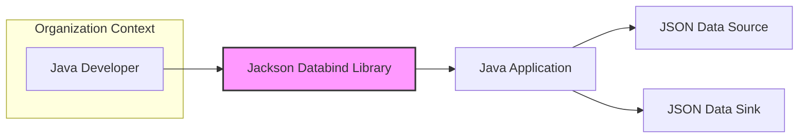
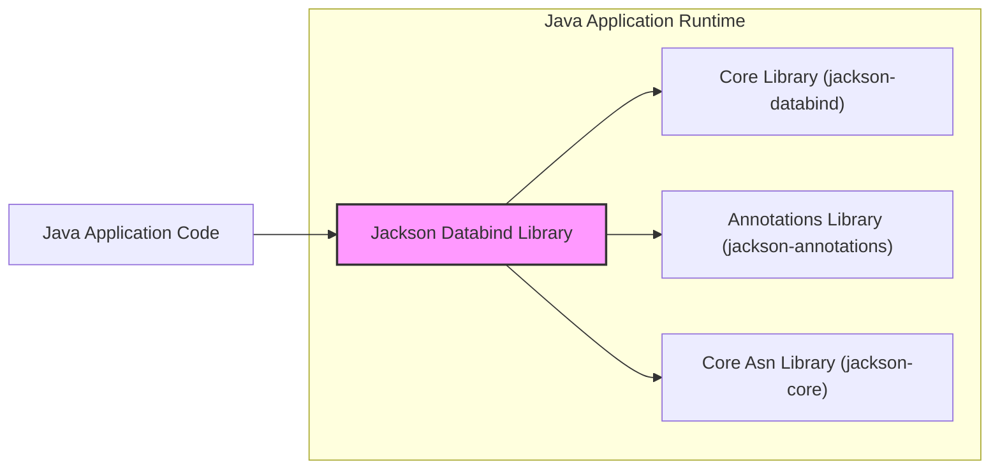
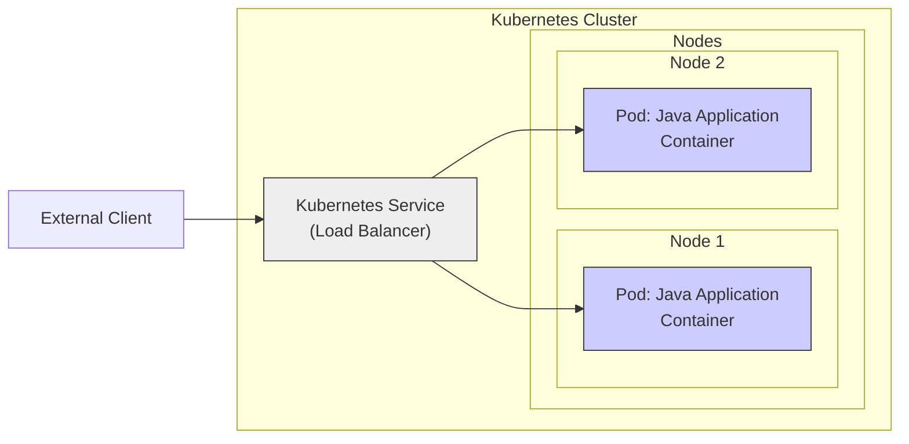
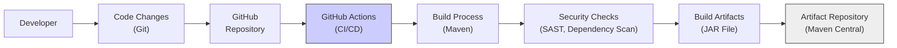

# BUSINESS POSTURE

The Jackson Databind library is a high-performance JSON processor for Java. It provides functionality to convert Java objects to JSON and vice versa (data binding). It is widely used in Java applications for data serialization and deserialization, enabling communication between systems and data persistence.

Business priorities and goals for Jackson Databind are:
- Provide a reliable and efficient JSON processing library for Java developers.
- Maintain compatibility with JSON standards and evolving Java ecosystems.
- Ensure the library is performant and minimizes resource consumption in applications using it.
- Foster a strong community and provide timely support and updates.
- Maintain the library's reputation as a trusted and secure component for Java applications.

Most important business risks that need to be addressed:
- Security vulnerabilities in the library could impact a vast number of applications relying on it, leading to data breaches, service disruptions, or reputational damage.
- Performance issues or bugs could negatively affect the performance and stability of applications using Jackson.
- Lack of maintenance or slow response to security issues could erode trust and lead to users migrating to alternative libraries.
- Incompatibility with new Java versions or JSON standards could limit the library's usability and adoption.

# SECURITY POSTURE

Existing security controls:
- security control: Code hosted on GitHub, leveraging GitHub's infrastructure security. (Implemented: GitHub)
- security control: Open-source project with community review and scrutiny. (Implemented: Open Source Nature)
- security control: Dependency management using Maven Central, which provides some level of artifact integrity checks. (Implemented: Maven Central)
- security control: Regular updates and bug fixes provided by maintainers. (Implemented: Project Maintainers)

Accepted risks:
- accepted risk: Vulnerabilities might be discovered in the library code despite community review.
- accepted risk: Third-party dependencies might introduce vulnerabilities.
- accepted risk: Misuse of the library by developers can lead to security issues in applications.

Recommended security controls:
- security control: Implement automated security scanning (SAST, DAST, dependency scanning) in the CI/CD pipeline.
- security control: Conduct regular security audits and penetration testing.
- security control: Establish a clear vulnerability disclosure and response process.
- security control: Provide security guidelines and best practices for developers using Jackson Databind.
- security control: Consider code signing of released artifacts to enhance supply chain security.

Security requirements:
- Authentication: Not directly applicable to a library. Authentication is the responsibility of applications using Jackson Databind.
- Authorization: Not directly applicable to a library. Authorization is the responsibility of applications using Jackson Databind.
- Input validation: Jackson Databind must perform robust input validation to prevent vulnerabilities like injection attacks or denial-of-service attacks due to malformed JSON input. This should be implemented within the library's parsing and data binding logic.
- Cryptography: Jackson Databind itself might not directly implement cryptography, but it should handle cryptographic data securely if applications use it to process encrypted data. It should avoid introducing vulnerabilities when handling byte arrays or sensitive strings.

# DESIGN

## C4 CONTEXT

Elements of context diagram:
- Name: Java Developer
  - Type: Person
  - Description: Software developers who use the Jackson Databind library to build Java applications.
  - Responsibilities: Integrate Jackson Databind into Java applications, configure and use the library correctly.
  - Security controls: Secure development practices, code review, secure configuration management.
- Name: Jackson Databind Library
  - Type: Software System
  - Description: A Java library for high-performance JSON processing, providing data binding between Java objects and JSON.
  - Responsibilities: Parse JSON data, serialize Java objects to JSON, deserialize JSON to Java objects, provide configuration options for customization.
  - Security controls: Input validation, secure coding practices, vulnerability management, dependency scanning.
- Name: Java Application
  - Type: Software System
  - Description: Applications built using Java that incorporate the Jackson Databind library for JSON processing.
  - Responsibilities: Utilize Jackson Databind for data serialization and deserialization, handle application logic, interact with data sources and sinks.
  - Security controls: Authentication, authorization, input validation (application-level), secure data handling, logging and monitoring.
- Name: JSON Data Source
  - Type: External System
  - Description: External systems or components that provide JSON data to the Java Application. This could be databases, APIs, message queues, or files.
  - Responsibilities: Provide JSON data in a defined format, ensure data availability and integrity.
  - Security controls: Authentication, authorization, data encryption in transit and at rest, access control.
- Name: JSON Data Sink
  - Type: External System
  - Description: External systems or components that consume JSON data from the Java Application. This could be databases, APIs, message queues, or files.
  - Responsibilities: Receive and process JSON data, ensure data persistence and integrity.
  - Security controls: Authentication, authorization, input validation, data encryption in transit and at rest, access control.

## C4 CONTAINER

Elements of container diagram:
- Name: Jackson Databind Library
  - Type: Container (Java Library)
  - Description:  The overall Jackson Databind library, composed of multiple modules.
  - Responsibilities: Provide JSON processing functionalities to Java applications. Act as a facade for underlying modules.
  - Security controls: Input validation, secure coding practices, vulnerability management, dependency scanning.
- Name: Core Library (jackson-databind)
  - Type: Container (Java Module)
  - Description: The main module of Jackson Databind, providing core data binding functionalities.
  - Responsibilities: Object serialization and deserialization, data mapping, configuration management.
  - Security controls: Input validation, secure coding practices, vulnerability management, unit and integration testing.
- Name: Annotations Library (jackson-annotations)
  - Type: Container (Java Module)
  - Description:  Provides annotations used to configure and customize Jackson's data binding behavior.
  - Responsibilities: Define annotations for serialization and deserialization customization.
  - Security controls:  Limited direct security controls, but proper annotation usage is important for secure data handling.
- Name: Core Asn Library (jackson-core)
  - Type: Container (Java Module)
  - Description:  Low-level JSON processing module, providing streaming API and basic parsing/generation.
  - Responsibilities:  Efficient JSON parsing and generation, handling low-level JSON syntax.
  - Security controls: Input validation, protection against parsing vulnerabilities, performance optimization to prevent denial-of-service.
- Name: Java Application Code
  - Type: Container (Application Code)
  - Description: The application code that utilizes the Jackson Databind library.
  - Responsibilities:  Application logic, calling Jackson Databind APIs, handling data, implementing application-level security controls.
  - Security controls: Authentication, authorization, input validation (application-level), secure data handling, logging and monitoring.

## DEPLOYMENT

Jackson Databind is a library and is not deployed as a standalone application. It is embedded within Java applications. The deployment architecture for Jackson Databind is determined by the deployment architecture of the Java applications that use it.

Common deployment architectures for Java applications using Jackson Databind:
1. **On-Premise Servers**: Java application deployed on physical or virtual servers within an organization's data center.
2. **Cloud-Based Virtual Machines (VMs)**: Java application deployed on VMs in cloud environments like AWS EC2, Azure VMs, or Google Compute Engine.
3. **Containerized Environments (Docker, Kubernetes)**: Java application packaged as Docker containers and orchestrated using Kubernetes or similar platforms.
4. **Serverless Functions (AWS Lambda, Azure Functions, Google Cloud Functions)**:  Java application deployed as serverless functions in cloud environments.

Let's consider a common **Containerized Environment (Kubernetes)** deployment for detailed description.

Elements of deployment diagram (Containerized Environment - Kubernetes):
- Name: Pod: Java Application Container
  - Type: Deployment Unit (Container)
  - Description: Docker container running the Java application that includes the Jackson Databind library. Multiple instances can be deployed for scalability and resilience.
  - Responsibilities: Run the Java application, process requests, utilize Jackson Databind for JSON handling.
  - Security controls: Container image scanning, least privilege container configuration, network policies, resource limits, application-level security controls.
- Name: Kubernetes Service (Load Balancer)
  - Type: Infrastructure Component (Load Balancer)
  - Description: Kubernetes Service of type LoadBalancer, providing a single entry point for external traffic and distributing requests across application pods.
  - Responsibilities: Load balancing, service discovery, exposing the application to external clients.
  - Security controls: Network security groups, TLS termination, rate limiting, DDoS protection.
- Name: Kubernetes Cluster
  - Type: Infrastructure Environment (Container Orchestration Platform)
  - Description: The Kubernetes cluster providing the runtime environment for the containerized Java application.
  - Responsibilities: Container orchestration, resource management, scaling, health monitoring.
  - Security controls: RBAC (Role-Based Access Control), network policies, security audits, cluster hardening, secrets management.
- Name: Nodes (Node 1, Node 2)
  - Type: Infrastructure Component (Compute Instance)
  - Description: Worker nodes in the Kubernetes cluster where application pods are deployed.
  - Responsibilities: Provide compute resources for running containers.
  - Security controls: Operating system hardening, security patching, access control, monitoring and logging.
- Name: External Client
  - Type: External Actor
  - Description: Users or systems external to the Kubernetes cluster that interact with the Java application.
  - Responsibilities: Initiate requests to the Java application.
  - Security controls: Authentication (if applicable), authorization (if applicable), secure communication protocols (HTTPS).

## BUILD

Elements of build diagram:
- Name: Developer
  - Type: Person
  - Description: Software developer contributing code to the Jackson Databind project.
  - Responsibilities: Write code, commit changes, create pull requests.
  - Security controls: Secure development environment, code review, secure coding practices, authentication to Git repository.
- Name: Code Changes (Git)
  - Type: Data
  - Description: Code modifications made by developers, tracked using Git version control.
  - Responsibilities: Represent code changes, maintain version history.
  - Security controls: Access control to Git repository, branch protection, commit signing.
- Name: GitHub Repository
  - Type: Code Repository
  - Description: GitHub repository hosting the Jackson Databind source code.
  - Responsibilities: Store source code, manage versions, facilitate collaboration.
  - Security controls: Access control, branch protection, audit logs, vulnerability scanning (GitHub Advanced Security).
- Name: GitHub Actions (CI/CD)
  - Type: Automation System (CI/CD)
  - Description: GitHub's CI/CD platform used to automate the build, test, and release process for Jackson Databind.
  - Responsibilities: Automate build process, run tests, perform security checks, publish artifacts.
  - Security controls: Secure workflow definitions, secret management, access control, audit logs.
- Name: Build Process (Maven)
  - Type: Build Tool
  - Description: Maven build tool used to compile, package, and manage dependencies for Jackson Databind.
  - Responsibilities: Compile code, manage dependencies, run tests, package artifacts.
  - Security controls: Dependency management (Maven Central), plugin management, build reproducibility.
- Name: Security Checks (SAST, Dependency Scan)
  - Type: Security Tooling
  - Description: Static Application Security Testing (SAST) and dependency scanning tools integrated into the build process to identify potential vulnerabilities.
  - Responsibilities: Identify security vulnerabilities in code and dependencies.
  - Security controls: Configuration of security tools, vulnerability reporting, integration with CI/CD pipeline.
- Name: Build Artifacts (JAR File)
  - Type: Software Artifact
  - Description: Compiled JAR files of the Jackson Databind library, ready for distribution.
  - Responsibilities: Contain compiled code, be distributable and usable by Java applications.
  - Security controls: Code signing (optional), integrity checks (checksums).
- Name: Artifact Repository (Maven Central)
  - Type: Artifact Repository
  - Description: Maven Central repository where Jackson Databind JAR files are published for public consumption.
  - Responsibilities: Host and distribute Jackson Databind artifacts, ensure artifact availability and integrity.
  - Security controls: Access control, artifact integrity checks, vulnerability scanning (Maven Central).

# RISK ASSESSMENT

Critical business process we are trying to protect:
- Secure and reliable JSON data processing in Java applications that rely on Jackson Databind. This includes data serialization, deserialization, and data mapping.  Disruptions or vulnerabilities in Jackson Databind can impact the functionality and security of a wide range of applications.

Data we are trying to protect and their sensitivity:
- Application data processed by Jackson Databind. The sensitivity of this data varies greatly depending on the application. It can range from publicly available data to highly sensitive personal or financial information. Jackson Databind itself does not inherently store data, but it processes data in transit and in memory within applications. The confidentiality, integrity, and availability of this data are crucial.

# QUESTIONS & ASSUMPTIONS

Questions:
- What are the specific security testing practices currently employed by the Jackson Databind project beyond basic unit tests?
- Is there a formal vulnerability disclosure process in place?
- Are there any specific security certifications or compliance requirements that Jackson Databind aims to meet?
- What is the process for managing and updating third-party dependencies, especially concerning security vulnerabilities?

Assumptions:
- The primary goal of Jackson Databind is to provide a robust, performant, and reliable JSON processing library for the Java ecosystem.
- Security is a significant concern for the Jackson Databind project due to its widespread use and potential impact of vulnerabilities.
- The project maintainers are committed to addressing security issues and maintaining the library's security posture.
- Users of Jackson Databind rely on it for critical functionalities in their applications, and security vulnerabilities can have significant consequences.
- The project benefits from community contributions and scrutiny, which aids in identifying and addressing potential issues, including security vulnerabilities.