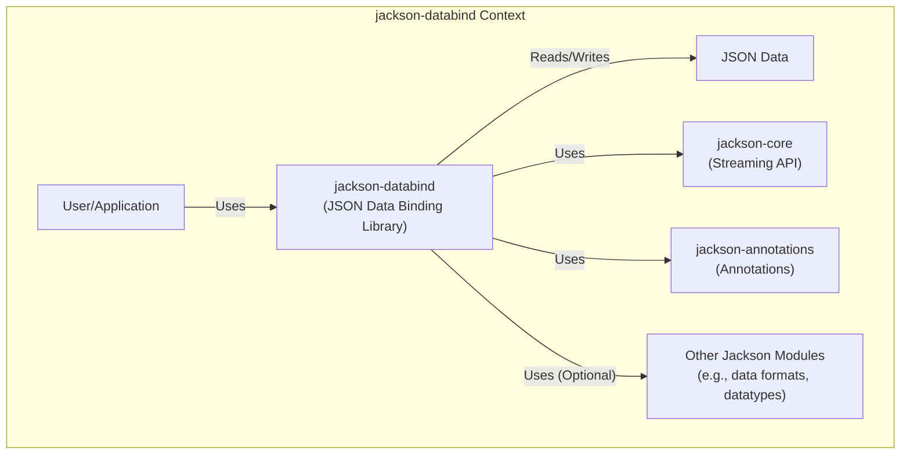
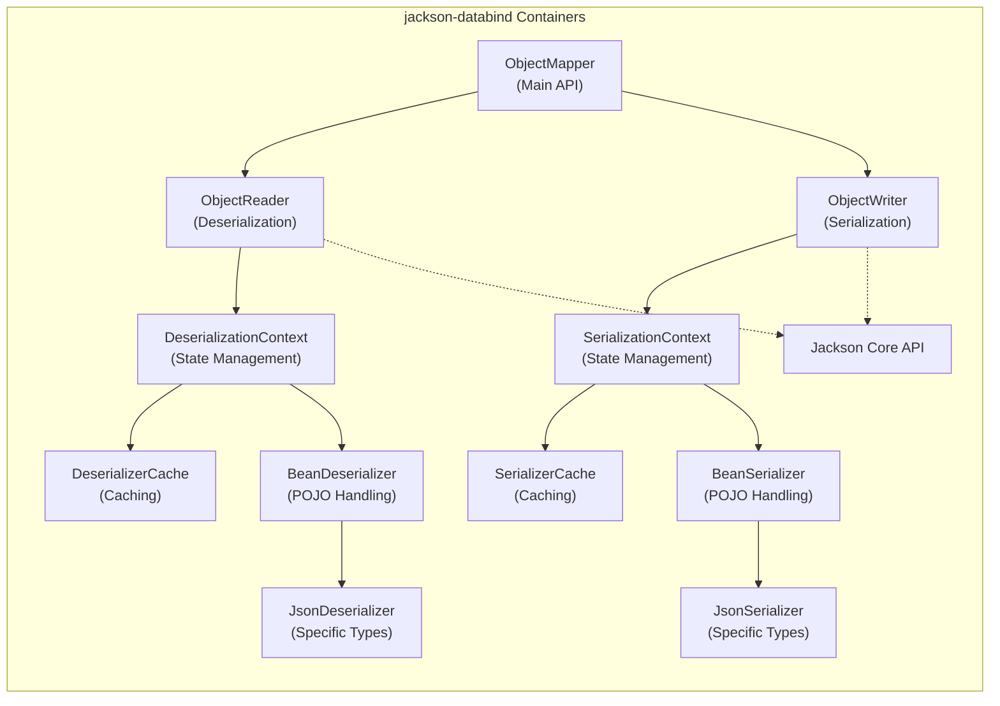
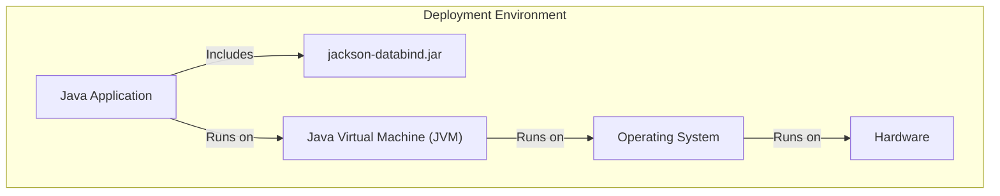
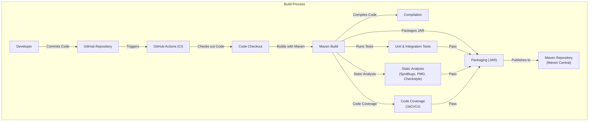

# Project Design Document: jackson-databind

## BUSINESS POSTURE

*   Business Priorities and Goals:
    *   Provide a high-performance, standards-compliant, and highly configurable JSON data binding library for Java.
    *   Maintain backward compatibility with previous versions where possible.
    *   Support a wide range of Java objects for serialization and deserialization.
    *   Offer extensive customization options for handling different data formats and structures.
    *   Be a core dependency for many other Java projects and frameworks, ensuring reliability and stability.
    *   Minimize external dependencies to reduce the risk of conflicts and vulnerabilities.

*   Business Risks:
    *   Security vulnerabilities in the library could lead to remote code execution (RCE) or denial-of-service (DoS) attacks in applications that use it. This is the most critical risk due to the library's widespread use.
    *   Performance bottlenecks could impact the performance of applications relying on the library.
    *   Compatibility issues with different Java versions or other libraries could limit adoption or cause integration problems.
    *   Lack of support for new JSON features or standards could make the library less relevant over time.
    *   Bugs or unexpected behavior could lead to data corruption or incorrect processing of JSON data.
    *   License violations or legal issues related to the library's use or distribution.

## SECURITY POSTURE

*   Existing Security Controls:
    *   security control: Input validation: The library performs extensive input validation to prevent common vulnerabilities like buffer overflows and injection attacks. Implemented in parsing logic throughout the codebase.
    *   security control: Polymorphic Type Handling Restrictions: Specific configurations and checks are in place to mitigate risks associated with polymorphic type handling, a known source of vulnerabilities. Described in documentation and implemented in `com.fasterxml.jackson.databind.jsontype.impl`.
    *   security control: Regular security audits and vulnerability scanning: The project maintainers and community perform ongoing security reviews and use vulnerability scanning tools.
    *   security control: Dependency management: Efforts are made to keep dependencies up-to-date and minimize the number of external dependencies.
    *   security control: Fuzz testing: Fuzz testing is used to discover potential vulnerabilities by providing invalid or unexpected inputs.
    *   security control: Secure coding practices: Developers follow secure coding guidelines to minimize the introduction of new vulnerabilities.

*   Accepted Risks:
    *   accepted risk: Certain advanced features, if misconfigured, could potentially be exploited. The documentation highlights these risks and provides guidance on secure configuration.
    *   accepted risk: Deserialization of untrusted data is inherently risky. The library provides mechanisms to mitigate these risks, but users must be aware of the potential dangers.

*   Recommended Security Controls:
    *   security control: Implement a comprehensive Content Security Policy (CSP) if the library is used in a web context (although this is less likely, as it's a backend library).
    *   security control: Integrate with static application security testing (SAST) tools for continuous code analysis during development.
    *   security control: Integrate with dynamic application security testing (DAST) tools for runtime security testing.
    *   security control: Implement Software Composition Analysis (SCA) to identify and manage vulnerabilities in third-party dependencies.

*   Security Requirements:

    *   Authentication: Not directly applicable, as this is a data-binding library, not an authentication system.
    *   Authorization: Not directly applicable. Authorization should be handled by the application using the library.
    *   Input Validation:
        *   The library MUST validate all input to ensure it conforms to the expected format and structure.
        *   The library MUST handle invalid or unexpected input gracefully, without crashing or exposing sensitive information.
        *   The library MUST protect against common injection attacks, such as buffer overflows and format string vulnerabilities.
    *   Cryptography:
        *   If the library handles sensitive data, it MUST use strong, industry-standard cryptographic algorithms and protocols.
        *   Cryptographic keys MUST be managed securely, following best practices for key generation, storage, and rotation.
        *   The library should not implement its own cryptography, but rely on well-vetted cryptographic libraries.
    *   Polymorphic Deserialization:
        *   The library MUST provide secure mechanisms for handling polymorphic deserialization, preventing attackers from instantiating arbitrary classes.
        *   Configuration options related to polymorphic deserialization MUST be secure by default.

## DESIGN

### C4 CONTEXT

*   Elements Description:

    *   Element:
        *   Name: User/Application
        *   Type: External Entity (User or Application)
        *   Description: Represents any Java application or user that utilizes the jackson-databind library for JSON data binding.
        *   Responsibilities: Provides JSON data to be deserialized, receives Java objects after deserialization, provides Java objects to be serialized, receives JSON data after serialization.
        *   Security controls: Input validation (of data provided to jackson-databind), secure handling of deserialized data, secure configuration of jackson-databind.

    *   Element:
        *   Name: jackson-databind
        *   Type: System
        *   Description: The core data binding library, providing functionality for converting Java objects to JSON and vice versa.
        *   Responsibilities: Deserializing JSON data into Java objects, serializing Java objects into JSON data, handling type conversions, providing configuration options for customization.
        *   Security controls: Input validation, polymorphic type handling restrictions, secure coding practices, regular security audits.

    *   Element:
        *   Name: JSON Data
        *   Type: Data
        *   Description: Represents the JSON data that is being read or written by the library.
        *   Responsibilities: N/A - This is data, not an active component.
        *   Security controls: N/A

    *   Element:
        *   Name: jackson-core
        *   Type: Library
        *   Description: Provides the low-level streaming API for reading and writing JSON, used by jackson-databind.
        *   Responsibilities: Parsing and generating JSON tokens, handling low-level I/O operations.
        *   Security controls: Input validation, secure coding practices.

    *   Element:
        *   Name: jackson-annotations
        *   Type: Library
        *   Description: Provides annotations used to configure the data binding process.
        *   Responsibilities: Defining annotations for customizing serialization and deserialization behavior.
        *   Security controls: Secure coding practices.

    *   Element:
        *   Name: Other Jackson Modules
        *   Type: Library (Optional)
        *   Description: Represents other Jackson modules that provide support for additional data formats (e.g., XML, YAML) or datatypes.
        *   Responsibilities: Extending jackson-databind's functionality to support other formats or types.
        *   Security controls: Dependent on the specific module; should follow similar security principles as jackson-databind.

### C4 CONTAINER

*   Elements Description:

    *   Element:
        *   Name: ObjectMapper
        *   Type: Component
        *   Description: The main entry point for using the library. Provides methods for reading and writing JSON.
        *   Responsibilities: Creating ObjectReader and ObjectWriter instances, configuring default settings, providing convenience methods for common operations.
        *   Security controls: Secure configuration options, input validation (indirectly, through ObjectReader/ObjectWriter).

    *   Element:
        *   Name: ObjectReader
        *   Type: Component
        *   Description: Handles the deserialization of JSON data into Java objects.
        *   Responsibilities: Parsing JSON input, creating Java objects, populating object fields, handling type conversions.
        *   Security controls: Input validation, polymorphic type handling restrictions.

    *   Element:
        *   Name: ObjectWriter
        *   Type: Component
        *   Description: Handles the serialization of Java objects into JSON data.
        *   Responsibilities: Converting Java objects to JSON, formatting JSON output, handling type conversions.
        *   Security controls: Secure handling of object data.

    *   Element:
        *   Name: DeserializationContext
        *   Type: Component
        *   Description: Manages the state of the deserialization process.
        *   Responsibilities: Providing access to configuration settings, resolving type information, handling errors.
        *   Security controls: Secure configuration options, error handling.

    *   Element:
        *   Name: SerializationContext
        *   Type: Component
        *   Description: Manages the state of the serialization process.
        *   Responsibilities: Providing access to configuration settings, resolving type information, handling errors.
        *   Security controls: Secure configuration options, error handling.

    *   Element:
        *   Name: DeserializerCache
        *   Type: Component
        *   Description: Caches deserializer instances for performance.
        *   Responsibilities: Storing and retrieving deserializer instances.
        *   Security controls: Secure handling of cached objects.

    *   Element:
        *   Name: SerializerCache
        *   Type: Component
        *   Description: Caches serializer instances for performance.
        *   Responsibilities: Storing and retrieving serializer instances.
        *   Security controls: Secure handling of cached objects.

    *   Element:
        *   Name: BeanDeserializer
        *   Type: Component
        *   Description: Handles the deserialization of Java objects that follow the JavaBean pattern.
        *   Responsibilities: Creating object instances, setting field values, handling annotations.
        *   Security controls: Input validation, polymorphic type handling restrictions.

    *   Element:
        *   Name: BeanSerializer
        *   Type: Component
        *   Description: Handles the serialization of Java objects that follow the JavaBean pattern.
        *   Responsibilities: Getting field values, converting objects to JSON, handling annotations.
        *   Security controls: Secure handling of object data.

    *   Element:
        *   Name: JsonDeserializer
        *   Type: Component
        *   Description: Abstract class for custom deserializers for specific types.
        *   Responsibilities: Providing a mechanism for users to implement custom deserialization logic.
        *   Security controls: Relies on the implementation of the custom deserializer.

    *   Element:
        *   Name: JsonSerializer
        *   Type: Component
        *   Description: Abstract class for custom serializers for specific types.
        *   Responsibilities: Providing a mechanism for users to implement custom serialization logic.
        *   Security controls: Relies on the implementation of the custom serializer.
    *   Element:
        *   Name: Jackson Core API
        *   Type: Library
        *   Description: Provides low level JSON processing.
        *   Responsibilities: Tokenizing, parsing and generating JSON.
        *   Security controls: Input validation.

### DEPLOYMENT

*   Possible Deployment Solutions:
    *   Embedded within a Java application (most common).
    *   As a dependency in a web application deployed to an application server (e.g., Tomcat, Jetty, WildFly).
    *   As a dependency in a serverless function (e.g., AWS Lambda, Azure Functions, Google Cloud Functions).
    *   As a dependency in a microservice deployed to a container orchestration platform (e.g., Kubernetes, Docker Swarm).

*   Chosen Deployment Solution (Example: Embedded within a Java Application):

*   Elements Description:

    *   Element:
        *   Name: Java Application
        *   Type: Application
        *   Description: The application that uses jackson-databind for JSON processing.
        *   Responsibilities: Performing the application's core logic, using jackson-databind to handle JSON data.
        *   Security controls: Application-level security controls, secure configuration of jackson-databind.

    *   Element:
        *   Name: jackson-databind.jar
        *   Type: Library (JAR file)
        *   Description: The compiled jackson-databind library, packaged as a JAR file.
        *   Responsibilities: Providing the JSON data binding functionality.
        *   Security controls: Internal security controls of the library (input validation, etc.).

    *   Element:
        *   Name: JVM
        *   Type: Runtime Environment
        *   Description: The Java Virtual Machine that runs the application and the library.
        *   Responsibilities: Executing Java bytecode, managing memory, providing system resources.
        *   Security controls: JVM security settings, security manager (if enabled).

    *   Element:
        *   Name: Operating System
        *   Type: Operating System
        *   Description: The operating system on which the JVM runs.
        *   Responsibilities: Providing system resources, managing processes, handling network communication.
        *   Security controls: OS-level security controls (firewall, user permissions, etc.).

    *   Element:
        *   Name: Hardware
        *   Type: Hardware
        *   Description: The physical hardware on which the operating system runs.
        *   Responsibilities: Providing the physical resources for the system.
        *   Security controls: Physical security controls, hardware-level security features.

### BUILD

*   Build Process:
    1.  Developer writes code and commits changes to the Git repository (GitHub).
    2.  Continuous Integration (CI) system (GitHub Actions) is triggered by commits.
    3.  CI system checks out the code.
    4.  Maven is used to build the project:
        *   Compile the source code.
        *   Run unit and integration tests.
        *   Perform static analysis (using plugins like SpotBugs, PMD, Checkstyle).
        *   Generate code coverage reports (using JaCoCo).
        *   Package the library into JAR files.
    5.  If all tests and checks pass, the JAR files are published to a Maven repository (e.g., Maven Central).
    6.  Release process involves tagging the repository, updating version numbers, and creating release notes.

*   Security Controls in Build Process:
    *   security control: Static analysis tools (SpotBugs, PMD, Checkstyle) are used to identify potential code quality and security issues.
    *   security control: Unit and integration tests are run to ensure code correctness and prevent regressions.
    *   security control: Code coverage analysis (JaCoCo) is used to measure the effectiveness of the tests.
    *   security control: Dependency management tools are used to track and update dependencies, minimizing the risk of using vulnerable libraries.
    *   security control: The build process is automated using GitHub Actions, ensuring consistency and reproducibility.
    *   security control: Access to the build system and Maven repository is restricted to authorized personnel.
    *   security control: Signed JARs: JAR files can be digitally signed to ensure their integrity and authenticity.

## RISK ASSESSMENT

*   Critical Business Processes:
    *   Serialization and deserialization of JSON data in applications relying on jackson-databind. This is critical because a failure in this process can disrupt the functionality of numerous applications.
    *   Maintaining the stability and reliability of the library, as it's a core dependency for many projects.

*   Data Sensitivity:
    *   The library itself doesn't store or manage data directly. However, it processes data that may be highly sensitive, depending on the application using it. The sensitivity of the data is determined by the application, not the library.
    *   Data types handled can range from non-sensitive (e.g., configuration settings) to highly sensitive (e.g., personally identifiable information (PII), financial data, authentication credentials).
    *   The library should be treated as a potential conduit for sensitive data, and appropriate security measures should be taken in the applications that use it.

## QUESTIONS & ASSUMPTIONS

*   Questions:
    *   Are there any specific compliance requirements (e.g., GDPR, HIPAA, PCI DSS) that applications using this library typically need to meet? This will influence recommendations for data handling.
    *   What is the expected threat model for applications using this library? (e.g., web applications, internal services, embedded systems). This helps prioritize security controls.
    *   What level of security expertise is expected from developers using this library? This informs the level of detail needed in security guidance.
    *   What are the specific performance requirements for applications using this library? This helps identify potential performance bottlenecks.
    *   Are there any known limitations or weaknesses in the current implementation that need to be addressed?

*   Assumptions:
    *   BUSINESS POSTURE: The project prioritizes security and is willing to invest in addressing vulnerabilities.
    *   BUSINESS POSTURE: The project maintainers are responsive to security reports and will release patches promptly.
    *   SECURITY POSTURE: Developers using the library have a basic understanding of security principles.
    *   SECURITY POSTURE: Applications using the library will handle sensitive data appropriately, following best practices for data security.
    *   DESIGN: The library is primarily used in server-side Java applications.
    *   DESIGN: The library is not directly exposed to untrusted user input in most cases (the application using it is responsible for handling user input).
    *   DESIGN: The build process is secure and reliable.
    *   DESIGN: The library's dependencies are regularly reviewed and updated.