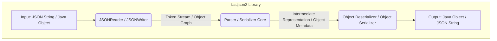
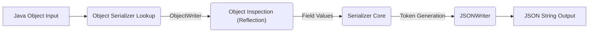

# Project Design Document: fastjson2 Library - Enhanced

**Version:** 1.1
**Date:** October 26, 2023
**Author:** AI Software Architect

## 1. Introduction

This document provides an enhanced and more detailed design overview of the `fastjson2` library, a high-performance JSON library for Java. Building upon the previous version, this document further clarifies the architecture, components, and data flow within the library, with a stronger focus on aspects relevant to threat modeling. A thorough understanding of `fastjson2`'s internal mechanisms is essential for identifying potential security vulnerabilities and designing effective mitigation strategies.

## 2. Goals

*   Provide a comprehensive and technically detailed architectural overview of the `fastjson2` library.
*   Clearly define the responsibilities and interactions of key internal components.
*   Elaborate on the data flow during both JSON parsing (deserialization) and serialization processes.
*   Serve as a robust and informative foundation for subsequent threat modeling exercises, highlighting potential attack surfaces.
*   Document the design in a clear, precise, and easily understandable manner, adhering to specified formatting guidelines.

## 3. Project Overview

`fastjson2` is a Java library developed by Alibaba, engineered for exceptional performance in JSON processing. It facilitates the conversion of JSON strings into Java objects (deserialization) and the transformation of Java objects into JSON strings (serialization). Key characteristics include:

*   **Superior Performance:**  Designed for speed and efficiency, often outperforming other popular Java JSON libraries.
*   **JSON Standard Compliance:** Adheres to relevant JSON specifications and supports common extensions.
*   **Data Type Flexibility:**  Handles a wide range of Java data types and complex object structures.
*   **API Versatility:** Offers both streaming and tree-based API approaches for different use cases.
*   **Extensibility:** Provides mechanisms for customization through filters and other extension points.

## 4. Architectural Design

The `fastjson2` library employs a pipelined architecture optimized for speed. The core processes of parsing and serialization involve distinct stages, each handled by specialized components.

### 4.1. Key Components

*   **JSONReader:**
    *   The entry point for deserialization. Responsible for reading the input JSON string from various sources (String, InputStream, Reader).
    *   Manages character encoding (typically UTF-8) and buffering for efficient input processing.
    *   Provides methods for reading different JSON constructs (objects, arrays, primitives).
    *   Internally uses a `Tokenizer` to break down the input into individual tokens.
*   **JSONWriter:**
    *   The entry point for serialization. Responsible for writing the output JSON string to various destinations (StringBuilder, OutputStream, Writer).
    *   Handles character encoding and escaping of special characters according to JSON rules.
    *   Offers options for formatting the output (e.g., pretty printing).
    *   Provides methods for writing different JSON constructs.
*   **Parser Core (Internal):**
    *   The central engine for deserialization. Takes the token stream from `JSONReader` and interprets the JSON structure.
    *   Implements state machines and algorithms to efficiently process the token stream.
    *   Identifies JSON values, keys, and structural elements.
    *   Handles error conditions and syntax violations during parsing.
*   **Serializer Core (Internal):**
    *   The central engine for serialization. Takes Java objects and their metadata as input.
    *   Traverses the object graph to extract field values.
    *   Generates a stream of JSON tokens representing the object's state.
    *   Handles different data types and applies configured serialization rules.
*   **Object Deserializer:**
    *   Responsible for mapping parsed JSON data to specific Java object instances.
    *   Determines the target Java class based on type information or configuration.
    *   Instantiates Java objects and populates their fields with values from the JSON input.
    *   Handles type conversions and potential mismatches.
    *   May utilize reflection or bytecode generation for efficient object instantiation and population.
*   **Object Serializer:**
    *   Responsible for converting Java objects into their JSON representation.
    *   Inspects the Java object's fields (using reflection or direct access).
    *   Formats field values according to JSON syntax and data type rules.
    *   Handles nested objects and collections recursively.
    *   Applies configured filters and custom serialization logic.
*   **Internal Data Structures:**
    *   Employs various internal data structures for efficient processing, including:
        *   **Token Buffers:**  Temporary storage for parsed JSON tokens.
        *   **String Pools:**  Optimized storage for frequently occurring strings to reduce memory usage.
        *   **Object Caches:**  Caches of deserialized objects or serializer instances for performance.

### 4.2. Data Flow - Deserialization (JSON to Java Object)

1. **Input Acquisition:** A JSON string is provided as input to the `JSONReader`.
2. **Tokenization:** The `JSONReader`'s internal `Tokenizer` scans the input string and breaks it down into a stream of discrete JSON tokens (e.g., `{`, `"key"`, `:`, `"value"`, `}`, `[` , `]`, numbers, booleans, null).
3. **Parsing and Structure Interpretation:** The `Parser Core` consumes the token stream, analyzing the sequence of tokens to understand the hierarchical structure of the JSON data (objects, arrays, key-value pairs).
4. **Object Mapping and Instantiation:** The `Object Deserializer` determines the target Java class for deserialization. It then instantiates an object of that class.
5. **Field Population:** The `Object Deserializer` maps the parsed JSON values to the corresponding fields of the instantiated Java object. This involves:
    *   Matching JSON keys to Java field names (considering potential naming conventions).
    *   Converting JSON values to the appropriate Java data types (e.g., string to int, string to Date).
    *   Handling nested objects and arrays recursively by invoking deserialization for those nested structures.
6. **Output:** A fully populated Java object representing the data contained in the input JSON string.

### 4.3. Data Flow - Serialization (Java Object to JSON)

1. **Input Acquisition:** A Java object is provided as input to the `JSONWriter`.
2. **Object Inspection:** The `Object Serializer` inspects the input Java object to determine its structure and field values. This typically involves reflection to access the object's fields.
3. **Token Generation:** The `Serializer Core` generates a stream of JSON tokens based on the extracted field values and their data types. This includes:
    *   Generating opening and closing brackets (`{`, `}`) for objects and square brackets (`[`, `]`) for arrays.
    *   Generating key-value pairs for object fields, including quoting keys.
    *   Formatting values according to JSON syntax rules (e.g., quoting strings, representing numbers).
    *   Handling nested objects and collections recursively by invoking serialization for those nested structures.
4. **Output Assembly:** The `JSONWriter` receives the generated token stream and assembles it into a valid JSON string.
5. **Output Delivery:** The assembled JSON string is delivered to the specified output destination (e.g., a StringBuilder, OutputStream).

## 5. Key Components in Detail

*   **com.alibaba.fastjson2.JSONReader:**
    *   Provides methods like `readObject()`, `readArray()`, `readString()`, `readInt()`, etc., for reading specific JSON data types.
    *   Offers methods for navigating the JSON structure, such as `startObject()`, `endObject()`, `nextName()`.
    *   Supports features like error handling and lenient parsing.
*   **com.alibaba.fastjson2.JSONWriter:**
    *   Provides methods like `writeObject()`, `writeArray()`, `writeName()`, `writeValue()`, `writeString()`, `writeInt()`, etc., for writing JSON data.
    *   Offers configuration options for output formatting (e.g., indentation, sorting of keys).
    *   Supports features like disabling escaping of certain characters.
*   **com.alibaba.fastjson2.JSONFactory:**
    *   Serves as a factory for creating `JSONReader` and `JSONWriter` instances.
    *   Allows setting global configuration options that affect parsing and serialization behavior.
    *   Provides methods for creating readers and writers from various input/output sources.
*   **com.alibaba.fastjson2.parse.JSONLexer:** (Internal component, part of the `Parser Core`)
    *   The low-level tokenizer responsible for scanning the input JSON string and identifying individual tokens.
    *   Implements efficient algorithms for character processing and token recognition.
    *   Handles different character encodings.
*   **com.alibaba.fastjson2.reader.ObjectReader<T>:** (Internal component, part of the `Object Deserializer`)
    *   An interface responsible for deserializing JSON data into objects of a specific type `T`.
    *   Implementations are generated or retrieved based on the target class.
    *   Handles the mapping of JSON properties to object fields.
*   **com.alibaba.fastjson2.writer.ObjectWriter<T>:** (Internal component, part of the `Object Serializer`)
    *   An interface responsible for serializing objects of a specific type `T` into JSON.
    *   Implementations are generated or retrieved based on the object's class.
    *   Handles the extraction of field values and their formatting into JSON.
*   **com.alibaba.fastjson2.filter.Filter / com.alibaba.fastjson2.filter.NameFilter / com.alibaba.fastjson2.filter.ValueFilter / com.alibaba.fastjson2.filter.PropertyPreFilter / com.alibaba.fastjson2.filter.PropertyFilter:**
    *   Provides a powerful mechanism for customizing the serialization and deserialization processes.
    *   Allows developers to intercept and modify the processing of specific properties or objects.
    *   Can be used for security purposes, such as sanitizing output or preventing the deserialization of certain types.

## 6. Data Flow Diagrams

### 6.1. Enhanced Deserialization Data Flow

```mermaid
graph LR
    A["JSON String Input"] --> B("JSONReader");
    B -- "Character Stream" --> C("JSONLexer (Tokenizer)");
    C -- "Token Stream" --> D("Parser Core");
    D -- "Object Type Info" --> E("Object Deserializer Lookup");
    E -- "ObjectReader" --> F("Object Instantiation");
    F -- "Property Mapping" --> G("Field Population");
    G --> H["Java Object Output"];
```

### 6.2. Enhanced Serialization Data Flow

## 7. Security Considerations (Detailed for Threat Modeling)

This section provides a more detailed breakdown of potential security concerns relevant for threat modeling.

*   **Deserialization Vulnerabilities (Significant Attack Surface):**
    *   **Type Confusion/Polymorphic Deserialization Issues:** Malicious JSON can specify unexpected types for deserialization, potentially leading to the instantiation of dangerous classes with harmful side effects in their constructors, static initializers, or during field setting. This is a classic vector for Remote Code Execution (RCE).
    *   **Unsafe Type Handling:** If `fastjson2` is configured to allow deserialization of arbitrary types without proper validation, attackers can exploit this to instantiate and manipulate objects that can compromise the application.
    *   **Property-Oriented Programming (POP) Gadgets:** Attackers can craft JSON payloads that, when deserialized, chain together sequences of method calls on different objects (gadgets) to achieve arbitrary code execution.
    *   **Denial of Service (DoS) via Resource Exhaustion:**
        *   **Deeply Nested Objects/Arrays:**  Crafted JSON with excessive nesting can consume significant stack space during parsing, leading to `StackOverflowError`.
        *   **Large Strings/Arrays:**  Extremely large string or array values can exhaust available memory, causing `OutOfMemoryError`.
        *   **Hash Collision Attacks:**  In older versions or if hash map implementations are vulnerable, carefully chosen keys can cause hash collisions, leading to excessive CPU usage during deserialization.
*   **Input Validation and Error Handling:**
    *   **Malformed JSON Handling:**  Robust error handling is crucial to prevent crashes or unexpected behavior when processing invalid JSON. Insufficient validation can lead to exploitable states.
    *   **Integer Overflow/Underflow:** When parsing numeric values, especially from untrusted sources, ensure proper bounds checking to prevent integer overflow or underflow, which could lead to unexpected behavior or vulnerabilities in subsequent calculations.
*   **String Handling Vulnerabilities:**
    *   **Excessive Memory Allocation:**  Improper handling of very long strings during parsing or serialization can lead to excessive memory allocation and potential `OutOfMemoryError` conditions.
    *   **Injection Attacks (Less likely in direct JSON processing but relevant in context):** While direct JSON processing is less prone to SQL injection, if deserialized data is used in database queries without proper sanitization, it could still contribute to such vulnerabilities.
*   **Configuration and Default Settings:**
    *   **Insecure Default Settings:**  Review default configurations for potential security implications. For example, allowing deserialization of arbitrary classes by default could be risky.
    *   **Lack of Secure Configuration Options:** Ensure that `fastjson2` provides sufficient configuration options to enforce secure deserialization practices (e.g., whitelisting allowed classes).
*   **Dependency Chain Vulnerabilities:** While `fastjson2` aims to be self-contained, any transitive dependencies should be regularly reviewed for known vulnerabilities.
*   **Information Disclosure:**  Error messages or logging during deserialization might inadvertently reveal sensitive information about the application's internal structure or data.

## 8. Future Considerations

*   Ongoing performance optimization efforts.
*   Continuous alignment with evolving JSON standards and best practices.
*   Further enhancements to error reporting and debugging capabilities.
*   Exploration of new features and extension points to enhance flexibility.
*   Proactive security audits and vulnerability assessments.

## 9. Conclusion

This enhanced design document provides a more in-depth understanding of the `fastjson2` library's architecture and internal workings. The detailed descriptions of components and data flow, coupled with the expanded security considerations, offer a solid foundation for conducting comprehensive threat modeling. By carefully analyzing the potential attack surfaces and vulnerabilities outlined in this document, developers and security professionals can make informed decisions to secure applications that utilize the `fastjson2` library.