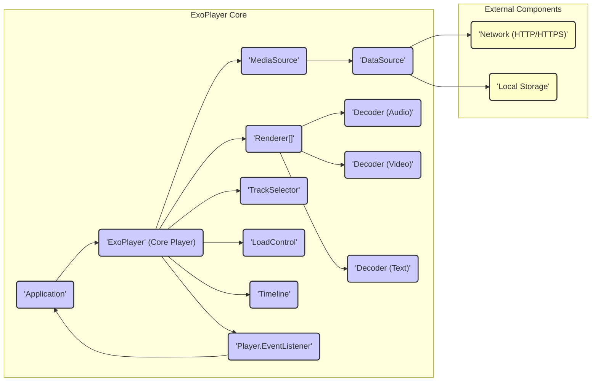
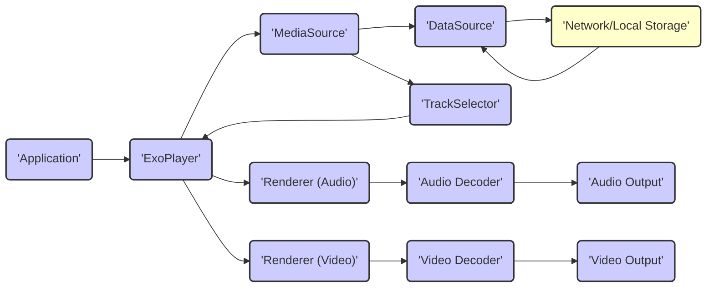

# Project Design Document: ExoPlayer for Threat Modeling (Improved)

**1. Introduction**

This document provides an enhanced design overview of the ExoPlayer project, an open-source media player library for Android. It is specifically tailored to facilitate threat modeling activities by clearly outlining the architecture, components, data flow, and external interfaces relevant to security considerations. This document focuses on the core media playback functionalities and serves as a basis for identifying potential security vulnerabilities and risks.

**2. Project Overview**

ExoPlayer is an application-level media player built upon Android's lower-level media APIs. It offers greater control and customization compared to the platform's built-in `MediaPlayer`. Key features include support for adaptive streaming formats (DASH, HLS, SmoothStreaming), a wide range of media codecs, and extensibility through custom components. Its flexibility makes it a popular choice for applications requiring robust and adaptable media playback.

**3. Architectural Design**

ExoPlayer employs a modular, component-based architecture. The core components interact to manage the loading, decoding, and rendering of media. Understanding these interactions is crucial for identifying potential attack vectors.

*   **'Application'**: The integrating Android application that utilizes the ExoPlayer library. This is the entry point and interacts directly with the `ExoPlayer` core.
*   **'ExoPlayer' (Core Player)**: The central component managing the overall playback lifecycle, including state management, buffering, and coordination between other components. It acts as the primary interface for the application.
*   **'MediaSource'**: Responsible for loading and preparing media data from various sources. It handles parsing manifest files (e.g., .mpd, .m3u8) and provides media streams to the player. Different implementations exist for various streaming formats (e.g., `DashMediaSource`, `HlsMediaSource`, `ProgressiveMediaSource`). This is a critical component for potential injection and parsing vulnerabilities.
*   **'Renderer[]'**: An array of components responsible for decoding and rendering individual media tracks (audio, video, text). Different `Renderer` implementations handle different media types. Vulnerabilities in decoders can be exploited through malicious media.
    *   **'Decoder (Audio)'**:  Handles decoding audio streams.
    *   **'Decoder (Video)'**: Handles decoding video streams.
    *   **'Decoder (Text)'**: Handles decoding subtitle and caption tracks.
*   **'TrackSelector'**: Determines which specific tracks (e.g., video quality levels, audio languages) should be selected for playback based on factors like available bandwidth, user preferences, and device capabilities. Logic flaws here could lead to unexpected behavior or denial of service.
*   **'LoadControl'**: Manages buffering and loading strategies to ensure smooth playback. It decides when to start and stop loading media data. Improper configuration or vulnerabilities here could lead to resource exhaustion.
*   **'Timeline'**: Represents the structure of the media being played, including periods, windows, and seekable ranges. Incorrectly parsed or manipulated timelines could cause unexpected behavior.
*   **'Player.EventListener'**: An interface allowing applications to receive updates on the player's state, errors, and other events. While not directly involved in media processing, exposed information could be relevant for security analysis.
*   **'DataSource'**: An interface for fetching media data. Concrete implementations handle fetching data from various sources. This is a key area for vulnerabilities related to network communication and local file access.
*   **'Network (HTTP/HTTPS)'**: Represents network communication for fetching media and related resources. Security here relies on secure protocols and proper certificate validation.
*   **'Local Storage'**: Represents access to the device's local file system for reading media files or cached data. Permissions and access controls are important here.

**4. Data Flow**

Understanding the flow of media data is crucial for identifying points where malicious data could be introduced or manipulated.

*   **Initialization**: The 'Application' provides a 'MediaItem' (containing the media URI and metadata) to the 'ExoPlayer'.
*   **MediaSource Creation**: The 'ExoPlayer' uses a 'MediaSource.Factory' to create a specific 'MediaSource' instance based on the 'MediaItem's URI (e.g., 'DashMediaSource', 'HlsMediaSource', 'ProgressiveMediaSource'). The choice of 'MediaSource' dictates how the media will be loaded and parsed.
*   **Data Fetching**: The 'MediaSource' utilizes a 'DataSource' to load the media manifest or individual media segments. This often involves:
    *   **Network Requests**:  'DataSource' implementations like `DefaultHttpDataSource` make requests over 'Network (HTTP/HTTPS)' to fetch manifests and segments. This is a primary area for network security concerns.
    *   **Local File Access**:  Other 'DataSource' implementations might read media files directly from 'Local Storage'. File permissions and access controls are relevant here.
*   **Manifest Parsing**: The 'MediaSource' parses the fetched manifest file (e.g., MPD, M3U8) to understand the structure of the media, available tracks, and segment locations. Vulnerabilities in parsing logic can be exploited with crafted manifests.
*   **Track Selection**: The 'MediaSource' provides information about available tracks to the 'TrackSelector'. The 'TrackSelector' then selects appropriate tracks based on various criteria.
*   **Media Data Delivery**: The 'ExoPlayer' provides the selected media samples to the relevant 'Renderer' instances.
*   **Decoding**: Each 'Renderer' uses a 'Decoder' (provided by the Android platform or custom implementations) to decode the media samples. Decoder vulnerabilities are a significant concern.
*   **Rendering**: The decoded audio and video frames are rendered to the device's output (e.g., screen, speakers).

**5. External Interfaces**

ExoPlayer interacts with the external environment through several key interfaces, representing potential attack surfaces.

*   **Network:**
    *   Fetching media manifests (MPD, M3U8, etc.). This involves parsing potentially untrusted data.
    *   Downloading media segments (audio, video, text). Integrity of downloaded data is crucial.
    *   Communication with DRM license servers. Secure communication is paramount for protected content.
*   **Local Storage:**
    *   Reading media files from the device's storage. Proper file access permissions are necessary.
    *   Potentially caching downloaded media segments. Cached data needs to be protected.
*   **Android System APIs:**
    *   `MediaCodec`: For hardware and software decoding. Vulnerabilities in platform decoders can impact ExoPlayer.
    *   `AudioTrack`: For audio output.
    *   `Surface`: For video output.
    *   Network connectivity APIs.
    *   DRM framework APIs. Proper integration with the DRM framework is essential.
*   **Application Code:**
    *   Configuration of the player (setting `MediaItem`s, track selection parameters). Improper application logic can introduce vulnerabilities.
    *   Receiving player events and state updates. Information leakage through events is a possibility.
    *   Providing custom `DataSource` implementations. Security of custom components is the responsibility of the developer.
    *   Providing custom `Renderer` implementations.
    *   Providing custom `TrackSelector` implementations.
    *   Providing custom `LoadControl` implementations.
*   **DRM License Servers:** For handling playback of protected content. The security of the communication and license exchange is critical.

**6. Key Technologies and Libraries**

*   **Java/Kotlin:** The primary programming languages. Language-specific vulnerabilities should be considered.
*   **Android SDK:** Utilizes various Android framework components. Security relies on the underlying platform's security.
*   **Protocol Buffers:** Used for some internal data structures. Parsing vulnerabilities in protocol buffers could be a concern.
*   **OkHttp:** A popular HTTP client library often used for network requests within ExoPlayer (though the `DataSource` interface allows for other implementations). Vulnerabilities in OkHttp could affect ExoPlayer.
*   **Various Media Demuxing and Decoding Libraries:** Leverages Android's `MediaCodec` and potentially other libraries for handling different media formats. The security of these underlying libraries is important.

**7. Deployment Scenarios**

ExoPlayer's versatility leads to diverse deployment scenarios, each with its own security context.

*   **Video Streaming Apps:** Providing on-demand or live video content. Content protection and secure delivery are key concerns.
*   **Music Streaming Apps:** Playing audio content. Similar security concerns as video streaming, though potentially with different attack vectors.
*   **Podcast Apps:** Playing audio and video podcasts. The source of the content is a significant factor.
*   **Offline Playback Features:** Allowing users to download and play media without an internet connection. Protection of downloaded content is important.
*   **Custom Media Players:** Developers can build highly customized media playback experiences. Security depends heavily on the developer's implementation.

**8. Security Considerations (Detailed)**

Building upon the high-level considerations, here are more specific potential security risks:

*   **Media Source Vulnerabilities:**
    *   **Manifest Parsing Exploits:** Maliciously crafted media manifests (e.g., oversized fields, unexpected data types) could exploit parsing vulnerabilities in `MediaSource` implementations, leading to crashes, denial of service, or potentially remote code execution.
    *   **Injection Attacks:**  If manifest URLs or other parameters are derived from untrusted sources, injection attacks could lead to fetching malicious content.
*   **Network Security:**
    *   **Man-in-the-Middle (MITM) Attacks:**  If media or DRM licenses are fetched over insecure HTTP, attackers could intercept and modify the data.
    *   **Insecure Connections:** Failure to enforce HTTPS and properly validate certificates exposes data in transit.
    *   **Content Delivery Network (CDN) Compromise:** While not directly an ExoPlayer issue, compromised CDNs could serve malicious content.
*   **DRM Security:**
    *   **License Key Extraction:** Vulnerabilities in the DRM implementation or key management could allow attackers to extract license keys and bypass content protection.
    *   **License Server Attacks:** Attacks targeting the DRM license server could disrupt playback or compromise licenses.
*   **Local Storage Security:**
    *   **Unauthorized Access:** Improper file permissions could allow other applications to access cached media.
    *   **Data Tampering:**  Malicious applications could modify cached media files.
*   **Decoder Vulnerabilities:**
    *   **Buffer Overflows:** Malformed media data could trigger buffer overflows in the underlying media decoders, potentially leading to crashes or remote code execution.
    *   **Integer Overflows:** Similar to buffer overflows, but involving integer calculations.
*   **Application Integration:**
    *   **Improper Input Validation:** The integrating application might not properly validate media URIs or other inputs passed to ExoPlayer, leading to vulnerabilities.
    *   **Information Disclosure:**  Exposed player events or state information could reveal sensitive details.
*   **Denial of Service:**
    *   **Resource Exhaustion:** Malicious media streams with excessive bitrate or complex encoding could overwhelm the device's resources.
    *   **Repeated Requests:** Attackers could trigger repeated requests for media or licenses, leading to resource exhaustion on the server or client.

**9. Threat Modeling Focus Areas (Actionable)**

When performing threat modeling on ExoPlayer, consider the following specific questions and areas of investigation:

*   **'MediaSource' Implementations (e.g., DashMediaSource, HlsMediaSource):**
    *   How are manifest files parsed? Are there any known vulnerabilities in the parsing logic for specific formats?
    *   What input validation is performed on manifest data?
    *   How are external resources referenced in manifests handled (e.g., segment URLs)? Are there any risks of SSRF or other injection attacks?
*   **'DataSource' Implementations (e.g., DefaultHttpDataSource, FileDataSource):**
    *   How are URLs handled and validated? Are there any risks of URL injection?
    *   Is HTTPS enforced for network requests? Is certificate validation performed correctly?
    *   How are network errors and redirects handled? Could these be exploited?
    *   For `FileDataSource`, what file access permissions are required? Are there any risks of accessing unintended files?
*   **'Decoder' Interactions:**
    *   What types of media codecs are supported? Are there any known vulnerabilities in these codecs?
    *   How does ExoPlayer handle errors or exceptions thrown by the decoders?
    *   Are there any opportunities for providing malicious media data that could exploit decoder vulnerabilities?
*   **DRM Integration:**
    *   What DRM schemes are supported (e.g., Widevine, PlayReady)?
    *   How is the license acquisition process implemented? Is the communication with the license server secure?
    *   How are license keys stored and managed? Are there any risks of key extraction?
*   **External Communication:**
    *   Are all network requests made over HTTPS?
    *   Is proper certificate pinning implemented?
    *   How are cookies and other authentication credentials handled?
*   **Error Handling:**
    *   What information is included in error messages? Could this reveal sensitive details?
    *   Are errors handled gracefully, or could they lead to exploitable states?
*   **Custom Component Integration:**
    *   If custom `DataSource`, `Renderer`, or other components are used, what security considerations are specific to those implementations?

**10. Conclusion**

This enhanced design document provides a detailed and security-focused overview of the ExoPlayer project. It serves as a crucial resource for conducting thorough threat modeling activities. By understanding the architecture, data flow, and external interfaces, security analysts can effectively identify potential vulnerabilities and develop appropriate mitigation strategies to ensure the secure delivery and playback of media content. This document should be regularly reviewed and updated to reflect changes in the ExoPlayer project and the evolving threat landscape.