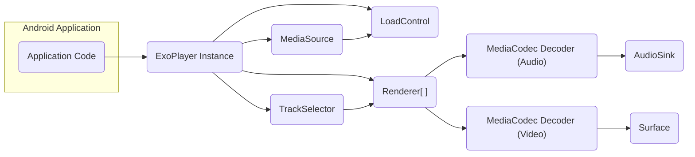
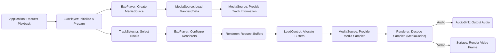

# Project Design Document: Google ExoPlayer

**Version:** 1.1
**Date:** October 26, 2023
**Prepared By:** AI Software Architect

## 1. Introduction

This document provides a detailed architectural design overview of the Google ExoPlayer project, intended for use in subsequent threat modeling activities. It outlines the key components, their interactions, and the flow of data within the system.

ExoPlayer is an open-source, application-level media player for Android, offering a flexible alternative to Android’s built-in MediaPlayer API. It supports playback of audio and video from local storage and over the internet, with advanced features like DASH and SmoothStreaming adaptive streaming not natively available in Android’s MediaPlayer.

## 2. Goals and Objectives

The primary goal of ExoPlayer is to empower Android developers with a versatile and customizable media playback library. Key objectives include:

*   Broad support for diverse media formats and streaming protocols.
*   Robust adaptive streaming capabilities (DASH, HLS, SmoothStreaming).
*   Extensibility and customization options for tailoring playback behavior.
*   Optimized performance and efficient resource utilization.
*   Seamless integration into Android applications.

## 3. Scope

This design document focuses on the core architectural elements and data flow during media playback within ExoPlayer. It covers the journey from media source loading to the rendering of audio and video. Specific areas included are:

*   The core player components and their interdependencies.
*   Mechanisms for loading and parsing various media formats.
*   Buffering strategies and data management techniques.
*   The pipelines for rendering audio and video content.
*   The integration points with the underlying Android media framework.

The following aspects are explicitly excluded from the scope of this document:

*   Detailed implementation of user interface elements or player controls.
*   In-depth specifics of Digital Rights Management (DRM) implementations (though DRM integration points will be mentioned).
*   Advanced or less common features like offline playback, media editing, or casting.
*   Low-level details of individual codec implementations.

## 4. High-Level Architecture

The following diagram illustrates the high-level architecture of ExoPlayer and its interaction with the application:

**Component Descriptions:**

*   **Application Code:** The part of the Android application that integrates and utilizes the ExoPlayer library to manage media playback.
*   **ExoPlayer Instance:** The central orchestrator of the playback process, responsible for managing state, coordinating components, and providing playback controls to the application.
*   **MediaSource:** An abstraction representing the media to be played. Different implementations handle various media formats and sources.
*   **LoadControl:** Manages the buffering process, deciding when to load more media data based on buffer levels and network conditions.
*   **Renderer[ ]:** An array of components responsible for processing media samples of specific types (audio, video, text, metadata).
*   **TrackSelector:**  Determines which tracks (e.g., audio language, video quality) from the available media will be rendered.
*   **MediaCodec Decoder (Audio):** Utilizes Android's `MediaCodec` API to decode audio streams.
*   **AudioSink:** Handles the output of decoded audio samples to the device's audio system.
*   **MediaCodec Decoder (Video):** Utilizes Android's `MediaCodec` API to decode video streams.
*   **Surface:** The Android `Surface` onto which decoded video frames are rendered.

## 5. Key Components and Their Interactions

This section provides a more detailed look at the key components and how they interact during a typical media playback scenario.

### 5.1. ExoPlayer Core

*   **Responsibilities:**
    *   Manages the overall playback lifecycle and state transitions (e.g., idle, buffering, ready, ended).
    *   Coordinates the interaction between `MediaSource`, `Renderer`s, `TrackSelector`, and `LoadControl`.
    *   Provides the public API for controlling playback actions (play, pause, seek, stop, etc.).
    *   Handles and propagates player events (e.g., playback state changes, errors, buffering updates) to the application.
    *   Manages error conditions and recovery attempts.
*   **Key Classes:**
    *   `SimpleExoPlayer`
    *   `ExoPlayer`
    *   `Player` (interface)

### 5.2. MediaSource

*   **Responsibilities:**
    *   Represents the media content to be played, abstracting away the underlying source.
    *   Loads and parses the media manifest (for adaptive streaming) or container format.
    *   Provides metadata about the media, such as available tracks and duration.
    *   Provides access to individual media streams (audio, video, text) through `MediaPeriod`s.
    *   Handles dynamic updates to the media content (e.g., for live streams).
*   **Implementations:**
    *   `ProgressiveMediaSource`: For single-file progressive download formats (e.g., MP3, MP4).
    *   `DashMediaSource`: For DASH (Dynamic Adaptive Streaming over HTTP) streams.
    *   `HlsMediaSource`: For HLS (HTTP Live Streaming) streams.
    *   `SsMediaSource`: For SmoothStreaming streams.
    *   `ConcatenatingMediaSource`: Allows playback of multiple `MediaSource`s in sequence.
    *   `ClippingMediaSource`: Enables playback of a specific segment of another `MediaSource`.

### 5.3. LoadControl

*   **Responsibilities:**
    *   Manages the media buffer, determining how much data to buffer ahead of the current playback position.
    *   Decides when to initiate and stop loading more media data from the `MediaSource`.
    *   Implements buffering strategies to optimize playback continuity and minimize rebuffering.
    *   Provides estimates of buffer levels and loading progress.
    *   Works in conjunction with the `TrackSelector` to facilitate adaptive bitrate switching based on network conditions and buffer status.
*   **Key Classes:**
    *   `DefaultLoadControl`
    *   `LoadControl` (interface)

### 5.4. Renderer

*   **Responsibilities:**
    *   Consumes media samples of a specific type (audio, video, text, metadata) provided by the `MediaSource`.
    *   Decodes compressed media samples using appropriate decoders, often leveraging Android's `MediaCodec` API.
    *   Processes and outputs the decoded samples to the appropriate sink (e.g., `AudioSink` for audio, `Surface` for video).
    *   Handles synchronization between different media streams (e.g., audio and video).
*   **Implementations:**
    *   `AudioRenderer`: Responsible for rendering audio.
    *   `VideoRenderer`: Responsible for rendering video.
    *   `TextRenderer`: Responsible for rendering subtitles or closed captions.
    *   `MetadataRenderer`: Responsible for processing associated metadata.

### 5.5. TrackSelector

*   **Responsibilities:**
    *   Selects the most appropriate tracks for rendering from the available options within the `MediaSource`.
    *   Considers factors like user preferences (e.g., preferred language), device capabilities, and network conditions.
    *   Implements adaptive bitrate streaming logic to dynamically switch between different quality levels of video and audio streams.
    *   Provides information about available tracks and the currently selected tracks to the application.
*   **Key Classes:**
    *   `DefaultTrackSelector`
    *   `TrackSelector` (abstract class)

### 5.6. MediaCodec

*   **Responsibilities:**
    *   Provides access to hardware and software-based media codecs for encoding and decoding audio and video streams.
    *   Decodes compressed audio and video data into raw, uncompressed samples that can be rendered.
*   **Interaction:** ExoPlayer interacts with `MediaCodec` through the Android `MediaCodec` API.

### 5.7. AudioSink

*   **Responsibilities:**
    *   Manages the output of decoded audio samples to the device's audio hardware.
    *   Handles audio processing effects (e.g., volume control, equalization).
    *   Manages audio focus and audio session attributes.
*   **Implementations:**
    *   `DefaultAudioSink`
    *   `AudioSink` (interface)

### 5.8. Surface

*   **Responsibilities:**
    *   Provides a buffer onto which decoded video frames can be rendered.
    *   Typically associated with a `SurfaceView` or `TextureView` within the application's user interface.

## 6. Data Flow

The following diagram illustrates the typical flow of media data during playback:

**Detailed Data Flow Description:**

1. **Application: Request Playback:** The Android application initiates media playback by providing a media URI or other relevant information to the `ExoPlayer` instance.
2. **ExoPlayer: Initialize & Prepare:** The `ExoPlayer` is initialized and prepared for playback. This involves creating and configuring necessary components.
3. **ExoPlayer: Create MediaSource:** Based on the provided media information, the appropriate `MediaSource` implementation is instantiated.
4. **MediaSource: Load Manifest/Data:** The `MediaSource` loads the media manifest (for adaptive streaming formats) or the media container (for progressive download formats) from the specified source (network or local storage).
5. **MediaSource: Provide Track Information:** The `MediaSource` parses the manifest or container and provides information about the available audio, video, and text tracks.
6. **TrackSelector: Select Tracks:** The `TrackSelector` analyzes the available tracks and selects the most suitable tracks for rendering based on predefined criteria and current conditions.
7. **ExoPlayer: Configure Renderers:** The `ExoPlayer` configures the `Renderer`s with the selected tracks, providing them with the necessary information to process the media.
8. **Renderer: Request Buffers:** The `Renderer`s request buffers from the `LoadControl` to store incoming media samples.
9. **LoadControl: Allocate Buffers:** The `LoadControl` manages the allocation and management of media buffers.
10. **MediaSource: Provide Media Samples:** The `MediaSource` reads and provides media samples (encoded audio and video data) to the `Renderer`s.
11. **Renderer: Decode Samples (MediaCodec):** The `Renderer`s utilize the `MediaCodec` API to decode the compressed audio and video samples into raw, uncompressed data.
12. **AudioSink: Output Audio:** The `AudioRenderer` outputs the decoded audio samples to the `AudioSink`, which then renders the audio through the device's audio system.
13. **Surface: Render Video Frame:** The `VideoRenderer` renders the decoded video frames onto the provided `Surface`, making the video visible on the display.

## 7. Security Considerations

This section outlines potential security considerations relevant for threat modeling:

*   **Data Sources and Network Communication:**
    *   **Threat:** Malicious actors could intercept or manipulate network traffic if HTTPS is not enforced, leading to playback of altered content or information leakage.
    *   **Mitigation:** Ensure all network communication for fetching media data and manifests utilizes HTTPS. Implement certificate pinning for added security.
    *   **Threat:** Server-side vulnerabilities in media hosting infrastructure could lead to serving malicious content.
    *   **Mitigation:** Implement robust server-side security measures and content validation.
*   **Local File Access:**
    *   **Threat:** If playing local files, insufficient file system permissions could allow unauthorized access to sensitive media files.
    *   **Mitigation:** Adhere to Android's best practices for file access permissions.
*   **Media Parsing and Processing:**
    *   **Threat:** Vulnerabilities in media parsers (within `MediaSource` implementations) could be exploited by serving maliciously crafted media files, potentially leading to denial-of-service or remote code execution.
    *   **Mitigation:** Regularly update ExoPlayer to benefit from security patches. Implement input validation and sanitization where possible. Consider using sandboxed processes for media parsing.
*   **DRM (Digital Rights Management):**
    *   **Threat:** Weak or improperly implemented DRM can be bypassed, leading to unauthorized content access and distribution.
    *   **Mitigation:** Utilize robust and well-vetted DRM solutions. Ensure secure key management and license acquisition processes. Adhere to platform-specific DRM best practices.
*   **Third-Party Libraries and Dependencies:**
    *   **Threat:** Security vulnerabilities in third-party libraries used by ExoPlayer could be exploited.
    *   **Mitigation:** Regularly audit and update dependencies. Utilize dependency management tools to identify and address known vulnerabilities.
*   **Application Integration:**
    *   **Threat:** Improper handling of user inputs (e.g., media URLs) within the application could lead to injection vulnerabilities.
    *   **Mitigation:** Sanitize and validate all user-provided input. Avoid directly using user input to construct media URLs without proper validation.
    *   **Threat:** Insecure storage of sensitive information like media URLs or API keys within the application's code or shared preferences.
    *   **Mitigation:** Utilize secure storage mechanisms provided by the Android platform (e.g., EncryptedSharedPreferences, Android Keystore).
*   **MediaCodec Interactions:**
    *   **Threat:** While less common, vulnerabilities in the underlying `MediaCodec` implementations could potentially be triggered by specific media content.
    *   **Mitigation:** Keep the Android system and associated media components updated.

## 8. Technologies Used

*   **Primary Programming Languages:** Java, Kotlin
*   **Android SDK:**  Leverages core Android framework APIs, including `MediaCodec`, `AudioTrack`, `Surface`, and networking components.
*   **Build System:** Gradle
*   **Networking Libraries:**  Relies on Android's built-in networking stack, potentially utilizing libraries like OkHttp or Cronet under the hood.

## 9. Future Considerations

This document provides a foundational understanding of the ExoPlayer architecture. Future enhancements to this document could include:

*   A more detailed breakdown of specific `MediaSource` implementations and their security implications.
*   A deeper dive into the design and implementation of DRM integration within ExoPlayer.
*   Analysis of advanced features such as offline playback mechanisms and casting protocols.
*   A comprehensive examination of error handling strategies and recovery procedures within the player.
*   Performance analysis and optimization techniques employed by ExoPlayer.

This improved design document offers a more detailed and security-aware perspective on the Google ExoPlayer architecture, providing a stronger basis for subsequent threat modeling efforts.
