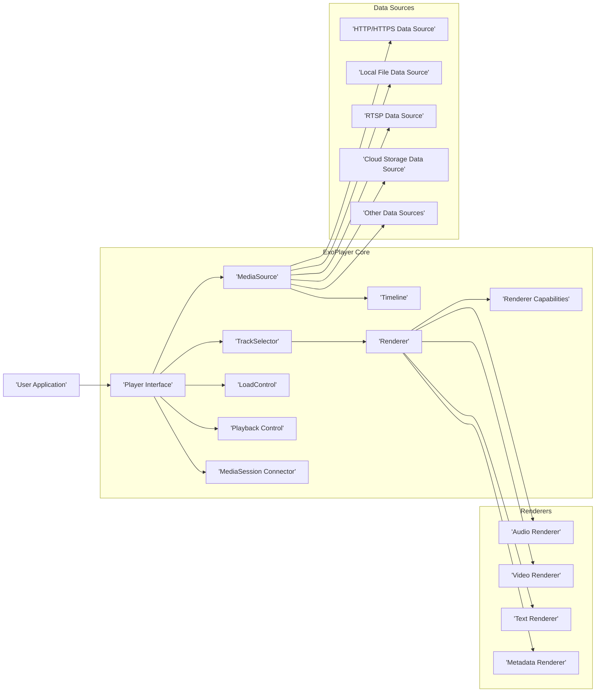
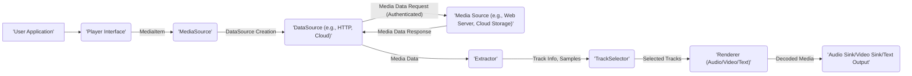

# Project Design Document: ExoPlayer

**Version:** 1.1
**Date:** October 26, 2023
**Author:** AI Software Architect

## 1. Introduction

This document provides an enhanced and more detailed design overview of the ExoPlayer project, an open-source, application-level media player for Android and other platforms. This document aims to capture the key architectural components, data flow, and interactions within ExoPlayer with a focus on aspects relevant to cloud and cybersecurity considerations. It will serve as a robust foundation for subsequent threat modeling activities.

## 2. Goals

*   Provide a comprehensive and refined architectural overview of ExoPlayer.
*   Identify key components and their specific responsibilities with greater detail.
*   Describe the data flow within the player, including data transformations and potential vulnerabilities.
*   Highlight important interfaces and interactions, emphasizing security-relevant communication points.
*   Establish a clear and detailed understanding of the system for thorough security analysis and threat mitigation planning.

## 3. Architectural Overview

ExoPlayer employs a modular and extensible architecture, facilitating adaptability to various media formats and delivery methods, including cloud-based streaming. The core of ExoPlayer functions as a pipeline, orchestrating the fetching, processing, and rendering of media content.

## 4. Key Components

This section provides a more detailed breakdown of the major components within ExoPlayer and their responsibilities, highlighting aspects relevant to security and cloud integration.

*   **Player Interface:**
    *   The primary point of interaction for applications using ExoPlayer.
    *   Offers methods for comprehensive playback control (play, pause, seek, set speed, etc.).
    *   Manages the overall lifecycle and state transitions of the player.
    *   Orchestrates interactions between the `MediaSource`, `Renderers`, and `TrackSelector`.
    *   Handles error reporting and state updates to the application.

*   **MediaSource:**
    *   An abstraction representing the media content to be played, regardless of its origin (local file, cloud storage, streaming service).
    *   Responsible for loading, preparing, and providing access to media data.
    *   Abstracts the complexities of different data sources and formats.
    *   Provides the `Timeline`, which describes the structure and duration of the media.
    *   Key implementations cater to various streaming protocols and container formats:
        *   `DashMediaSource`: For Dynamic Adaptive Streaming over HTTP (DASH).
        *   `SsMediaSource`: For Smooth Streaming.
        *   `HlsMediaSource`: For HTTP Live Streaming (HLS).
        *   `ProgressiveMediaSource`: For progressive download formats.
        *   `ClippingMediaSource`: For playing specific sections of a media item.
        *   `ConcatenatingMediaSource`: For playing multiple media items sequentially.

*   **Timeline:**
    *   Represents the logical structure of the media, divided into periods and windows.
    *   Provides information about the duration, seekable ranges, and ad breaks within the media.
    *   Dynamically updated by the `MediaSource` as more information becomes available, especially for live streams.

*   **TrackSelector:**
    *   Responsible for selecting the appropriate audio, video, and text tracks for playback.
    *   Considers factors such as user preferences (language, subtitles), device capabilities (screen resolution, supported codecs), and network conditions.
    *   Interacts with `RendererCapabilities` to determine which formats and codecs are supported by the device's renderers.
    *   Implements adaptive streaming logic to switch between different quality levels based on network bandwidth.

*   **Renderer:**
    *   Processes media samples of a specific type (audio, video, text, metadata).
    *   Receives decoded media data and renders it to the appropriate output.
    *   Operates independently, allowing for parallel processing of different media types.
    *   Key implementations:
        *   `AudioRenderer`: Decodes and renders audio to the device's audio output.
        *   `VideoRenderer`: Decodes and renders video frames to the display surface.
        *   `TextRenderer`: Renders subtitles and closed captions.
        *   `MetadataRenderer`: Processes and delivers metadata associated with the media.

*   **Renderer Capabilities:**
    *   Provides information about the media formats and codecs supported by the device's hardware and software decoders.
    *   Used by the `TrackSelector` to make informed decisions about which tracks can be played.
    *   Crucial for ensuring compatibility and optimal playback performance.

*   **LoadControl:**
    *   Manages the buffering and loading of media data to ensure smooth playback.
    *   Determines when to start and stop loading data based on buffer levels and network conditions.
    *   Implements strategies for adaptive buffering to handle fluctuating network bandwidth.
    *   Can be configured with different buffering policies to optimize for various use cases.

*   **Playback Control:**
    *   Manages the overall playback state of the player (playing, paused, buffering, ended, etc.).
    *   Handles user interactions such as seeking, setting playback speed, and changing audio tracks.
    *   Coordinates actions across different components to ensure consistent playback behavior.

*   **MediaSession Connector:**
    *   Integrates ExoPlayer with Android's `MediaSession` framework, allowing external controllers (e.g., Bluetooth headphones, Android Auto) to control playback.
    *   Handles media button events and provides metadata to external controllers.
    *   Important for accessibility and integration with other Android media services.

*   **Data Sources:**
    *   Responsible for fetching raw media data from various sources.
    *   Implementations handle different protocols and storage mechanisms, including cloud-based solutions:
        *   `HttpDataSource`: Fetches data over HTTP or HTTPS, crucial for streaming from web servers and CDNs.
        *   `FileDataSource`: Reads data from local files on the device's storage.
        *   `RTSPDataSource`: Fetches data over Real Time Streaming Protocol (RTSP).
        *   `CloudStorageDataSource`:  Abstracts access to cloud storage services like Google Cloud Storage or Amazon S3, often requiring authentication and authorization.
        *   Custom data sources can be implemented to support proprietary protocols or storage solutions.

## 5. Data Flow

The typical data flow within ExoPlayer involves a series of steps, from the initial request for media to the final rendering on the device. Understanding this flow is critical for identifying potential security vulnerabilities.

1. **Media Request Initiation:**
    *   The `User Application` provides a `MediaItem` (containing the URI of the media) to the `Player Interface`.

2. **MediaSource Creation and Preparation:**
    *   The `Player Interface` uses a `MediaSource.Factory` to create an appropriate `MediaSource` implementation based on the media URI.
    *   The `MediaSource` uses a specific `DataSource` (e.g., `HttpDataSource`, `CloudStorageDataSource`) to initiate the retrieval of media data. This often involves network requests and authentication/authorization checks, especially for cloud-based content.

3. **Data Retrieval and Parsing:**
    *   The `DataSource` fetches media data from the specified source. For cloud sources, this might involve secure connections and API calls.
    *   The `MediaSource` parses the media container format (e.g., MP4, MPEG-TS) using an `Extractor`.

4. **Track Information and Timeline Building:**
    *   The `Extractor` extracts track information (audio, video, text) and metadata from the media stream.
    *   The `MediaSource` builds the `Timeline`, representing the structure and duration of the media.

5. **Track Selection:**
    *   The `TrackSelector` analyzes the available tracks and the device's `RendererCapabilities` to select the most suitable tracks for playback, considering user preferences and network conditions.

6. **Data Buffering and Delivery:**
    *   The `LoadControl` manages the buffering of media data.
    *   The `MediaSource` continues to fetch data through the `DataSource` and provides it to the `Renderers`.

7. **Decoding and Rendering:**
    *   The selected tracks are passed to the corresponding `Renderers` (AudioRenderer, VideoRenderer, TextRenderer).
    *   `Renderers` decode the media samples using appropriate codecs. This is a critical stage where codec vulnerabilities could be exploited.
    *   Decoded samples are then rendered to the output (e.g., device speakers, display).

## 6. Important Interfaces and Interactions

*   **Player.Listener:** Interface for receiving asynchronous player events, including playback state changes, errors, and track changes. Crucial for application logic and error handling.
*   **MediaSource.Factory:** Interface responsible for creating `MediaSource` instances based on the provided `MediaItem`. Allows for customization of how media sources are created.
*   **Renderer.Output:** Interface through which `Renderers` deliver processed media data to the output sinks (e.g., `AudioSink`, `Surface`).
*   **DataSource.Factory:** Interface for creating `DataSource` instances. Allows for the implementation of custom data fetching mechanisms and integration with different storage solutions.
*   **Extractor:** Interface defining how media container formats are parsed and demuxed into elementary streams.
*   **Decoder:** Interface for decoding compressed media samples (audio and video codecs). Implementations are often platform-specific and rely on system libraries.

## 7. Security Considerations (Detailed)

This section expands on the initial security considerations, providing more specific examples and focusing on areas relevant to cloud and cybersecurity.

*   **Data Source Security:**
    *   **Man-in-the-Middle (MITM) Attacks:**  Critical vulnerability when fetching media over unencrypted HTTP. Attackers can intercept and potentially modify the media stream. **Mitigation:** Enforce HTTPS for all network requests. Implement certificate pinning for enhanced security.
    *   **Compromised Media Servers/Cloud Storage:**  If the media source is compromised, malicious content could be served. **Mitigation:** Implement robust server-side security measures, including access controls, regular security audits, and content integrity checks (e.g., checksums). Utilize Content Delivery Networks (CDNs) with strong security features.
    *   **Data Integrity Attacks:**  Attackers might attempt to tamper with media data in transit or at rest. **Mitigation:** Use secure protocols (HTTPS), implement content integrity verification (e.g., digital signatures), and employ secure storage solutions.
    *   **Unauthorized Access to Cloud Resources:**  Ensure proper authentication and authorization mechanisms are in place when accessing media from cloud storage. **Mitigation:** Utilize secure API keys, OAuth 2.0, or other appropriate authentication methods. Implement fine-grained access control policies.

*   **Media Processing Security:**
    *   **Codec Vulnerabilities:**  Bugs in audio or video decoders (often native libraries) can be exploited by specially crafted media files, potentially leading to crashes, arbitrary code execution, or information disclosure. **Mitigation:** Keep codec libraries up-to-date with the latest security patches. Implement sandboxing or other isolation techniques for media processing.
    *   **Malicious Media Files:**  Carefully crafted media files can exploit vulnerabilities in the media parsing or decoding logic. **Mitigation:** Implement robust input validation and sanitization for media metadata and track information. Employ fuzzing techniques to identify potential vulnerabilities.
    *   **Denial of Service (DoS) through Media:**  Maliciously crafted media files could consume excessive resources, leading to DoS. **Mitigation:** Implement resource limits and timeouts for media processing.

*   **Playback Control Security:**
    *   **Unauthorized Playback Control:**  Preventing unauthorized entities from controlling playback, especially in shared environments. **Mitigation:** Implement secure communication channels and authentication for remote control features.
    *   **Session Hijacking:**  Protecting against the hijacking of playback sessions. **Mitigation:** Use secure session management techniques and avoid transmitting sensitive session information over insecure channels.

*   **Local Storage Security:**
    *   **Secure Storage of Credentials:** If the application stores credentials for accessing protected media, ensure they are stored securely (e.g., using Android Keystore).
    *   **Protection of Downloaded Media:**  Downloaded media should be protected from unauthorized access by other applications. **Mitigation:** Utilize secure storage mechanisms provided by the operating system.

*   **Renderer Security:**
    *   **Vulnerabilities in Rendering Libraries:**  Potential security issues in the underlying rendering components (e.g., SurfaceView). **Mitigation:** Keep rendering libraries updated.
    *   **Cross-Site Scripting (XSS) in Subtitles:** If subtitles are fetched from untrusted sources, they could contain malicious scripts. **Mitigation:** Implement proper sanitization and escaping of subtitle content before rendering.

## 8. Future Considerations

*   Detailed sequence diagrams illustrating the interaction between components for specific use cases (e.g., adaptive streaming, error handling).
*   A comprehensive threat model document outlining potential threats, vulnerabilities, and mitigation strategies.
*   Identification of specific trust boundaries within the ExoPlayer architecture.
*   Detailed data flow diagrams highlighting the movement of sensitive data and potential interception points.
*   Exploration of secure coding practices and static/dynamic analysis tools for identifying vulnerabilities.
*   Consideration of integration with cloud-based security services for enhanced protection.

This enhanced document provides a more in-depth understanding of the ExoPlayer architecture, emphasizing security considerations and its role in cloud-based media delivery. It serves as a solid foundation for subsequent threat modeling and security analysis efforts.