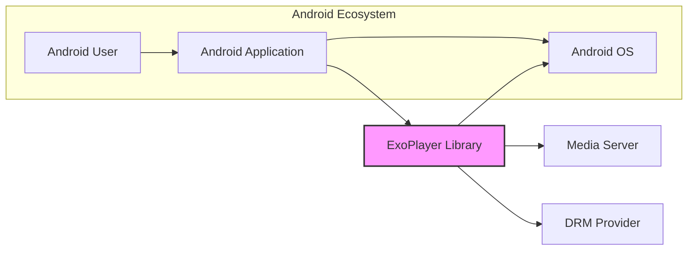

# BUSINESS POSTURE

The ExoPlayer project is an open-source media player library for Android. Its primary business goal is to provide a flexible, extensible, and feature-rich alternative to Android's MediaPlayer API.  It aims to empower Android developers to build robust media playback experiences in their applications, supporting a wide range of audio and video formats and streaming protocols.

Business priorities for ExoPlayer include:
- Feature completeness: Supporting a wide array of media formats, streaming protocols, and playback features (e.g., adaptive streaming, DRM, subtitles).
- Performance and efficiency: Ensuring smooth and efficient playback across a range of Android devices.
- Extensibility and customization: Allowing developers to customize and extend the player to meet specific application needs.
- Community adoption: Fostering a strong community of users and contributors to ensure the library remains actively maintained and improved.

Key business risks associated with ExoPlayer include:
- Software defects: Bugs in the library could lead to application crashes, poor user experience, and negative perception of applications using ExoPlayer.
- Security vulnerabilities: Security flaws in ExoPlayer could be exploited by malicious media content, potentially leading to device compromise or data breaches in applications using the library. This is a significant risk as media players process untrusted data.
- Compatibility issues: Incompatibility with certain Android devices or versions could limit the reach and usability of applications using ExoPlayer.
- Licensing and legal risks:  Dependencies or included components might have licensing restrictions that could impact the usage and distribution of ExoPlayer and applications using it.

# SECURITY POSTURE

security control: Use of GitHub for source code management, providing version control and transparency. Implemented: GitHub repository.
security control: Open-source project, allowing for community security review. Implemented: GitHub repository, open development model.
security control: Google's involvement and maintenance, suggesting internal security practices and reviews are likely in place. Implemented: Google's development processes.

accepted risk:  Being a media player library, ExoPlayer inherently processes untrusted media content from various sources. The risk of encountering malicious or malformed media that could exploit vulnerabilities is always present.
accepted risk:  Reliance on underlying Android platform security. Vulnerabilities in the Android OS or media frameworks could indirectly affect ExoPlayer.

recommended security control: Implement automated security scanning tools in the CI/CD pipeline, including SAST (Static Application Security Testing) and dependency vulnerability scanning.
recommended security control: Conduct regular security audits and penetration testing, focusing on media parsing and playback functionalities.
recommended security control: Implement fuzzing techniques to test media parsing robustness against malformed or malicious media files.
recommended security control:  Maintain a security vulnerability disclosure and response process to handle reported security issues effectively.

Security Requirements:

Authentication:
- Not directly applicable to ExoPlayer library itself. Authentication is the responsibility of the application using ExoPlayer to secure access to media sources if needed.

Authorization:
- Not directly applicable to ExoPlayer library itself. Authorization for accessing media content is the responsibility of the application using ExoPlayer. ExoPlayer should respect authorization decisions made by the application.

Input Validation:
- Critical for ExoPlayer.  ExoPlayer must perform robust input validation on all media data it processes to prevent vulnerabilities like buffer overflows, format string bugs, and other memory corruption issues. This includes validating media container formats, codecs, and metadata.
- Input validation should be applied at all stages of media processing, from parsing the container format to decoding individual media samples.

Cryptography:
- Relevant for DRM (Digital Rights Management) and secure streaming protocols (e.g., HLS with encryption, DASH with encryption).
- ExoPlayer should correctly implement and utilize cryptographic libraries and APIs provided by the Android platform for DRM and secure streaming.
- Ensure proper handling of encryption keys and secure key storage mechanisms as per DRM provider requirements.
- For secure streaming, ensure proper implementation of TLS/HTTPS for communication with media servers.

# DESIGN

## C4 CONTEXT



Context Diagram Elements:

- Element:
  - Name: Android User
  - Type: Person
  - Description: End-user of an Android application that utilizes ExoPlayer for media playback.
  - Responsibilities:  Interacts with the Android application to play media content.
  - Security controls: User device security (device lock, malware protection), application permissions.

- Element:
  - Name: Android Application
  - Type: Software System
  - Description: An Android application developed by a third-party developer that integrates the ExoPlayer library to provide media playback functionality.
  - Responsibilities:  Manages user interaction, media content selection, authorization (if needed), integrates ExoPlayer for playback, handles application-level security.
  - Security controls: Application-level authentication and authorization, secure data storage, input validation of user inputs, secure communication with backend services.

- Element:
  - Name: Android OS
  - Type: Software System
  - Description: The Android Operating System, providing the runtime environment, system services, and platform APIs for Android applications and ExoPlayer.
  - Responsibilities:  Provides core OS functionalities, manages hardware resources, enforces security policies, provides media framework APIs used by ExoPlayer.
  - Security controls:  Operating system security features (sandboxing, permissions, SELinux), kernel security, secure boot, regular security updates.

- Element:
  - Name: ExoPlayer Library
  - Type: Software System
  - Description: The ExoPlayer media player library, providing the core media playback engine.
  - Responsibilities:  Media parsing, decoding, rendering, adaptive streaming, DRM handling, subtitle rendering, audio and video output.
  - Security controls: Input validation of media data, secure handling of DRM keys, secure communication for streaming protocols, protection against memory corruption vulnerabilities.

- Element:
  - Name: Media Server
  - Type: External System
  - Description:  Servers hosting media content (audio and video files, streaming manifests). Can be CDNs, cloud storage, or application backend servers.
  - Responsibilities:  Storing and serving media content, handling media streaming requests.
  - Security controls: Access controls, authentication and authorization for content access, TLS/HTTPS for secure content delivery, DDoS protection.

- Element:
  - Name: DRM Provider
  - Type: External System
  - Description:  Third-party service providing Digital Rights Management (DRM) licenses and key management for protected media content.
  - Responsibilities:  Issuing DRM licenses, managing encryption keys, enforcing content usage policies.
  - Security controls: Secure license issuance and delivery, key management, access control, secure communication with DRM clients (ExoPlayer).

## C4 CONTAINER

```mermaid
graph LR
    subgraph "Android Application"
        A[Application UI]
        B[Application Logic]
        C[ExoPlayer Integration]
    end
    D[ExoPlayer Library]
    E[Android Media APIs]
    F[Native Code (C/C++)]

    A --> B
    B --> C
    C --> D
    D --> E
    D --> F
    E --> C
    F --> E

    style D fill:#f9f,stroke:#333,stroke-width:2px
```

Container Diagram Elements:

- Element:
  - Name: Application UI
  - Type: Container - Application Component
  - Description:  The user interface components of the Android application, responsible for user interaction and displaying media playback controls and information.
  - Responsibilities:  Handling user input, displaying playback UI, communicating user actions to application logic.
  - Security controls: Input validation of user inputs, protection against UI-based vulnerabilities (e.g., XSS if displaying web content).

- Element:
  - Name: Application Logic
  - Type: Container - Application Component
  - Description:  The core application logic, managing media content selection, business logic, communication with backend services, and integration with ExoPlayer.
  - Responsibilities:  Content management, business rules, network communication, orchestrating media playback using ExoPlayer.
  - Security controls: Application-level authentication and authorization, secure data storage, input validation, secure communication with backend services.

- Element:
  - Name: ExoPlayer Integration
  - Type: Container - Application Component
  - Description:  The application code that specifically interacts with the ExoPlayer library, configuring player instances, handling playback events, and managing media sources.
  - Responsibilities:  Initializing and configuring ExoPlayer, providing media sources, handling playback events, managing player lifecycle.
  - Security controls: Proper configuration of ExoPlayer security settings (e.g., network security configuration), secure handling of media source URLs and DRM parameters.

- Element:
  - Name: ExoPlayer Library
  - Type: Container - Library
  - Description:  The ExoPlayer library itself, written primarily in Java/Kotlin, providing the high-level media player API and core playback logic.
  - Responsibilities:  Providing media player API, managing playback state, orchestrating media processing pipeline.
  - Security controls:  Input validation, secure coding practices, memory safety, vulnerability management.

- Element:
  - Name: Android Media APIs
  - Type: Container - System API
  - Description:  Android platform media APIs (e.g., MediaCodec, AudioTrack, MediaDrm) used by ExoPlayer to interact with the underlying media framework.
  - Responsibilities:  Providing low-level media decoding, rendering, and DRM functionalities.
  - Security controls:  Android OS security controls, platform API security, regular security updates from Android.

- Element:
  - Name: Native Code (C/C++)
  - Type: Container - Native Component
  - Description:  Native C/C++ components used by ExoPlayer for performance-critical tasks like media decoding and DRM handling. These components are often part of the Android platform or bundled with ExoPlayer.
  - Responsibilities:  High-performance media decoding, DRM processing, low-level media operations.
  - Security controls: Memory safety in native code, input validation in native components, secure compilation practices, regular security updates for native libraries.

## DEPLOYMENT

Deployment Scenario: Android Application Distribution via Google Play Store

```mermaid
graph LR
    subgraph "Developer Environment"
        A[Developer Workstation]
        B[Code Repository (GitHub)]
        C[CI/CD System (GitHub Actions)]
        D[Build Artifacts]
    end
    subgraph "Google Play Store"
        E[Google Play Store]
    end
    subgraph "Android Device"
        F[Android Device]
        G[Installed Application]
        H[ExoPlayer Library (within App)]
    end

    A --> B
    B --> C
    C --> D
    D --> E
    E --> F
    F --> G
    G --> H

    style F fill:#ccf,stroke:#333,stroke-width:2px
    style H fill:#f9f,stroke:#333,stroke-width:2px
```

Deployment Diagram Elements:

- Element:
  - Name: Developer Workstation
  - Type: Infrastructure - Workstation
  - Description:  Developer's local machine used for writing code, building, and testing the Android application.
  - Responsibilities:  Code development, local testing, committing code to repository.
  - Security controls:  Developer workstation security (OS security, antivirus, access controls), code review practices.

- Element:
  - Name: Code Repository (GitHub)
  - Type: Infrastructure - Cloud Service
  - Description:  GitHub repository hosting the source code of the Android application and ExoPlayer (as a dependency).
  - Responsibilities:  Version control, source code management, collaboration, code review.
  - Security controls:  GitHub access controls, branch protection, audit logs, vulnerability scanning for dependencies.

- Element:
  - Name: CI/CD System (GitHub Actions)
  - Type: Infrastructure - Cloud Service
  - Description:  GitHub Actions used for automated building, testing, and deployment of the Android application.
  - Responsibilities:  Automated build process, running tests, creating release artifacts, publishing to Google Play Store.
  - Security controls:  Secure CI/CD pipeline configuration, access controls, secret management, build artifact signing.

- Element:
  - Name: Build Artifacts
  - Type: Artifact - File System
  - Description:  Output of the build process, typically an APK (Android Package Kit) file containing the Android application and integrated ExoPlayer library.
  - Responsibilities:  Packaging the application and dependencies for distribution.
  - Security controls:  Code signing of APK, integrity checks, secure storage of build artifacts.

- Element:
  - Name: Google Play Store
  - Type: Infrastructure - Cloud Service
  - Description:  Google's official app store for Android, used for distributing Android applications to end-users.
  - Responsibilities:  App distribution, app discovery, app updates, security scanning of uploaded apps.
  - Security controls:  Google Play Protect (malware scanning), app signing verification, developer account security.

- Element:
  - Name: Android Device
  - Type: Infrastructure - Mobile Device
  - Description:  End-user's Android mobile device where the application is installed and run.
  - Responsibilities:  Running the Android application, executing ExoPlayer library, media playback.
  - Security controls:  Android OS security features, device security settings, user-installed security applications.

- Element:
  - Name: Installed Application
  - Type: Software System - Application Instance
  - Description:  Instance of the Android application installed on the Android device, including the integrated ExoPlayer library.
  - Responsibilities:  Providing media playback functionality to the user on the device.
  - Security controls:  Application-level security controls, permissions requested by the application, sandboxing by Android OS.

- Element:
  - Name: ExoPlayer Library (within App)
  - Type: Software System - Library Instance
  - Description:  Instance of the ExoPlayer library running within the installed Android application on the device.
  - Responsibilities:  Media playback within the application context.
  - Security controls:  Inherited security context of the application, input validation, memory safety.

## BUILD

```mermaid
graph LR
    A[Developer] --> B{Code Changes};
    B --> C[Code Repository (GitHub)];
    C --> D[CI/CD System (GitHub Actions)];
    D --> E{Build Process};
    E --> F{Unit Tests};
    F --> G{SAST Scanning};
    G --> H{Dependency Scanning};
    H --> I[Build Artifacts];

    style I fill:#eee,stroke:#333,stroke-width:2px
```

Build Process Description:

1. Developer: Developers write code and make changes to the ExoPlayer codebase.
2. Code Changes: Code modifications are made by developers.
3. Code Repository (GitHub): Changes are committed and pushed to the GitHub repository.
4. CI/CD System (GitHub Actions): GitHub Actions is triggered by code changes in the repository.
5. Build Process: The CI/CD system executes the build process, compiling the code, and packaging the library.
6. Unit Tests: Automated unit tests are executed to verify code functionality.
7. SAST Scanning: Static Application Security Testing (SAST) tools are used to scan the codebase for potential security vulnerabilities.
8. Dependency Scanning: Dependency scanning tools check for known vulnerabilities in third-party libraries used by ExoPlayer.
9. Build Artifacts:  If all checks pass, build artifacts (e.g., AAR files for Android) are generated and published.

Build Security Controls:

- security control: Automated build process using CI/CD (GitHub Actions) to ensure consistent and repeatable builds. Implemented: GitHub Actions workflows.
- security control: Unit tests to verify code functionality and prevent regressions. Implemented: JUnit tests in the codebase, executed in CI.
- security control: Static Application Security Testing (SAST) to identify potential security vulnerabilities in the code. Recommended: Integrate SAST tools into the CI pipeline.
- security control: Dependency scanning to detect known vulnerabilities in third-party dependencies. Recommended: Integrate dependency scanning tools (e.g., Dependabot, OWASP Dependency-Check) into the CI pipeline.
- security control: Code signing of build artifacts to ensure integrity and authenticity. Implemented:  Likely using standard Android signing mechanisms for AAR releases.
- security control: Access control to the CI/CD system and build artifacts to prevent unauthorized modifications. Implemented: GitHub Actions access controls, repository permissions.
- security control: Secure storage of build artifacts. Implemented: GitHub Releases, artifact repositories.

# RISK ASSESSMENT

Critical Business Processes:
- Providing a reliable and secure media playback library for Android developers.
- Maintaining the reputation and trustworthiness of the ExoPlayer project.
- Ensuring continued adoption and contribution to the open-source project.

Data to Protect:
- Source code of ExoPlayer: Sensitivity: High. Confidentiality and integrity are crucial to prevent unauthorized modifications or exposure of vulnerabilities.
- Build artifacts (AAR files): Sensitivity: Medium. Integrity is important to ensure users download and use genuine, untampered libraries.
- Developer credentials and secrets used in the build process: Sensitivity: High. Confidentiality is essential to prevent unauthorized access to build and release processes.
- Project infrastructure (GitHub repository, CI/CD configuration): Sensitivity: Medium. Integrity and availability are important for project continuity and security.

Data Sensitivity Levels:
- High: Source code, developer credentials, signing keys.
- Medium: Build artifacts, project infrastructure configuration.
- Low: Public documentation, website content.

# QUESTIONS & ASSUMPTIONS

BUSINESS POSTURE:
- Assumption: The primary business goal is to provide a high-quality, open-source media player library for Android, prioritizing functionality, performance, and community adoption.
- Question: What are the specific target use cases and industries for ExoPlayer? Are there any specific regulatory compliance requirements (e.g., GDPR, HIPAA) that need to be considered?
- Question: What is the acceptable level of risk for security vulnerabilities in ExoPlayer? Is there a formal risk appetite statement?

SECURITY POSTURE:
- Assumption: Basic security practices are followed in the development process, but there might be room for improvement in areas like automated security testing and formal security audits.
- Question: Are there existing security policies and procedures for the ExoPlayer project?
- Question: Is there a dedicated security team or individual responsible for security aspects of ExoPlayer?
- Question: What is the process for handling security vulnerability reports? Is there a security contact or public disclosure policy?

DESIGN:
- Assumption: ExoPlayer has a modular design with clear separation of concerns between different components (e.g., renderers, decoders, DRM).
- Question: Is there detailed design documentation available for ExoPlayer's internal architecture and components?
- Question: What are the key dependencies of ExoPlayer, and are there any known security concerns associated with them?
- Question: What are the performance and scalability requirements for ExoPlayer, and how are these considered in the design?