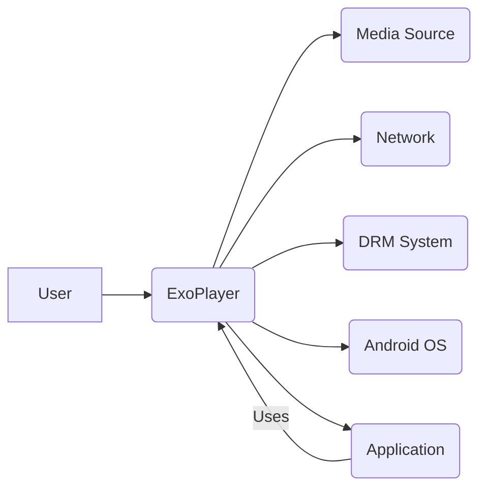
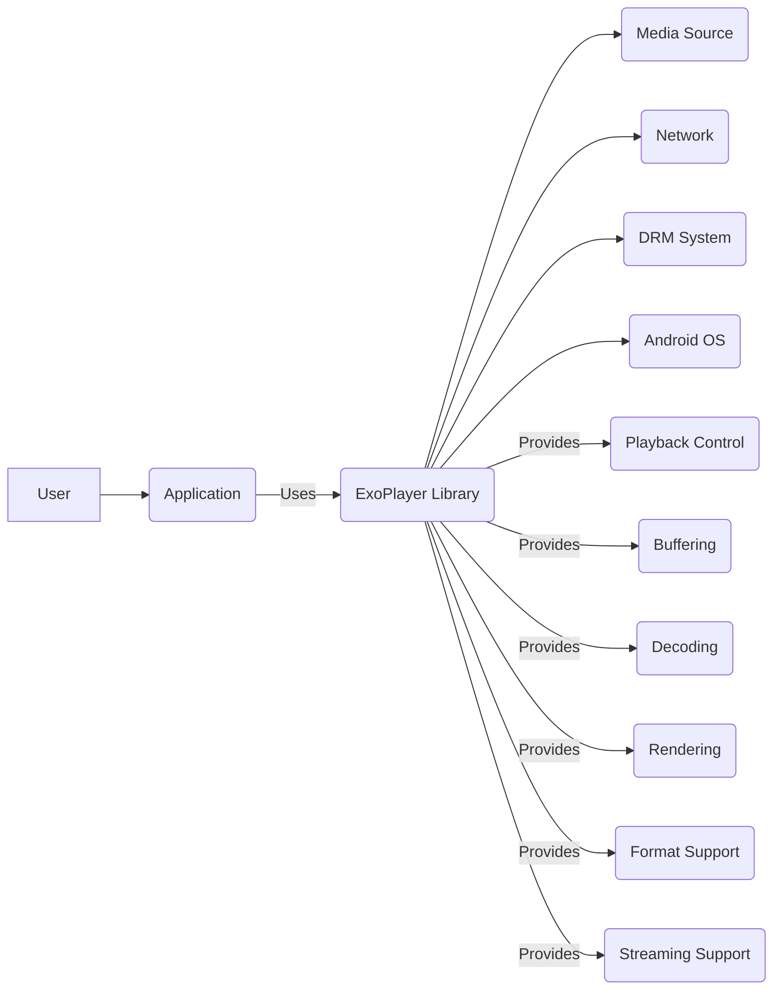
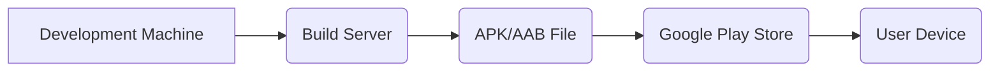
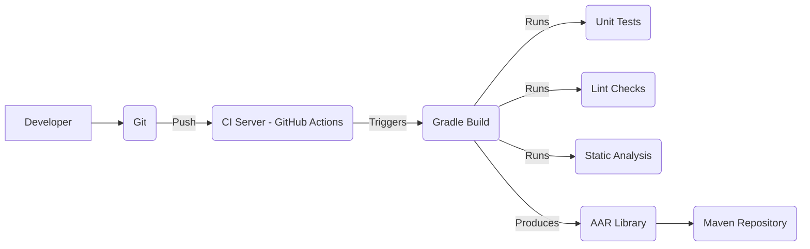

# BUSINESS POSTURE

ExoPlayer is a Google-maintained open-source project. It's widely used in many Android applications, including some of Google's own. The primary business goals are:

*   Provide a robust, feature-rich, and customizable media playback solution for Android developers.
*   Maintain a high level of performance and efficiency to ensure smooth playback even on low-end devices.
*   Support a wide range of media formats and streaming protocols.
*   Offer an extensible architecture that allows developers to customize and extend the player's functionality.
*   Keep the library up-to-date with the latest Android media APIs and best practices.
*   Maintain a strong open-source community and encourage contributions.

Business priorities:

*   Wide adoption: Maximize the number of applications using ExoPlayer.
*   Developer satisfaction: Provide a positive developer experience.
*   Performance and reliability: Ensure high-quality playback across a wide range of devices and network conditions.
*   Maintainability: Keep the codebase clean, well-documented, and easy to maintain.
*   Extensibility: Allow for easy customization and extension.

Most important business risks:

*   Security vulnerabilities: Exploitable vulnerabilities in ExoPlayer could compromise user data or device security, leading to reputational damage and potential legal liabilities.
*   Performance issues: Poor performance or excessive battery drain could lead to negative user reviews and app uninstalls.
*   Compatibility problems: Incompatibility with certain devices or media formats could limit adoption and user satisfaction.
*   Lack of adoption: If developers choose alternative media players, the project's long-term viability could be threatened.
*   Community disengagement: A decline in community contributions could slow down development and innovation.

# SECURITY POSTURE

Existing security controls:

*   security control: Code reviews: All code changes undergo a review process. (Described in the contribution guidelines).
*   security control: Static analysis: The project likely uses static analysis tools to identify potential security vulnerabilities. (Inferred from Google's general development practices).
*   security control: Fuzz testing: ExoPlayer uses fuzz testing to find potential vulnerabilities. (Mentioned in the documentation and visible in the codebase).
*   security control: Regular updates: The project is actively maintained, and updates are released regularly to address bugs and security vulnerabilities. (Visible from the release history).
*   security control: Secure coding practices: The project follows secure coding practices to minimize the risk of vulnerabilities. (Inferred from Google's general development practices).
*   security control: Dependency management: Dependencies are carefully managed and updated to address known vulnerabilities. (Inferred from Google's general development practices and visible in build files).
*   security control: Content Security Policy (CSP): If used within a web context, CSP can help mitigate XSS attacks. (Not directly applicable to the core ExoPlayer library, but relevant for web-based integrations).

Accepted risks:

*   accepted risk: Third-party libraries: ExoPlayer relies on third-party libraries, which may contain vulnerabilities. While efforts are made to keep these libraries up-to-date, there is always a risk associated with using external code.
*   accepted risk: Complex codebase: The codebase is large and complex, making it challenging to ensure that all potential vulnerabilities are identified and addressed.
*   accepted risk: Evolving threat landscape: New vulnerabilities and attack vectors are constantly emerging, requiring ongoing vigilance and updates.

Recommended security controls:

*   security control: Dynamic Application Security Testing (DAST): Implement DAST to complement SAST and fuzzing.
*   security control: Software Composition Analysis (SCA): Use SCA tools to automatically track and manage third-party dependencies and their associated vulnerabilities.
*   security control: Penetration testing: Conduct regular penetration testing to identify vulnerabilities that may be missed by other security controls.
*   security control: Security training: Provide regular security training to developers working on the project.

Security requirements:

*   Authentication: Not directly applicable to the core ExoPlayer library, as it primarily deals with media playback. Authentication is typically handled at the application level or by the content provider.
*   Authorization: If ExoPlayer is used to access protected content, it should support relevant authorization mechanisms, such as DRM (Digital Rights Management) systems and token-based authentication.
*   Input validation: ExoPlayer must thoroughly validate all input, including media data, manifest files, and user-provided parameters, to prevent vulnerabilities such as buffer overflows, format string bugs, and injection attacks.
*   Cryptography: ExoPlayer should use strong cryptographic algorithms and protocols to protect sensitive data, such as DRM keys and user credentials. It should also support secure transport protocols like HTTPS.

# DESIGN

## C4 CONTEXT

Element descriptions:

*   Element:
    *   Name: User
    *   Type: Person
    *   Description: A person who interacts with an application that uses ExoPlayer to play media.
    *   Responsibilities: Initiates media playback, interacts with playback controls.
    *   Security controls: None (handled by the application).

*   Element:
    *   Name: ExoPlayer
    *   Type: Software System
    *   Description: An application-level media player for Android.
    *   Responsibilities: Handles media buffering, decoding, rendering, and playback control. Supports various media formats and streaming protocols.
    *   Security controls: Code reviews, static analysis, fuzz testing, regular updates, secure coding practices, dependency management.

*   Element:
    *   Name: Media Source
    *   Type: External System
    *   Description: A source of media data, such as a local file or a remote server.
    *   Responsibilities: Provides media data to ExoPlayer.
    *   Security controls: Depends on the specific media source (e.g., HTTPS for remote servers).

*   Element:
    *   Name: Network
    *   Type: External System
    *   Description: The network connection used to access remote media sources.
    *   Responsibilities: Transports media data from the source to the device.
    *   Security controls: Network security protocols (e.g., TLS/SSL).

*   Element:
    *   Name: DRM System
    *   Type: External System
    *   Description: A Digital Rights Management system used to protect copyrighted content.
    *   Responsibilities: Provides decryption keys and licenses for protected content.
    *   Security controls: Secure key management, secure communication protocols.

*   Element:
    *   Name: Android OS
    *   Type: External System
    *   Description: The Android operating system.
    *   Responsibilities: Provides the underlying platform and APIs for ExoPlayer.
    *   Security controls: Android security features (e.g., sandboxing, permissions).

*   Element:
    *   Name: Application
    *   Type: Software System
    *   Description: The Android application that integrates and utilizes ExoPlayer.
    *   Responsibilities: Manages the user interface, interacts with ExoPlayer, and handles application-specific logic.
    *   Security controls: Application-specific security measures.

## C4 CONTAINER

Element descriptions:

*   Element:
    *   Name: User
    *   Type: Person
    *   Description: A person interacting with the application.
    *   Responsibilities: Initiates playback, interacts with UI.
    *   Security controls: None (handled by the application).

*   Element:
    *   Name: Application
    *   Type: Container
    *   Description: The Android application using ExoPlayer.
    *   Responsibilities: UI, application logic, ExoPlayer integration.
    *   Security controls: Application-level security.

*   Element:
    *   Name: ExoPlayer Library
    *   Type: Container
    *   Description: The core ExoPlayer library.
    *   Responsibilities: Media playback, format support, streaming.
    *   Security controls: Code reviews, SAST, fuzzing, updates.

*   Element:
    *   Name: Media Source
    *   Type: External System
    *   Description: Source of media data.
    *   Responsibilities: Provides media data.
    *   Security controls: Source-specific (e.g., HTTPS).

*   Element:
    *   Name: Network
    *   Type: External System
    *   Description: Network connection.
    *   Responsibilities: Transports data.
    *   Security controls: Network security protocols.

*   Element:
    *   Name: DRM System
    *   Type: External System
    *   Description: Digital Rights Management system.
    *   Responsibilities: Decryption keys, licenses.
    *   Security controls: Secure key management.

*   Element:
    *   Name: Android OS
    *   Type: External System
    *   Description: Android operating system.
    *   Responsibilities: Platform and APIs.
    *   Security controls: Android security features.

*   Element:
    *   Name: Playback Control
    *   Type: Component
    *   Description: Manages playback state (play, pause, seek, etc.).
    *   Responsibilities: Responds to user input, updates playback state.
    *   Security controls: Input validation.

*   Element:
    *   Name: Buffering
    *   Type: Component
    *   Description: Manages buffering of media data.
    *   Responsibilities: Ensures smooth playback, handles network interruptions.
    *   Security controls: Input validation, error handling.

*   Element:
    *   Name: Decoding
    *   Type: Component
    *   Description: Decodes media data into raw audio and video frames.
    *   Responsibilities: Handles various codecs and formats.
    *   Security controls: Input validation, fuzz testing.

*   Element:
    *   Name: Rendering
    *   Type: Component
    *   Description: Renders audio and video frames to the device's output.
    *   Responsibilities: Displays video, plays audio.
    *   Security controls: Secure rendering pipeline.

*   Element:
    *   Name: Format Support
    *   Type: Component
    *   Description: Handles various media container formats (MP4, MKV, etc.).
    *   Responsibilities: Parses container formats, extracts media streams.
    *   Security controls: Input validation, fuzz testing.

*   Element:
    *   Name: Streaming Support
    *   Type: Component
    *   Description: Handles various streaming protocols (DASH, HLS, SmoothStreaming).
    *   Responsibilities: Downloads media segments, manages adaptive bitrate switching.
    *   Security controls: Input validation, secure communication.

## DEPLOYMENT

ExoPlayer is a library, not a standalone application. Therefore, it doesn't have its own deployment process in the traditional sense. Instead, it's included as a dependency in other Android applications. The deployment of an application using ExoPlayer typically involves the following:

Possible deployment solutions:

1.  **Standard Android Application Deployment:** The most common scenario. The application is built into an APK or AAB file and distributed through the Google Play Store or other distribution channels.
2.  **Instant App Deployment:** ExoPlayer can be used within Android Instant Apps, which are small, lightweight versions of apps that can be run without installation.
3.  **Embedded Systems:** While less common, ExoPlayer could potentially be used in embedded Android systems, such as smart TVs or set-top boxes.

Chosen deployment solution (Standard Android Application Deployment):

Element descriptions:

*   Element:
    *   Name: Development Machine
    *   Type: Infrastructure Node
    *   Description: Developer's workstation.
    *   Responsibilities: Code development, testing.
    *   Security controls: Secure development environment.

*   Element:
    *   Name: Build Server
    *   Type: Infrastructure Node
    *   Description: Server that builds the application.
    *   Responsibilities: Compiles code, runs tests, creates APK/AAB.
    *   Security controls: Secure build environment, access control.

*   Element:
    *   Name: APK/AAB File
    *   Type: Artifact
    *   Description: The application package.
    *   Responsibilities: Contains the application code and resources.
    *   Security controls: Code signing, integrity checks.

*   Element:
    *   Name: Google Play Store
    *   Type: Platform
    *   Description: Google's app distribution platform.
    *   Responsibilities: Hosts and distributes the application.
    *   Security controls: Google Play Protect, app review process.

*   Element:
    *   Name: User Device
    *   Type: Infrastructure Node
    *   Description: Android device running the application.
    *   Responsibilities: Runs the application.
    *   Security controls: Android security features.

## BUILD

ExoPlayer's build process is managed using Gradle, a build automation system. The process involves compiling the Java and Kotlin source code, running tests, and packaging the library for distribution. The build process is automated and can be triggered locally or within a CI/CD environment.

Security controls in the build process:

*   security control: Dependency management: Gradle manages dependencies, and the project uses dependency verification to ensure the integrity of downloaded artifacts.
*   security control: Static analysis: Lint checks and static analysis tools are integrated into the build process to identify potential code quality and security issues.
*   security control: Unit tests: Extensive unit tests are run as part of the build to verify the functionality and prevent regressions.
*   security control: CI/CD: GitHub Actions is used for continuous integration, ensuring that every code change is automatically built and tested.
*   security control: Code signing: While not explicitly shown in the basic build process, release builds are typically signed to ensure authenticity and prevent tampering.

# RISK ASSESSMENT

Critical business processes to protect:

*   Media playback: The core functionality of ExoPlayer must be reliable and secure.
*   Application integration: ExoPlayer must integrate seamlessly with various Android applications.
*   Content protection: If DRM is used, the decryption keys and licenses must be protected.

Data to protect and their sensitivity:

*   Media data: Sensitivity varies depending on the content. Some media may be publicly available, while others may be copyrighted or contain personal information.
*   DRM keys and licenses: Highly sensitive. Compromise could lead to unauthorized access to protected content.
*   User data (if collected by the application): Sensitivity depends on the specific data collected. May include personal information, usage data, or device identifiers.
*   Source Code: Medium sensitivity. Source code is publicly available, but vulnerabilities in code can lead to exploits.

# QUESTIONS & ASSUMPTIONS

Questions:

*   What specific static analysis tools are used in the build process?
*   Are there any specific security audits or penetration tests performed on ExoPlayer?
*   What is the process for handling reported security vulnerabilities?
*   What are the specific DRM systems supported by ExoPlayer, and how are they integrated?
*   Are there any plans to implement additional security features, such as DAST or SCA?

Assumptions:

*   BUSINESS POSTURE: Assumed that Google prioritizes security and follows secure development practices.
*   SECURITY POSTURE: Assumed that the project uses static analysis and dependency management tools, even though specific tools weren't explicitly mentioned in the repository.
*   DESIGN: Assumed a standard Android application deployment model, as it's the most common scenario.
*   BUILD: Assumed use of GitHub Actions based on common open-source practices and the presence of related configuration files.