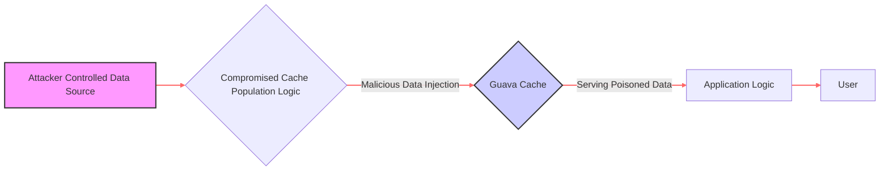
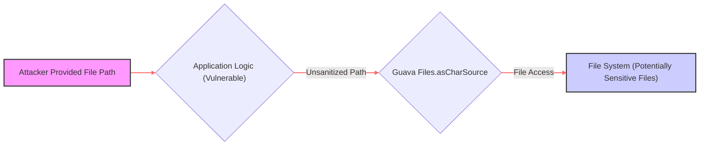

Here's the updated threat list focusing on high and critical threats directly involving the Guava library:

*   **Threat:** Resource Exhaustion via Large Collection Manipulation
    *   **Description:** An attacker could provide a large amount of data that, when processed using Guava's collection utilities without proper size limits, leads to excessive memory consumption and potentially a denial of service.
    *   **Impact:** Denial of Service (DoS), application crashes, performance degradation.
    *   **Guava Component Affected:** `com.google.common.collect` (Various collection implementations like `Lists`, `Sets`, `Maps`).
    *   **Risk Severity:** High
    *   **Mitigation Strategies:**
        *   **Developers:** Implement size limits and validation on data used to populate Guava collections, especially when sourced from external or untrusted sources. Monitor application memory usage. Consider using bounded data structures where appropriate.
*   **Threat:** Cache Poisoning through Untrusted Data
    *   **Description:** An attacker could inject malicious data into a Guava cache if the source of the cached data is not properly validated. This could involve compromising the data source or exploiting vulnerabilities in the cache population logic.
    *   **Impact:** Serving incorrect or malicious data to users, bypassing security checks, potential for further exploitation based on the poisoned data.
    *   **Guava Component Affected:** `com.google.common.cache` (`LoadingCache`, `Cache`).
    *   **Risk Severity:** High
    *   **Mitigation Strategies:**
        *   **Developers:**  Thoroughly validate data before caching it. Implement strong authentication and authorization for any processes that update the cache. Consider using signed or encrypted cache entries. Implement appropriate cache expiration policies to limit the lifespan of potentially poisoned data.

*   **Threat:** Concurrency Issues Leading to Race Conditions or Deadlocks
    *   **Description:** An attacker might trigger race conditions or deadlocks by exploiting improper synchronization or incorrect usage of Guava's concurrency utilities, particularly `ListenableFuture` and related components. This could involve sending specific sequences of requests or manipulating application state to create unfavorable concurrent scenarios.
    *   **Impact:** Application hangs, inconsistent data state, potential for security vulnerabilities if race conditions affect access control or data integrity.
    *   **Guava Component Affected:** `com.google.common.util.concurrent` (`ListenableFuture`, `Futures`, `MoreExecutors`).
    *   **Risk Severity:** High
    *   **Mitigation Strategies:**
        *   **Developers:**  Thoroughly understand the concurrency implications of Guava's utilities. Use appropriate synchronization mechanisms (locks, semaphores, etc.) when accessing shared resources within `ListenableFuture` callbacks or concurrent operations. Carefully manage thread pools and execution contexts. Conduct thorough testing of concurrent code paths.
*   **Threat:** Path Traversal via Unsanitized File Paths
    *   **Description:** An attacker could provide a malicious file path as input, and if the application uses Guava's I/O utilities (like `Files.asCharSource`) without proper sanitization, the attacker could potentially access or manipulate files outside of the intended directories.
    *   **Impact:** Information disclosure (reading sensitive files), potential for arbitrary code execution (if attacker can write to executable files).
    *   **Guava Component Affected:** `com.google.common.io` (`Files`, `ByteSource`, `CharSource`).
    *   **Risk Severity:** Critical
    *   **Mitigation Strategies:**
        *   **Developers:**  Strictly sanitize and validate all user-provided file paths. Use canonicalization to resolve symbolic links and relative paths. Implement the principle of least privilege for file system access. Avoid directly using user input to construct file paths.

*   **Threat:** Regular Expression Denial of Service (ReDoS)
    *   **Description:** An attacker could provide a specially crafted, complex regular expression to Guava's string manipulation utilities (like `Splitter` or `CharMatcher`) that causes excessive backtracking and CPU consumption, leading to a denial of service.
    *   **Impact:** Denial of Service (DoS), application slowdown or unavailability.
    *   **Guava Component Affected:** `com.google.common.base` (`Splitter`, `CharMatcher`).
    *   **Risk Severity:** High
    *   **Mitigation Strategies:**
        *   **Developers:** Avoid using regular expressions based on untrusted input. If necessary, carefully review and test regular expressions for potential performance issues. Implement timeouts for regex operations to prevent indefinite execution. Consider using alternative, non-regex-based string manipulation methods where appropriate.
*   **Threat:** Vulnerability in Guava Library Itself
    *   **Description:** An attacker could exploit a known or zero-day vulnerability within the Guava library code itself.
    *   **Impact:**  Wide range of potential security issues depending on the nature of the vulnerability, including remote code execution, information disclosure, or denial of service.
    *   **Guava Component Affected:** Various components depending on the specific vulnerability.
    *   **Risk Severity:** Critical (if a severe vulnerability exists)
    *   **Mitigation Strategies:**
        *   **Developers & Users:** Keep the Guava library updated to the latest stable version. Monitor security advisories and vulnerability databases for reported issues in Guava. Implement a process for quickly patching or mitigating identified vulnerabilities.