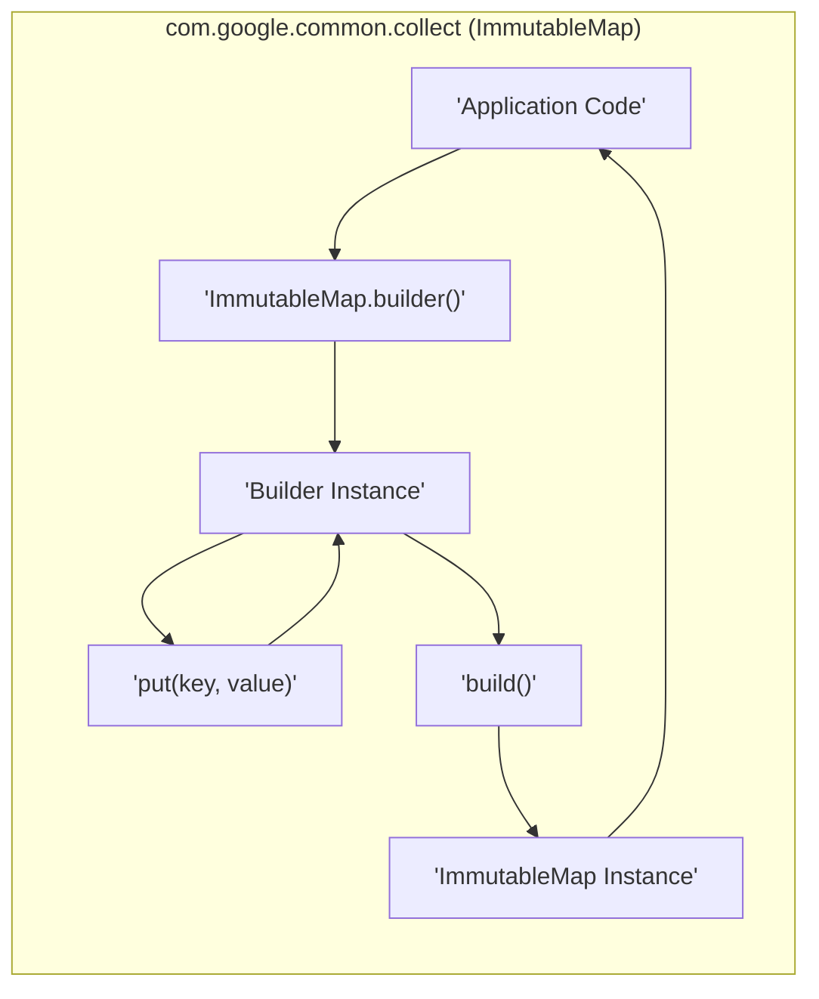
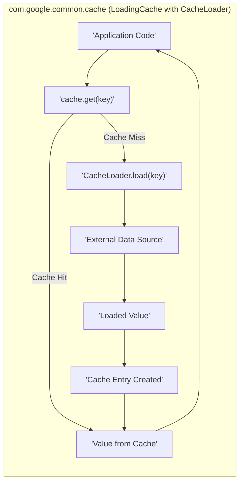
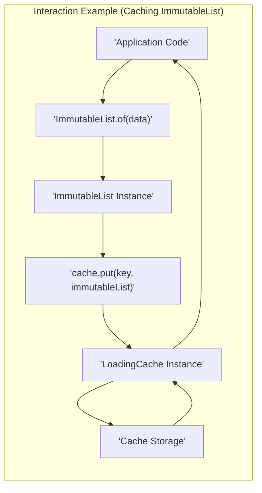

## Project Design Document: Google Guava Library (Improved)

**1. Introduction**

This document provides an enhanced design overview of the Google Guava library (https://github.com/google/guava). Building upon the previous version, this iteration aims for greater clarity, more detailed examples, and a stronger focus on security considerations relevant for threat modeling. This document describes the library's internal structure and functionalities, not specific applications utilizing Guava. Guava is a mature and widely-used library, and this design reflects its established architecture.

**2. Project Overview**

Guava is a foundational Java library offering a suite of core utilities that significantly extend the capabilities of the Java standard libraries. It provides well-engineered, thoroughly tested, and performant solutions for common programming tasks, encompassing collections, caching mechanisms, primitive type support, concurrency utilities, common annotations, string manipulation, I/O operations, mathematical functions, and more. The primary objective of Guava is to streamline Java development, reduce boilerplate code, and enhance the reliability and efficiency of Java applications.

**3. Goals**

* **Provide highly reliable and extensively tested utility classes and interfaces.**
* **Enhance the expressiveness and readability of Java code, promoting maintainability.**
* **Offer performant and memory-efficient implementations for frequently used functionalities.**
* **Serve as a natural and consistent extension to the existing Java standard libraries.**
* **Promote the adoption of best practices in data structure and algorithm usage within Java development.**
* **Reduce the likelihood of common programming errors through well-designed and robust APIs.**

**4. Target Audience**

This design document is primarily intended for:

* **Security Engineers:** To gain a deep understanding of Guava's architecture for effective threat modeling and vulnerability analysis.
* **Software Architects:** To leverage insights into Guava's structure and dependencies for informed system design and integration decisions.
* **Developers:** To facilitate a better understanding of Guava's internal mechanisms for debugging, extending, or contributing to the project.

**5. Scope**

This document specifically focuses on the design of the core Guava library and its constituent modules. The scope includes:

* The major functional areas and packages within the Guava library.
* The key components and their interactions within each functional area.
* Illustrative data flow examples within specific Guava components.
* Security considerations relevant to the library's design and usage.

This document explicitly excludes:

* The design of specific applications or systems that depend on the Guava library.
* The intricacies of the Guava library's build process, testing infrastructure, or development environment.
* Fine-grained implementation details of individual classes, methods, or algorithms within Guava.
* External dependencies of applications that integrate the Guava library.

**6. High-Level Architecture**

Guava is architected as a modular library, comprising several distinct packages, each dedicated to a specific set of functionalities. The `com.google.common.base` package serves as the foundational layer, providing core utilities used by other modules.

```mermaid
graph LR
    subgraph "Guava Library"
        A["'com.google.common.base'"]
        B["'com.google.common.collect'"]
        C["'com.google.common.cache'"]
        D["'com.google.common.util.concurrent'"]
        E["'com.google.common.io'"]
        F["'com.google.common.math'"]
        G["'com.google.common.reflect'"]
        H["'com.google.common.eventbus'"]
        I["'com.google.common.net'"]
        J["'com.google.common.primitives'"]
        K["'com.google.common.hash'"]
    end

    style A fill:#f9f,stroke:#333,stroke-width:2px
    style B fill:#ccf,stroke:#333,stroke-width:2px
    style C fill:#ddf,stroke:#333,stroke-width:2px
    style D fill:#eef,stroke:#333,stroke-width:2px
    style E fill:#fcf,stroke:#333,stroke-width:2px
    style F fill:#ffc,stroke:#333,stroke-width:2px
    style G fill:#cfc,stroke:#333,stroke-width:2px
    style H fill:#cdf,stroke:#333,stroke-width:2px
    style I fill:#dff,stroke:#333,stroke-width:2px
    style J fill:#fdf,stroke:#333,stroke-width:2px
    style K fill:#ffd,stroke:#333,stroke-width:2px
```

**7. Key Components**

The Guava library's functionality is organized into the following key packages:

* **`com.google.common.base`:** Provides fundamental, widely used utility classes and interfaces that form the bedrock of the library.
    * `Optional`:  A robust way to represent the presence or absence of a value, mitigating null pointer exceptions.
    * `Preconditions`:  Static methods for verifying method arguments, ensuring data integrity early in the execution flow.
    * `Objects`:  Utility methods for common object operations like equality checks (`equals`), hash code generation (`hashCode`), and string representation (`toString`).
    * `Strings`:  A collection of helpful string manipulation utilities, including null-safe operations and common transformations.
    * `Enums`:  Utilities to simplify working with enums, such as retrieving enum constants by string value.
    * `Throwables`:  Utilities for handling exceptions and errors, including propagating exceptions and retrieving root causes.
    * `Function` and `Predicate`: Core functional interfaces for transforming and filtering data.

* **`com.google.common.collect`:** Offers a rich set of powerful and efficient collection types beyond those provided in the Java Collections Framework.
    * Immutable Collections:  Thread-safe, memory-efficient, and unmodifiable collection implementations (e.g., `ImmutableList`, `ImmutableSet`, `ImmutableMap`), crucial for concurrent programming and data integrity.
    * Multimap:  A collection that maps keys to multiple values, simplifying scenarios where a single key can have several associated values.
    * Multiset:  A collection that allows duplicate elements and keeps track of the count of each element.
    * Table:  Represents a two-dimensional map with rows, columns, and values.
    * RangeSet and RangeMap:  Efficiently represent and manipulate sets and maps of disjoint ranges, useful for scheduling and interval management.

* **`com.google.common.cache`:** Provides sophisticated in-memory caching capabilities.
    * `LoadingCache`:  A powerful cache implementation that automatically loads values using a specified `CacheLoader` when a requested key is not present.
    * `CacheBuilder`:  A fluent builder API for configuring various cache behaviors, including size-based eviction, time-based expiration, and soft/weak references.

* **`com.google.common.util.concurrent`:** Offers utilities for concurrent programming, extending the capabilities of the `java.util.concurrent` package.
    * `ListenableFuture`:  An enhancement of `Future` that allows attaching callbacks to be executed upon completion, failure, or cancellation of an asynchronous computation.
    * `RateLimiter`:  A utility for controlling the rate of events, preventing resource exhaustion and ensuring fair usage.
    * `Service`:  An abstraction for managing the lifecycle of long-running background processes or services.
    * `MoreExecutors`:  Provides factory methods for creating various `ExecutorService` instances with specific configurations.

* **`com.google.common.io`:**  Provides utility classes for input/output operations.
    * `ByteStreams`, `CharStreams`:  Utility methods for efficiently reading from and writing to byte and character streams.
    * `Files`:  Utilities for common file system operations, such as copying, moving, and reading files.
    * `Resources`:  Utilities for accessing resources from the classpath.

* **`com.google.common.math`:** Offers mathematical utilities, including safe arithmetic operations.
    * Overflow-safe arithmetic operations for primitive types, preventing unexpected behavior due to integer overflow.
    * Utilities for working with `BigInteger` and `BigDecimal`.
    * Statistical calculation utilities.

* **`com.google.common.reflect`:** Provides reflection utilities.
    * `ClassPath`:  A utility for discovering classes available on the classpath.
    * `TypeToken`:  A utility for capturing and manipulating generic type information at runtime.

* **`com.google.common.eventbus`:**  A lightweight event bus implementation for decoupled communication between components.
    * Enables components to publish events without needing explicit knowledge of subscribers, and allows subscribers to react to events of interest.

* **`com.google.common.net`:**  Provides networking utilities.
    * `InternetDomainName`:  Represents and validates internet domain names according to established standards.
    * `MediaType`:  Represents and parses media type strings (formerly known as MIME types).

* **`com.google.common.primitives`:**  Offers utility methods for working with Java primitive types.
    * Static utility methods for each primitive type (e.g., `Ints`, `Longs`, `Booleans`), providing operations like array manipulation, conversion, and searching.

* **`com.google.common.hash`:**  Provides hashing utilities.
    * Implementations of various hashing algorithms (e.g., MurmurHash, SHA-1, SHA-256) for data integrity and indexing.
    * Bloom filters for probabilistic set membership testing, offering a space-efficient way to check if an element might be in a set.

**8. Data Flow**

Data flow within Guava is generally localized within specific components, focusing on the creation, manipulation, and retrieval of data structures. Interactions between components often involve passing data structures or objects.

Example demonstrating data flow in caching with a `LoadingCache`:

Illustrative data flow involving multiple components (e.g., using immutable collections with caching):

**9. Security Considerations**

While Guava is a utility library and doesn't directly handle network requests or user authentication, security considerations are important when using it:

* **Dependency Management:** Guava relies on other libraries. Vulnerabilities in these transitive dependencies could introduce security risks. Regularly updating Guava and its dependencies is crucial.
* **Denial of Service (DoS) via Resource Exhaustion:**
    * **Unbounded Collections:** Using Guava's collection types without proper size limits could lead to excessive memory consumption if an attacker can influence the data being added.
    * **Cache Abuse:**  If cache keys are derived from user input without proper validation, an attacker could flood the cache with unique keys, exhausting memory. Employing eviction strategies and size limits is essential.
* **Misuse of Concurrency Utilities:** Incorrectly using Guava's concurrency primitives (e.g., `RateLimiter`, `ListenableFuture`) could introduce race conditions or deadlocks if not implemented carefully.
* **Serialization and Deserialization Risks:** While Guava's core functionality doesn't heavily rely on serialization, if Guava objects are serialized (e.g., for caching or inter-process communication), standard serialization vulnerabilities like object injection should be considered. Ensure that deserialized data originates from trusted sources.
* **Hashing Collisions:** When using Guava's hashing utilities, be aware of potential hash collision vulnerabilities, especially if the hashed data is used in security-sensitive contexts. While Guava's hash functions are generally robust, understanding the theoretical limitations is important. For critical applications, consider using cryptographic hash functions where appropriate (though Guava primarily provides non-cryptographic hashes).
* **Regular Expression Denial of Service (ReDoS):** If using Guava's string utilities for operations involving regular expressions based on user input, be mindful of potential ReDoS vulnerabilities if the regex patterns are not carefully crafted.
* **Information Disclosure:**  Carelessly logging or exposing data structures managed by Guava could unintentionally reveal sensitive information.

**10. Deployment**

Guava is deployed as a standard Java Archive (JAR) file. It is typically included as a dependency in other Java projects using build management tools like Maven or Gradle. No specific deployment process beyond including the JAR in the classpath is required for using Guava.

**11. Technologies Used**

* **Java (Primary Language):** Guava is written entirely in Java.
* **Maven or Gradle:**  Common build tools for managing Guava as a project dependency.
* **JUnit:** Used for unit testing the Guava library itself.

This improved design document provides a more detailed and nuanced understanding of the Google Guava library's architecture, components, and security considerations. This information is intended to be a valuable resource for security engineers conducting threat modeling and for developers seeking a deeper understanding of this widely used library.