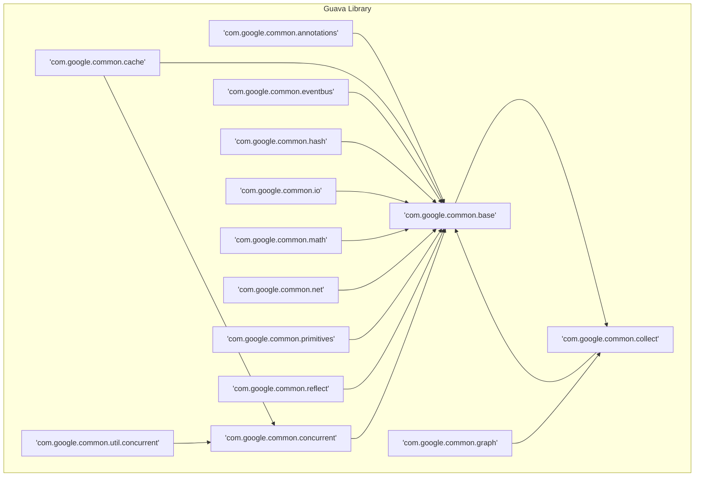
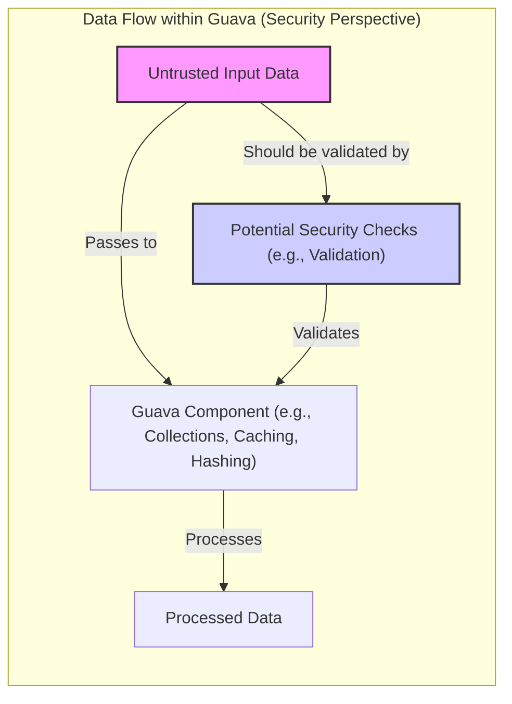

# Project Design Document: Google Guava Library (Improved for Threat Modeling)

**Version:** 1.1
**Date:** October 26, 2023
**Author:** Gemini (AI Language Model)

## 1. Project Overview

The Google Guava library is a foundational Java library providing a wide range of utility classes and interfaces. It enhances the Java development experience with robust and efficient tools for collections, caching, primitives support, concurrency, common annotations, string manipulation, I/O operations, and more. This document provides an enhanced architectural design overview of the Guava library, specifically tailored for effective threat modeling.

## 2. Goals and Objectives

*   Present a clear and detailed architectural overview of the Guava library, emphasizing aspects relevant to security.
*   Identify key components and their interactions, highlighting potential security implications.
*   Describe the typical data flow patterns within the library and potential vulnerabilities at each stage.
*   Provide specific and actionable security considerations to guide the threat modeling process.
*   Serve as a comprehensive resource for security engineers and developers to understand Guava's architecture from a security perspective.

## 3. Target Audience

*   Security engineers responsible for threat modeling and security assessments.
*   Software developers integrating and utilizing the Guava library in their applications.
*   Software architects designing systems that rely on Guava's functionalities.

## 4. Scope

This document focuses on the logical architecture, key components, and typical data flow patterns within the Guava library, specifically from a security standpoint. It does not delve into the intricate implementation details of individual classes or methods. The scope includes:

*   Major functional areas and modules within Guava, with a security lens.
*   Key data structures and their manipulation, considering potential security risks.
*   Interactions between different components, highlighting potential attack surfaces.
*   External dependencies (primarily the Java standard library) and their security implications.

## 5. Architecture Overview

Guava is architected as a collection of well-defined and largely independent modules, promoting modularity and reusability. While delivered as a single JAR file, its logical organization into packages reflects distinct functional areas. This modularity allows developers to utilize specific parts of the library without necessarily including the entire codebase.

**Key Architectural Characteristics (with Security Relevance):**

*   **Modular Design:** Limits the impact of potential vulnerabilities within a specific module.
*   **Minimal External Dependencies:** Reduces the attack surface by minimizing reliance on external libraries.
*   **Emphasis on Immutability:** Enhances thread safety and reduces the risk of unintended data modification.
*   **Fluent Interfaces:** Primarily an API design choice with limited direct security impact, but can improve code readability for security reviews.
*   **Null-Hostile Approach:** Promotes more robust code and can prevent NullPointerExceptions that might be exploitable in some scenarios.

## 6. Key Components (with Security Considerations)

This section details the major functional areas within Guava, highlighting potential security considerations for each.

*   **`com.google.common.annotations`:**
    *   Provides metadata annotations.
    *   **Security Consideration:**  Generally low security impact, but custom annotation processors could potentially introduce vulnerabilities if not carefully implemented.

*   **`com.google.common.base`:**
    *   Fundamental utilities like `Optional`, `Preconditions`, `Objects`, `Strings`, `Enums`.
    *   **Security Consideration:**
        *   `Preconditions`: Crucial for input validation. Failure to use them properly can lead to vulnerabilities.
        *   `Strings`:  While providing utility methods, developers must still be mindful of injection vulnerabilities when handling user-provided strings.

*   **`com.google.common.cache`:**
    *   In-memory caching with features like loading, eviction, and refresh.
    *   **Security Consideration:**
        *   **Cache Poisoning:**  If the cache loading mechanism is vulnerable, malicious data could be injected.
        *   **Cache Side-Channel Attacks:**  Timing differences in cache access might reveal information.
        *   **Denial of Service:**  Unbounded caches or improper eviction policies can lead to memory exhaustion.
        *   **Sensitive Data in Cache:**  Care must be taken to avoid caching sensitive information inappropriately.

*   **`com.google.common.collect`:**
    *   Enhanced collections framework, including immutable collections, multisets, multimaps, etc.
    *   **Security Consideration:**
        *   **Immutability:**  Provides a degree of protection against unintended modification in concurrent environments.
        *   **Data Integrity:**  Using appropriate collection types can help maintain data integrity.

*   **`com.google.common.concurrent`:**
    *   Utilities for concurrent programming like `ListenableFuture`, `Service`, rate limiters.
    *   **Security Consideration:**
        *   **Rate Limiting:** Can be used to mitigate denial-of-service attacks.
        *   **Thread Safety:**  Improper use of concurrency utilities can lead to race conditions and other concurrency vulnerabilities.

*   **`com.google.common.eventbus`:**
    *   Lightweight publish/subscribe event bus.
    *   **Security Consideration:**
        *   **Unintended Information Disclosure:**  Ensure that sensitive information is not inadvertently broadcasted on the event bus.
        *   **Malicious Event Handling:**  Subscribers should be designed to handle potentially malicious or unexpected events gracefully.

*   **`com.google.common.graph`:**
    *   Data structures for representing graphs.
    *   **Security Consideration:**
        *   **DoS through Graph Complexity:**  Processing extremely large or complex graphs could lead to performance issues or denial of service.

*   **`com.google.common.hash`:**
    *   Utilities for hashing data, including various hash functions and Bloom filters.
    *   **Security Consideration:**
        *   **Hash Collision Attacks:**  While Guava's hash functions are generally robust, understanding their collision resistance is important, especially when used in security-sensitive contexts.
        *   **Cryptographic vs. Non-Cryptographic Hashing:**  Ensure the appropriate type of hashing is used for the intended purpose (e.g., use cryptographic hashes for password storage).

*   **`com.google.common.io`:**
    *   Utilities for input/output operations.
    *   **Security Consideration:**
        *   **Path Traversal Vulnerabilities:**  Care must be taken when constructing file paths using user-provided input.
        *   **Resource Exhaustion:**  Improper handling of input streams could lead to resource exhaustion.

*   **`com.google.common.math`:**
    *   Mathematical utilities.
    *   **Security Consideration:**
        *   **Integer Overflow/Underflow:**  While Guava provides some overflow-safe methods, developers should be aware of potential arithmetic vulnerabilities.

*   **`com.google.common.net`:**
    *   Utilities for working with network-related data.
    *   **Security Consideration:**
        *   **Input Validation:**  Properly validate network addresses and other network-related data to prevent injection attacks or other vulnerabilities.

*   **`com.google.common.primitives`:**
    *   Utilities for working with primitive types.
    *   **Security Consideration:**  Generally low security impact, but potential for misuse in data conversion or manipulation.

*   **`com.google.common.reflect`:**
    *   Utilities for runtime reflection.
    *   **Security Consideration:**
        *   **Access Control Bypass:**  Reflection can potentially bypass access modifiers and security restrictions. Use with caution.

*   **`com.google.common.util.concurrent`:**
    *   Further concurrency utilities.
    *   **Security Consideration:**  Similar to `com.google.common.concurrent`, improper use can lead to concurrency vulnerabilities.

## 7. Data Flow (with Security Implications)

Data flow within Guava typically involves the manipulation and transformation of data within the application's memory. Guava itself doesn't usually initiate external data flows but operates on data provided to its methods. Understanding how data moves through Guava components is crucial for identifying potential security vulnerabilities.

**Common Data Flow Patterns and Security Implications:**

*   **Untrusted Input to Collection Methods:**  Passing unsanitized user input directly to collection methods could lead to unexpected behavior or vulnerabilities if the input is not properly validated beforehand.
*   **Sensitive Data in Caches:**  Storing sensitive information in caches without proper encryption or access controls can lead to information disclosure.
*   **Data Processed by Hashing Functions:**  Ensure the appropriate hashing algorithm is used for the sensitivity of the data. Avoid using non-cryptographic hashes for sensitive data like passwords.
*   **Events on the Event Bus:**  Be mindful of the data being published on the event bus and who has access to subscribe to those events. Avoid broadcasting sensitive information unnecessarily.
*   **Data Transformation and Manipulation:**  Ensure that data transformations performed by Guava utilities do not introduce vulnerabilities (e.g., format string bugs).

**Key Security Practices for Data Flow:**

*   **Input Validation:**  Always validate input data before passing it to Guava methods. Utilize `Preconditions` or other validation mechanisms.
*   **Output Encoding:**  Encode output data appropriately to prevent injection vulnerabilities (e.g., HTML escaping, URL encoding).
*   **Secure Handling of Sensitive Data:**  Encrypt sensitive data when stored in caches or processed by Guava utilities.
*   **Principle of Least Privilege:**  Grant only the necessary permissions to components interacting with Guava.

## 8. Security Considerations (Detailed)

This section provides a more detailed breakdown of potential security considerations when using the Guava library.

*   **Denial of Service (DoS):**
    *   **Cache Exhaustion:**  Attackers might attempt to fill caches with a large number of unique entries, exhausting memory resources. Implement appropriate eviction policies and consider maximum cache sizes.
    *   **Hash Collision Attacks:**  While less likely with Guava's robust hash functions, be aware of the potential for hash collisions to degrade performance in hash-based collections.
    *   **Resource Exhaustion in Concurrent Utilities:**  Misuse of concurrency primitives (e.g., creating unbounded numbers of threads) can lead to resource exhaustion.

*   **Data Integrity:**
    *   **Serialization/Deserialization Vulnerabilities:** If Guava objects are serialized, they are susceptible to standard Java serialization vulnerabilities. Avoid serializing sensitive data or use secure serialization mechanisms.
    *   **Concurrency Issues:**  Improper synchronization when using mutable Guava collections in multithreaded environments can lead to data corruption. Favor immutable collections where possible.

*   **Information Disclosure:**
    *   **Logging Sensitive Information:**  Avoid logging sensitive data handled by Guava utilities. Implement proper logging practices.
    *   **Error Handling:**  Ensure error messages and stack traces do not reveal sensitive information.
    *   **Cache Side-Channel Attacks:**  Be aware of potential timing attacks on cached data, especially for security-sensitive information.

*   **Injection Vulnerabilities:**
    *   While Guava itself doesn't directly handle user input in many cases, improper use of its string utilities or I/O functionalities with unsanitized input can lead to injection vulnerabilities (e.g., if constructing SQL queries or file paths).

*   **Dependency Management:**
    *   Ensure the integrity and authenticity of the Guava JAR file to prevent supply chain attacks. Use dependency management tools to verify checksums.

## 9. Deployment Considerations

Guava is typically deployed as a JAR file included in the classpath of a Java application. Its security is intrinsically linked to the security of the host application and the environment in which it runs.

*   **Application Security:** The application utilizing Guava must implement its own comprehensive security measures, including authentication, authorization, input validation, and secure data handling.
*   **Java Security Manager:** In environments where the Java Security Manager is enabled, Guava's behavior will be subject to the configured security policies.
*   **Container Security:** If deployed in a containerized environment, ensure the container image and runtime environment are secure.

## 10. Assumptions and Constraints

*   This document assumes a foundational understanding of Java security principles.
*   The focus is on architectural considerations for threat modeling, not a comprehensive security audit of Guava's codebase.
*   Security best practices and the threat landscape are constantly evolving, requiring ongoing review and adaptation.

## 11. Future Considerations

*   As Guava continues to evolve, new features and modules may introduce new security considerations. This document should be reviewed and updated accordingly.
*   Emerging attack vectors and security research may reveal new potential vulnerabilities related to Guava's functionalities. Continuous monitoring and analysis are essential.

This improved design document provides a more detailed and security-focused overview of the Google Guava library, intended to facilitate more effective threat modeling and security assessments. It highlights potential security considerations for each key component and data flow pattern, empowering security engineers and developers to build more secure applications utilizing this widely adopted library.