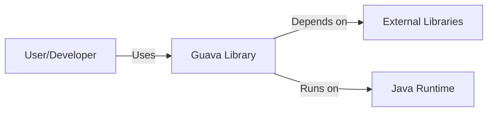
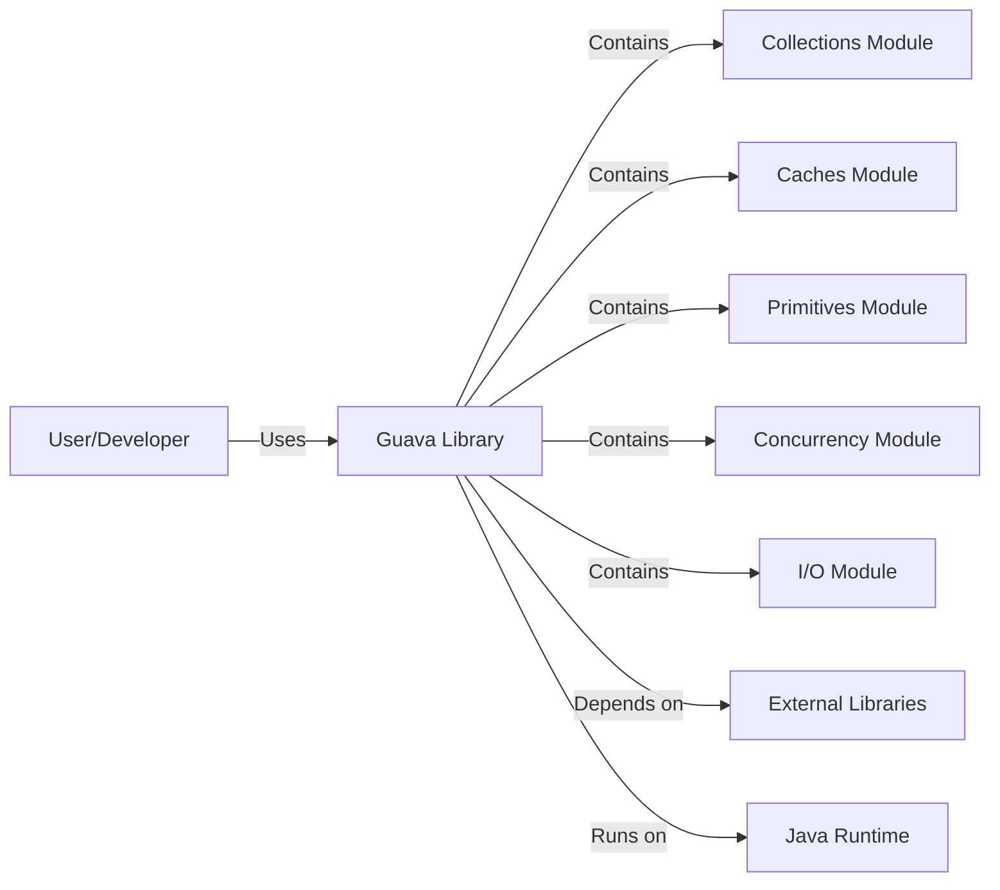
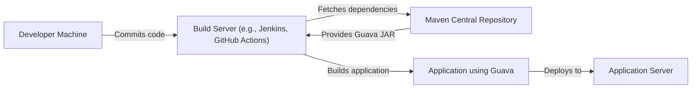
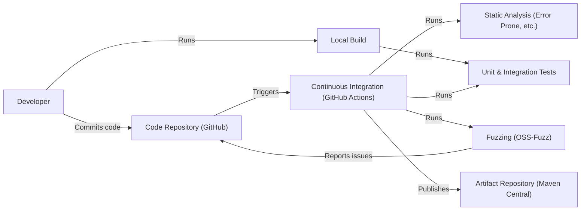

# BUSINESS POSTURE

Business Priorities and Goals:

*   Provide a set of core Java libraries that are widely used within Google.
*   Improve developer productivity by providing reusable, well-tested, and performant utilities.
*   Reduce code duplication and improve code quality across Google's Java projects.
*   Offer a stable and reliable foundation for building Java applications.
*   Foster a community around the library, encouraging contributions and feedback.

Most Important Business Risks:

*   Introduction of vulnerabilities: Given Guava's widespread use, any security vulnerability in the library could have a significant impact on a large number of applications, both within Google and externally.
*   Supply chain attacks: Compromise of the build or distribution process could lead to malicious code being included in the library, affecting all users.
*   Compatibility issues: Changes to the library could break existing applications that depend on it, leading to significant disruption.
*   Performance regressions: Performance degradations in core utilities could impact the performance of many applications.
*   Lack of adoption of security best practices: If developers using Guava don't follow secure coding practices, the benefits of the library's security features may be undermined.

# SECURITY POSTURE

Existing Security Controls:

*   security control: Code reviews: All changes to Guava undergo code review by multiple engineers. (Described in the project's contribution guidelines).
*   security control: Static analysis: The project uses static analysis tools to identify potential bugs and security vulnerabilities. (Visible in build configurations and continuous integration setup).
*   security control: Testing: Guava has an extensive suite of unit and integration tests to ensure correctness and prevent regressions. (Visible in the project's test directory).
*   security control: Fuzzing: Guava utilizes OSS-Fuzz for continuous fuzzing to discover potential vulnerabilities. (Referenced in project documentation and OSS-Fuzz integration).
*   security control: Dependency management: The project carefully manages its dependencies to minimize the risk of supply chain attacks. (Visible in build files like pom.xml).
*   security control: Security releases: The Guava team promptly addresses and releases fixes for reported security vulnerabilities. (Visible in release notes and issue tracker).

Accepted Risks:

*   accepted risk: Reliance on third-party libraries: While dependencies are carefully managed, there's an inherent risk associated with using any external code.
*   accepted risk: Potential for unknown vulnerabilities: Despite rigorous testing and analysis, there's always a possibility of undiscovered vulnerabilities.
*   accepted risk: Backward compatibility constraints: Maintaining backward compatibility can sometimes limit the ability to implement certain security improvements.

Recommended Security Controls:

*   security control: Implement a Software Bill of Materials (SBOM) generation process to provide transparency into the library's components and dependencies.
*   security control: Conduct regular security audits and penetration testing by independent security experts.
*   security control: Integrate Software Composition Analysis (SCA) tools to continuously monitor for known vulnerabilities in dependencies.

Security Requirements:

*   Authentication: Not directly applicable, as Guava is a library, not a service requiring authentication.
*   Authorization: Not directly applicable, as Guava is a library, not a service with authorization needs.
*   Input validation:
    *   Guava should provide utilities for validating input data, such as checking for nulls, ranges, and formats.
    *   These utilities should be designed to prevent common injection vulnerabilities.
*   Cryptography:
    *   Guava should provide secure and well-vetted implementations of cryptographic algorithms and utilities.
    *   Cryptographic APIs should be designed to minimize the risk of misuse.
    *   Deprecated cryptographic utilities should be clearly marked and alternatives provided.
*   Error Handling:
    *   Guava should handle errors gracefully and provide informative error messages.
    *   Error handling should not leak sensitive information.

# DESIGN

## C4 CONTEXT

Element Descriptions:

*   Element:
    *   Name: User/Developer
    *   Type: Person
    *   Description: A developer who uses the Guava library in their Java application.
    *   Responsibilities: Integrates Guava into their application, calls Guava APIs, handles results and errors.
    *   Security controls: Follows secure coding practices, uses Guava's security features appropriately.

*   Element:
    *   Name: Guava Library
    *   Type: Software System
    *   Description: The Guava library itself, a set of core Java libraries.
    *   Responsibilities: Provides utility functions, data structures, and other core functionalities.
    *   Security controls: Code reviews, static analysis, testing, fuzzing, dependency management, security releases.

*   Element:
    *   Name: External Libraries
    *   Type: Software System
    *   Description: Third-party libraries that Guava depends on.
    *   Responsibilities: Provides specific functionalities required by Guava.
    *   Security controls: Dependency management, vulnerability scanning (by Guava team).

*   Element:
    *   Name: Java Runtime
    *   Type: Software System
    *   Description: The Java Runtime Environment (JRE) or Java Development Kit (JDK) on which Guava runs.
    *   Responsibilities: Executes Java bytecode, provides core system libraries.
    *   Security controls: Relies on the security of the underlying JRE/JDK installation.

## C4 CONTAINER

Since Guava is a library, the container diagram is essentially the same as the context diagram, with the addition of internal modules within the Guava library.

Element Descriptions:

*   Element:
    *   Name: User/Developer
    *   Type: Person
    *   Description: A developer who uses the Guava library in their Java application.
    *   Responsibilities: Integrates Guava into their application, calls Guava APIs, handles results and errors.
    *   Security controls: Follows secure coding practices, uses Guava's security features appropriately.

*   Element:
    *   Name: Guava Library
    *   Type: Software System
    *   Description: The Guava library itself, a set of core Java libraries.
    *   Responsibilities: Provides utility functions, data structures, and other core functionalities.
    *   Security controls: Code reviews, static analysis, testing, fuzzing, dependency management, security releases.

*   Element:
    *   Name: Collections Module
    *   Type: Container
    *   Description: Provides extensions to the Java Collections Framework.
    *   Responsibilities: Offers new collection types, utility methods, and improved implementations.
    *   Security controls: Input validation, careful handling of iterators and collections to prevent concurrent modification issues.

*   Element:
    *   Name: Caches Module
    *   Type: Container
    *   Description: Provides in-memory caching capabilities.
    *   Responsibilities: Manages cache entries, eviction policies, and loading mechanisms.
    *   Security controls: Secure configuration options, protection against denial-of-service attacks through size limits.

*   Element:
    *   Name: Primitives Module
    *   Type: Container
    *   Description: Provides utilities for working with primitive types.
    *   Responsibilities: Offers operations and data structures for primitives not covered by the standard Java library.
    *   Security controls: Input validation, overflow/underflow checks.

*   Element:
    *   Name: Concurrency Module
    *   Type: Container
    *   Description: Provides concurrency utilities and abstractions.
    *   Responsibilities: Offers thread-safe data structures, synchronization helpers, and improved concurrency control mechanisms.
    *   Security controls: Careful design to prevent deadlocks, race conditions, and other concurrency-related vulnerabilities.

*   Element:
    *   Name: I/O Module
    *   Type: Container
    *   Description: Provides utilities for working with input/output streams and files.
    *   Responsibilities: Offers simplified file handling, stream processing, and resource management.
    *   Security controls: Secure handling of file paths, prevention of resource leaks.

*   Element:
    *   Name: External Libraries
    *   Type: Software System
    *   Description: Third-party libraries that Guava depends on.
    *   Responsibilities: Provides specific functionalities required by Guava.
    *   Security controls: Dependency management, vulnerability scanning (by Guava team).

*   Element:
    *   Name: Java Runtime
    *   Type: Software System
    *   Description: The Java Runtime Environment (JRE) or Java Development Kit (JDK) on which Guava runs.
    *   Responsibilities: Executes Java bytecode, provides core system libraries.
    *   Security controls: Relies on the security of the underlying JRE/JDK installation.

## DEPLOYMENT

Deployment Solutions:

1.  Direct download of JAR files from a repository like Maven Central.
2.  Inclusion as a dependency in a build system like Maven or Gradle.
3.  Bundling within a larger application's deployment artifact.

Chosen Solution (Maven/Gradle Dependency):

Element Descriptions:

*   Element:
    *   Name: Developer Machine
    *   Type: Infrastructure Node
    *   Description: The developer's local workstation.
    *   Responsibilities: Writing code, running local builds and tests.
    *   Security controls: Local security measures (e.g., antivirus, firewall).

*   Element:
    *   Name: Build Server (e.g., Jenkins, GitHub Actions)
    *   Type: Infrastructure Node
    *   Description: A server that automates the build process.
    *   Responsibilities: Compiling code, running tests, fetching dependencies, creating build artifacts.
    *   Security controls: Access controls, secure configuration, regular updates.

*   Element:
    *   Name: Maven Central Repository
    *   Type: Infrastructure Node
    *   Description: A public repository for Java libraries.
    *   Responsibilities: Storing and serving JAR files.
    *   Security controls: Integrity checks, access controls, security monitoring.

*   Element:
    *   Name: Application Server
    *   Type: Infrastructure Node
    *   Description: The server where the application using Guava is deployed.
    *   Responsibilities: Running the application.
    *   Security controls: Server hardening, access controls, network security.

*   Element:
    *   Name: Application using Guava
    *   Type: Software System
    *   Description: The final application that includes Guava as a dependency.
    *   Responsibilities: Performing the application's specific functions.
    *   Security controls: Application-level security measures.

## BUILD

Build Process Description:

1.  Developers write code and run local builds and tests.
2.  Code is committed to the GitHub repository.
3.  GitHub Actions (the CI system) is triggered by commits.
4.  The CI pipeline performs the following steps:
    *   Checks out the code.
    *   Runs static analysis tools (e.g., Error Prone).
    *   Runs unit and integration tests.
    *   Runs fuzzing tests (via OSS-Fuzz integration).
    *   If all checks pass, builds the Guava JAR files.
    *   Publishes the JAR files to Maven Central.
5.  OSS-Fuzz continuously fuzzes the library and reports any discovered issues to the GitHub repository.

Security Controls in Build Process:

*   Code reviews: All changes are reviewed before merging.
*   Static analysis: Tools like Error Prone are used to identify potential bugs and vulnerabilities.
*   Automated testing: Extensive unit and integration tests ensure code correctness.
*   Fuzzing: OSS-Fuzz integration provides continuous fuzzing for vulnerability discovery.
*   Dependency management: Careful management of dependencies to minimize supply chain risks.
*   CI/CD: GitHub Actions provides a secure and automated build and deployment pipeline.
*   Signed Releases: Releases are signed to ensure authenticity and integrity.

# RISK ASSESSMENT

Critical Business Processes:

*   Providing reliable and performant core utilities for Java applications.
*   Maintaining the trust of developers and organizations that rely on Guava.
*   Ensuring the security of applications that use Guava.

Data Sensitivity:

*   Guava itself does not handle sensitive data directly. It's a library of utilities. However, applications using Guava *might* handle sensitive data. The sensitivity of that data depends entirely on the application. Guava's role is to provide tools that can be used *securely* to handle data, regardless of its sensitivity. For example, Guava's cryptographic utilities, if used correctly, can help protect sensitive data. If used incorrectly, they offer no protection. Guava's I/O utilities can be used to read and write sensitive data; it is the responsibility of the application developer to ensure this is done securely (e.g., using appropriate file permissions, encryption, etc.).

# QUESTIONS & ASSUMPTIONS

Questions:

*   Are there any specific compliance requirements (e.g., PCI DSS, HIPAA) that applications using Guava typically need to meet? This would influence recommendations for how Guava's utilities should be used.
*   What is the process for handling vulnerability reports from external researchers?
*   What is the long-term strategy for managing deprecated APIs, especially those with security implications?
*   What level of support is provided to users who encounter security issues related to Guava?

Assumptions:

*   BUSINESS POSTURE: The primary business goal is to provide a high-quality, reliable, and secure set of core libraries for Java developers.
*   SECURITY POSTURE: The Guava team is committed to security and follows best practices for secure software development.
*   DESIGN: Developers using Guava are responsible for understanding and implementing secure coding practices in their own applications. Guava provides the tools, but it's up to the developers to use them correctly.
*   DEPLOYMENT: The primary deployment method is through dependency management systems like Maven and Gradle.
*   BUILD: The build process is automated and includes security checks.