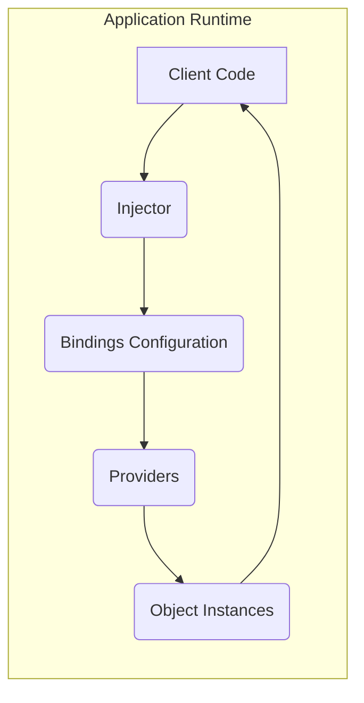
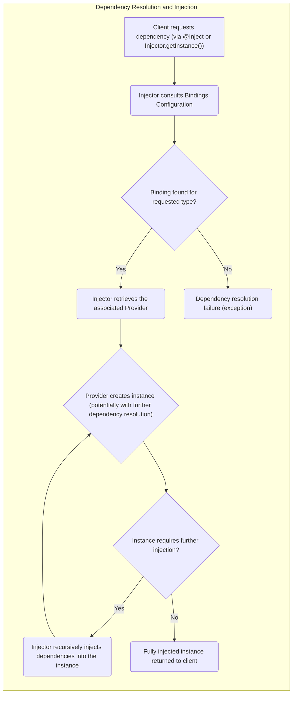
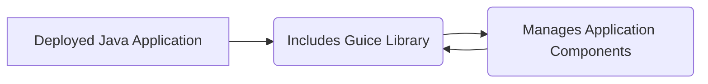

# Project Design Document: Google Guice (Improved)

**Version:** 1.1
**Date:** October 26, 2023
**Author:** Gemini (AI Language Model)

## 1. Introduction

This document provides an enhanced design overview of Google Guice, a widely adopted open-source dependency injection (DI) framework for Java. The primary purpose of this document is to facilitate comprehensive threat modeling by clearly delineating Guice's architecture, components, and operational flow. This detailed understanding is crucial for identifying potential security vulnerabilities and designing effective mitigation strategies.

## 2. Goals and Objectives

Guice aims to streamline Java application development by centralizing and automating the management of object dependencies. Key objectives, with security implications in mind, include:

* **Decoupling Components:** Reducing inter-class dependencies, which can limit the impact of vulnerabilities within a single component.
* **Improved Testability:** Enabling easier isolation and testing of individual components, facilitating the identification of security flaws early in the development cycle.
* **Increased Reusability:** Promoting the reuse of well-defined, independent components, potentially reducing the introduction of new vulnerabilities in repeated code.
* **Enhanced Maintainability:** Simplifying application modification and extension by centralizing dependency configuration, making security audits and updates more manageable.

## 3. Architectural Overview

Guice functions as an embedded library within a Java application and does not operate as a standalone service. The core of Guice is the `Injector`, responsible for the creation and management of object instances and their dependencies.

The high-level architecture can be visualized as follows:

**Key Architectural Components:**

* **Injector:** The central orchestrator responsible for resolving dependencies and instantiating objects. It acts as the dependency resolver and factory.
* **Bindings Configuration:**  The set of rules defining how types are mapped to their implementations. This configuration is typically defined in `Modules`.
* **Providers:** Factories responsible for creating instances of specific types. Guice uses providers internally and allows for custom provider implementations.
* **Object Instances:** The concrete instances of classes managed and injected by Guice.

## 4. Component Details

This section provides a more granular description of the key components, highlighting aspects relevant to security.

### 4.1. Injector

* **Responsibilities:**
    * Reads dependency configurations from `Modules`.
    * Manages the lifecycle of injected instances based on their defined `Scope`.
    * Resolves dependencies by consulting the `Bindings Configuration`.
    * Instantiates objects using associated `Providers`.
    * Performs field, constructor, and method injection.
* **Security Relevance:**
    * The `Injector`'s configuration is a critical security control point. Malicious or misconfigured modules can lead to the instantiation of compromised objects.
    * The `Injector`'s internal state and operations could be a target for denial-of-service attacks if resource-intensive dependency graphs are created.
* **Key Operations:**
    * `getInstance(Class<T>)`: Retrieves an instance of the specified type. Potential for abuse if the requested type leads to the instantiation of a vulnerable component.
    * `injectMembers(Object)`: Injects dependencies into an existing object. Could be used to inject malicious dependencies into otherwise safe objects.
    * Creation: Typically initiated via `Guice.createInjector(Module...)`. The source and integrity of these `Modules` are crucial.

### 4.2. Bindings Configuration

* **Responsibilities:**
    * Defines the mapping between interfaces/abstract classes and their concrete implementations.
    * Specifies the `Scope` of each binding (e.g., `@Singleton`, `@RequestScoped`).
    * Can associate specific `Providers` with bindings for custom instantiation logic.
    * May utilize annotations (`@Named`, custom qualifiers) to differentiate between bindings of the same type.
* **Security Relevance:**
    * A primary attack surface. If an attacker can influence the bindings, they can redirect dependencies to malicious implementations.
    * Incorrect scope configurations can lead to unintended sharing of state, potentially exposing sensitive information or creating concurrency vulnerabilities.
* **Types of Bindings:**
    * **Linked Bindings:** Direct mapping to a concrete class. The target class's security is paramount.
    * **Provider Bindings:** Mapping to a `Provider` implementation. The security of the `Provider` implementation is critical.
    * **Instance Bindings:** Binding to a specific pre-existing instance. The security of this instance and its creation process is important.
    * **Untargeted Bindings:** Guice infers the binding. Less explicit, but still relies on the security of the inferred concrete class.

### 4.3. Modules

* **Responsibilities:**
    * Encapsulate collections of `Bindings`.
    * Provide a structured mechanism for organizing dependency configurations.
    * Can be composed together using the `install()` method.
* **Security Relevance:**
    * The source and integrity of `Modules` are crucial. Compromised modules can introduce vulnerabilities throughout the application.
    * The order in which modules are installed can sometimes affect binding resolution, potentially leading to unexpected behavior if manipulated.
* **Key Methods:**
    * `configure()`: The method where bindings are defined using methods like `bind()`, `bindConstant()`, and `install()`. Careless or malicious code within this method can introduce vulnerabilities.

### 4.4. Providers

* **Responsibilities:**
    * Responsible for creating instances of a specific type.
    * Allow for custom logic during object creation, beyond simple constructor invocation.
    * Can themselves have dependencies injected.
* **Security Relevance:**
    * Custom `Providers` represent a potential vulnerability point if they contain flaws or perform insecure operations during object creation (e.g., accessing external resources without proper validation).
    * If a `Provider`'s dependencies are compromised, the objects it creates may also be compromised.
* **Types of Providers:**
    * **Provider Interface Implementation:** Classes implementing `Provider<T>`. The implementation code needs careful security review.
    * **Provider Methods:** Methods within a `Module` annotated with `@Provides`. The logic within these methods must be secure.

### 4.5. Scopes

* **Responsibilities:**
    * Define the lifecycle and sharing behavior of injected instances.
    * Determine how many instances of a bound type will be created within a given scope.
* **Security Relevance:**
    * Incorrect scope configuration can lead to security vulnerabilities:
        * **Singleton abuse:**  Stateful singletons can become points of contention or expose sensitive data if not properly managed.
        * **Incorrect per-request/session scoping:**  Data intended to be isolated within a request or session might be inadvertently shared.
* **Common Scopes:**
    * `@Singleton`: Only one instance per `Injector`. Potential for shared state vulnerabilities.
    * `@RequestScoped`, `@SessionScoped`: Typically managed by web frameworks. Security depends on the framework's scope management.
    * `@NoScope`: A new instance is created on each injection. Can increase resource consumption if object creation is expensive.
    * Custom Scopes:  Security depends on the implementation of the custom scope.

### 4.6. Interceptors (AOP)

* **Responsibilities:**
    * Enable the interception of method invocations on injected objects.
    * Facilitate the implementation of cross-cutting concerns (e.g., logging, authorization).
* **Security Relevance:**
    * **Powerful attack vector:** Malicious interceptors can log sensitive data, modify method arguments or return values, or even prevent method execution entirely.
    * Misconfigured interceptors can introduce vulnerabilities or bypass existing security checks.
* **Key Components:**
    * **MethodInterceptor:** Interface to implement interception logic. Security of the interceptor implementation is critical.
    * **MethodInterceptor Binding:** Configuration specifying which methods to intercept. Incorrectly targeted or overly broad interceptors can be problematic.
    * **Matchers:** Used to define criteria for selecting methods. Loosely defined matchers could inadvertently intercept sensitive methods.

## 5. Data Flow

The core data flow in Guice centers around the resolution and injection of dependencies.

**Detailed Steps:**

1. **Dependency Request:** Client code requests an instance of a type, either through constructor/field injection (`@Inject`) or by directly calling `Injector.getInstance()`.
2. **Binding Lookup:** The `Injector` searches its `Bindings Configuration` for a binding corresponding to the requested type.
3. **Binding Resolution:** If a binding is found, the `Injector` retrieves the associated `Provider`.
4. **Instance Provision:** The `Provider` creates an instance of the required type. This might involve further recursive dependency resolution if the created object has its own dependencies.
5. **Dependency Injection (Recursive):** If the newly created instance has fields or methods annotated with `@Inject`, the `Injector` recursively resolves and injects those dependencies.
6. **Instance Return:** The fully constructed and injected instance is returned to the requesting client code.

## 6. Security Considerations (For Threat Modeling)

This section expands on potential security vulnerabilities arising from Guice's configuration and usage.

* **Malicious Modules:**
    * **Threat:** An attacker gains control over the `Modules` used to configure the `Injector`.
    * **Impact:** Can lead to the instantiation of backdoored classes, binding interfaces to insecure implementations, or manipulating application behavior.
    * **Example:** Replacing a legitimate service implementation with one that logs sensitive data or performs unauthorized actions.
* **Vulnerable Dependencies:**
    * **Threat:** Guice injects dependencies, and one or more of these dependencies contain known vulnerabilities.
    * **Impact:** The application inherits the vulnerabilities of its dependencies.
    * **Example:** Injecting a vulnerable version of a logging library that is susceptible to remote code execution.
* **Scope Misconfiguration:**
    * **Threat:** Incorrectly configured scopes lead to unintended sharing of state or resources.
    * **Impact:** Data leaks, concurrency issues, or unauthorized access to resources.
    * **Example:** A request-scoped object containing sensitive user data is incorrectly configured as a singleton, making it accessible across multiple user sessions.
* **Reflection Abuse:**
    * **Threat:** While Guice manages reflection internally, vulnerabilities in the JVM or Guice's reflection handling could be exploited.
    * **Impact:** Potential for bypassing security restrictions or gaining unauthorized access.
    * **Mitigation:** Keep the JVM and Guice library updated.
* **Denial of Service (DoS):**
    * **Threat:** A complex and deeply nested dependency graph leads to excessive resource consumption during `Injector` creation or object instantiation.
    * **Impact:** Application startup delays or complete failure due to resource exhaustion.
    * **Mitigation:**  Monitor dependency graph complexity and optimize bindings.
* **Interceptor Misuse:**
    * **Threat:** Maliciously crafted interceptors are used to compromise application security.
    * **Impact:** Logging sensitive information, modifying application behavior, bypassing security checks.
    * **Example:** An interceptor that logs user credentials or modifies authorization decisions.
* **Untrusted Providers:**
    * **Threat:** Custom `Providers` contain vulnerabilities or perform insecure operations.
    * **Impact:**  Instantiation of compromised objects or execution of malicious code during object creation.
    * **Mitigation:** Thoroughly review and test custom `Provider` implementations.
* **Serialization/Deserialization Issues:**
    * **Threat:** Injected objects are serialized and deserialized, and vulnerabilities related to object deserialization are present.
    * **Impact:** Remote code execution or other security breaches.
    * **Mitigation:** Avoid serializing injected objects if possible, or use secure serialization mechanisms.

## 7. Deployment

Guice is deployed as a library embedded within a Java application. It is typically included as a dependency in the project's build configuration (e.g., Maven, Gradle). The `Injector` is usually instantiated during the application's startup process.

**Deployment Considerations for Security:**

* **Dependency Management:** Ensure the Guice library and its transitive dependencies are from trusted repositories and are regularly updated to patch known vulnerabilities. Use dependency management tools to enforce version control and security checks.
* **Configuration Security:** Protect the source and integrity of the `Modules` used to configure Guice. Prevent unauthorized modification of these configurations during deployment and runtime. Consider storing sensitive configuration data securely.
* **Code Reviews:** Conduct thorough security code reviews of the Guice configuration and the injected dependencies to identify potential vulnerabilities before deployment.
* **Principle of Least Privilege:** Ensure that the application and the user accounts running the application have only the necessary permissions to function, limiting the potential impact of a compromise.

## 8. Future Considerations

* **Security Analysis Tools:** Development of tools to automatically analyze Guice configurations for potential security vulnerabilities (e.g., identifying insecure bindings or overly broad interceptors).
* **Stricter Binding Validation:** Options for more rigorous validation of bindings at compile time or during startup to catch misconfigurations early.
* **Provider Sandboxing:** Exploring mechanisms to isolate or sandbox custom `Providers` to limit the potential damage from vulnerabilities within their code.
* **Improved Interceptor Security:**  Mechanisms to enforce stricter control over interceptor registration and execution, preventing unauthorized or malicious interceptors from being added.

This improved document provides a more detailed and security-focused overview of Google Guice's design. This enhanced understanding is crucial for effective threat modeling and the development of secure Java applications utilizing the Guice framework.
