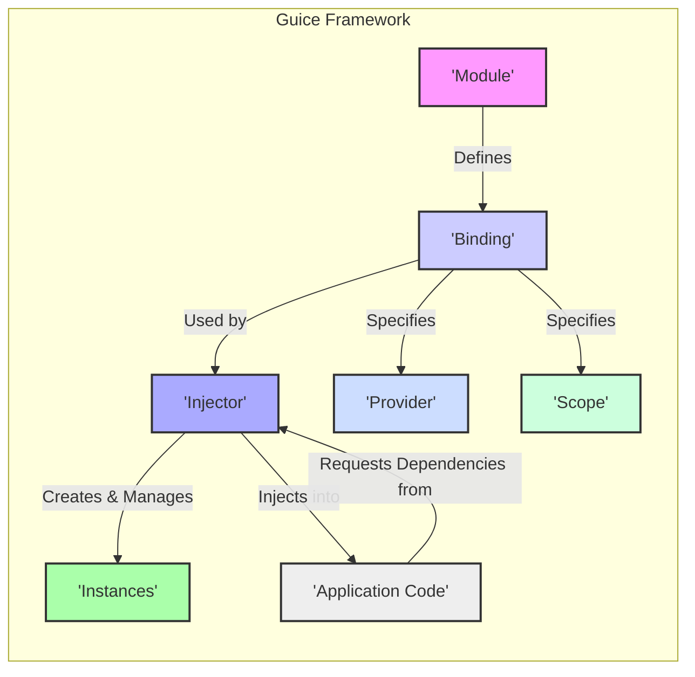
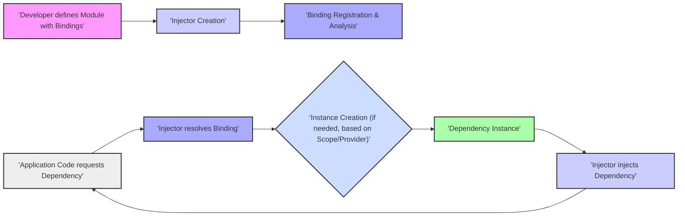

# Project Design Document: Google Guice

**Version:** 1.1
**Date:** 2023-10-27
**Author:** AI Software Architect

## 1. Introduction

This document provides a detailed architectural design overview of the Google Guice dependency injection framework. This document serves as a foundation for subsequent threat modeling activities, outlining the key components, data flows, and interactions within the Guice framework. The focus is on providing a clear understanding of Guice's internal workings to identify potential security vulnerabilities.

## 2. Goals

The primary goals of this design document are:

*   Clearly articulate the architecture and components of the Guice framework, emphasizing aspects relevant to security.
*   Describe the key data flows and interactions within Guice, highlighting potential points of manipulation or vulnerability.
*   Provide sufficient detail to enable effective threat modeling of systems utilizing Guice, allowing for the identification of potential attack vectors.
*   Document the security considerations inherent in the design of Guice and how they can impact applications using it.

## 3. Architectural Overview

Guice is a lightweight dependency injection framework for Java. It promotes modularity and testability by decoupling components and managing their dependencies. Guice achieves this by allowing developers to declare dependencies declaratively, and the framework automatically provides those dependencies at runtime.

The core concepts and their relationships within Guice are:

*   **Modules:**  Configuration blueprints that define *how* dependencies should be provided. They contain `Binding` definitions.
*   **Bindings:**  Specific instructions within a `Module` that dictate *which* concrete implementation should be used for a given interface or class, or how an instance should be obtained (e.g., via a `Provider`).
*   **Injectors:**  The central runtime engine of Guice. It reads `Module` configurations and uses the `Binding` information to create and manage object instances and inject dependencies.
*   **Providers:**  Factories that encapsulate the logic for creating instances of a specific type. They offer more control over instantiation than simple class bindings.
*   **Scopes:**  Define the lifecycle of injected instances, controlling whether a new instance is created each time or if a shared instance is used (e.g., `Singleton`, `RequestScoped`).
*   **Annotations:**  Metadata used to mark injection points (fields, constructors, methods) and to qualify bindings (e.g., `@Inject`, `@Named`).

## 4. Component Details

This section provides a more detailed look at each key component, highlighting aspects relevant to security.

*   **Module:**
    *   Purpose:  To configure the dependency injection rules for an application.
    *   Responsibilities:
        *   Declares bindings between interfaces and concrete implementations.
        *   Specifies custom `Provider` implementations for complex object creation.
        *   Defines the `Scope` for bound types.
        *   Can install other `Module` instances, creating a hierarchy of configurations.
    *   Security Relevance:
        *   If `Module` definitions are loaded from untrusted sources or can be manipulated, malicious bindings could be introduced, leading to the instantiation of harmful objects.
        *   The logic within `configure()` methods of modules executes during injector creation and could potentially perform unintended actions.

*   **Binding:**
    *   Purpose:  To instruct the `Injector` on how to obtain an instance of a specific type.
    *   Responsibilities:
        *   Maps a type to a concrete implementation class.
        *   Associates a type with a `Provider`.
        *   Specifies an existing instance to be used.
        *   Defines the `Scope` of the binding (e.g., singleton).
        *   Can be qualified with annotations (`@Named`, custom annotations) to differentiate between multiple bindings for the same type.
    *   Security Relevance:
        *   Incorrect or malicious bindings can lead to the injection of unintended implementations, potentially bypassing security checks or introducing vulnerabilities.
        *   Bindings to factory methods or constructors with side effects could be exploited if the binding configuration is compromised.

*   **Injector:**
    *   Purpose:  To create and manage object instances and inject their dependencies.
    *   Responsibilities:
        *   Reads and processes `Module` configurations.
        *   Resolves dependencies based on bindings.
        *   Creates instances of required classes, respecting specified `Scope`s.
        *   Performs injection into fields, constructors, and methods annotated with `@Inject`.
    *   Security Relevance:
        *   The `Injector` is the core of the framework; vulnerabilities here could have significant impact.
        *   If the `Injector` can be manipulated or if its configuration is compromised, it could be forced to instantiate malicious objects or inject them into sensitive parts of the application.
        *   Reflection is used extensively, which can be a potential attack vector if not handled carefully.

*   **Provider:**
    *   Purpose:  To provide a custom way to create instances of a type.
    *   Responsibilities:
        *   Implements the `Provider<T>` interface with a `get()` method that returns an instance of `T`.
        *   Can perform complex initialization logic, retrieve instances from external sources, or implement custom caching.
    *   Security Relevance:
        *   `Provider` implementations execute arbitrary code during instance creation. Untrusted or malicious `Provider` implementations can introduce significant vulnerabilities.
        *   `Provider` implementations might interact with external systems or resources, potentially exposing sensitive information or creating attack vectors.

*   **Scope:**
    *   Purpose:  To control the lifecycle and sharing of injected instances.
    *   Responsibilities:
        *   Determines when a new instance is created and when existing instances are reused.
        *   Standard scopes include `Singleton`, `RequestScoped`, `SessionScoped`, and `NoScope`. Custom scopes can also be defined.
    *   Security Relevance:
        *   Incorrectly configured scopes can lead to unintended sharing of state, potentially exposing sensitive information or creating race conditions. For example, a request-scoped object containing user-specific data might be inadvertently shared if the scope is mismanaged.
        *   Custom scopes need to be implemented carefully to avoid security flaws.

*   **Annotations:**
    *   Purpose:  To provide metadata that guides the dependency injection process.
    *   Responsibilities:
        *   Mark injection points (`@Inject`).
        *   Qualify bindings (`@Named`, custom qualifier annotations).
        *   Specify scopes (`@Singleton`, custom scope annotations).
    *   Security Relevance:
        *   While annotations themselves don't execute code, their misuse or misinterpretation by custom extensions could lead to security issues.
        *   Care should be taken when using annotations to control access or permissions, as the framework's behavior is based on these annotations.

## 5. Data Flow

The primary data flow in Guice involves the configuration of bindings and the subsequent injection of dependencies. Understanding this flow is crucial for identifying potential points of interception or manipulation.

1. **Module Definition:** Developers write `Module` implementations, defining `Binding` rules using Guice's Domain-Specific Language (DSL) within the `configure()` method. This defines *how* dependencies will be provided.
2. **Injector Creation:** The application creates an `Injector` instance, typically by calling `Guice.createInjector()` and passing one or more `Module` instances. This initializes the dependency injection container.
3. **Binding Registration and Analysis:** The `Injector` parses the provided `Module`s and registers the defined `Binding`s internally. It also performs static analysis to detect potential issues like circular dependencies.
4. **Dependency Request:** When an object needs a dependency, this is triggered either explicitly by requesting an instance from the `Injector` (e.g., `injector.getInstance(MyClass.class)`) or implicitly when Guice creates an object with `@Inject` annotations on its constructor, fields, or methods.
5. **Dependency Resolution:** The `Injector` looks up the appropriate `Binding` for the requested type. If multiple bindings exist (e.g., due to qualifiers), it uses the annotations at the injection point to select the correct one.
6. **Instance Creation (if necessary):** Based on the resolved `Binding` and its `Scope`, the `Injector` either creates a new instance of the dependency (using the bound class or `Provider`) or retrieves an existing instance (for scoped types like `Singleton`).
7. **Dependency Injection:** The `Injector` injects the created or retrieved dependency instance into the requesting object's fields, constructor parameters, or methods marked with `@Inject`.

## 6. Security Considerations

This section outlines potential security considerations when using Guice.

*   **Configuration Vulnerabilities:**
    *   **Malicious Modules:** If `Module` definitions are loaded from untrusted sources or can be modified by attackers, they can introduce malicious bindings, leading to the instantiation of compromised objects.
    *   **Insecure Bindings:**  Bindings to classes or `Provider`s that perform insecure operations can be exploited if an attacker can influence the binding configuration.
    *   **Exposure of Sensitive Information in Bindings:** Binding configurations might inadvertently expose sensitive information, such as database credentials or API keys, if not managed carefully.

*   **Runtime Vulnerabilities:**
    *   **Untrusted Providers:** Custom `Provider` implementations execute arbitrary code. If these providers are not thoroughly vetted, they can introduce vulnerabilities.
    *   **Scope Mismanagement:** Incorrectly configured scopes can lead to unintended sharing of mutable state, potentially causing race conditions or information leaks.
    *   **Reflection Exploitation:** While Guice uses reflection, vulnerabilities in the application code that allow manipulation of class names or annotations could potentially be used to influence Guice's behavior.
    *   **Circular Dependency Issues:** While Guice detects basic circular dependencies, complex cycles might lead to unexpected behavior or resource exhaustion, potentially creating denial-of-service opportunities.

*   **Dependency Management Vulnerabilities:**
    *   **Vulnerable Dependencies:** If Guice is used to inject dependencies that themselves have known vulnerabilities, these vulnerabilities can be exploited within the application.
    *   **Dependency Confusion:** In scenarios where dependencies are fetched from external repositories, there's a risk of dependency confusion attacks if the wrong dependencies are injected.

*   **Injection Point Vulnerabilities:**
    *   **Injection into Insecure Components:** If Guice injects dependencies into components that are not designed to handle untrusted data or inputs, it can create vulnerabilities.
    *   **Method Injection Exploitation:** While less common, method injection (`@Inject` on methods) could be exploited if an attacker can control the arguments passed to the injected method.

## 7. Deployment

Guice is a library that is integrated directly into Java applications. There is no separate Guice server or deployment process.

*   **Library Inclusion:** The Guice library is typically included as a dependency in the application's build configuration (e.g., using Maven or Gradle).
*   **Application Initialization:** The application code initializes Guice by creating an `Injector` instance, usually at the application's startup.
*   **Dependency Provision:** Once the `Injector` is created, the application can request instances of its dependencies or rely on Guice to inject them into application components.

The security of Guice in a deployed environment depends heavily on the security of the application itself and the configuration of the Guice modules.

## 8. Technologies Used

*   **Java:** The core programming language for Guice.
*   **Reflection:** Used extensively for inspecting classes, accessing members, and performing injection.
*   **Annotations:** Used for declarative dependency management and binding configuration.

## 9. Future Considerations

*   **Enhanced Security Auditing:**  Potentially adding features for better auditing of binding configurations and injection points.
*   **Improved Error Reporting for Security Issues:** Providing more specific warnings or errors for potentially insecure configurations.
*   **Integration with Security Frameworks:** Exploring tighter integration with security frameworks to enforce security policies during dependency injection.

This document provides an improved and more detailed design overview of the Google Guice framework, with a strong emphasis on aspects relevant to threat modeling. It aims to equip security professionals and developers with the necessary information to identify and mitigate potential security risks associated with using Guice in their applications.
