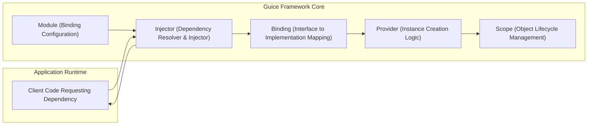

## Project Design Document: Google Guice (Improved)

**1. Introduction**

This document provides an enhanced architectural design of the Google Guice dependency injection framework, specifically tailored for threat modeling. It aims to offer a clear and detailed understanding of Guice's components, their interactions, and the system's overall architecture, with a focus on security-relevant aspects. This document will serve as the foundation for subsequent threat modeling activities.

**1.1. Project Name:** Google Guice

**1.2. Project Purpose:** Guice is a lightweight dependency injection framework for Java. Its primary goal is to simplify the development of modular, testable, and maintainable Java applications by decoupling components and automating the management of their dependencies.

**1.3. Scope:** This document focuses on the core architectural elements and functionalities of the Guice framework itself that are relevant for security analysis. It primarily covers the framework's internal mechanisms for dependency injection and does not delve into the specifics of user-defined application logic or external integrations, except where they directly interact with Guice's core features.

**2. Architecture Overview**

Guice's architecture centers around the `Injector`, which acts as the central container for managing object creation and dependency injection. `Modules` are used to configure how dependencies are bound to their implementations.

**3. Component Details**

*   **Injector:** The heart of Guice. It performs two main functions:
    *   **Dependency Resolution:**  Determines the correct implementation for a requested dependency based on the configured bindings.
    *   **Injection:**  Instantiates objects and injects their required dependencies (constructor, fields, methods). The `Injector` is typically built from one or more `Module` instances.
*   **Module:** A configuration unit written by developers to define *bindings*. A `Module` specifies how interfaces or abstract classes should be mapped to concrete implementations, or how instances of objects should be provided.
*   **Binding:** Represents a specific rule or mapping within the `Injector`. It links a type (interface or class) to a mechanism for obtaining an instance of that type. Bindings can be:
    *   **Linked Bindings:** Explicitly maps an interface to a concrete class.
    *   **Provider Bindings:** Uses a `Provider` class to create instances.
    *   **Instance Bindings:** Binds a specific, pre-existing instance.
    *   **Untargeted Bindings:** Guice attempts to create instances directly if possible.
*   **Provider:** An interface (`com.google.inject.Provider`) that defines a single method, `get()`, responsible for creating and returning an instance of a specific type. `Providers` offer more control over object creation logic than simple linked bindings.
*   **Scope:** Defines the lifecycle and sharing behavior of injected objects. Common scopes include:
    *   `@Singleton`: Only one instance of the object is created per `Injector`.
    *   `@Transient`: A new instance is created every time the dependency is requested.
    *   Custom scopes can be defined for more specific lifecycle management (e.g., request-scoped in web applications).

**4. Data Flow for Dependency Injection**

The process of dependency injection in Guice follows these steps:

*   **Dependency Request:** Application code requests an instance of a class or interface, typically through constructor injection, field injection, or method injection.
*   **Injector Lookup:** The `Injector` receives the request for a specific type.
*   **Binding Resolution:** The `Injector` searches its configured `Bindings` to find a matching binding for the requested type.
*   **Instance Provision:** Based on the found `Binding`:
    *   **Linked Binding:** The `Injector` instantiates the concrete class.
    *   **Provider Binding:** The `Injector` calls the `get()` method of the associated `Provider`.
    *   **Instance Binding:** The `Injector` returns the pre-bound instance.
    *   **Untargeted Binding:** The `Injector` attempts to instantiate the class directly using its default constructor.
*   **Dependency Injection:** If the created instance has dependencies annotated with `@Inject`, the `Injector` recursively resolves and injects those dependencies. This can involve constructor injection, field injection, and method injection.
*   **Scoped Instance Management:** The `Injector` manages the lifecycle of instances according to their defined `Scope`. For example, `@Singleton` instances are stored and reused.
*   **Return Instance:** The fully constructed and injected instance is returned to the requesting application code.

**5. Key Technologies and Concepts**

*   **Java Reflection:** Guice heavily utilizes Java reflection to inspect class structures, annotations, and perform dynamic instantiation and injection. This allows Guice to work without requiring significant changes to application code.
*   **Annotations:** Annotations are crucial for configuring Guice. Key annotations include:
    *   `@Inject`: Marks constructors, fields, or methods for dependency injection.
    *   `@Provides`:  Used within `Modules` to define methods that provide instances of specific types.
    *   `@Singleton`, `@Transient`, and other scope annotations: Define the lifecycle of injected objects.
    *   `@Named` and `@Qualifier` annotations: Used to differentiate between multiple bindings of the same type.
*   **Type Literals:** Used to specify generic types for bindings, which can be important for injecting collections or parameterized types.
*   **Just-In-Time (JIT) Bindings:** If no explicit binding is found, Guice can sometimes create bindings on the fly for concrete classes with accessible constructors.

**6. Deployment Model**

Guice is a runtime library that is integrated into Java applications. Its deployment is directly tied to the deployment of the application itself.

*   **Library Inclusion:** The Guice JAR file is added as a dependency to the project (e.g., using Maven, Gradle).
*   **Injector Initialization:** The application's startup code typically creates an `Injector` instance by providing one or more `Module` implementations. This sets up the dependency injection configuration.
*   **Runtime Dependency Resolution:** During the application's execution, when instances of classes are needed, the application can request them from the `Injector`. Guice handles the creation and injection of dependencies transparently.

**7. Security Considerations for Threat Modeling**

This section outlines potential security considerations and threat vectors related to the Guice framework.

*   **Malicious Module Configuration:**
    *   **Threat:** A compromised or malicious `Module` could be introduced, leading to the injection of malicious or unintended dependencies. This could involve binding legitimate interfaces to malicious implementations.
    *   **Example:** A module could bind a seemingly harmless interface like `UserService` to an implementation that exfiltrates data.
*   **Abuse of Reflection:**
    *   **Threat:** Guice's reliance on reflection could be exploited if the framework itself has vulnerabilities or if application code using Guice makes unsafe assumptions about the types being injected.
    *   **Example:**  A vulnerability in Guice's reflection handling could allow an attacker to manipulate object instantiation or access private members.
*   **Insecure Provider Implementations:**
    *   **Threat:** Custom `Provider` implementations might perform insecure operations during object creation, such as making unvalidated external calls or handling sensitive data improperly.
    *   **Example:** A `Provider` for a database connection could hardcode credentials or be susceptible to injection attacks.
*   **Scope Mismanagement:**
    *   **Threat:** Incorrectly configured scopes could lead to unintended sharing of mutable state between different parts of the application, potentially leading to data corruption or race conditions.
    *   **Example:** A request-scoped object containing sensitive user data might be inadvertently shared across multiple requests if the scope is misconfigured.
*   **Vulnerabilities in Third-Party Modules/Extensions:**
    *   **Threat:** If the application uses external Guice modules or extensions, vulnerabilities in those components could be exploited.
    *   **Example:** A third-party AOP module integrated with Guice might have a vulnerability that allows code injection.
*   **Serialization and Deserialization Issues:**
    *   **Threat:** If Guice-managed objects are serialized and deserialized, vulnerabilities related to object reconstruction (e.g., gadget chains) could be introduced.
    *   **Example:** An attacker could craft a serialized payload that, when deserialized, executes arbitrary code due to the state of injected dependencies.
*   **Dynamic Binding and Configuration:**
    *   **Threat:** Features that allow dynamic binding or configuration based on runtime conditions could introduce complexity and potential security risks if the configuration sources are not properly secured.
    *   **Example:** If binding configurations are loaded from an external file that is not properly protected, an attacker could modify it to inject malicious dependencies.
*   **Circumvention of Access Control:**
    *   **Threat:** While Guice respects Java's visibility modifiers, the way dependencies are injected might inadvertently bypass some intended access restrictions if not carefully considered during design.
    *   **Example:**  A private field might be injected in a way that allows unintended modification from outside the class.

**8. Conclusion**

This improved design document provides a more detailed and security-focused overview of the Google Guice framework's architecture. By outlining the core components, data flow, and potential security considerations, this document serves as a valuable resource for conducting thorough threat modeling activities. The identified potential threats will be further analyzed to develop appropriate mitigation strategies and secure the application's dependency injection mechanism.