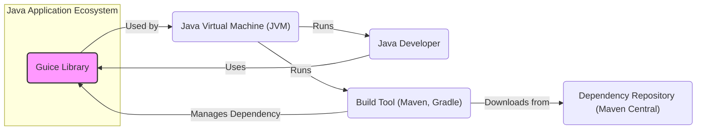
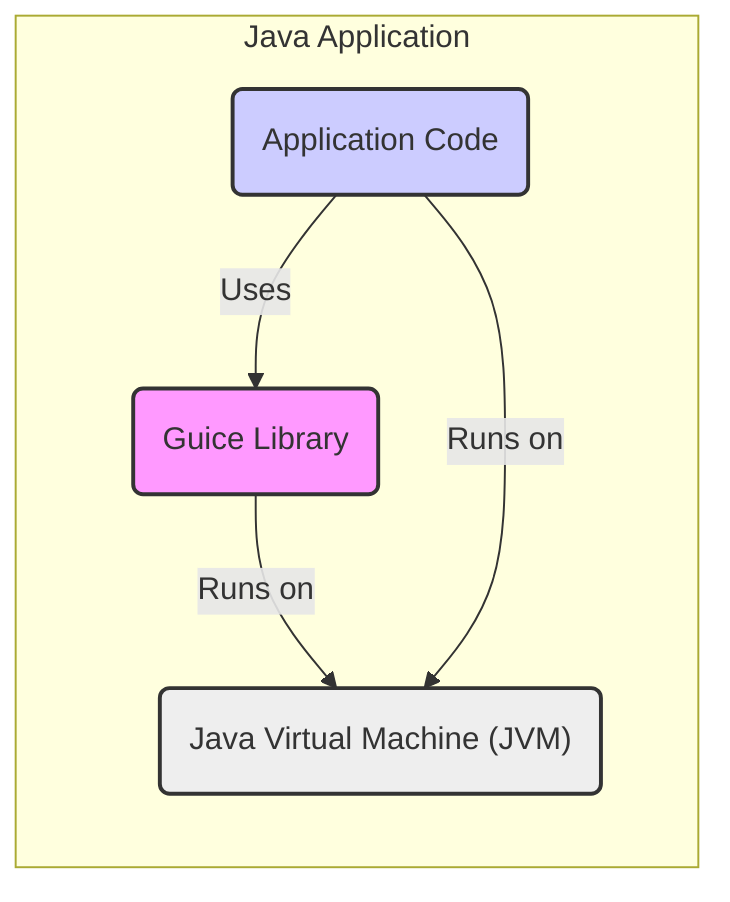
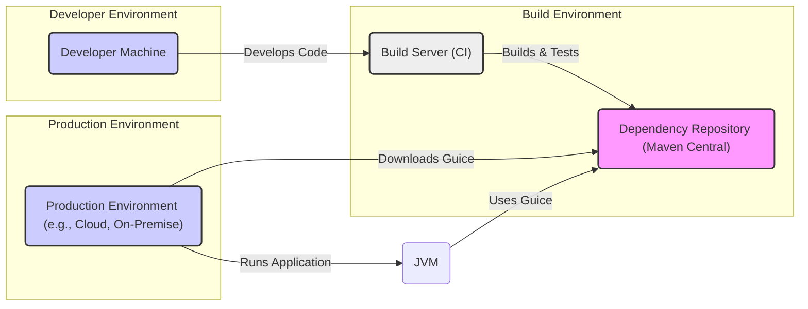

# BUSINESS POSTURE

- Business Priorities and Goals:
  - Guice aims to simplify the development of Java applications by providing a robust and efficient dependency injection framework.
  - It promotes modularity, testability, and maintainability of codebases, leading to faster development cycles and reduced maintenance costs.
  - By decoupling components, Guice enables developers to focus on business logic rather than dependency management, increasing productivity.
- Business Risks:
  - Dependency on a third-party library introduces a potential supply chain risk. If vulnerabilities are discovered in Guice, applications using it may become vulnerable.
  - Improper use of dependency injection patterns, although not directly a Guice vulnerability, can lead to complex and less secure application architectures if not implemented correctly.
  - Performance overhead, although generally minimal, could become a concern in performance-critical applications if dependency injection is not used judiciously.

# SECURITY POSTURE

- Existing Security Controls:
  - security control: GitHub repository with standard security features like branch protection and issue tracking. Implemented in: GitHub repository settings.
  - security control: Open source project with community review, increasing the likelihood of identifying and addressing potential vulnerabilities. Implemented in: Open nature of the project and community contributions.
- Accepted Risks:
  - accepted risk: As a dependency, Guice inherits the risk profile of its development and release process.
  - accepted risk: Potential for vulnerabilities to be discovered in the library after deployment in applications.
- Recommended Security Controls:
  - security control: Implement automated security scanning (SAST, DAST, dependency scanning) in the Guice build pipeline to detect potential vulnerabilities early.
  - security control: Conduct periodic security audits and code reviews by security experts to identify and mitigate potential security weaknesses.
  - security control: Establish a clear vulnerability disclosure and response process to handle security issues promptly and transparently.
  - security control: Promote secure coding practices within the Guice development team and community.
- Security Requirements:
  - Authentication: Not directly applicable to Guice as a library. Authentication is the responsibility of the applications that use Guice.
  - Authorization: Not directly applicable to Guice as a library. Authorization is the responsibility of the applications that use Guice.
  - Input Validation: Input validation within Guice primarily concerns the configuration of bindings. Guice should validate binding configurations to prevent unexpected behavior or errors. Implemented in: Guice core logic during injector creation.
  - Cryptography: Cryptography is not a core requirement for Guice itself. If applications using Guice require cryptography, they should implement it independently of Guice.

# DESIGN

## C4 CONTEXT

- Context Diagram Elements:
  - - Name: Guice Library
    - Type: Software System
    - Description: A dependency injection framework for Java. It helps in managing dependencies between different components of an application, promoting loose coupling and improving code maintainability.
    - Responsibilities:
      - Providing dependency injection capabilities.
      - Managing object creation and lifecycle.
      - Enabling configuration of bindings between interfaces and implementations.
    - Security controls:
      - security control: Input validation of binding configurations. Implemented in: Guice core logic.
  - - Name: Java Developer
    - Type: Person
    - Description: Software developers who use Guice to build Java applications.
    - Responsibilities:
      - Developing Java applications using Guice.
      - Configuring Guice modules and bindings.
      - Integrating Guice into application build processes.
    - Security controls:
      - security control: Secure coding practices when using Guice. Implemented in: Developer training and guidelines.
  - - Name: Build Tool (Maven, Gradle)
    - Type: Software System
    - Description: Tools used to build and manage Java projects, including dependency management.
    - Responsibilities:
      - Managing project dependencies, including Guice.
      - Compiling and packaging Java code.
      - Running tests and performing other build tasks.
    - Security controls:
      - security control: Dependency scanning to identify vulnerable dependencies, including Guice and its transitive dependencies. Implemented in: Build tool plugins and configurations.
  - - Name: Java Virtual Machine (JVM)
    - Type: Software System
    - Description: The runtime environment for Java applications.
    - Responsibilities:
      - Executing Java bytecode.
      - Providing core Java libraries and functionalities.
      - Managing memory and resources for Java applications.
    - Security controls:
      - security control: JVM security features like sandboxing and security managers. Implemented in: JVM runtime environment.
  - - Name: Dependency Repository (Maven Central)
    - Type: External System
    - Description: A public repository where Java libraries, including Guice, are published and distributed.
    - Responsibilities:
      - Hosting and distributing Java libraries.
      - Providing access to library metadata and artifacts.
    - Security controls:
      - security control: Repository security measures to ensure integrity and availability of hosted libraries. Implemented in: Maven Central infrastructure and policies.

## C4 CONTAINER

- Container Diagram Elements:
  - - Name: Guice Library
    - Type: Library
    - Description: The Guice dependency injection library, packaged as a JAR file. It is integrated into Java applications as a dependency.
    - Responsibilities:
      - Providing core dependency injection functionality to the application.
      - Managing the creation and injection of application components.
    - Security controls:
      - security control: Code reviews and testing of Guice library code. Implemented in: Guice development process.
  - - Name: Application Code
    - Type: Application Component
    - Description: The custom Java code of the application that utilizes Guice for dependency injection.
    - Responsibilities:
      - Implementing the business logic of the application.
      - Defining Guice modules and bindings to configure dependency injection.
      - Utilizing injected dependencies to perform application tasks.
    - Security controls:
      - security control: Secure coding practices in application code to properly use dependency injection and handle injected dependencies securely. Implemented in: Application development process.
  - - Name: Java Virtual Machine (JVM)
    - Type: Execution Environment
    - Description: The Java Virtual Machine that executes both the application code and the Guice library.
    - Responsibilities:
      - Providing the runtime environment for the application and Guice.
      - Managing resources and executing Java bytecode.
    - Security controls:
      - security control: JVM security features and configurations. Implemented in: JVM deployment and configuration.

## DEPLOYMENT

- Deployment Diagram Elements:
  - - Name: Developer Machine
    - Type: Environment
    - Description: The local machine used by developers to write, test, and debug Guice code and applications using Guice.
    - Responsibilities:
      - Development and local testing of Guice and applications.
      - Code editing and version control.
    - Security controls:
      - security control: Developer workstation security practices (OS hardening, antivirus, etc.). Implemented in: Company security policies and developer training.
  - - Name: Build Server (CI)
    - Type: Environment
    - Description: A Continuous Integration server that automates the build, test, and release process for Guice.
    - Responsibilities:
      - Automated building and testing of Guice code.
      - Running security scans and quality checks.
      - Publishing release artifacts to the dependency repository.
    - Security controls:
      - security control: Secure build pipeline configuration and access controls. Implemented in: CI/CD platform security settings.
      - security control: Automated security scanning tools integrated into the build pipeline. Implemented in: CI/CD pipeline configuration.
  - - Name: Dependency Repository (Maven Central)
    - Type: Environment
    - Description: The public repository where Guice JAR files are published and made available for download.
    - Responsibilities:
      - Hosting and distributing Guice releases.
      - Ensuring the integrity and availability of Guice artifacts.
    - Security controls:
      - security control: Repository security measures to protect against unauthorized modifications and ensure artifact integrity. Implemented in: Maven Central infrastructure and policies.
  - - Name: Production Environment (e.g., Cloud, On-Premise)
    - Type: Environment
    - Description: The environment where applications using Guice are deployed and run in production. This could be cloud infrastructure, on-premise servers, or other deployment environments.
    - Responsibilities:
      - Running and hosting applications that depend on Guice.
      - Providing the runtime environment (JVM) for applications.
    - Security controls:
      - security control: Infrastructure security controls (network security, access management, OS hardening, etc.). Implemented in: Production environment security configuration.
      - security control: Application runtime security measures. Implemented in: Application deployment and configuration.

## BUILD

```mermaid
flowchart LR
    developer("Developer") --> github_repo("GitHub Repository");
    github_repo --> ci_system("CI System (GitHub Actions)");
    ci_system --> build_process("Build Process (Maven)");
    build_process --> security_checks("Security Checks (SAST, Dependency Scan)");
    security_checks --> artifact_repo("Artifact Repository (Maven Central)");

    style developer fill:#ccf,stroke:#333,stroke-width:2px
    style github_repo fill:#eee,stroke:#333,stroke-width:2px
    style ci_system fill:#f9f,stroke:#333,stroke-width:2px
    style build_process fill:#ccf,stroke:#333,stroke-width:2px
    style security_checks fill:#eee,stroke:#333,stroke-width:2px
    style artifact_repo fill:#f9f,stroke:#333,stroke-width:2px
```

- Build Process Elements:
  - - Name: Developer
    - Type: Person
    - Description: A software developer contributing to the Guice project.
    - Responsibilities:
      - Writing and committing code changes to the Guice repository.
      - Participating in code reviews.
    - Security controls:
      - security control: Developer authentication and authorization to access the GitHub repository. Implemented in: GitHub access control settings.
      - security control: Secure coding training and practices. Implemented in: Developer onboarding and training programs.
  - - Name: GitHub Repository
    - Type: Code Repository
    - Description: The Git repository hosted on GitHub that stores the Guice source code.
    - Responsibilities:
      - Version control for Guice source code.
      - Collaboration platform for developers.
      - Triggering CI/CD pipelines on code changes.
    - Security controls:
      - security control: Branch protection rules to enforce code review and prevent direct commits to protected branches. Implemented in: GitHub repository settings.
      - security control: Access control to restrict who can contribute to the repository. Implemented in: GitHub repository permissions.
  - - Name: CI System (GitHub Actions)
    - Type: Automation System
    - Description: GitHub Actions is used as the Continuous Integration system to automate the build, test, and release process for Guice.
    - Responsibilities:
      - Automating the build process upon code changes.
      - Running unit and integration tests.
      - Performing security checks and code quality analysis.
      - Publishing build artifacts.
    - Security controls:
      - security control: Secure configuration of CI workflows to prevent unauthorized modifications. Implemented in: GitHub Actions workflow definitions and permissions.
      - security control: Secrets management to securely handle credentials used in the build process. Implemented in: GitHub Actions secrets management.
  - - Name: Build Process (Maven)
    - Type: Build Tool
    - Description: Maven is used as the build tool to compile, package, and manage dependencies for the Guice project.
    - Responsibilities:
      - Compiling Java source code.
      - Managing project dependencies.
      - Packaging Guice as JAR files.
      - Running build scripts and plugins.
    - Security controls:
      - security control: Dependency management to ensure only trusted and verified dependencies are used. Implemented in: Maven dependency management and repository configurations.
      - security control: Build tool configuration security to prevent malicious build scripts or plugins. Implemented in: Maven project configuration and build file reviews.
  - - Name: Security Checks (SAST, Dependency Scan)
    - Type: Security Tooling
    - Description: Automated security scanning tools integrated into the build process to identify potential vulnerabilities. Includes Static Application Security Testing (SAST) and dependency vulnerability scanning.
    - Responsibilities:
      - Identifying potential security vulnerabilities in the Guice codebase.
      - Detecting vulnerable dependencies.
      - Generating reports on security findings.
    - Security controls:
      - security control: Regular updates of security scanning tools and vulnerability databases. Implemented in: CI/CD pipeline maintenance and tool updates.
      - security control: Configuration of security scanning tools to match project security requirements. Implemented in: Security scanning tool configurations.
  - - Name: Artifact Repository (Maven Central)
    - Type: Artifact Storage
    - Description: Maven Central is used as the artifact repository to publish and distribute Guice JAR files.
    - Responsibilities:
      - Storing and distributing Guice release artifacts.
      - Providing access to Guice JAR files for developers and build tools.
    - Security controls:
      - security control: Secure artifact publishing process to ensure integrity and authenticity of released artifacts. Implemented in: Maven Central publishing policies and procedures.
      - security control: Repository security measures to protect against unauthorized access and modifications. Implemented in: Maven Central infrastructure security.

# RISK ASSESSMENT

- Critical Business Processes:
  - Development of Java applications that rely on dependency injection for modularity, testability, and maintainability.
  - Distribution and consumption of the Guice library by the Java developer community.
- Data to Protect and Sensitivity:
  - Guice library source code: Sensitive as it represents the intellectual property and core functionality of the project. Confidentiality and integrity are important.
  - Guice build artifacts (JAR files): Integrity and availability are critical to ensure users can reliably and securely use the library.
  - Vulnerability information: Confidentiality is important until a fix is released, then transparency is key for responsible disclosure.

# QUESTIONS & ASSUMPTIONS

- Questions:
  - What is the intended audience and use case for this design document? (Threat modeling for Guice library itself, or for applications using Guice?) - Assuming threat modeling for Guice library itself.
  - Are there specific security compliance requirements that Guice needs to adhere to? - Assuming general best practices for open-source libraries.
  - What is the process for handling security vulnerabilities reported in Guice? - Assuming standard open-source vulnerability disclosure and response process.
- Assumptions:
  - Guice is intended to be a widely used, general-purpose dependency injection library for Java.
  - Security is a significant concern for the Guice project, given its potential impact on applications that depend on it.
  - The Guice project follows standard open-source development practices, including community involvement and transparency.
  - The target deployment environment for applications using Guice is varied, ranging from cloud to on-premise environments.