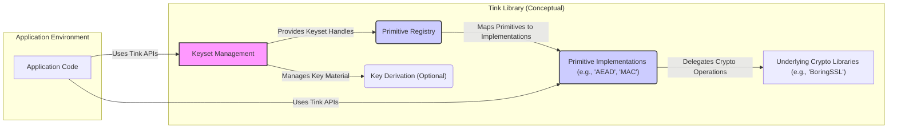
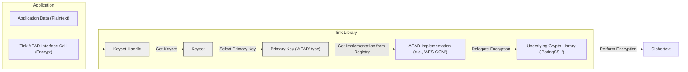

# Project Design Document: Google Tink Cryptographic Library

**Version:** 1.1
**Date:** October 26, 2023
**Prepared By:** Gemini (AI Language Model)

## 1. Introduction

This document provides an enhanced architectural design overview of the Google Tink cryptographic library, building upon the information available at [https://github.com/google/tink](https://github.com/google/tink). This improved document aims to provide a more detailed and clearer understanding of Tink's architecture, specifically for the purpose of subsequent threat modeling activities. It elaborates on the key components, their interactions, and the underlying security principles of the Tink library to facilitate the identification of potential threats and vulnerabilities.

## 2. Goals

*   Provide a clear, concise, and comprehensive architectural overview of the Tink library.
*   Elaborate on the responsibilities and interactions of key components.
*   Illustrate the data flow within the library for common cryptographic operations with more detail.
*   Highlight important security considerations and their implications in more depth.
*   Serve as a robust and detailed foundation for identifying potential threats and vulnerabilities during threat modeling sessions.

## 3. Non-Goals

*   Provide an exhaustive code-level analysis of every class and function within Tink.
*   Detail specific implementation choices within each language binding (Java, C++, Go, Python, etc.) beyond illustrative examples.
*   Include performance benchmarks or optimization strategies.
*   Offer a step-by-step guide for using the Tink library; focus remains on architectural understanding.

## 4. High-Level Architecture

Tink is architected as a multi-language, opinionated cryptographic library focused on simplifying the correct usage of cryptography and making misuse more difficult. Its design emphasizes secure defaults and well-defined abstractions.

**Key Architectural Components:**

*   **Application Code:** The software utilizing the Tink library for cryptographic functionalities.
*   **Keyset Management:** The core component responsible for the lifecycle management of cryptographic keys. This includes generation, storage, rotation, and access control.
*   **Primitive Registry:** A central mapping service that connects abstract cryptographic primitives to their concrete implementations. This enables flexibility and algorithm agility.
*   **Key Derivation (Optional):**  A feature allowing the derivation of cryptographic keys from a master secret or passphrase, adding a layer of indirection and potentially simplifying key management in certain scenarios.
*   **Primitive Implementations:** The concrete implementations of cryptographic algorithms for various primitives (e.g., AEAD, MAC, Signature). Tink often offers multiple implementations for a single primitive.
*   **Underlying Crypto Libraries:**  Well-vetted, low-level cryptographic libraries (like BoringSSL) that Tink leverages for the actual cryptographic computations.

## 5. Component Details

This section provides a more in-depth look at the key components and their responsibilities.

### 5.1. Keyset Management

*   **Purpose:** To manage the lifecycle of cryptographic keys securely and effectively.
*   **Responsibilities:**
    *   **Key Generation:** Creating new cryptographic keys based on specified algorithms and parameters.
    *   **Key Storage:** Securely storing key material, potentially utilizing integrations with Key Management Systems (KMS) or custom storage solutions.
    *   **Key Rotation:** Facilitating the process of replacing old keys with new ones to mitigate the risk of compromise.
    *   **Key Disabling/Revocation:**  Providing mechanisms to disable or revoke compromised or outdated keys.
    *   **Access Control:** Enforcing policies to ensure only authorized entities can access and utilize specific keys.
*   **Key Concepts:**
    *   **Keyset:** A logical collection of keys used for a specific cryptographic task. It typically includes a primary key for new operations and potentially older keys for decryption/verification during rotation.
    *   **Key:** Represents a single cryptographic key, encompassing its material, algorithm parameters, and status (e.g., `ENABLED`, `DISABLED`).
    *   **Keyset Handle:** A secure reference to a keyset, providing controlled access to the underlying key material.
    *   **Key Template:** A specification defining the parameters for generating a new key (e.g., algorithm type, key size).
    *   **Key Manager:** An interface providing methods for managing keysets, such as creation, rotation, and obtaining keys for cryptographic operations.
    *   **Key Deriver:**  A component responsible for generating new keys from a master secret or passphrase, often using techniques like HKDF.

### 5.2. Primitive Registry

*   **Purpose:** To act as a central directory for cryptographic primitive implementations.
*   **Responsibilities:**
    *   **Mapping Primitives to Implementations:**  Associating abstract primitive interfaces (e.g., `Aead`, `Mac`, `DigitalSignature`) with their concrete implementations.
    *   **Custom Implementation Registration:** Allowing developers to register their own custom implementations of primitives.
    *   **Algorithm Agility Enablement:**  Facilitating the ability to switch between different cryptographic algorithms or implementations without significant code changes in the application.
*   **Key Concepts:**
    *   **Primitive:** An abstract interface representing a specific type of cryptographic operation.
    *   **Primitive Wrapper:** A mechanism to adapt different implementations to conform to the common primitive interface, ensuring interoperability.
    *   **Catalog:**  The collection of registered primitive implementations available for use.

### 5.3. Primitive Implementations

*   **Purpose:** To provide concrete implementations of cryptographic algorithms for defined primitives.
*   **Responsibilities:**
    *   **Performing Cryptographic Computations:** Executing the actual cryptographic operations (e.g., encryption, decryption, signing, verification) based on the selected algorithm.
    *   **Adhering to Security Standards:** Ensuring implementations meet the security requirements and specifications of the corresponding primitive.
    *   **Leveraging Underlying Libraries:** Utilizing well-established cryptographic libraries (e.g., BoringSSL) for the core cryptographic functions.
*   **Examples of Primitives and their Implementations:**
    *   **AEAD (Authenticated Encryption with Associated Data):** Implementations might include AES-GCM, ChaCha20-Poly1305.
    *   **MAC (Message Authentication Code):** Implementations might include HMAC-SHA256, HMAC-SHA512.
    *   **Digital Signatures:** Implementations might include ECDSA, RSA-PSS.
    *   **Streaming AEAD:** For handling large data streams.
    *   **Deterministic AEAD:**  For scenarios requiring deterministic ciphertext.
    *   **Hybrid Encryption:** Combining symmetric and asymmetric encryption.
    *   **Key Agreement:** For establishing shared secrets between parties.

### 5.4. Underlying Crypto Libraries

*   **Purpose:** To provide the foundational cryptographic algorithms and building blocks.
*   **Examples:**
    *   BoringSSL (often the default)
    *   Platform-specific cryptographic libraries (depending on the language binding and environment).
*   **Tink's Abstraction:** Tink aims to abstract away the complexities and potential pitfalls of directly using these low-level libraries, offering a safer and more user-friendly API.

## 6. Data Flow for Encryption (Illustrative Example)

The following diagram illustrates a more detailed data flow for an encryption operation using the AEAD primitive.

**Detailed Steps:**

1. The application provides plaintext data to the Tink AEAD interface, calling the `encrypt` method.
2. Tink retrieves the appropriate `Keyset Handle`, which securely references the keyset.
3. The `Keyset Handle` is used to access the `Keyset`.
4. The primary key (of type AEAD) is selected from the `Keyset`.
5. The Primitive Registry is consulted to find the corresponding AEAD implementation based on the primary key's algorithm.
6. The selected AEAD implementation (e.g., the AES-GCM implementation) is invoked.
7. The AEAD implementation delegates the actual encryption operation to the underlying crypto library (e.g., BoringSSL).
8. BoringSSL performs the encryption algorithm on the plaintext using the key material.
9. The resulting ciphertext is returned to the application.

## 7. Security Considerations

Tink's design incorporates several key security principles to minimize the risk of cryptographic misuse and vulnerabilities:

*   **Secure Defaults:** Tink promotes the use of secure and recommended cryptographic algorithms and parameters by default, reducing the likelihood of developers choosing weaker options. For example, AES-GCM is often a default choice for AEAD.
*   **Robust Key Management:**  A strong emphasis is placed on secure key generation, storage (including KMS integrations), and rotation. This helps protect keys throughout their lifecycle and limits the impact of potential compromises.
*   **Misuse Resistance:** The API is designed to be difficult to misuse. For instance, Tink often handles nonce generation automatically for AEAD, preventing common errors.
*   **Algorithm Agility:** The architecture allows for switching between different cryptographic algorithms or implementations with relative ease. This is crucial for responding to newly discovered vulnerabilities or adopting more secure algorithms in the future.
*   **Security Audits and Reviews:** Tink undergoes regular security audits and code reviews by security experts to identify and address potential vulnerabilities proactively.
*   **Principle of Least Privilege:** Access to key material and cryptographic operations is controlled and restricted to the necessary components, minimizing the attack surface.
*   **Defense in Depth:** Multiple layers of security are employed. For example, even if an attacker gains access to a keyset handle, they still need the key material to perform cryptographic operations, especially if a KMS is used.
*   **Careful Handling of Side Channels:** While not always explicitly visible in the architecture, Tink's implementations aim to mitigate side-channel attacks where feasible.

## 8. Deployment Considerations

Tink is designed for broad applicability across various deployment scenarios:

*   **Multi-Language Support:** Libraries are available for multiple programming languages (Java, C++, Go, Python, etc.), enabling its use in diverse application stacks.
*   **Platform Independence:** Tink aims to be platform-agnostic, allowing it to run on different operating systems and hardware.
*   **Cloud Integration (KMS):**  Seamless integration with cloud-based Key Management Systems (e.g., Google Cloud KMS, AWS KMS, Azure Key Vault) for secure key storage and management in cloud environments.
*   **On-Premise Deployment:** Support for custom key storage mechanisms allows for deployment in on-premise environments or situations where cloud KMS is not desired.
*   **Mobile Applications:** Tink can be integrated into mobile applications to provide secure local storage and communication.
*   **Web Applications:** Used for securing data at rest and in transit within web applications.

## 9. Future Considerations

*   **Incorporation of Post-Quantum Cryptography:**  Exploring and integrating post-quantum cryptographic algorithms as they become standardized.
*   **Advanced Key Management Features:**  Further enhancements to key rotation policies, automated key revocation, and more granular access control mechanisms.
*   **Formal Verification Techniques:**  Investigating the application of formal verification methods to provide stronger guarantees about the security and correctness of core Tink components.
*   **Improved Error Handling and Reporting:**  Providing more detailed and actionable error messages to assist developers in debugging and resolving issues.

This improved document provides a more detailed and nuanced understanding of the Google Tink cryptographic library's architecture, emphasizing aspects relevant to threat modeling. By understanding these components, their interactions, and the underlying security principles, security professionals can more effectively identify potential threats and vulnerabilities within systems utilizing Tink.