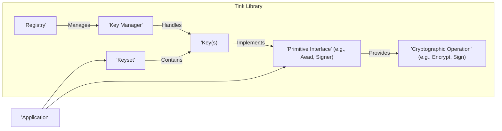
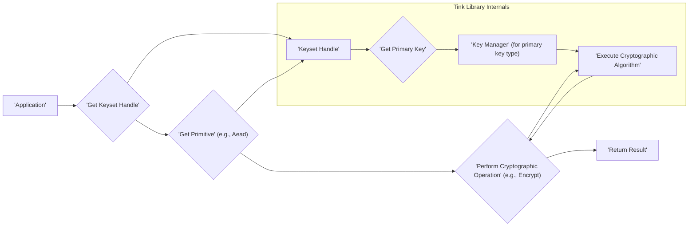

# Project Design Document: Tink Cryptographic Library

**Version:** 1.1
**Date:** October 26, 2023
**Author:** Gemini (AI Model)

## 1. Introduction

This document provides an enhanced and detailed design overview of the Tink cryptographic library, an open-source library developed by Google. This document is specifically designed to serve as a robust foundation for future threat modeling activities. It meticulously outlines the key components, architecture, and data flow within Tink, offering a comprehensive understanding of the system's structure, functionality, and security-relevant interactions.

Tink's core objective is to empower developers with secure and user-friendly cryptographic primitives, thereby minimizing the likelihood of introducing common cryptographic vulnerabilities. It achieves this by offering a standardized API that transcends programming language barriers and supports a diverse range of cryptographic algorithms and key management strategies.

## 2. Goals and Non-Goals

**Goals:**

* **Provision of a Secure and Usable Cryptographic Library:** To significantly simplify the process for developers to implement cryptography correctly and effectively, thereby proactively preventing common security vulnerabilities.
* **Cross-Language Consistent API:** To ensure developers can leverage the same cryptographic concepts and patterns seamlessly, irrespective of the programming language they are utilizing.
* **Broad Spectrum of Cryptographic Primitives:** To encompass a comprehensive set of common cryptographic functionalities, including symmetric and asymmetric encryption, digital signatures, message authentication codes (MACs), and hybrid encryption.
* **Promotion of Key Management Best Practices:** To furnish developers with robust mechanisms for secure key generation, reliable storage, and systematic rotation.
* **Enablement of Algorithm Agility:** To facilitate seamless transitions to newer and more secure algorithms as cryptographic best practices evolve and new threats emerge.
* **Encouragement of Secure Defaults:** To guide developers towards the adoption of secure cryptographic parameters and configurations by default, reducing the risk of misconfiguration.

**Non-Goals:**

* **Comprehensive Security Solution:** Tink's focus is deliberately limited to cryptographic primitives. It does not aim to provide solutions for tangential security aspects such as authentication, authorization, or network security.
* **Specific Key Management Infrastructure Provider:** While Tink offers tools and abstractions for key management, it does not prescribe or implement specific key storage or distribution mechanisms. Integration with specialized systems like Hardware Security Modules (HSMs) is considered an extension, not a core responsibility.
* **Universal Security Library:** Tink's scope is intentionally confined to the domain of cryptography. It does not seek to address broader security needs beyond cryptographic operations.

## 3. High-Level Architecture

Tink's architectural design is centered around the concepts of cryptographic *primitives* and *keysets*. The library exposes a set of well-defined interfaces that encapsulate common cryptographic operations, abstracting away the underlying complexities.

**Key Components:**

* **Keyset:**  A logical container holding cryptographic keys intended for a specific purpose. It can contain multiple `Key` objects, with one designated as the primary key for initiating new cryptographic operations. The `Keyset` also stores metadata about the keys, such as their status and creation time.
* **Key:** Represents an individual cryptographic key, encompassing its raw material (the actual key bytes), associated algorithm parameters (e.g., initialization vectors, salt), and its operational status (e.g., enabled, disabled, destroyed).
* **Primitive Interface:** A clearly defined interface that abstracts a specific cryptographic capability (e.g., `Aead` for authenticated encryption with associated data, `Signer` for generating digital signatures). These interfaces provide a consistent way to interact with different cryptographic algorithms.
* **Cryptographic Operation:** The concrete cryptographic function executed by a `Primitive` implementation (e.g., encryption, decryption, signing, verification). The specific algorithm used is determined by the underlying `Key`.
* **Registry:** A central management component responsible for maintaining a mapping between key types and their corresponding `KeyManager` implementations. This allows Tink to dynamically select the correct handler for a given key.
* **Key Manager:**  A specialized component dedicated to managing a specific type of cryptographic key. It handles tasks such as generating new keys of that type, parsing serialized key material, and performing cryptographic operations using keys of that type.
* **Application:** The external software system that utilizes the Tink library to perform cryptographic operations within its workflow.

## 4. Detailed Design

### 4.1. Keyset Management

* **Keyset Handle:** The primary and secure entry point for applications to interact with keysets. It provides controlled access to the keyset without directly exposing the sensitive key material. The `KeysetHandle` enforces security policies and manages the lifecycle of the keyset.
* **Keyset Reader/Writer:**  Abstract interfaces defining how keysets are serialized and deserialized from various storage mediums. Tink offers concrete implementations for reading and writing keysets in formats like JSON and binary, allowing integration with different storage solutions (e.g., local files, cloud storage, dedicated key management services).
* **Key Rotation Mechanism:** Tink facilitates seamless key rotation by allowing a keyset to contain multiple keys simultaneously. New encryption or signing operations utilize the designated primary key, while older, still-enabled keys can be used for decryption or verification of previously processed data. This ensures backward compatibility and reduces disruption during key transitions.
* **Granular Key Status:** Each `Key` within a `Keyset` has a specific status that governs its usability:
    * `'ENABLED'`: The key is fully operational and can be used for both new cryptographic operations and processing existing data.
    * `'DISABLED'`: The key is deactivated for new operations but remains available for decrypting or verifying data encrypted or signed with it in the past. This is crucial for smooth key rotation.
    * `'DESTROYED'`: The key material is considered permanently irrecoverable and should no longer be used. This status indicates that the key has been securely deleted.

### 4.2. Primitives

Tink offers a curated set of `Primitive` interfaces, each representing a distinct cryptographic capability:

* **`'Aead'` (Authenticated Encryption with Associated Data):**  Provides robust authenticated encryption, guaranteeing the confidentiality and integrity of the encrypted data. It also allows for the inclusion of associated data that is authenticated but not encrypted, ensuring its integrity.
* **`'DeterministicAead'`:**  A specialized `Aead` variant that produces the identical ciphertext for the same plaintext and associated data when encrypted with the same key. While useful in specific scenarios, its deterministic nature can leak information and requires careful consideration before use.
* **`'StreamingAead'`:**  Designed for handling large streams of data, enabling authenticated encryption without requiring the entire stream to be loaded into memory at once. This is essential for processing large files or network streams efficiently and securely.
* **`'Mac'` (Message Authentication Code):**  Provides functionality for generating and verifying message authentication codes. MACs are cryptographic hashes generated using a secret key, allowing verification of the message's integrity and authenticity.
* **`'PublicKeySign'`:**  Defines the interface for generating digital signatures. Implementations use a private key to create a signature that can be used to verify the authenticity and integrity of data.
* **`'PublicKeyVerify'`:**  The counterpart to `PublicKeySign`, providing the interface for verifying digital signatures using the corresponding public key.
* **`'HybridEncrypt'`:**  Implements hybrid encryption, combining the efficiency of symmetric encryption with the key management benefits of asymmetric encryption. Data is encrypted using a freshly generated symmetric key, which is then encrypted with the recipient's public key.
* **`'HybridDecrypt'`:**  The decryption counterpart to `HybridEncrypt`, allowing decryption of data encrypted using hybrid encryption with the corresponding private key.
* **`'Prf'` (Pseudorandom Function):**  Provides a mechanism for generating deterministic pseudorandom outputs based on a secret key and an input. PRFs are valuable for tasks like key derivation and generating unpredictable values.

### 4.3. Key Management

* **Key Templates:**  Predefined, recommended configurations for creating new keys with specific algorithm parameters and security settings. Tink provides a library of standard key templates that represent best practices for common cryptographic use cases, simplifying secure key creation.
* **Key Managers:**  Concrete implementations responsible for the lifecycle management of specific key types. They encapsulate the logic for generating new keys, securely parsing key material from different formats, and performing the cryptographic operations associated with their key type.
* **Registry Functionality:** The central component that dynamically maps key types (identified by a unique identifier) to their corresponding `KeyManager` implementations. This allows Tink to support a diverse range of key types in a modular and extensible manner.
* **Custom Key Type Registration:** Tink's architecture allows developers to register their own custom key types and associated `KeyManager` implementations. This extensibility enables the integration of specialized or non-standard cryptographic algorithms and key formats.

### 4.4. Language Bindings

Tink offers language-specific bindings to facilitate its use across various development environments:

* Java
* C++
* Go
* Python
* Objective-C
* Swift
* JavaScript

These bindings aim to provide a consistent API and core functionality across different platforms, simplifying cross-platform development and ensuring predictable behavior.

## 5. Data Flow

A typical cryptographic operation within an application utilizing Tink involves the following sequence of interactions:

**Detailed Data Flow for Encryption (Example):**

1. **Application Initiation:** The application initiates a request to encrypt data, specifying the relevant keyset.
2. **Keyset Handle Acquisition:** The application obtains a `KeysetHandle`, which provides a secure reference to the desired keyset.
3. **Primitive Retrieval:** The application requests an `Aead` primitive (or another relevant primitive) from the `KeysetHandle`. Tink's internal logic selects the appropriate `Key` from the `Keyset`, typically the designated primary key.
4. **Key Manager Invocation:** The `KeysetHandle` delegates the encryption operation to the specific `KeyManager` responsible for handling the primary key's cryptographic algorithm and type.
5. **Cryptographic Execution:** The `KeyManager` utilizes the key material and associated algorithm parameters to perform the actual encryption process on the provided data.
6. **Result Delivery:** The resulting encrypted ciphertext is returned to the calling application.

**Detailed Data Flow for Decryption (Example):**

1. **Application Initiation:** The application requests the decryption of ciphertext, referencing the relevant keyset.
2. **Keyset Handle Acquisition:** The application retrieves the `KeysetHandle` associated with the ciphertext.
3. **Primitive Retrieval:** The application requests an `Aead` primitive (or the corresponding decryption primitive) from the `KeysetHandle`.
4. **Key Iteration and Attempt:** Tink iterates through the keys within the `Keyset`, starting with the primary key, and attempts decryption using each enabled key. This mechanism supports decryption even after key rotation has occurred.
5. **Key Manager Invocation:** For each key in the `Keyset`, the decryption request is delegated to the corresponding `KeyManager` responsible for that key's type.
6. **Cryptographic Execution:** The `KeyManager` attempts to decrypt the ciphertext using its assigned key material and algorithm parameters.
7. **Result Delivery:** If decryption is successful with one of the keys, the original plaintext is returned to the application.

## 6. Security Considerations

This section delves into critical security aspects of Tink, providing essential context for threat modeling activities:

* **Key Management Vulnerabilities:**
    * **Insecure Key Generation:** Tink relies on cryptographically secure random number generators (CSRNGs) provided by the underlying platform or language. Compromises or weaknesses in these RNGs could lead to predictable or weak keys.
    * **Vulnerable Key Storage:** Tink does not dictate how `KeysetHandle`s or underlying key material are stored. Applications must implement secure storage mechanisms. Storing keys in plaintext or easily accessible locations is a critical vulnerability.
    * **Improper Key Rotation:** While Tink provides tools for key rotation, incorrect implementation (e.g., failing to rotate keys regularly, using weak new keys) can negate its benefits and increase the window of opportunity for attackers.
    * **Insecure Key Destruction:**  Failure to securely delete key material after it is no longer needed can leave it vulnerable to recovery. Tink's `'DESTROYED'` status is a logical marker; the underlying storage must ensure physical deletion.
* **Cryptographic Algorithm Risks:**
    * **Use of Weak Algorithms:**  Selecting or defaulting to cryptographically weak or outdated algorithms makes the encrypted data or signatures susceptible to attacks.
    * **Algorithm Agility Challenges:**  While Tink supports algorithm agility, improper migration processes or continued support for deprecated algorithms can introduce vulnerabilities. Rollback attacks might be possible if old, vulnerable algorithms remain active.
    * **Side-Channel Attack Susceptibility:**  Implementations of cryptographic algorithms, even within Tink, can be vulnerable to side-channel attacks that exploit information leaked through timing, power consumption, or electromagnetic emanations.
* **Implementation-Specific Vulnerabilities:**
    * **Bugs in Tink Library Code:**  Like any software, Tink itself could contain bugs that lead to security vulnerabilities. Regular security audits and prompt patching are essential.
    * **Dependency Chain Risks:**  Vulnerabilities in Tink's external dependencies can indirectly compromise its security. Careful dependency management and security scanning are necessary.
* **API Misuse and Configuration Errors:**
    * **Incorrect Parameter Usage:** Developers might misuse the Tink API by providing incorrect parameters or configurations, leading to weakened security (e.g., using an insecure encryption mode).
    * **Ignoring Security Guidance:** Tink may provide warnings or recommendations regarding secure usage. Ignoring these guidelines can introduce vulnerabilities.
* **Platform and Environment Security:**
    * **Compromised Operating System:** The security of the underlying operating system and its cryptographic libraries directly impacts Tink's security. A compromised OS can expose key material or allow for manipulation of cryptographic operations.
    * **Lack of Hardware Security:**  Failure to leverage hardware security features (e.g., hardware-backed keystores, Trusted Execution Environments) when available can increase the risk of key compromise.

## 7. Deployment Considerations

Tink's versatility allows for deployment across diverse environments, each with its own security implications:

* **Standalone Application Deployment:**  Applications running directly on end-user devices (desktops, laptops, mobile phones) or servers integrate the Tink library directly. Key storage in such environments is a significant concern, as the application itself is responsible for secure storage, often relying on operating system features or application-specific keychains.
* **Cloud Environment Deployment:**  Utilizing Tink within cloud services and applications offers opportunities to leverage cloud-provided key management solutions (e.g., AWS KMS, Google Cloud KMS, Azure Key Vault). This can significantly improve key security but introduces dependencies on the cloud provider's security model.
* **Embedded System Deployment:**  Deploying Tink in resource-constrained embedded systems requires careful consideration of the available language bindings and the security capabilities of the hardware. Secure key storage in embedded systems can be particularly challenging.

The chosen deployment environment directly influences the available options for secure key storage and the overall security architecture of the system. Threat models must consider the specific constraints and risks associated with the deployment context.

## 8. Future Considerations

* **Enhanced Key Management System Integration:**  Deepening integration with industry-standard Key Management Systems (KMS) could streamline key management workflows and enhance security for users operating in enterprise environments. Specific integrations with popular KMS vendors would be beneficial.
* **Adoption of Post-Quantum Cryptography:**  Investigating and implementing support for post-quantum cryptographic algorithms is crucial to future-proof systems against potential threats from quantum computers.
* **Formal Verification of Core Components:**  Applying formal verification techniques to critical parts of the Tink codebase could provide a higher degree of assurance regarding its security and correctness, reducing the risk of subtle implementation flaws.
* **Improved Error Handling and Security Auditing Features:**  Enhancing error reporting to provide more context about potential security issues and incorporating more robust security auditing capabilities could aid developers in building more secure applications with Tink. This could include logging of key usage or suspicious activities.

This enhanced design document provides a more granular and security-focused overview of the Tink cryptographic library. It aims to equip security professionals with the necessary information to conduct thorough and effective threat modeling exercises, ultimately contributing to the development of more secure applications utilizing Tink.