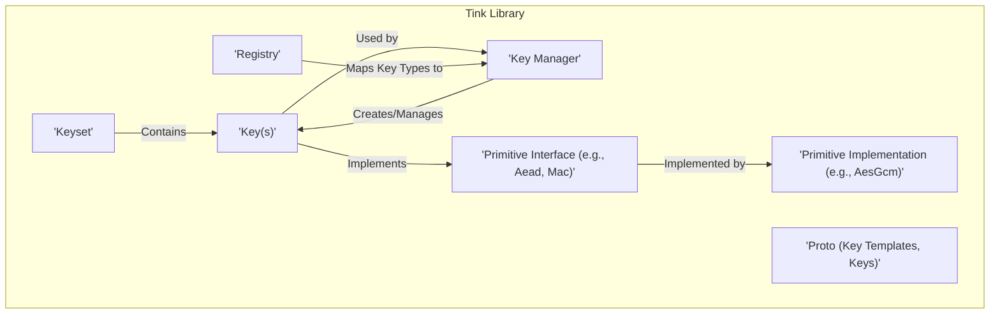

## Project Design Document: Google Tink (Improved)

**Project Name:** Tink

**Project Repository:** https://github.com/google/tink

**Document Version:** 1.1

**Date:** October 26, 2023

**Author:** AI Software Architect

**1. Introduction**

This document provides an enhanced architectural design of the Google Tink library, building upon the previous version. Tink is a robust, multi-language, and cross-platform cryptographic library designed to be secure, easy to use correctly, and difficult to misuse. This improved document offers a more detailed exploration of Tink's architecture, components, and data flow, with a specific focus on providing the necessary information for effective threat modeling.

**2. Goals of Tink**

*   **Usability:**  Offer straightforward and intuitive APIs for common cryptographic operations, minimizing the learning curve for developers.
*   **Security:**  Significantly reduce the likelihood of developers introducing cryptographic vulnerabilities through API design and secure defaults.
*   **Agility:**  Facilitate seamless algorithm evolution and key rotation with minimal impact on application code.
*   **Interoperability:**  Enable secure communication and data exchange between systems implemented in different programming languages and environments.
*   **Auditability:**  Provide a clear and structured framework that allows for the inspection and verification of cryptographic configurations and operations.
*   **Maintainability:**  Design a modular and well-defined architecture that is easy to maintain and extend.

**3. High-Level Architecture**

Tink's architecture is centered around the concepts of *Keysets* and *Primitives*. A Keyset is a logical collection of keys used interchangeably for a specific cryptographic purpose. A Primitive represents a well-defined cryptographic operation.

**4. Detailed Design**

This section provides a more in-depth look at the key components of the Tink library and their interactions, highlighting aspects relevant for security analysis.

*   **Keyset:**
    *   The core management unit in Tink, representing a collection of cryptographic keys.
    *   Contains one or more `Key` objects, each potentially with a different status (e.g., enabled, disabled, scheduled for rotation).
    *   Designated with a primary key, which is the default key used for cryptographic operations unless otherwise specified.
    *   Supports various storage mechanisms, including in-memory storage (for testing or short-lived secrets), file-based storage (often encrypted), and integration with external Key Management Systems (KMS).
    *   Facilitates key rotation, allowing for the addition of new keys and the eventual retirement of older keys. This process is crucial for maintaining long-term security.
    *   Includes metadata such as the key status, creation time, and potentially rotation schedules.

*   **Key:**
    *   Represents an individual cryptographic key, containing the actual key material.
    *   Associated metadata includes:
        *   `Key ID`: A unique identifier within the Keyset, used to distinguish between different keys.
        *   `Key Material Type`: Specifies the type of key material (e.g., symmetric, asymmetric public, asymmetric private).
        *   `Key Status`:  Indicates the current operational state of the key (e.g., `ENABLED`, `DISABLED`, `DESTROYED`).
        *   `Output Prefix Type`: Determines how the Key ID is prepended to the ciphertext or signature, influencing interoperability and potential collision risks. Options include `TINK`, `LEGACY`, `RAW`, and `CRUNCHY`.
        *   Algorithm-specific parameters (e.g., key size, curve for elliptic curve cryptography).

*   **Key Manager:**
    *   Responsible for the lifecycle management of keys within a Keyset.
    *   Provides functionalities for:
        *   Generating new key material based on a provided `KeyTemplate`.
        *   Potentially importing existing key material (with appropriate security considerations).
        *   Disabling or destroying keys.
        *   Accessing key metadata.
    *   Enforces security policies related to key usage, such as restricting the algorithms or key sizes that can be used.

*   **Primitive:**
    *   Defines an interface for a specific cryptographic operation, abstracting away the underlying algorithm.
    *   Key Primitives include:
        *   `Aead`: Authenticated Encryption with Associated Data, providing confidentiality and integrity.
        *   `Mac`: Message Authentication Code, ensuring message integrity and authenticity.
        *   `Signature`: Digital Signatures, providing non-repudiation and authenticity.
        *   `DeterministicAead`:  AEAD where the ciphertext is deterministic for the same plaintext, key, and associated data. This has specific security implications.
        *   `HybridEncrypt` and `HybridDecrypt`: Public-key encryption schemes.
        *   `PublicKeySign` and `PublicKeyVerify`: Public-key signature schemes.
        *   `StreamingAead`: AEAD for processing large streams of data.

*   **Primitive Implementation:**
    *   Concrete implementations of the `Primitive` interfaces, utilizing specific cryptographic algorithms.
    *   Examples include `AesGcm` for `Aead`, `HmacSha256` for `Mac`, and `EcdsaSign` for `Signature`.
    *   Tink often provides multiple implementations for the same Primitive, allowing for algorithm agility and the ability to switch to more secure or efficient algorithms as needed.

*   **Registry:**
    *   A central component that acts as a directory, mapping `Key` types (defined by their Protocol Buffer messages) to their corresponding `KeyManager` and `Primitive` implementations.
    *   Enables dynamic loading and instantiation of cryptographic components.
    *   Provides a mechanism for registering custom `KeyManager` and `Primitive` implementations, allowing for extensibility.

*   **Key Template:**
    *   A configuration object that specifies the parameters for creating new keys.
    *   Defined using Protocol Buffers, ensuring language independence.
    *   Includes details such as the cryptographic algorithm, key size, and any algorithm-specific parameters.
    *   Tink provides a set of recommended `KeyTemplate`s that adhere to security best practices.

*   **Proto (Protocol Buffers):**
    *   A fundamental technology used by Tink for defining the structure of `KeyTemplate`s, `Key` objects, and `Keyset`s.
    *   Provides a language-neutral and platform-neutral mechanism for serializing and deserializing structured data. This is crucial for Tink's multi-language support.

**5. Data Flow (Detailed)**

This section provides a more granular view of the data flow during a cryptographic operation, highlighting security-sensitive points.

```mermaid
graph LR
    A["'Application'"] --> B["'Tink Library'"];
    B --> C["'Keyset Handle'"];
    C --> D["'Keyset (Metadata)'"];
    D -- "References" --> E["'Key (Metadata)'"];
    E -- "Identifies" --> F["'Key Manager (for Key Type)'"];
    F -- "Provides" --> G["'Primitive Implementation'"];
    G -- "Uses Key Material from" --> H["'Key (Material - Securely Accessed)'"];
    H --> I["'Cryptographic Operation (e.g., Encrypt, Sign)'"];
    I --> J["'Result (e.g., Ciphertext, Signature)'"];
    J --> B;
    B --> A;
```

Detailed Data Flow Breakdown:

*   The `Application` initiates a cryptographic operation by interacting with the `Tink Library`.
*   The application obtains a `Keyset Handle`. This handle provides a secure reference to the `Keyset` without exposing the raw key material directly. The `Keyset Handle` enforces access controls and ensures proper usage of the keys.
*   The `Keyset Handle` retrieves the `Keyset` metadata, which includes information about the available keys and their status.
*   Based on the requested operation and potentially the `Output Prefix Type`, the appropriate `Key` (or the primary key) is selected. Its metadata is accessed.
*   The `Key` metadata identifies the specific `Key Manager` responsible for handling keys of that type.
*   The `Key Manager` provides the correct `Primitive Implementation` for the selected key.
*   The `Primitive Implementation` securely accesses the actual key material from the `Key`. This access is typically mediated by the `Key Manager` and may involve interaction with a KMS.
*   The `Primitive Implementation` performs the requested cryptographic operation (e.g., encryption, signing) using the key material and the provided input data.
*   The `Result` of the operation (e.g., ciphertext, signature) is returned to the `Tink Library`.
*   The `Tink Library` returns the result to the `Application`.

**6. Security Considerations (Expanded)**

This section expands on the security features and considerations built into Tink.

*   **Secure Defaults and Recommendations:** Tink promotes the use of secure cryptographic algorithms and parameters by providing secure defaults and recommending best practices through predefined `KeyTemplate`s.
*   **Robust Key Management:** Tink enforces proper key management practices, including secure key generation, secure storage (leveraging KMS integration where possible), and controlled access to key material. The `KeysetHandle` design is central to this.
*   **Automatic Key Rotation:** Tink's architecture facilitates automatic key rotation, reducing the risk associated with long-lived keys.
*   **Algorithm Agility and Future-Proofing:** The modular design allows for easy migration to new, more secure algorithms without requiring significant application changes. This is crucial for adapting to evolving security threats.
*   **Safe API Design (Misuse Resistance):** Tink's APIs are designed to be difficult to misuse, minimizing common cryptographic errors such as using the wrong mode of operation or failing to authenticate data.
*   **Key Isolation and Least Privilege:** The `KeysetHandle` provides a level of abstraction, preventing direct access to the raw key material and enforcing the principle of least privilege.
*   **Cross-Language Consistency:** Tink aims to provide consistent security properties and behavior across its different language implementations, reducing the risk of language-specific vulnerabilities.
*   **Auditing and Monitoring:** The structure of Tink, particularly the use of `Keyset`s and `Key` metadata, facilitates auditing of cryptographic configurations and key lifecycle events. Integration with logging and monitoring systems can further enhance security.
*   **Resistance to Known Attacks:** Tink's underlying primitive implementations are chosen and configured to resist known cryptographic attacks. However, the security of the overall system also depends on the correct usage of the library.
*   **Error Handling and Failure Modes:**  Tink's design includes considerations for how cryptographic failures are handled, aiming to prevent information leakage or insecure fallback mechanisms.

**7. Deployment Considerations (More Detail)**

This section provides more detail on deployment scenarios and related security considerations.

*   **Standalone Applications:** When deployed in standalone applications, the security of the `Keyset` storage becomes paramount. Encryption of the `Keyset` at rest is crucial.
*   **Cloud Environments (with KMS Integration):** Leveraging cloud-based Key Management Systems (e.g., Google Cloud KMS, AWS KMS, Azure Key Vault) significantly enhances key security by offloading key generation, storage, and access control to a dedicated service. Tink's integration with these services is a key security feature.
*   **Microservices Architectures:** In microservices, Tink can be used to secure inter-service communication (e.g., using AEAD for encrypting payloads) and data persistence. Secure key distribution and management across services are critical considerations.
*   **Mobile Applications:**  Deploying Tink in mobile applications requires careful consideration of key storage. Options include the Android Keystore and iOS Keychain, which provide hardware-backed security.
*   **Hardware Security Modules (HSMs):** Tink can be configured to use HSMs for enhanced key protection, providing a higher level of assurance against key compromise.

**8. Assumptions and Constraints**

*   It is assumed that the underlying operating system and hardware provide a reasonable level of security. Compromises at this level can undermine the security of Tink.
*   Tink relies on the correctness and security of the underlying cryptographic libraries (e.g., BoringSSL, JCE) used by its primitive implementations. Vulnerabilities in these libraries could impact Tink.
*   The security of Tink is heavily dependent on the proper handling and secure storage of `KeysetHandle`s and the underlying `Keyset` data. Mishandling these can lead to key exposure.
*   This document focuses on the core architectural components of Tink. Security considerations for specific primitive implementations and their potential vulnerabilities are outside the scope of this document but are important for a complete security assessment.
*   The security of the application using Tink is also crucial. Tink can provide secure cryptographic primitives, but vulnerabilities in the application logic can still lead to security issues.

**9. Future Considerations**

*   Enhanced integration with more Hardware Security Modules (HSMs) and secure enclaves for even stronger key protection.
*   Expansion of the set of supported cryptographic algorithms and primitives to keep pace with advancements in cryptography.
*   Development of more sophisticated tooling for key management, rotation, and auditing, simplifying these critical tasks for developers.
*   Further research and implementation of mitigations against advanced attacks, such as side-channel attacks, at the primitive implementation level.

This improved document provides a more detailed and nuanced understanding of the Google Tink project's architecture, with a stronger emphasis on security considerations relevant for threat modeling. This information will be invaluable for identifying potential vulnerabilities and ensuring the secure use of the Tink library in various applications and environments.