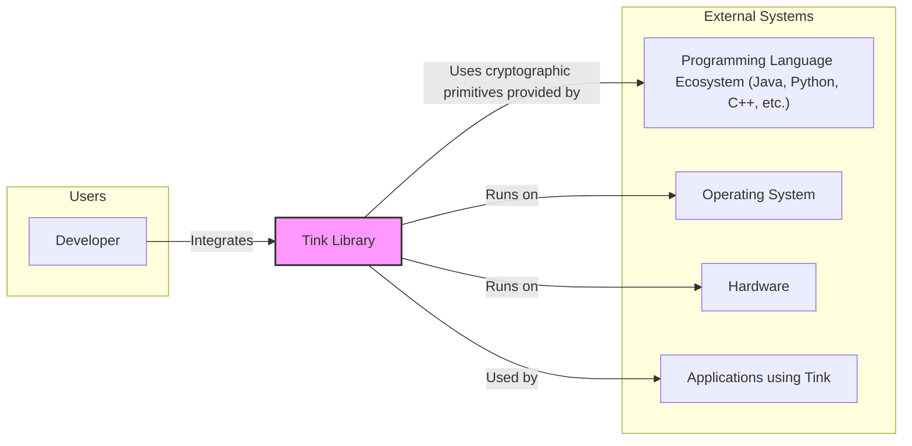
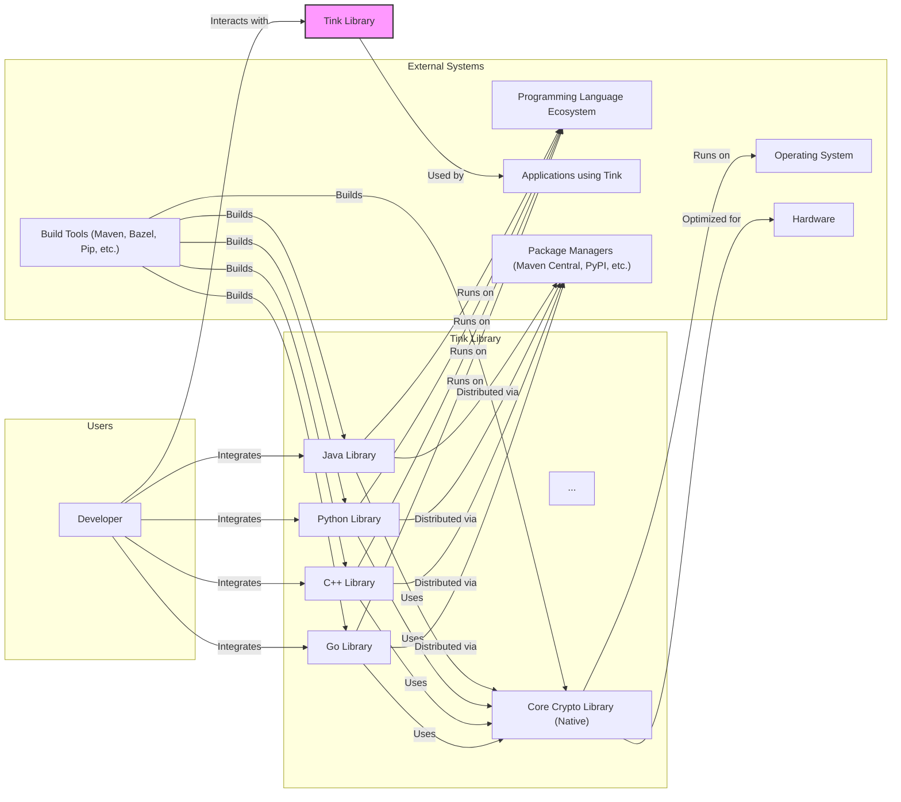
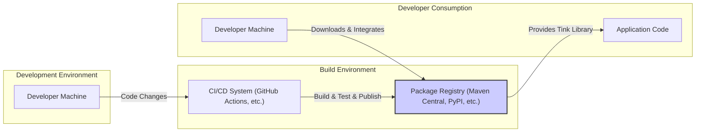

# BUSINESS POSTURE

The primary business priority for the Tink project is to provide a secure, easy-to-use, and open-source cryptographic library for developers. The goal is to enable developers to easily integrate robust cryptography into their applications, reducing the likelihood of cryptographic misuse and improving overall application security.

The most important business risks associated with Tink are:

- Risk of vulnerabilities in the Tink library itself, which could be exploited by attackers to compromise applications using Tink.
- Risk of developers misusing the Tink library, leading to insecure cryptographic implementations in their applications.
- Risk of supply chain attacks targeting Tink or its dependencies, potentially introducing malicious code into the library.
- Risk of performance issues or usability problems hindering adoption and effectiveness of Tink.

# SECURITY POSTURE

Existing security controls for the Tink project include:

- security control Open source development model with public code repository on GitHub (https://github.com/google/tink). This allows for community review and contributions.
- security control Code review process for contributions to the Tink repository. This helps to identify and prevent introduction of vulnerabilities.
- security control Automated testing including unit tests and integration tests. This ensures the correctness and reliability of the cryptographic implementations.
- security control Public issue tracker on GitHub for reporting bugs and security vulnerabilities. This provides a channel for community feedback and vulnerability disclosure.
- security control Dependency management using standard build tools (e.g., Maven, Bazel, Pip). This helps to manage and track dependencies.

Accepted risks for the Tink project include:

- accepted risk Reliance on community contributions, which may introduce vulnerabilities if not properly vetted.
- accepted risk Public disclosure of vulnerabilities before patches are available, due to the open-source nature of the project.
- accepted risk Potential for misuse of the library by developers, despite documentation and examples.

Recommended security controls to implement for Tink:

- recommended security control Regular security audits by independent security experts to identify potential vulnerabilities.
- recommended security control Formal vulnerability disclosure program with clear guidelines for reporting and handling security issues.
- recommended security control Automated dependency scanning to detect known vulnerabilities in third-party libraries.
- recommended security control Software Bill of Materials (SBOM) generation to track components and dependencies for supply chain security.
- recommended security control Static Application Security Testing (SAST) and Dynamic Application Security Testing (DAST) integration into the CI/CD pipeline.

Security requirements for the Tink project:

- Authentication: Not directly applicable to a cryptographic library. Authentication is the responsibility of applications using Tink.
- Authorization: Not directly applicable to a cryptographic library. Authorization is the responsibility of applications using Tink.
- Input Validation: Critical for Tink. All cryptographic functions must perform rigorous input validation to prevent vulnerabilities such as buffer overflows, format string bugs, and injection attacks. Input validation should be implemented at the API boundaries of the library.
- Cryptography: Tink must provide correct and secure cryptographic implementations. This includes using well-vetted cryptographic algorithms, following best practices for key management, and preventing common cryptographic pitfalls. The library should offer a range of cryptographic primitives and constructions suitable for various use cases.

# DESIGN

## C4 CONTEXT

### Context Diagram Elements

- Name: Developer
  - Type: User
  - Description: Software developers who want to integrate cryptography into their applications.
  - Responsibilities: Integrate Tink into their applications, use Tink APIs correctly, and understand basic cryptographic principles.
  - Security controls: Responsible for secure usage of Tink APIs in their applications, including proper key management and handling of cryptographic operations.

- Name: Tink Library
  - Type: System
  - Description: A cryptographic library providing a set of secure and easy-to-use cryptographic primitives and APIs.
  - Responsibilities: Provide correct and secure cryptographic implementations, offer a user-friendly API, and ensure robustness and performance.
  - Security controls: Input validation, secure cryptographic algorithm implementations, protection against side-channel attacks, and secure key handling within the library (though key management is primarily the responsibility of the user).

- Name: Programming Language Ecosystem (Java, Python, C++, etc.)
  - Type: External System
  - Description: The programming language environments in which Tink is used, including language-specific libraries and runtime environments.
  - Responsibilities: Provide the underlying platform for Tink to run, including language features, standard libraries, and build tools.
  - Security controls: Security of the programming language runtime environment, including memory safety, vulnerability patching, and secure library dependencies.

- Name: Operating System
  - Type: External System
  - Description: The operating system on which applications using Tink are deployed.
  - Responsibilities: Provide the underlying operating system services, including process management, memory management, and system calls.
  - Security controls: Operating system security features, kernel hardening, access control mechanisms, and regular security updates.

- Name: Hardware
  - Type: External System
  - Description: The physical hardware on which applications using Tink are executed.
  - Responsibilities: Provide the physical infrastructure for running applications and the underlying hardware security features.
  - Security controls: Hardware security features such as secure boot, Trusted Platform Modules (TPM), and hardware-based encryption acceleration.

- Name: Applications using Tink
  - Type: External System
  - Description: Software applications that integrate and utilize the Tink library for cryptographic operations.
  - Responsibilities: Securely integrate and use Tink APIs, manage cryptographic keys, and implement application-level security controls.
  - Security controls: Application-level authentication, authorization, input validation, secure data handling, and proper usage of cryptographic primitives provided by Tink.

## C4 CONTAINER

### Container Diagram Elements

- Name: Java Library
  - Type: Container
  - Description: Tink library implementation for the Java programming language. Provides Java-specific APIs and integrates with the Java ecosystem.
  - Responsibilities: Expose Tink cryptographic functionalities to Java developers, provide Java-idiomatic APIs, and handle Java-specific integration details.
  - Security controls: Input validation, secure API design, adherence to Java security best practices, and integration with underlying Core Crypto Library securely.

- Name: Python Library
  - Type: Container
  - Description: Tink library implementation for the Python programming language. Provides Python-specific APIs and integrates with the Python ecosystem.
  - Responsibilities: Expose Tink cryptographic functionalities to Python developers, provide Python-idiomatic APIs, and handle Python-specific integration details.
  - Security controls: Input validation, secure API design, adherence to Python security best practices, and integration with underlying Core Crypto Library securely.

- Name: C++ Library
  - Type: Container
  - Description: Tink library implementation for the C++ programming language. Provides C++-specific APIs and integrates with the C++ ecosystem.
  - Responsibilities: Expose Tink cryptographic functionalities to C++ developers, provide C++-idiomatic APIs, and handle C++-specific integration details.
  - Security controls: Input validation, memory safety, secure API design, adherence to C++ security best practices, and integration with underlying Core Crypto Library securely.

- Name: Go Library
  - Type: Container
  - Description: Tink library implementation for the Go programming language. Provides Go-specific APIs and integrates with the Go ecosystem.
  - Responsibilities: Expose Tink cryptographic functionalities to Go developers, provide Go-idiomatic APIs, and handle Go-specific integration details.
  - Security controls: Input validation, memory safety, secure API design, adherence to Go security best practices, and integration with underlying Core Crypto Library securely.

- Name: Core Crypto Library (Native)
  - Type: Container
  - Description: The core cryptographic implementation of Tink, likely written in a language like C or C++ for performance and direct hardware access. This container provides the fundamental cryptographic algorithms and primitives used by language-specific wrappers.
  - Responsibilities: Implement core cryptographic algorithms, optimize for performance, and provide a low-level interface for language-specific wrappers.
  - Security controls: Rigorous input validation, secure cryptographic algorithm implementations, protection against side-channel attacks, memory safety, and potentially hardware acceleration integration.

- Name: Package Managers (Maven Central, PyPI, etc.)
  - Type: External System
  - Description: Online repositories for distributing and managing software packages, used to distribute Tink libraries to developers.
  - Responsibilities: Host and distribute Tink library packages, ensure package integrity, and provide package management tools.
  - Security controls: Package signing, malware scanning, and repository security measures to prevent supply chain attacks.

- Name: Build Tools (Maven, Bazel, Pip, etc.)
  - Type: External System
  - Description: Software tools used to build, test, and package Tink libraries.
  - Responsibilities: Automate the build process, manage dependencies, run tests, and create distributable packages.
  - Security controls: Secure build environment, dependency management, and integration with security scanning tools.

## DEPLOYMENT

Tink itself is a library and is not deployed as a standalone application. Instead, it is integrated into other applications which are then deployed in various environments.  The deployment of Tink is essentially its distribution to developers and its integration into their applications.

Deployment Architecture for Tink Library Distribution:

### Deployment Diagram Elements

- Name: Developer Machine (Development Environment)
  - Type: Environment
  - Description: Developer's local machine where code changes are made and tested locally.
  - Responsibilities: Code development, local testing, and committing code changes to version control.
  - Security controls: Developer workstation security, code review before commit, and local development security practices.

- Name: CI/CD System (GitHub Actions, etc.) (Build Environment)
  - Type: Environment
  - Description: Automated Continuous Integration and Continuous Delivery system used to build, test, and publish Tink libraries.
  - Responsibilities: Automated build process, running tests, performing security checks, and publishing packages to package registries.
  - Security controls: Secure build pipelines, access control to CI/CD system, secrets management, and integration of security scanning tools.

- Name: Package Registry (Maven Central, PyPI, etc.) (Build Environment)
  - Type: Infrastructure
  - Description: Online repositories where Tink library packages are published and made available for download by developers.
  - Responsibilities: Hosting and distributing Tink packages, ensuring package integrity, and providing access control.
  - Security controls: Package signing, malware scanning, access control, and infrastructure security.

- Name: Developer Machine (Developer Consumption)
  - Type: Environment
  - Description: Developer's machine where they are developing applications that will use the Tink library.
  - Responsibilities: Downloading and integrating Tink library into their applications, developing application code, and testing application functionality.
  - Security controls: Developer workstation security, secure dependency management practices, and application development security practices.

- Name: Application Code (Developer Consumption)
  - Type: Software
  - Description: The application code developed by developers that integrates and uses the Tink library.
  - Responsibilities: Utilizing Tink library correctly, implementing application logic, and ensuring overall application security.
  - Security controls: Application-level security controls, secure usage of Tink APIs, and proper key management within the application.

## BUILD

```mermaid
flowchart LR
    subgraph "Developer"
        DeveloperMachine["Developer Machine"]
    end
    subgraph "Version Control"
        GitHub["GitHub Repository"]
    end
    subgraph "CI/CD Pipeline"
        CodeCheckout["Code Checkout"]
        Build["Build Process"]
        Test["Automated Tests"]
        SAST["SAST Scanners"]
        DependencyCheck["Dependency Check"]
        Package["Package Creation"]
        Publish["Publish to Package Registry"]
    end
    subgraph "Package Registry"
        PackageRegistry["Package Registry (Maven Central, PyPI, etc.)"]
    end

    DeveloperMachine -- "Code Commit" --> GitHub
    GitHub -- "Webhook Trigger" --> CodeCheckout
    CodeCheckout -- "Source Code" --> Build
    Build -- "Build Artifacts" --> Test
    Test -- "Test Results" --> SAST
    SAST -- "Scan Results" --> DependencyCheck
    DependencyCheck -- "Dependency Report" --> Package
    Package -- "Package Artifact" --> Publish
    Publish -- "Published Package" --> PackageRegistry

    style PackageRegistry fill:#ccf,stroke:#333,stroke-width:2px
```

### Build Diagram Elements

- Name: Developer Machine
  - Type: Environment
  - Description: Developer's local machine where code is written and changes are committed.
  - Responsibilities: Code development and committing code to version control.
  - Security controls: Developer workstation security, code review before commit.

- Name: GitHub Repository
  - Type: Infrastructure
  - Description: Central repository for source code version control and collaboration.
  - Responsibilities: Source code management, version control, and access control.
  - Security controls: Access control, branch protection, and audit logging.

- Name: Code Checkout
  - Type: Build Step
  - Description: Step in the CI/CD pipeline that retrieves the latest source code from the GitHub repository.
  - Responsibilities: Fetching source code for building.
  - Security controls: Secure connection to GitHub, access control to repository.

- Name: Build Process
  - Type: Build Step
  - Description: Step in the CI/CD pipeline that compiles and builds the Tink library from the source code.
  - Responsibilities: Compiling code, resolving dependencies, and creating build artifacts.
  - Security controls: Secure build environment, dependency management, and build process isolation.

- Name: Automated Tests
  - Type: Build Step
  - Description: Step in the CI/CD pipeline that runs unit tests and integration tests to verify the correctness of the code.
  - Responsibilities: Running tests and reporting test results.
  - Security controls: Secure test environment, test case coverage, and failure handling.

- Name: SAST Scanners
  - Type: Build Step
  - Description: Static Application Security Testing tools integrated into the CI/CD pipeline to scan the source code for potential security vulnerabilities.
  - Responsibilities: Static code analysis and vulnerability detection.
  - Security controls: SAST tool configuration, vulnerability reporting, and integration with build pipeline.

- Name: Dependency Check
  - Type: Build Step
  - Description: Step in the CI/CD pipeline that checks for known vulnerabilities in third-party dependencies.
  - Responsibilities: Dependency vulnerability scanning and reporting.
  - Security controls: Dependency scanning tool configuration, vulnerability database updates, and integration with build pipeline.

- Name: Package Creation
  - Type: Build Step
  - Description: Step in the CI/CD pipeline that packages the build artifacts into distributable packages (e.g., JAR, wheel, etc.).
  - Responsibilities: Creating package artifacts.
  - Security controls: Package signing, secure package creation process.

- Name: Publish to Package Registry
  - Type: Build Step
  - Description: Step in the CI/CD pipeline that publishes the created packages to package registries like Maven Central or PyPI.
  - Responsibilities: Publishing packages to registries.
  - Security controls: Secure credentials management for registry access, package signing, and secure publishing process.

- Name: Package Registry (Maven Central, PyPI, etc.)
  - Type: Infrastructure
  - Description: Online repositories where Tink library packages are published and made available for download.
  - Responsibilities: Hosting and distributing Tink packages.
  - Security controls: Package signing verification, malware scanning, and registry infrastructure security.

# RISK ASSESSMENT

Critical business process being protected: Secure cryptographic operations within applications using Tink. Ensuring the confidentiality, integrity, and authenticity of data protected by cryptography.

Data being protected: Sensitive data processed by applications using Tink. The sensitivity of the data depends on the specific application context. This could include:

- Confidential data: Data that needs to be protected from unauthorized access, such as personal information, financial data, or trade secrets.
- Integrity-sensitive data: Data where unauthorized modification could lead to significant harm or business disruption.
- Authenticity-sensitive data: Data where verifying the source and integrity is crucial, such as digital signatures or transaction records.

The sensitivity level is highly dependent on the application using Tink. For a banking application, the data would be highly sensitive. For a less critical application, the sensitivity might be lower. However, given the nature of cryptography, any misuse or vulnerability can have severe security implications.

# QUESTIONS & ASSUMPTIONS

Questions:

- What are the primary target use cases for Tink? Is it focused on specific industries or application types?
- What is the intended level of cryptographic expertise of developers using Tink? Are they expected to have deep cryptographic knowledge, or is Tink designed for developers with limited crypto background?
- What are the performance requirements for Tink? Are there specific performance benchmarks or targets?
- What is the process for handling and responding to security vulnerabilities reported in Tink? Is there a public security policy or vulnerability disclosure program?
- What is the long-term maintenance and support plan for Tink?

Assumptions:

- BUSINESS POSTURE: It is assumed that security and ease of use are the top priorities for the Tink project. It is assumed that the project aims for wide adoption by developers across various industries.
- SECURITY POSTURE: It is assumed that the Tink project follows secure software development lifecycle best practices, including code review, testing, and vulnerability management. It is assumed that the project is committed to addressing security vulnerabilities promptly.
- DESIGN: It is assumed that Tink is designed to be modular and extensible, supporting multiple programming languages and cryptographic algorithms. It is assumed that the core cryptographic implementations are written in a performance-oriented language and wrapped for different language ecosystems. It is assumed that the build and release process is automated and includes security checks.