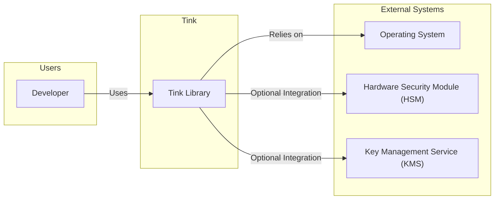
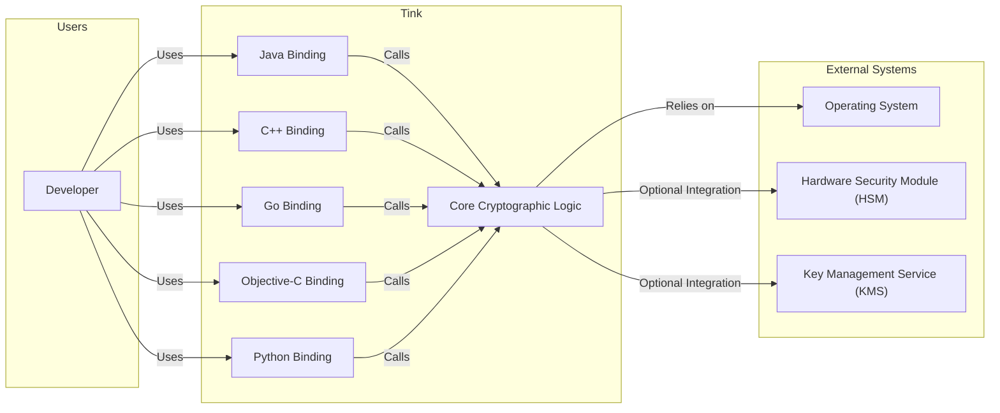
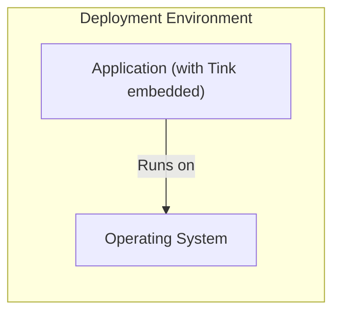
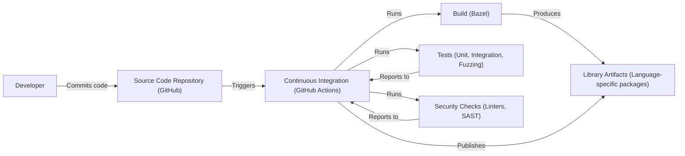

Okay, let's create a design document for Google's Tink library.

# BUSINESS POSTURE

Tink is a multi-language, cross-platform cryptographic library that provides simple and misuse-proof APIs for common cryptographic tasks.  It's developed and maintained by Google, and used internally within many Google products.  Given its open-source nature and Google's backing, the business posture can be characterized as follows:

Priorities and Goals:

*   Provide a secure and easy-to-use cryptographic library for developers, reducing the likelihood of common cryptographic errors.
*   Promote best practices in cryptography across the industry.
*   Support a wide range of platforms and languages, maximizing adoption.
*   Maintain a high level of trust and reliability, given its use in sensitive applications.
*   Enable cryptographic agility, allowing for easy updates and transitions to new algorithms.
*   Reduce development time and cost associated with implementing cryptography.

Business Risks:

*   Vulnerabilities in Tink itself could compromise a large number of applications relying on it. This is the most significant risk.
*   Misuse of the Tink API, despite its design, could still lead to security weaknesses.
*   Lack of adoption due to complexity or perceived limitations could hinder its impact.
*   Failure to keep up with evolving cryptographic standards and threats could render it obsolete.
*   Reputational damage to Google if Tink is found to have major flaws.
*   Supply chain attacks targeting Tink's build and distribution process.

# SECURITY POSTURE

Existing Security Controls:

*   security control: Extensive testing, including unit tests, integration tests, and fuzzing (OSS-Fuzz). Described in the repository's testing documentation and CI workflows.
*   security control: Code reviews by cryptography experts at Google. Implied by Google's development process.
*   security control: Use of memory-safe languages (primarily Java, C++, Go, Obj-C, and Python with appropriate bindings) to mitigate memory corruption vulnerabilities.  Evident in the codebase.
*   security control: Regular security audits and penetration testing. Implied by Google's security practices.
*   security control: Clear and concise API design to minimize the chance of developer error. Evident in the API documentation.
*   security control: Support for key management best practices, including key rotation and separation of duties. Evident in the key management API.
*   security control: Cryptographic agility: Support for multiple algorithms and key types, allowing for easy upgrades. Evident in the API design.
*   security control: Continuous Integration/Continuous Delivery (CI/CD) pipeline with automated security checks. Evident in GitHub Actions workflows.

Accepted Risks:

*   accepted risk: Dependence on underlying operating system and hardware security for certain operations (e.g., random number generation).
*   accepted risk: Potential for side-channel attacks, although efforts are made to mitigate them.
*   accepted risk: The possibility of zero-day vulnerabilities, despite rigorous testing.

Recommended Security Controls:

*   Implement a Software Bill of Materials (SBOM) for each release to improve supply chain security.
*   Formal verification of critical cryptographic primitives.
*   Provide more explicit guidance and tooling for secure key storage and handling.

Security Requirements:

*   Authentication: Tink is a library, not a service, so it doesn't directly handle authentication. However, it provides primitives that can be used to build authentication systems (e.g., digital signatures, MACs).
*   Authorization: Tink does not handle authorization directly. Authorization is the responsibility of the application using Tink.
*   Input Validation: Tink performs input validation on cryptographic parameters (e.g., key sizes, IV lengths) to prevent common errors. This is crucial for preventing cryptographic weaknesses.
*   Cryptography: Tink's core purpose is to provide strong cryptography. It supports a wide range of algorithms and key types, including:
    *   Symmetric-key encryption (AES-GCM, AES-CTR-HMAC, ChaCha20-Poly1305)
    *   Public-key encryption (RSA-OAEP, ECIES)
    *   Digital signatures (ECDSA, Ed25519, RSA-PSS)
    *   Message authentication codes (HMAC, AES-CMAC)
    *   Hybrid encryption (combining symmetric and public-key encryption)
    *   Key Derivation Functions (HKDF, PBKDF2)

# DESIGN

## C4 CONTEXT

Element Descriptions:

*   Element:
    *   Name: Developer
    *   Type: Person
    *   Description: A software developer who integrates Tink into their application.
    *   Responsibilities: Uses Tink's API to perform cryptographic operations.
    *   Security controls: Follows secure coding practices; uses Tink's API correctly.

*   Element:
    *   Name: Tink Library
    *   Type: Software System
    *   Description: The Tink cryptographic library.
    *   Responsibilities: Provides cryptographic primitives and key management functions.
    *   Security controls: Extensive testing; code reviews; memory-safe languages; API design; support for key management best practices; cryptographic agility.

*   Element:
    *   Name: Operating System
    *   Type: Software System
    *   Description: The underlying operating system.
    *   Responsibilities: Provides low-level functionality like random number generation and memory management.
    *   Security controls: OS-level security features (e.g., ASLR, DEP); regular security updates.

*   Element:
    *   Name: Hardware Security Module (HSM)
    *   Type: Hardware Device
    *   Description: A physical device that securely stores cryptographic keys and performs cryptographic operations.
    *   Responsibilities: Secure key storage and execution of cryptographic operations.
    *   Security controls: Tamper resistance; strong access controls; certified hardware.

*   Element:
    *   Name: Key Management Service (KMS)
    *   Type: Software System
    *   Description: A service that manages cryptographic keys.
    *   Responsibilities: Key generation, storage, rotation, and access control.
    *   Security controls: Strong access controls; audit logging; key rotation policies.

## C4 CONTAINER

Since Tink is a library, the container diagram is essentially an expanded view of the context diagram, showing the different language bindings as separate containers.

Element Descriptions:

*   Element:
    *   Name: Java Binding
    *   Type: Container (Library)
    *   Description: The Java API for Tink.
    *   Responsibilities: Provides a Java interface to the core cryptographic functionality.
    *   Security controls: Same as Tink Library, plus Java-specific security considerations.

*   Element:
    *   Name: C++ Binding
    *   Type: Container (Library)
    *   Description: The C++ API for Tink.
    *   Responsibilities: Provides a C++ interface to the core cryptographic functionality.
    *   Security controls: Same as Tink Library, plus C++-specific security considerations.

*   Element:
    *   Name: Go Binding
    *   Type: Container (Library)
    *   Description: The Go API for Tink.
    *   Responsibilities: Provides a Go interface to the core cryptographic functionality.
    *   Security controls: Same as Tink Library, plus Go-specific security considerations.

*   Element:
    *   Name: Objective-C Binding
    *   Type: Container (Library)
    *   Description: The Objective-C API for Tink.
    *   Responsibilities: Provides an Objective-C interface to the core cryptographic functionality.
    *   Security controls: Same as Tink Library, plus Objective-C-specific security considerations.

*   Element:
    *   Name: Python Binding
    *   Type: Container (Library)
    *   Description: The Python API for Tink.
    *   Responsibilities: Provides a Python interface to the core cryptographic functionality.
    *   Security controls: Same as Tink Library, plus Python-specific security considerations.

*   Element:
    *   Name: Core Cryptographic Logic
    *   Type: Container (Library)
    *   Description: The core implementation of the cryptographic algorithms and key management.
    *   Responsibilities: Implements the cryptographic primitives.
    *   Security controls: Same as Tink Library.

*   Element:
    *   Name: Developer, Operating System, Hardware Security Module (HSM), Key Management Service (KMS)
    *   Same description as in C4 Context.

## DEPLOYMENT

Tink is a library, and therefore it is "deployed" as part of the application that uses it. There isn't a single deployment model. However, we can describe common scenarios:

Possible Deployment Solutions:

1.  **Embedded within an Application:** The most common scenario. Tink is linked directly into the application binary.
2.  **Dynamically Linked Library:** Tink is distributed as a shared library (.so, .dll, .dylib) and loaded at runtime.
3.  **Used within a Serverless Function:** Tink can be included as a dependency in serverless functions (e.g., AWS Lambda, Google Cloud Functions).
4.  **Used within a Mobile Application:** Tink can be integrated into Android and iOS applications.

Chosen Deployment Solution (Embedded within an Application):

Element Descriptions:

*   Element:
    *   Name: Application (with Tink embedded)
    *   Type: Software System
    *   Description: The application that uses Tink for its cryptographic needs. Tink is statically linked into the application.
    *   Responsibilities: Performs the application's primary functions, utilizing Tink for cryptography.
    *   Security controls: Application-level security controls, plus those provided by Tink.

*   Element:
    *   Name: Operating System
    *   Type: Software System
    *   Description: The underlying operating system.
    *   Responsibilities: Provides the runtime environment for the application.
    *   Security controls: OS-level security features.

## BUILD

Tink uses a combination of build systems, primarily Bazel, and integrates with CI systems like GitHub Actions.

Build Process Description:

1.  Developers commit code to the GitHub repository.
2.  This triggers a GitHub Actions workflow.
3.  The workflow uses Bazel to build the library for different languages and platforms.
4.  Extensive tests (unit, integration, and fuzzing via OSS-Fuzz) are run.
5.  Security checks, including linters and potentially static analysis (SAST), are performed.
6.  If all tests and checks pass, the build process produces library artifacts (language-specific packages).
7.  These artifacts are published (e.g., to Maven Central for Java, PyPI for Python).

Security Controls in Build Process:

*   Automated build process using Bazel and GitHub Actions.
*   Comprehensive testing, including unit, integration, and fuzzing.
*   Use of linters to enforce coding standards.
*   Potential integration with SAST tools for static analysis.
*   Signed releases (implied, as a best practice for distributing libraries).

# RISK ASSESSMENT

Critical Business Processes:

*   Protecting user data confidentiality and integrity.
*   Ensuring the secure operation of applications that rely on Tink.
*   Maintaining the integrity of cryptographic keys.
*   Complying with relevant cryptographic standards and regulations.

Data to Protect and Sensitivity:

*   Cryptographic keys (highest sensitivity): Compromise of keys would allow attackers to decrypt data or forge signatures.
*   Data encrypted or signed using Tink (variable sensitivity): Depends on the specific application. Could range from low-sensitivity data to highly sensitive personal or financial information.
*   Configuration data related to Tink (medium sensitivity): Could reveal information about the cryptographic algorithms and key management practices used.

# QUESTIONS & ASSUMPTIONS

Questions:

*   What specific SAST tools are used in the CI pipeline?
*   What is the exact process for handling vulnerability reports?
*   Are there any plans for formal verification of critical components?
*   What are the specific key management recommendations for different deployment scenarios?
*   What is the frequency of security audits and penetration testing?

Assumptions:

*   BUSINESS POSTURE: Google prioritizes the security and reliability of Tink due to its widespread use and potential impact.
*   SECURITY POSTURE: Google's internal security practices are applied to the development and maintenance of Tink.
*   DESIGN: The library is designed to be as misuse-proof as possible, but developers still need to follow best practices.
*   DESIGN: The build process is secure and prevents the introduction of malicious code.
*   DESIGN: The library is regularly updated to address new threats and vulnerabilities.