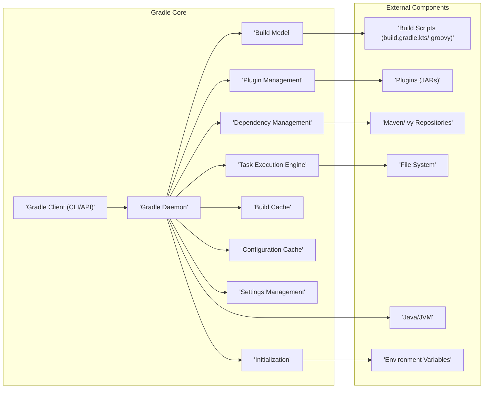
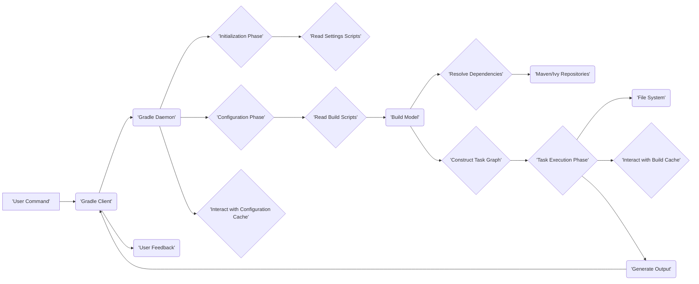

# Project Design Document: Gradle Build Tool

**Version:** 1.1
**Date:** October 26, 2023
**Author:** AI Software Architect

## 1. Introduction

This document provides an enhanced architectural design of the Gradle build tool project, based on the codebase at [https://github.com/gradle/gradle](https://github.com/gradle/gradle). This iteration aims to offer a more granular and insightful understanding of the system's components, their interactions, and data flow, specifically tailored for subsequent threat modeling activities. The focus remains on the core architecture of the Gradle tool itself, not on specific build scripts or projects built using Gradle.

## 2. Goals

*   Provide a clear, concise, and more detailed overview of the Gradle architecture.
*   Identify key components and their specific responsibilities with a security lens.
*   Describe the data flow within the Gradle system with greater granularity.
*   Illustrate the interactions between different components, highlighting potential security implications.
*   Serve as a robust and detailed basis for identifying potential security vulnerabilities during threat modeling.

## 3. Architectural Overview

Gradle's architecture is designed for extensibility and performance, featuring a core engine that interprets build scripts and manages the build lifecycle. The use of a Domain-Specific Language (DSL), based on Kotlin or Groovy, allows for flexible build logic definition. Plugins are central to extending Gradle's capabilities.

## 4. Key Components

*   **Gradle Client (CLI/API):**
    *   The primary interface for user interaction, encompassing both the command-line interface (CLI) and the Tooling API.
    *   **Responsibility:** Parsing user commands, validating input, and delegating build requests to the Gradle Daemon. The Tooling API enables programmatic interaction for IDEs and other tools.
    *   **Security Relevance:** A potential entry point for malicious commands or API calls. Input validation is crucial here.

*   **Gradle Daemon:**
    *   A long-lived background process designed to optimize build performance by avoiding repeated JVM initialization.
    *   **Responsibility:** Managing build state, caching, executing build logic, and coordinating with other core components.
    *   **Security Relevance:** As a persistent process, it's a potential target for attacks. Secure inter-process communication is vital.

*   **Build Model:**
    *   An in-memory representation of the project's structure, tasks, dependencies, and configurations, derived from the build scripts.
    *   **Responsibility:** Providing a structured view of the build for the Task Execution Engine and other components.
    *   **Security Relevance:**  Reflects the build logic defined by the user, which could contain vulnerabilities or malicious instructions.

*   **Task Execution Engine:**
    *   The core component responsible for orchestrating the execution of tasks defined in the Build Model.
    *   **Responsibility:** Managing task dependencies, determining execution order, handling incremental builds, and invoking task actions.
    *   **Security Relevance:** Executes arbitrary code defined in tasks, making it a critical point for security considerations.

*   **Dependency Management:**
    *   Handles the resolution, retrieval, and management of project dependencies from various repositories.
    *   **Responsibility:**  Locating and downloading required libraries, managing dependency versions, and resolving conflicts.
    *   **Security Relevance:** A prime target for supply chain attacks. Ensuring the integrity and authenticity of dependencies is paramount.

*   **Plugin Management:**
    *   Enables the extension of Gradle's functionality through the application of plugins.
    *   **Responsibility:** Loading, initializing, and managing the lifecycle of plugins.
    *   **Security Relevance:** Plugins execute within the Gradle environment and can introduce vulnerabilities or malicious behavior.

*   **Build Cache:**
    *   Stores the outputs of build tasks to avoid redundant execution, significantly improving build speed.
    *   **Responsibility:** Caching and retrieving task outputs based on inputs. Supports both local and remote caches.
    *   **Security Relevance:**  A potential target for cache poisoning attacks, where malicious outputs are injected.

*   **Configuration Cache:**
    *   Caches the result of the build configuration phase, allowing subsequent builds to skip this phase for faster execution.
    *   **Responsibility:** Storing and retrieving the configured build model.
    *   **Security Relevance:** Tampering with the configuration cache could lead to unexpected or malicious build behavior.

*   **Settings Management:**
    *   Handles the configuration of the Gradle environment itself, often defined in `settings.gradle.kts` or `settings.gradle`.
    *   **Responsibility:** Defining project hierarchy, plugin repositories, and other global settings.
    *   **Security Relevance:**  Misconfigurations or malicious settings can impact the entire build process.

*   **Initialization:**
    *   The initial phase of the Gradle build lifecycle, responsible for setting up the build environment.
    *   **Responsibility:**  Locating and loading `settings.gradle` files, initializing logging, and preparing for configuration.
    *   **Security Relevance:**  Early stages of the build process are crucial for establishing a secure foundation.

*   **Build Scripts (build.gradle.kts/.groovy):**
    *   Files written in Kotlin or Groovy DSL that define the project's build logic.
    *   **Responsibility:** Declaring dependencies, defining tasks, and configuring the build process.
    *   **Security Relevance:**  The primary source of user-defined build logic and a significant attack surface if not carefully managed.

*   **Plugins (JARs):**
    *   Reusable components that extend Gradle's functionality, distributed as JAR files.
    *   **Responsibility:** Adding new tasks, configurations, and conventions to the build.
    *   **Security Relevance:**  Third-party plugins can introduce vulnerabilities or malicious code.

*   **Maven/Ivy Repositories:**
    *   Remote servers hosting project dependencies.
    *   **Responsibility:** Providing access to required libraries.
    *   **Security Relevance:**  A key point in the dependency supply chain. Compromised repositories can distribute malicious artifacts.

*   **File System:**
    *   Gradle interacts extensively with the file system for reading build scripts, accessing source code, and writing build outputs.
    *   **Responsibility:** Providing access to project files and directories.
    *   **Security Relevance:**  Improper file system permissions or vulnerabilities can be exploited.

*   **Java/JVM:**
    *   The runtime environment for Gradle.
    *   **Responsibility:** Executing Gradle code.
    *   **Security Relevance:**  Vulnerabilities in the JVM can impact Gradle's security.

*   **Environment Variables:**
    *   External variables that can influence the Gradle build process.
    *   **Responsibility:** Providing configuration information.
    *   **Security Relevance:**  Maliciously set environment variables can alter the build process.

## 5. Data Flow

The data flow during a Gradle build involves several stages, starting from user invocation to the generation of build outputs:

1. **User Invocation:** A user initiates a Gradle build command (e.g., `gradle build`) via the Gradle Client.
2. **Client to Daemon Handshake:** The Gradle Client communicates the command to the Gradle Daemon. If a Daemon isn't running, the client initiates its startup.
3. **Initialization Phase:** The Daemon begins the initialization phase, locating and processing `settings.gradle.kts` or `settings.gradle` to determine the project structure.
4. **Configuration Phase:** The Daemon reads and interprets `build.gradle.kts` or `build.gradle` files to construct the Build Model, representing the project's tasks and dependencies. Plugin Management is involved in loading and applying plugins during this phase.
5. **Dependency Resolution:** The Dependency Management component resolves project dependencies by querying configured Maven/Ivy repositories. This involves downloading dependency artifacts.
6. **Task Graph Construction:** The Task Execution Engine analyzes the Build Model and constructs a task graph, determining the order of task execution based on dependencies.
7. **Task Execution Phase:** The Task Execution Engine executes the tasks in the determined order. This involves:
    *   Reading and writing files on the File System.
    *   Invoking external tools (e.g., compilers, linters).
    *   Utilizing cached outputs from the Build Cache if available.
8. **Build Cache Interaction:** Before executing a task, Gradle checks the Build Cache for existing outputs matching the task's inputs. If a cache hit occurs, the cached outputs are reused. Upon completion, task outputs are stored in the cache.
9. **Configuration Cache Interaction:** If enabled and available, the Configuration Cache is loaded, allowing Gradle to skip the Configuration Phase on subsequent builds.
10. **Output and Reporting:** Gradle provides feedback to the user through the CLI, including build status, logs, and reports.

## 6. Component Interactions

*   **Gradle Client interacts with Gradle Daemon:** Communication occurs via a local network socket, with the client sending commands and the daemon responding with status updates and results. Secure communication protocols are important here.
*   **Gradle Daemon interacts with Build Scripts:** The Daemon interprets the build scripts, executing the Groovy or Kotlin DSL code to understand the build logic. This interaction involves parsing and evaluating potentially untrusted code.
*   **Gradle Daemon interacts with Plugin Management:** The Daemon utilizes the Plugin Management component to load and apply plugins specified in the build scripts or settings. This involves executing code within the plugin JARs.
*   **Gradle Daemon interacts with Dependency Management:** The Daemon delegates dependency resolution to the Dependency Management component, which interacts with remote repositories. This interaction involves network communication and downloading artifacts.
*   **Task Execution Engine interacts with Tasks:** The engine orchestrates the execution of individual tasks, providing them with access to project resources and the build environment. Tasks can perform arbitrary actions, including file system operations and external process execution.
*   **Tasks interact with the File System:** Tasks frequently read and write files as part of the build process. Proper file system permissions and secure handling of file operations are crucial.
*   **Gradle Daemon interacts with Build Cache:** The Daemon interacts with the Build Cache to store and retrieve task outputs. This involves reading and writing to the cache storage, which could be local or remote. Authentication and authorization are important for remote caches.
*   **Gradle Daemon interacts with Configuration Cache:** The Daemon serializes and deserializes the build configuration to and from the Configuration Cache. Secure storage and integrity checks are necessary.
*   **Settings Management interacts with Initialization:** The Settings Management component processes settings scripts during the Initialization phase to configure the build environment.

## 7. Security Considerations (Detailed)

This design document provides a solid foundation for identifying potential security vulnerabilities. Key areas for threat modeling include:

*   **Build Script Security:**
    *   **Threat:** Malicious or poorly written build scripts can execute arbitrary code, potentially compromising the build environment or the final artifacts.
    *   **Considerations:** Input validation within build scripts, secure handling of credentials, and limiting the scope of script execution.
*   **Dependency Management:**
    *   **Threat:** Introduction of compromised or malicious dependencies (supply chain attacks) can inject vulnerabilities into the project.
    *   **Considerations:** Using dependency verification mechanisms (e.g., checksums, signatures), restricting dependency sources, and vulnerability scanning.
*   **Plugin Security:**
    *   **Threat:** Untrusted or vulnerable plugins can execute malicious code within the Gradle environment, potentially gaining access to sensitive information or altering the build process.
    *   **Considerations:**  Verifying plugin sources, using trusted plugin repositories, and employing plugin sandboxing or isolation techniques.
*   **Build Cache Poisoning:**
    *   **Threat:** Malicious actors could inject compromised outputs into the build cache, leading to the inclusion of vulnerable components in subsequent builds.
    *   **Considerations:**  Secure access controls for the build cache, integrity checks for cached entries, and potentially using signed cache entries.
*   **Configuration Cache Tampering:**
    *   **Threat:** Tampering with the configuration cache could lead to unexpected or malicious build behavior, bypassing intended configurations.
    *   **Considerations:**  Secure storage and integrity checks for the configuration cache.
*   **Gradle Daemon Security:**
    *   **Threat:**  Compromising the Gradle Daemon could grant an attacker control over the build process.
    *   **Considerations:** Secure inter-process communication between the client and daemon, restricting access to the daemon process, and regular security audits.
*   **File System Access:**
    *   **Threat:**  Tasks with excessive file system permissions could be exploited to access or modify sensitive files.
    *   **Considerations:**  Principle of least privilege for file system access, secure handling of temporary files, and preventing path traversal vulnerabilities.
*   **Remote Code Execution:**
    *   **Threat:** Vulnerabilities in Gradle or its components could potentially allow remote code execution.
    *   **Considerations:**  Regular security updates, input validation at all interfaces, and protection against common web application vulnerabilities if Gradle exposes any network services.
*   **Environment Variables:**
    *   **Threat:** Maliciously set environment variables could alter the build process in unintended and potentially harmful ways.
    *   **Considerations:**  Careful consideration of which environment variables are trusted and used by the build process.

## 8. Future Considerations

*   Detailed analysis of the security mechanisms currently implemented within Gradle, such as dependency verification and secure communication protocols.
*   Further decomposition of key components into sub-components for a more granular threat analysis.
*   Mapping of data flows to specific security controls and potential vulnerabilities.
*   Investigation of the security implications of remote build cache implementations.

This enhanced design document provides a more detailed and security-focused understanding of the Gradle architecture, serving as a robust foundation for conducting comprehensive threat modeling activities. The increased granularity in component descriptions, data flow, and interaction analysis will aid in identifying and mitigating potential security risks within the Gradle build tool.
