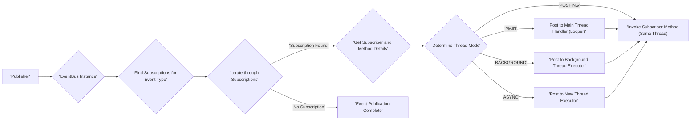
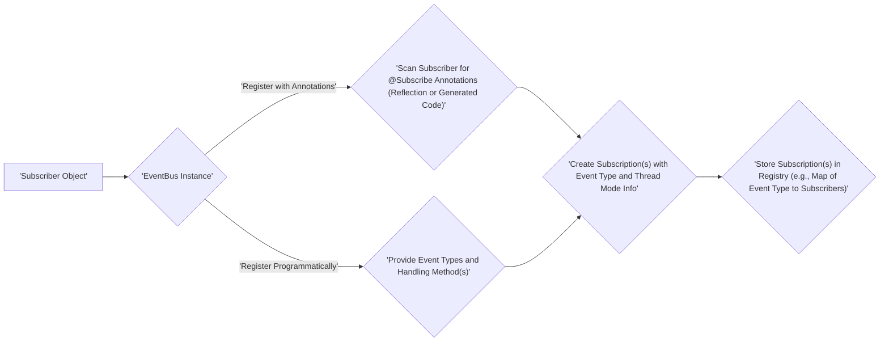
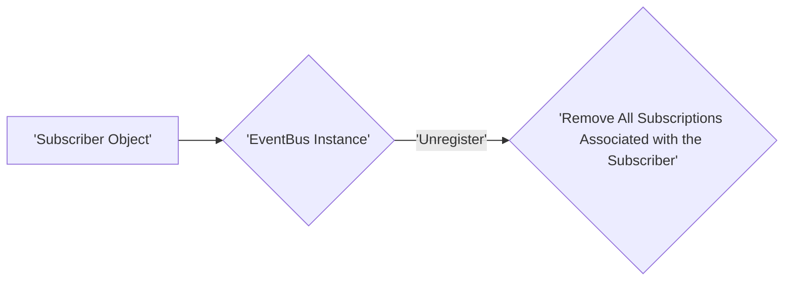

# Project Design Document: greenrobot/EventBus

**Version:** 1.1
**Date:** October 26, 2023
**Author:** AI Software Architect

## 1. Introduction

This document provides an enhanced and detailed design overview of the greenrobot/EventBus library, a widely adopted open-source publish/subscribe event bus specifically designed for Android and Java environments. The primary objective of this document is to offer a clear and comprehensive understanding of the library's architecture, its constituent components, and the intricate flow of data during event publication and subscription processes. This detailed description is crucial for conducting thorough threat modeling and security analysis of systems utilizing EventBus.

## 2. Goals and Objectives

*   Deliver an in-depth and precise description of the EventBus library's internal mechanisms and operational flow.
*   Clearly identify and delineate the key components within the EventBus architecture and meticulously explain their interactions and responsibilities.
*   Illustrate the complete data flow during both event publication and the subsequent delivery to registered subscribers, highlighting critical points of interaction.
*   Serve as a foundational resource for identifying potential security vulnerabilities, possible attack vectors, and areas of risk during comprehensive threat modeling exercises.
*   Document the design in a clear, concise, and readily understandable manner, adhering to valid markdown formatting and utilizing mermaid syntax for visual representations.

## 3. Architectural Overview

EventBus is architected around the well-established publish/subscribe pattern, enabling decoupled communication between different parts of an application. Subscribing components express their interest in specific event types, and publishing components dispatch events to the bus. The `EventBus` then efficiently routes these events to all registered subscribers interested in that particular event type.

**Key Architectural Principles:**

*   **Strict Decoupling:** Publishers and subscribers operate independently, possessing no direct knowledge of each other's existence or implementation.
*   **Loose Coupling via Events:** Dependencies are established solely through the shared understanding of event types, eliminating direct component dependencies.
*   **Centralized Management:** A single `EventBus` instance acts as the central point for managing all event registrations and distributions within the application.
*   **Configurable Asynchronous Delivery:** Event delivery can be configured to occur on the thread where the event was posted or on dedicated background or main threads, providing flexibility in handling event processing.

## 4. Component Description

The EventBus library is composed of several interacting components, each with a specific role:

*   **`EventBus`:** This is the core class and the central orchestrator of the event bus. Its responsibilities include:
    *   Managing the registration and unregistration of subscribers.
    *   Maintaining a registry of active subscriptions, typically organized by event type.
    *   Receiving published events.
    *   Identifying and notifying relevant subscribers based on the event type.
    *   Handling different thread modes for event delivery.
*   **Subscribers:** These are objects that have registered with the `EventBus` to receive notifications about specific types of events. Subscribers define methods that will be invoked when a matching event is published.
*   **Events:** These are plain Java objects (POJOs) that represent occurrences or changes in the application's state. Events carry data relevant to the occurrence they represent.
*   **Subscription:** This represents the link between a subscriber, a specific event type, and the subscriber method that will handle events of that type. It encapsulates information about the thread mode and priority (if implemented).
*   **Subscriber Method:** This is a method within a subscriber class that is designated (either via annotations or programmatic registration) to handle a particular event type. The method signature typically includes the event object as a parameter.
*   **Thread Mode:** This enumeration defines the thread on which the subscriber method will be invoked when an event is delivered. Common thread modes include:
    *   **`POSTING`:** The subscriber method is invoked on the same thread that posted the event. This is the default.
    *   **`MAIN`:** The subscriber method is invoked on the main (UI) thread. EventBus uses the Android Looper or a similar mechanism for this.
    *   **`BACKGROUND`:** The subscriber method is invoked on a background thread. If the posting thread is not the main thread, the method is invoked directly. Otherwise, it's enqueued for execution on a single background thread.
    *   **`ASYNC`:** The subscriber method is invoked on a new, separate thread.
*   **`SubscriberInfo`:** This interface and its implementations hold metadata about a subscriber, including a list of its event handling methods and their corresponding event types and thread modes. This information is often generated at compile time using annotation processors for performance optimization.
*   **`SubscriberInfoIndex`:** This interface defines a way to provide optimized access to `SubscriberInfo` objects. Implementations of this interface can be used to speed up subscriber registration, especially in applications with many subscribers and event types.

## 5. Data Flow

The core operation of EventBus involves two primary data flows: the publication of an event and its subsequent delivery to interested subscribers, and the registration process of subscribers.

**Event Publication Flow:**

**Detailed Steps for Event Publication:**

1. A component acting as a publisher creates an instance of an event object.
2. The publisher obtains a reference to the `EventBus` instance (typically a singleton or a readily accessible instance).
3. The publisher calls the `post(event)` method on the `EventBus` instance, passing the event object as an argument.
4. The `EventBus` receives the event and identifies its type (the class of the event object).
5. The `EventBus` consults its internal registry of subscriptions to find all subscriptions associated with the published event type.
6. The `EventBus` iterates through the matching subscriptions.
7. For each matching subscription:
    *   The `EventBus` retrieves the registered subscriber object and the corresponding subscriber method to be invoked.
    *   The `EventBus` examines the thread mode specified for that particular subscription.
    *   Based on the thread mode:
        *   **`POSTING`:** The subscriber method is invoked directly on the same thread that called the `post()` method.
        *   **`MAIN`:** The event is posted to the main thread's message queue using a `Handler` associated with the main thread's `Looper`. The subscriber method is then invoked on the main thread.
        *   **`BACKGROUND`:** If the posting thread is the main thread, the event is submitted to a shared, single-threaded background executor. If the posting thread is already a background thread, the subscriber method is invoked directly on that thread.
        *   **`ASYNC`:** A new thread is created, and the subscriber method is invoked on this newly created thread.
8. Once all relevant subscribers have been notified, the event publication process is complete.

**Subscriber Registration Flow:**

**Detailed Steps for Subscriber Registration:**

1. A subscriber object, intending to receive events, is instantiated.
2. The subscriber registers itself with the `EventBus` instance. This can happen in two primary ways:
    *   **Annotation-based registration:** The `register(subscriber)` method is called. The `EventBus` uses reflection (or pre-generated code via annotation processors) to scan the subscriber class for methods annotated with `@Subscribe`. These annotations specify the event type the method handles and the desired thread mode.
    *   **Programmatic registration:**  Methods like `register(Object subscriber, Class<?>... eventTypes)` allow explicit registration for specific event types and corresponding handler methods.
3. For each identified event handling method (either through annotations or programmatic configuration), the `EventBus` creates a `Subscription` object.
4. The `Subscription` object encapsulates the link between the subscriber instance, the specific event type being subscribed to, the designated handling method, and the desired thread mode for delivery.
5. The `EventBus` stores these `Subscription` objects in its internal registry. A common implementation uses a `Map` where the keys are the event types and the values are lists of corresponding `Subscription` objects.

**Subscriber Unregistration Flow:**

**Detailed Steps for Subscriber Unregistration:**

1. When a subscriber no longer needs to receive events, it needs to be unregistered.
2. The `unregister(subscriber)` method is called on the `EventBus` instance, passing the subscriber object as an argument.
3. The `EventBus` iterates through its internal subscription registry and removes all `Subscription` objects that are associated with the provided subscriber object.

## 6. Security Considerations (Pre-Threat Modeling)

While EventBus is primarily designed for facilitating communication and doesn't inherently enforce strict security measures, several aspects are crucial to consider during threat modeling:

*   **Unrestricted Event Posting:** Any component holding a reference to the `EventBus` instance can post arbitrary event types with potentially malicious payloads. This could be exploited to trigger unintended or harmful behavior in subscribers that process these events without proper validation. For example, a malicious component could post an event that causes a subscriber to access or modify sensitive data improperly.
*   **Uncontrolled Subscription:** Any component can register itself as a subscriber for any event type. This lack of access control can lead to information leakage if sensitive data is transmitted via events, and a malicious component subscribes to intercept this information. Consider scenarios where personal data or security tokens are inadvertently broadcasted.
*   **Reflection and Code Generation:** The use of reflection for annotation-based registration and the potential use of annotation processors for generating `SubscriberInfo` can introduce vulnerabilities if the subscriber classes are not from trusted sources. Maliciously crafted annotations or generated code could potentially compromise the application.
*   **Thread Context Vulnerabilities:** While thread modes offer flexibility, they also introduce potential vulnerabilities. Events delivered on the main thread with long-running handlers can lead to UI freezes (Denial of Service). Conversely, improper synchronization in handlers running on background or async threads can lead to race conditions and data corruption.
*   **Lack of Built-in Authorization/Authentication:** EventBus lacks built-in mechanisms to control which components are authorized to publish or subscribe to specific event types. This absence makes it challenging to enforce access control policies at the event bus level.
*   **Event Data Integrity and Authenticity:** EventBus does not provide any inherent mechanisms to guarantee the integrity or authenticity of event data. Subscribers must implement their own validation and sanitization logic to protect against malicious or corrupted event payloads. A man-in-the-middle attack (though less likely within a single application) or a compromised publisher could inject malicious events.
*   **Event Injection Attacks:** If an attacker can influence the data within an event being published, they might be able to manipulate the behavior of subscribers. For example, if an event contains user input that isn't sanitized, it could lead to cross-site scripting (XSS) vulnerabilities if a subscriber renders this data in a web view.

## 7. Deployment and Usage

EventBus is typically integrated into Android or Java projects by including it as a library dependency (e.g., via Gradle or Maven). Components within the application then obtain a reference to a shared `EventBus` instance, often implemented as a singleton, or create local instances as needed.

**Common Usage Patterns:**

*   **Facilitating Inter-component Communication:** Enabling different modules, activities, fragments, or services within an application to communicate without establishing direct dependencies, promoting modularity and maintainability.
*   **Propagating Background Task Updates:** Notifying the user interface (typically the main thread) about the completion, progress, or failure of asynchronous operations performed in background threads.
*   **Broadcasting Application-Wide Events:** Signaling significant events or state changes that are relevant to multiple parts of the application, such as user login/logout, network connectivity changes, or data synchronization status.

## 8. Assumptions and Limitations

*   We assume that the underlying platform (Android or Java Virtual Machine) provides a baseline level of security and integrity.
*   The security of the system heavily relies on the developers' responsible implementation and usage of EventBus, including proper validation of event data and secure handling of events in subscriber methods.
*   This design document primarily focuses on the core functionality of the base EventBus library and does not delve into specific extensions, add-ons, or integrations that might introduce additional complexities or security considerations.
*   Error handling and exception management within subscriber methods are considered the responsibility of the individual subscriber implementations. EventBus typically does not provide global error handling for subscriber exceptions.

## 9. Future Considerations (Potential Enhancements)

While the current design of EventBus is mature and widely used, potential future enhancements could address some of the identified security considerations and expand its capabilities:

*   **Scoped Event Buses:** Implementing the ability to create isolated event buses for specific modules or features, limiting the scope of event communication and potentially reducing the impact of unintended event broadcasts.
*   **Event Authorization Mechanisms:** Introducing mechanisms to define and enforce policies that control which components are permitted to publish or subscribe to specific event types, enhancing security and access control.
*   **Event Data Encryption:** Providing options for encrypting event data, especially when transmitting sensitive information, to protect against eavesdropping.
*   **Signed Events:** Implementing a mechanism for publishers to sign events, allowing subscribers to verify the authenticity and integrity of the event source.
*   **Dead-Letter Queue Enhancement:** Improving the handling of events that have no subscribers, potentially providing more detailed information or options for logging or retrying delivery.

This enhanced document provides a more in-depth and detailed design overview of the greenrobot/EventBus library, specifically tailored for effective threat modeling. By thoroughly understanding the components, data flow, and potential security implications, security professionals can conduct more comprehensive analyses and develop robust mitigation strategies for applications utilizing EventBus.