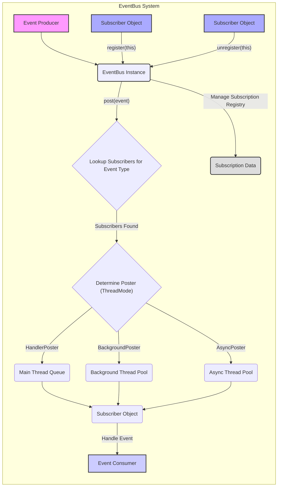

# Project Design Document: EventBus

**Version:** 1.1
**Date:** October 26, 2023
**Author:** AI Software Architect

## 1. Introduction

This document provides an enhanced design overview of the EventBus library, as found in the GitHub repository [https://github.com/greenrobot/eventbus](https://github.com/greenrobot/eventbus). This iteration aims to provide a more granular understanding of the architecture, components, and data flow of EventBus, specifically tailored for effective threat modeling. It delves deeper into the internal mechanisms and potential vulnerabilities.

## 2. Goals

The primary goals of this design document are to:

*   Provide a clear, concise, and technically detailed description of the EventBus library's architecture and functionality.
*   Identify and elaborate on the key components and their intricate interactions.
*   Illustrate the data flow within the system with greater precision, emphasizing the journey of an event through different stages.
*   Highlight potential areas of interest for security considerations and threat modeling with more specific examples.
*   Serve as a robust and informative foundation for subsequent threat modeling activities.

## 3. Overview

EventBus is a lightweight publish/subscribe event bus optimized for Android and Java environments. It facilitates decoupled communication between application components, enabling them to interact without explicit dependencies. This is achieved through the exchange of events, which are dispatched by publishers and received by interested subscribers via the central EventBus. This architecture promotes modularity, reduces coupling, and enhances code maintainability.

The fundamental concepts are:

*   **Events:** Plain Java objects that encapsulate information about occurrences within the application.
*   **Subscribers:** Objects that register with the EventBus to receive notifications of specific event types.
*   **EventBus:** The core component responsible for managing subscriber registrations and efficiently dispatching posted events to relevant subscribers.

## 4. Detailed Design

### 4.1. Core Components

*   **`EventBus` Class:**
    *   The central orchestrator of the event bus mechanism.
    *   Manages the lifecycle of subscribers, including registration and unregistration.
    *   Maintains a registry (`Map<Class<?>, CopyOnWriteArrayList<Subscription>>`) that maps event types to lists of their subscribers. The use of `CopyOnWriteArrayList` ensures thread-safety during event posting and subscriber modifications.
    *   Orchestrates the process of finding and notifying subscribers when an event is posted.
    *   Handles the threading aspects of event delivery based on the specified `ThreadMode`.
    *   Typically implemented as a singleton for application-wide access, but allows for multiple instances with distinct configurations.
*   **`SubscriberMethod` Class:**
    *   Represents a specific method within a subscriber object that is designated to handle a particular event type.
    *   Encapsulates metadata about the subscriber method, including the method itself (`Method`), the event type it accepts (`Class<?> eventType`), and the desired thread mode for event delivery (`ThreadMode`).
    *   Identified by the `@Subscribe` annotation.
*   **`Subscription` Class:**
    *   A pairing of a subscriber object instance and a `SubscriberMethod`.
    *   Holds a reference to the actual subscriber object (`Object subscriber`) and the corresponding `SubscriberMethod`.
    *   Used by the `EventBus` to invoke the correct method on the correct object when an event is dispatched.
*   **`Poster` Interface and Implementations (`HandlerPoster`, `BackgroundPoster`, `AsyncPoster`):**
    *   Responsible for the actual invocation of subscriber methods.
    *   Abstracts the threading logic involved in event delivery.
    *   `HandlerPoster`: Used for `ThreadMode.MAIN` and `ThreadMode.MAIN_ORDERED`, posting events to the main thread using a `Handler`.
    *   `BackgroundPoster`: Used for `ThreadMode.BACKGROUND`, posting events to a background thread pool. Reuses threads to minimize overhead.
    *   `AsyncPoster`: Used for `ThreadMode.ASYNC`, always posts events to a new thread from a thread pool.
*   **`SubscriberInfo` Interface and Implementations (Generated Code):**
    *   Provides a mechanism for optimizing subscriber method discovery.
    *   Implementations are typically generated at compile time (e.g., using an annotation processor) to avoid runtime reflection overhead.
    *   Contains information about the subscriber class and its event handling methods.
*   **`EventBusBuilder` Class:**
    *   A builder pattern for configuring the `EventBus` instance with various options and customizations.
    *   Allows setting exception handling behavior, thread enforcement policies, and the use of custom `ExecutorService` instances.

### 4.2. Key Processes

*   **Subscriber Registration:**
    *   A subscriber object invokes `eventBus.register(subscriber)`.
    *   The `EventBus` uses `SubscriberInfo` (if available) or reflection to identify methods annotated with `@Subscribe`.
    *   For each `@Subscribe` method, a `SubscriberMethod` is created, capturing the method details and event type.
    *   A `Subscription` object is created, linking the subscriber instance and the `SubscriberMethod`.
    *   The `Subscription` is added to the `EventBus`'s internal registry, indexed by the event type. If multiple subscribers are interested in the same event type, they are stored in a `CopyOnWriteArrayList` for thread-safe iteration during event posting.
*   **Event Posting:**
    *   An event is posted by calling `eventBus.post(event)`.
    *   The `EventBus` retrieves the class of the posted event.
    *   It then looks up the list of subscribers registered for that specific event type in its registry. The `eventInheritance` configuration determines if subscribers of superclasses or interfaces should also be notified.
    *   For each registered `Subscription`, the `EventBus` determines the appropriate `Poster` based on the `ThreadMode` specified in the `SubscriberMethod`.
    *   The `Poster` is tasked with delivering the event to the subscriber method, ensuring it's executed on the correct thread.
*   **Event Delivery (Detailed):**
    *   **`PostThread`:** The subscriber method is invoked directly on the same thread that called `eventBus.post(event)`. This offers the lowest overhead but requires careful consideration of thread safety within the subscriber method.
    *   **`MainThread` and `MainThreadOrdered`:** The event is posted to the main UI thread's message queue using a `Handler`. `MainThreadOrdered` ensures events are delivered in the order they were posted, even if multiple background threads post events concurrently.
    *   **`BackgroundThread`:** If the posting thread is the main thread, the event is submitted to a shared background thread pool. If the posting thread is already a background thread, the subscriber method is executed directly on that thread.
    *   **`Async`:** The event is always submitted to a dedicated thread pool, ensuring the subscriber method is executed on a separate thread, regardless of the posting thread.
    *   The `Poster` uses reflection to invoke the `SubscriberMethod` on the subscriber object instance with the posted event as an argument.
*   **Subscriber Unregistration:**
    *   A subscriber is unregistered by calling `eventBus.unregister(subscriber)`.
    *   The `EventBus` iterates through its internal registry and removes all `Subscription` objects associated with the given subscriber instance. This prevents the subscriber from receiving further events.

### 4.3. Data Flow Diagram

### 4.4. Configuration Options

The `EventBusBuilder` provides a fluent interface for configuring the `EventBus` instance:

*   **`throwSubscriberException(boolean)`:**  If `true`, exceptions thrown by subscriber methods are propagated up the call stack. If `false`, they are caught and potentially logged or result in a `SubscriberExceptionEvent` being posted.
*   **`logSubscriberExceptions(boolean)`:** If `true`, exceptions thrown by subscriber methods are logged.
*   **`logNoSubscriberMessages(boolean)`:** If `true`, a warning message is logged when an event is posted but no subscribers are registered for that type.
*   **`sendNoSubscriberEvent(boolean)`:** If `true`, a `NoSubscriberEvent` is posted on the EventBus when an event is posted but has no subscribers. This allows other components to react to such scenarios.
*   **`sendSubscriberExceptionEvent(boolean)`:** If `true`, a `SubscriberExceptionEvent` is posted on the EventBus when a subscriber method throws an exception. This allows for centralized error handling related to event processing.
*   **`eventInheritance(boolean)`:** If `true`, subscribers to a superclass event will also receive events of its subclasses. This enables a more flexible event handling hierarchy.
*   **`executorService(ExecutorService)`:** Allows providing a custom `ExecutorService` for `ThreadMode.BACKGROUND` and `ThreadMode.ASYNC` event delivery, offering control over thread pool characteristics.
*   **`strictMethodVerification()`:** Enables stricter validation of subscriber methods during registration, ensuring they adhere to the expected signature.
*   **`ignoreGeneratedIndex()`:**  Instructs the EventBus to ignore any generated subscriber indexes, forcing it to rely on reflection for subscriber discovery.
*   **`addIndex(SubscriberInfoIndex)`:** Adds a generated `SubscriberInfoIndex`, which contains pre-computed information about subscriber methods, improving registration performance by avoiding runtime reflection.

## 5. Security Considerations (For Threat Modeling)

EventBus, while facilitating communication, introduces potential security considerations that need careful evaluation during threat modeling:

*   **Unintended Event Consumption/Information Disclosure:**
    *   **Threat:** A malicious or compromised component registers as a subscriber for events it shouldn't have access to, potentially gaining sensitive information.
    *   **Example:** A logging component subscribing to events containing user credentials intended only for an authentication module.
    *   **Mitigation:** Employ principle of least privilege when designing event structures and subscriber registrations. Avoid broadcasting highly sensitive data in generic events.
*   **Malicious Event Posting/Denial of Service:**
    *   **Threat:** An attacker gains the ability to post arbitrary events, potentially triggering unintended actions or overwhelming the system with a flood of events, leading to a denial of service.
    *   **Example:** Posting a large number of resource-intensive events, forcing subscribers to perform excessive computations.
    *   **Mitigation:** Implement authorization checks before posting critical events. Rate-limiting event posting from untrusted sources.
*   **Exploiting Threading Models:**
    *   **Threat:**  An attacker crafts events that, when processed by subscribers in specific thread modes, can lead to race conditions, deadlocks, or other concurrency issues, especially if shared resources are involved.
    *   **Example:** Posting events intended for `ThreadMode.MAIN` that perform long-running operations, potentially freezing the UI.
    *   **Mitigation:**  Carefully design subscriber logic to be thread-safe, especially when using `PostThread` or `BackgroundThread`. Avoid performing long-blocking operations on the main thread.
*   **Exception Handling Vulnerabilities:**
    *   **Threat:**  If `throwSubscriberException` is set to `false` and exceptions in subscriber methods are not properly handled, errors might be silently ignored, leading to unexpected application state or masking underlying issues. Conversely, propagating exceptions might expose sensitive information in error logs.
    *   **Mitigation:**  Implement robust error handling within subscriber methods. Carefully consider the implications of the `throwSubscriberException` and `logSubscriberExceptions` configurations. Utilize `SubscriberExceptionEvent` for centralized error monitoring.
*   **Reflection Exploitation (Less Likely with Generated Indexes):**
    *   **Threat:** While less likely with the use of generated indexes, if reflection is heavily relied upon, vulnerabilities related to method injection or manipulation could theoretically be exploited, though this is a more general Java security concern.
    *   **Mitigation:**  Prefer using generated subscriber indexes for performance and reduced reliance on runtime reflection. Keep the EventBus library updated to benefit from security patches.
*   **Information Leakage through `NoSubscriberEvent` and `SubscriberExceptionEvent`:**
    *   **Threat:**  While intended for debugging and monitoring, the information contained within `NoSubscriberEvent` and `SubscriberExceptionEvent` could potentially leak information about the application's internal workings if these events are broadly accessible.
    *   **Mitigation:**  Restrict access to subscribers of these specific event types to authorized components responsible for monitoring and error handling.

## 6. Deployment Considerations

EventBus is a library integrated directly into the application. Deployment considerations are primarily related to the application's deployment process:

*   **Dependency Management:** Ensure the correct EventBus library version is included in the application's build dependencies (e.g., Gradle for Android/Java projects).
*   **Configuration:**  The `EventBus` instance should be configured appropriately during application initialization, considering threading requirements and exception handling strategies.
*   **Subscriber Lifecycle Management:** Developers must ensure that subscribers are registered and unregistered correctly to prevent memory leaks and unexpected behavior. Improper unregistration can lead to subscribers receiving events even when they are no longer needed.

## 7. Future Considerations

*   **Enhanced Event Filtering:** Explore mechanisms for more sophisticated event filtering beyond simple type matching, such as filtering based on event content or metadata.
*   **Integration with Reactive Streams:** Consider deeper integration with reactive programming paradigms (e.g., RxJava, Project Reactor) to provide more advanced event processing capabilities.
*   **Metrics and Monitoring Capabilities:**  Introduce built-in features for tracking event traffic, subscriber activity, and potential errors to aid in debugging and performance analysis.
*   **Support for Asynchronous Registration/Unregistration:** Investigate options for asynchronous subscriber registration and unregistration to avoid blocking the main thread, especially in scenarios with a large number of subscribers.

## 8. Conclusion

This enhanced design document provides a more detailed and nuanced understanding of the EventBus library's architecture and functionality. By elaborating on the core components, processes, and potential security considerations, this document serves as a valuable resource for conducting thorough threat modeling and mitigating potential risks associated with its use. The insights provided here will enable developers and security professionals to make informed decisions regarding the secure and efficient implementation of event-driven communication within their applications.