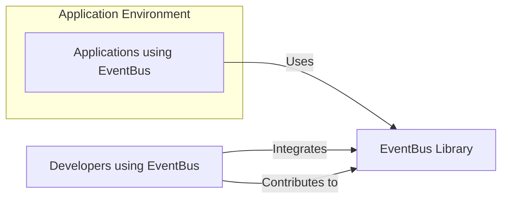
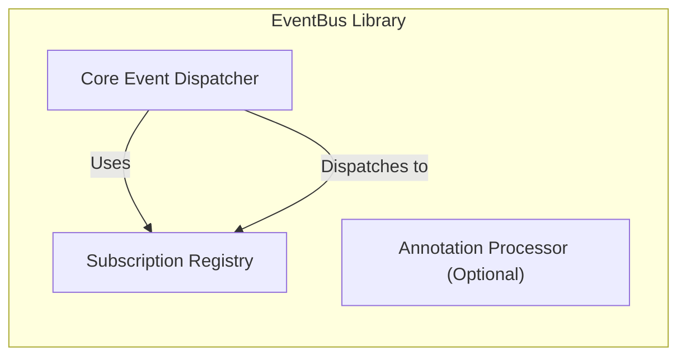
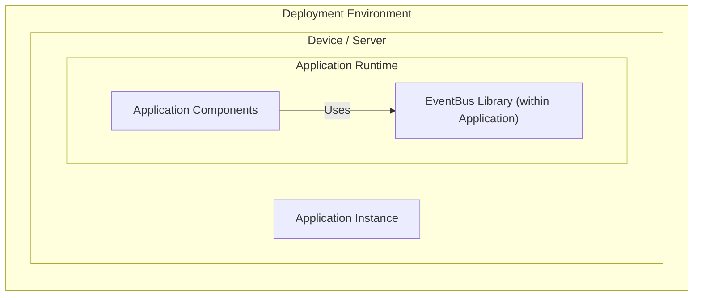
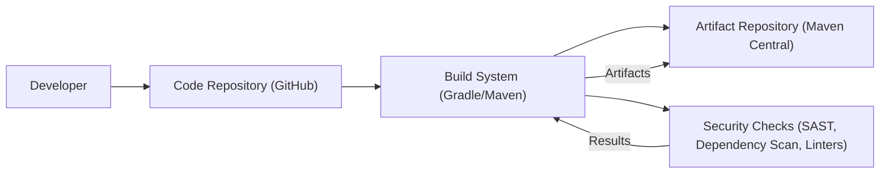

# BUSINESS POSTURE

- Business Priorities and Goals:
  - The EventBus project aims to provide a decoupled communication mechanism for Android and Java applications.
  - It prioritizes simplicity and ease of use for developers to implement publish/subscribe patterns within their applications.
  - The goal is to improve application architecture by reducing dependencies between components, leading to more maintainable and scalable code.
  - Another goal is to enhance application responsiveness by enabling asynchronous event handling.

- Business Risks:
  - Risk of introducing instability or bugs into applications if EventBus itself has vulnerabilities or is poorly implemented.
  - Risk of performance bottlenecks if event handling is not efficient, especially in high-volume scenarios.
  - Risk of developer misuse leading to unexpected application behavior if the API is not clear or documentation is lacking.
  - Risk of supply chain vulnerabilities if dependencies of EventBus are compromised.
  - Risk of reputational damage if security vulnerabilities are found in EventBus, impacting applications that rely on it.

# SECURITY POSTURE

- Existing Security Controls:
  - security control: Code hosted on GitHub, leveraging GitHub's infrastructure security. (Implemented: GitHub platform)
  - security control: Open-source project, allowing community review and scrutiny of the code. (Implemented: Open-source nature)
  - security control: Use of standard build tools like Gradle (assuming secure configuration). (Implemented: Build process)
  - accepted risk: Reliance on users to properly implement EventBus within their applications and handle sensitive data securely.
  - accepted risk: Limited direct control over how EventBus is used and deployed in various application contexts.

- Recommended Security Controls:
  - security control: Implement automated Static Application Security Testing (SAST) in the build pipeline to identify potential code vulnerabilities.
  - security control: Implement Dependency Check tools to identify known vulnerabilities in third-party libraries used by EventBus.
  - security control: Conduct regular code reviews, including security-focused reviews, by experienced developers.
  - security control: Provide clear and comprehensive documentation, including security considerations and best practices for using EventBus securely.
  - security control: Establish a process for reporting and handling security vulnerabilities, including timely patching and communication.

- Security Requirements:
  - Authentication: Not directly applicable to EventBus library itself. Authentication is the responsibility of the applications using EventBus.
  - Authorization: Not directly applicable to EventBus library itself. Authorization is the responsibility of the applications using EventBus to control access to events and data.
  - Input Validation:
    - Requirement: EventBus should handle various event types and data payloads robustly without crashing or causing unexpected behavior due to malformed input.
    - Requirement: Applications using EventBus should validate event data received through EventBus to prevent injection attacks or data integrity issues within their own application logic.
  - Cryptography:
    - Requirement: If EventBus is used to transmit sensitive data, applications should implement encryption at the application level before publishing events and decryption after receiving events. EventBus itself does not need to provide cryptographic features.

# DESIGN

- C4 CONTEXT

- C4 CONTEXT Elements:
  - - Name: Applications using EventBus
    - Type: Software System
    - Description: Android and Java applications that integrate the EventBus library to implement publish/subscribe communication patterns.
    - Responsibilities:
      - Define and publish events.
      - Subscribe to events and handle them.
      - Manage application-level security and data handling.
    - Security controls:
      - security control: Application-level authentication and authorization.
      - security control: Input validation of data within applications.
      - security control: Encryption of sensitive data within applications.

  - - Name: Developers using EventBus
    - Type: Person
    - Description: Software developers who integrate the EventBus library into their Android and Java applications.
    - Responsibilities:
      - Integrate EventBus library into applications.
      - Implement event publishers and subscribers.
      - Configure and use EventBus API correctly.
      - Follow security best practices when using EventBus.
    - Security controls:
      - security control: Secure coding practices.
      - security control: Following documentation and security guidelines for EventBus.

  - - Name: EventBus Library
    - Type: Software System
    - Description: A lightweight publish/subscribe event bus library for Android and Java. It facilitates communication between different components within an application without tight coupling.
    - Responsibilities:
      - Provide API for registering subscribers and posting events.
      - Manage event subscriptions and dispatch events to subscribers.
      - Ensure efficient event delivery.
      - Maintain code quality and security of the library.
    - Security controls:
      - security control: Code hosted on GitHub.
      - security control: Open-source community review.
      - security control: (Recommended) Automated SAST in build pipeline.
      - security control: (Recommended) Dependency vulnerability scanning.
      - security control: (Recommended) Code reviews.

- C4 CONTAINER

- C4 CONTAINER Elements:
  - - Name: Core Event Dispatcher
    - Type: Component
    - Description: The central component responsible for receiving published events and dispatching them to registered subscribers.
    - Responsibilities:
      - Receive events published via the EventBus API.
      - Look up subscribers registered for the event type.
      - Invoke subscriber methods to handle the event.
      - Manage event delivery mechanisms (e.g., thread handling).
    - Security controls:
      - security control: Input validation of event types and basic event data structure within the core dispatcher logic.
      - security control: (Recommended) Rate limiting or protection against event flooding if applicable in specific use cases (though less relevant for a library).

  - - Name: Subscription Registry
    - Type: Data Store / Component
    - Description: Stores information about registered subscribers, including the event types they are interested in and the methods to be invoked when those events occur.
    - Responsibilities:
      - Maintain a registry of subscribers and their associated event types and handler methods.
      - Provide efficient lookup of subscribers for a given event type.
      - Manage subscriber registration and unregistration.
    - Security controls:
      - security control: Access control to the subscription registry is internal to the library. No external access points.
      - security control: Data integrity of subscription data to prevent tampering or corruption.

  - - Name: Annotation Processor (Optional)
    - Type: Component
    - Description: An optional component that, during compile time, processes annotations (like `@Subscribe`) to automatically generate subscriber registration code, simplifying development.
    - Responsibilities:
      - Process annotations in application code during compilation.
      - Generate code for subscriber registration, reducing boilerplate code for developers.
      - Ensure correct and safe code generation.
    - Security controls:
      - security control: Input validation of annotations and associated code structures during processing to prevent code injection or unexpected behavior during code generation.
      - security control: (Recommended) Static analysis of generated code to ensure it adheres to security best practices.

- DEPLOYMENT

- DEPLOYMENT Elements:
  - - Name: Device / Server
    - Type: Infrastructure
    - Description: The physical or virtual environment where the application using EventBus is deployed. This could be an Android mobile device, a Java server, or any other platform supporting Java or Android applications.
    - Responsibilities:
      - Provide the runtime environment for the application.
      - Ensure the availability and performance of the application.
      - Implement platform-level security controls.
    - Security controls:
      - security control: Operating system and platform security controls (e.g., firewalls, access controls, patching).
      - security control: Physical security of the device/server.

  - - Name: Application Instance
    - Type: Software Deployment Unit
    - Description: A running instance of an application that incorporates the EventBus library.
    - Responsibilities:
      - Execute application logic.
      - Utilize EventBus for inter-component communication.
      - Manage application-specific resources.
    - Security controls:
      - security control: Application-level security controls (authentication, authorization, input validation, etc.).
      - security control: Secure configuration of the application.

  - - Name: Application Runtime
    - Type: Container / Process
    - Description: The runtime environment within the application instance where the EventBus library and application components are loaded and executed.
    - Responsibilities:
      - Provide execution context for application code and libraries.
      - Manage memory, threads, and other runtime resources.
    - Security controls:
      - security control: Runtime environment security features (e.g., sandboxing, memory protection).

  - - Name: EventBus Library (within Application)
    - Type: Library / Component
    - Description: The EventBus library as integrated and running within the application instance.
    - Responsibilities:
      - Provide publish/subscribe functionality within the application runtime.
      - Dispatch events efficiently within the application process.
    - Security controls:
      - security control: Inherits security controls of the application runtime environment.
      - security control: Library-level security features (as described in Container section).

  - - Name: Application Components
    - Type: Software Components
    - Description: The various modules and components of the application that use EventBus for communication.
    - Responsibilities:
      - Implement application-specific functionality.
      - Publish and subscribe to events using EventBus.
      - Handle events and data securely within their logic.
    - Security controls:
      - security control: Component-level security controls (input validation, secure data handling within components).

- BUILD

- BUILD Elements:
  - - Name: Developer
    - Type: Person
    - Description: Software developers who write, modify, and contribute code to the EventBus project.
    - Responsibilities:
      - Write secure and high-quality code.
      - Follow coding standards and security guidelines.
      - Commit code to the code repository.
    - Security controls:
      - security control: Secure development training.
      - security control: Code review participation.
      - security control: Secure coding practices.

  - - Name: Code Repository (GitHub)
    - Type: Software System
    - Description: GitHub repository hosting the EventBus source code, issue tracking, and collaboration features.
    - Responsibilities:
      - Version control of the codebase.
      - Access control to the repository.
      - Issue tracking and project management.
    - Security controls:
      - security control: GitHub access controls and authentication.
      - security control: Branch protection rules.
      - security control: Audit logs of repository activities.

  - - Name: Build System (Gradle/Maven)
    - Type: Software System
    - Description: Automated build system using Gradle or Maven to compile, test, and package the EventBus library.
    - Responsibilities:
      - Automate the build process.
      - Compile source code.
      - Run unit tests.
      - Package the library into distributable artifacts (JAR, AAR).
      - (Recommended) Integrate security checks into the build process.
    - Security controls:
      - security control: Secure configuration of the build system.
      - security control: Access control to the build system.
      - security control: (Recommended) Integration of SAST and dependency scanning tools.
      - security control: (Recommended) Build process hardening.

  - - Name: Security Checks (SAST, Dependency Scan, Linters)
    - Type: Software System / Tools
    - Description: Automated security tools integrated into the build pipeline to perform static analysis, dependency vulnerability scanning, and code linting.
    - Responsibilities:
      - Identify potential security vulnerabilities in the code.
      - Detect known vulnerabilities in dependencies.
      - Enforce coding standards and best practices.
      - Provide reports on security findings.
    - Security controls:
      - security control: Secure configuration of security tools.
      - security control: Regular updates of security tool databases.
      - security control: Review and remediation of security findings.

  - - Name: Artifact Repository (Maven Central)
    - Type: Software System
    - Description: Public repository (Maven Central) where the compiled and packaged EventBus library artifacts are published for developers to download and use in their projects.
    - Responsibilities:
      - Host and distribute EventBus library artifacts.
      - Ensure availability and integrity of artifacts.
      - Manage artifact versions.
    - Security controls:
      - security control: Maven Central's infrastructure security.
      - security control: Signing of artifacts to ensure integrity and authenticity.
      - security control: (Recommended) Software Bill of Materials (SBOM) generation and publication.

# RISK ASSESSMENT

- Critical Business Processes:
  - For EventBus itself, the critical process is maintaining the integrity, availability, and security of the library to ensure applications using it function correctly and are not negatively impacted.
  - For applications using EventBus, the critical business processes are those that rely on inter-component communication facilitated by EventBus. The criticality depends on the specific application and its business function.

- Data to Protect and Sensitivity:
  - For EventBus library: Primarily the source code and build artifacts. Sensitivity is moderate, as vulnerabilities could impact applications using the library.
  - For applications using EventBus: The data being transmitted as events. Sensitivity depends entirely on the application and the nature of the data. It could range from low (non-sensitive application events) to high (sensitive personal or financial data transmitted via events). EventBus itself does not inherently handle sensitive data; it's a transport mechanism. The sensitivity is determined by the application's use of EventBus.

# QUESTIONS & ASSUMPTIONS

- Questions:
  - What is the intended deployment environment for applications using EventBus (e.g., mobile devices, servers, embedded systems)? (Assumption: Broad range of Android and Java environments)
  - Are there specific performance requirements for EventBus in high-volume event scenarios? (Assumption: Performance is important, but focus is on general efficiency rather than extreme low-latency requirements)
  - Are there any specific regulatory compliance requirements for applications using EventBus (e.g., GDPR, HIPAA)? (Assumption: Compliance is application-specific and the responsibility of the application developers, not directly EventBus library itself)
  - Is there an existing security incident response plan for the EventBus project? (Assumption: Standard open-source project practices are followed, but a formal incident response plan might be beneficial)

- Assumptions:
  - BUSINESS POSTURE: The primary business goal is to provide a useful and reliable library for developers to improve application architecture.
  - SECURITY POSTURE: Standard secure software development practices are generally followed for open-source projects. The security of applications using EventBus is primarily the responsibility of the application developers.
  - DESIGN: The design is relatively simple and focused on providing core publish/subscribe functionality. Deployment is within applications, and build process uses standard open-source build tools.