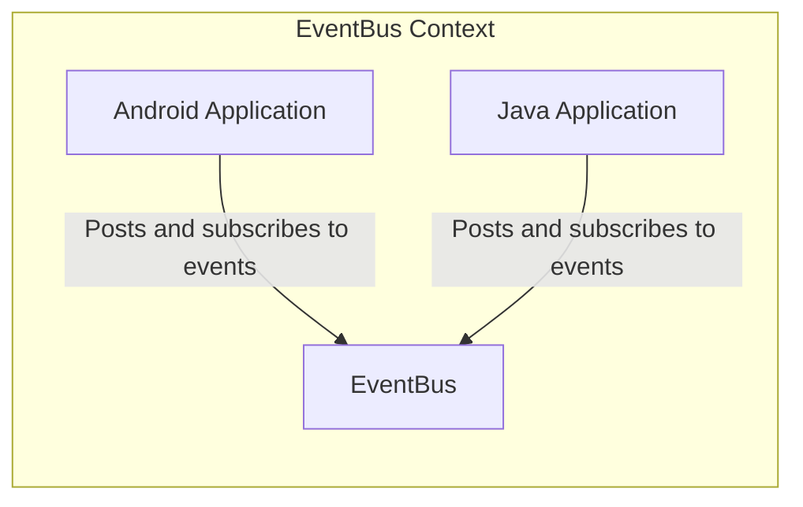
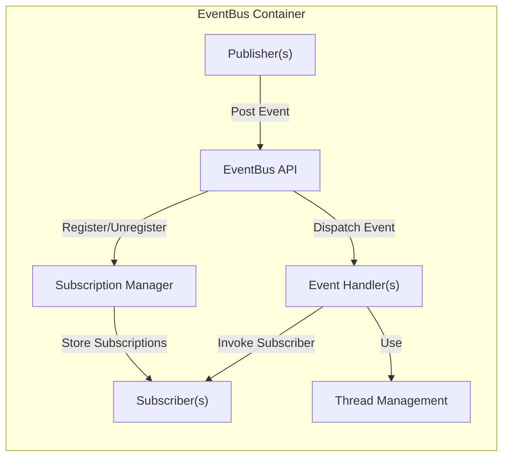
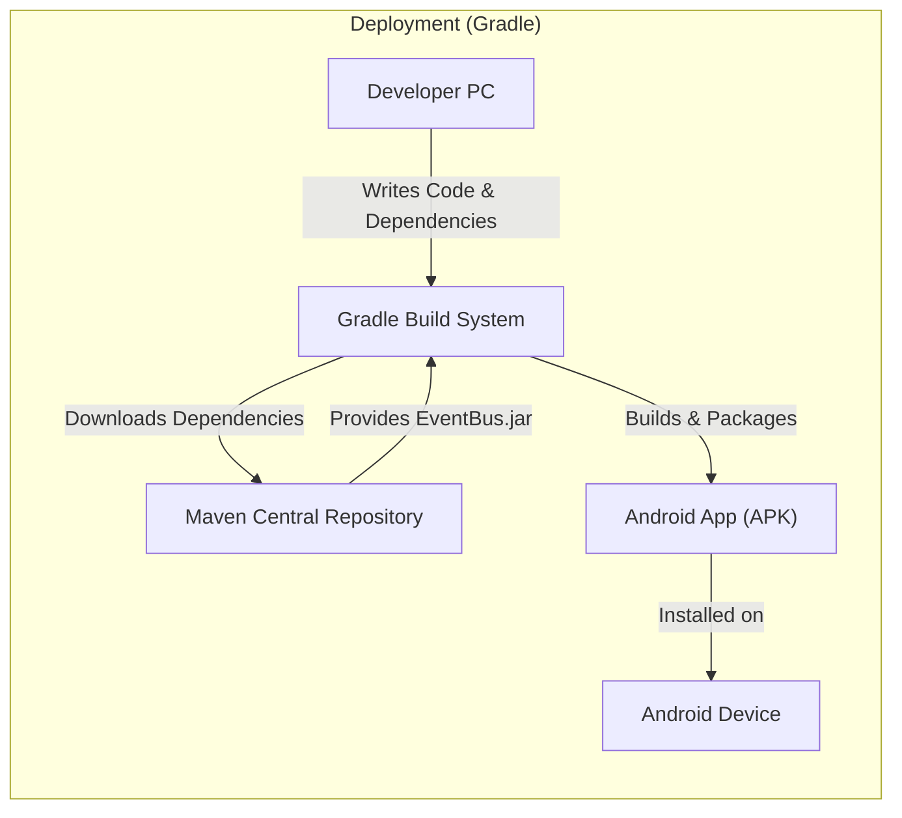
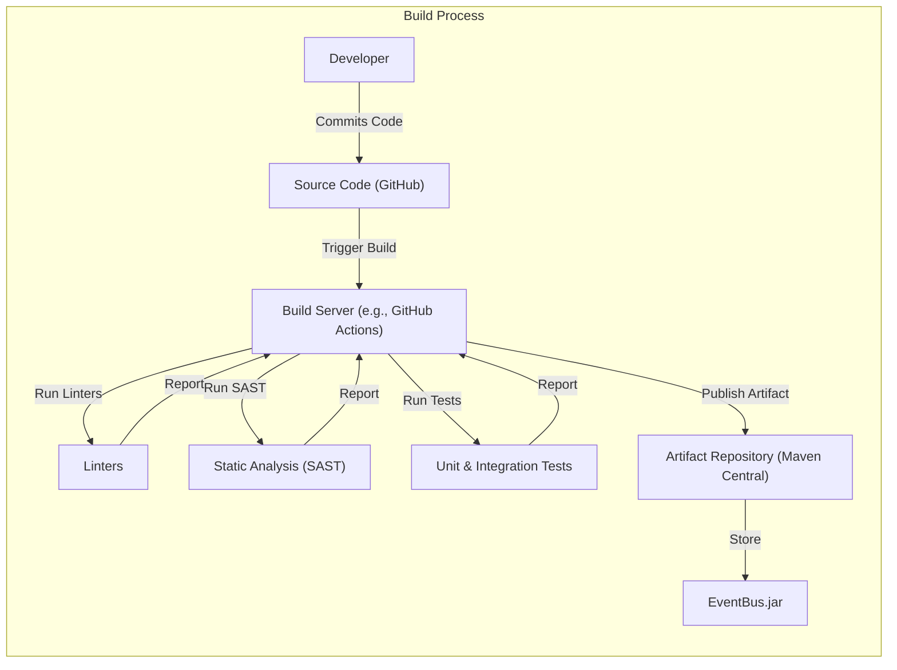

# Project Design Document: EventBus

## BUSINESS POSTURE

EventBus is a mature, open-source library widely used in Android and Java applications. Its primary goal is to simplify communication between different parts of an application by implementing the publisher-subscriber pattern. This decoupling enhances maintainability, testability, and overall code structure.

Business Priorities:

*   Maintainability: Reduce code complexity and coupling between components.
*   Testability: Facilitate easier unit and integration testing.
*   Performance: Minimize overhead associated with event handling.
*   Reliability: Ensure events are delivered reliably and consistently.
*   Adoption: Continue to be a widely adopted and trusted library.
*   Community Support: Maintain an active and supportive community.

Business Risks:

*   Performance Degradation: Inefficient event handling could lead to performance bottlenecks, especially in high-volume scenarios.
*   Memory Leaks: Improper subscriber management (e.g., failing to unregister) can lead to memory leaks.
*   Security Vulnerabilities: Although primarily a communication library, misuse or vulnerabilities in subscriber code could expose the application to risks.
*   Compatibility Issues: Changes or updates to the library could introduce compatibility issues with existing applications.
*   Community Fragmentation: Lack of active maintenance or community engagement could lead to project stagnation.

## SECURITY POSTURE

Existing Security Controls:

*   security control: Open Source: The codebase is publicly available for review and scrutiny, allowing for community-driven identification and resolution of potential security issues. (Described in GitHub repository)
*   security control: Mature Project: Being a long-standing project, it has likely undergone numerous bug fixes and security improvements over time. (Described in GitHub repository)
*   security control: Widely Used: Its widespread adoption means that many eyes have likely reviewed the code, increasing the chances of identifying and fixing vulnerabilities. (Described in GitHub repository)

Accepted Risks:

*   accepted risk: Third-Party Code Execution: Subscribers are responsible for their own code, and EventBus inherently executes this code. Malicious or vulnerable subscriber code could compromise the application.
*   accepted risk: Denial of Service (DoS): An excessive number of events or slow subscribers could potentially lead to performance degradation or even a denial-of-service condition within the application.
*   accepted risk: Sensitive Data Exposure: If sensitive data is passed through events, improper handling in subscribers could lead to data exposure.

Recommended Security Controls:

*   security control: Subscriber Validation: Implement a mechanism to validate or restrict which classes can register as subscribers, potentially using annotations or a whitelist.
*   security control: Event Data Sanitization: If events carry sensitive data, consider sanitizing or encrypting the data before posting it.
*   security control: Rate Limiting: Implement rate limiting to prevent an excessive number of events from overwhelming the system.
*   security control: Security Audits: Conduct regular security audits of the codebase and its dependencies.

Security Requirements:

*   Authentication: Not directly applicable to EventBus itself, as it's an in-process communication mechanism. Authentication should be handled at the application level before events are posted.
*   Authorization: Consider implementing authorization checks within subscribers if events trigger sensitive actions. This would involve checking if the event originator or the current application context has the necessary permissions to perform the action.
*   Input Validation: Event data should be treated as untrusted input. Subscribers should validate the data received in events before processing it to prevent vulnerabilities like injection attacks.
*   Cryptography: If sensitive data is transmitted via events, consider encrypting the data within the event payload. However, this adds complexity and performance overhead, so it should be used judiciously.

## DESIGN

### C4 CONTEXT

Element Description:

*   Element:
    *   Name: Android Application
    *   Type: Mobile Application
    *   Description: An Android application that utilizes EventBus for inter-component communication.
    *   Responsibilities: Posts events to EventBus, Subscribes to events from EventBus, Handles events in subscribers.
    *   Security controls: Subscriber validation, Event data sanitization, Rate limiting (if applicable).

*   Element:
    *   Name: Java Application
    *   Type: Java Application
    *   Description: A Java application (non-Android) that utilizes EventBus for inter-component communication.
    *   Responsibilities: Posts events to EventBus, Subscribes to events from EventBus, Handles events in subscribers.
    *   Security controls: Subscriber validation, Event data sanitization, Rate limiting (if applicable).

*   Element:
    *   Name: EventBus
    *   Type: Library
    *   Description: The EventBus library itself, facilitating the publisher-subscriber pattern.
    *   Responsibilities: Manages event subscriptions, Delivers events to subscribers, Handles threading and background execution.
    *   Security controls: Open Source, Mature Project, Widely Used.

### C4 CONTAINER

Element Description:

*   Element:
    *   Name: Publisher(s)
    *   Type: Application Component
    *   Description: Components within the application that generate and post events.
    *   Responsibilities: Create event objects, Post events to the EventBus.
    *   Security controls: Potentially responsible for initial data sanitization if events contain sensitive information.

*   Element:
    *   Name: Subscriber(s)
    *   Type: Application Component
    *   Description: Components within the application that register to receive specific events.
    *   Responsibilities: Register with the EventBus for specific event types, Handle received events, Unregister from the EventBus when no longer needed.
    *   Security controls: Input validation of event data, Authorization checks (if applicable), Avoid long-running operations in the main thread.

*   Element:
    *   Name: EventBus API
    *   Type: API
    *   Description: The public interface of the EventBus library.
    *   Responsibilities: Provides methods for posting events, registering and unregistering subscribers.
    *   Security controls: May implement subscriber validation or rate limiting.

*   Element:
    *   Name: Event Handler(s)
    *   Type: Internal Component
    *   Description: Internal components of EventBus that handle event dispatching.
    *   Responsibilities: Determine which subscribers should receive an event, Invoke the appropriate subscriber methods.
    *   Security controls: None directly, relies on the correctness of the Subscription Manager.

*   Element:
    *   Name: Subscription Manager
    *   Type: Internal Component
    *   Description: Internal component of EventBus that manages subscriber registrations.
    *   Responsibilities: Store and retrieve subscriber information, Determine the list of subscribers for a given event type.
    *   Security controls: None directly, but its correctness is crucial for preventing unauthorized event delivery.

*   Element:
    *   Name: Thread Management
    *   Type: Internal Component
    *   Description: Handles threading and background execution of event handlers.
    *   Responsibilities: Execute subscriber methods on the appropriate thread (main thread, background thread, etc.).
    *   Security controls: None directly, but proper thread management is important for preventing UI freezes and ensuring responsiveness.

### DEPLOYMENT

EventBus is a library, not a standalone application. Therefore, it doesn't have its own deployment diagram in the traditional sense. It's integrated into other applications.  However, we can describe how it's typically included and used within a project.

Possible Deployment Solutions:

1.  **Dependency Management (Maven, Gradle):** The most common approach. EventBus is added as a dependency in the project's build configuration (e.g., `build.gradle` for Android, `pom.xml` for Maven). The build system automatically downloads and includes the library.
2.  **Manual JAR Inclusion:** Less common, but possible. The EventBus JAR file can be manually downloaded and placed in the project's `libs` directory.

Chosen Solution (Dependency Management - Gradle):

Element Description:

*   Element:
    *   Name: Developer PC
    *   Type: Workstation
    *   Description: The developer's computer where the application code is written and built.
    *   Responsibilities: Writing code, configuring dependencies, initiating builds.
    *   Security controls: Standard development environment security practices (e.g., secure coding practices, up-to-date software).

*   Element:
    *   Name: Gradle Build System
    *   Type: Build Tool
    *   Description: The Gradle build system used to manage dependencies, compile code, and package the application.
    *   Responsibilities: Resolving dependencies, compiling code, creating the application package (APK).
    *   Security controls: Dependency verification (e.g., checksum validation), secure configuration of the build process.

*   Element:
    *   Name: Maven Central Repository
    *   Type: Artifact Repository
    *   Description: A public repository that hosts open-source libraries, including EventBus.
    *   Responsibilities: Storing and providing access to library artifacts.
    *   Security controls: Repository security measures (e.g., access controls, integrity checks).

*   Element:
    *   Name: Android App (APK)
    *   Type: Application Package
    *   Description: The final Android application package, containing the compiled code and all dependencies (including EventBus).
    *   Responsibilities: Running the application on an Android device.
    *   Security controls: Android platform security features, application signing.

*   Element:
    *   Name: Android Device
    *   Type: Mobile Device
    *   Description: The Android device where the application is installed and run.
    *   Responsibilities: Executing the application code.
    *   Security controls: Android operating system security features, user permissions.

### BUILD

Build Process Description:

1.  **Code Commit:** A developer commits code changes to the EventBus repository on GitHub.
2.  **Build Trigger:** The commit triggers a build process on a build server (e.g., GitHub Actions, Travis CI, or a similar CI/CD system).
3.  **Linting:** Linters (e.g., Checkstyle, PMD) are run to enforce code style and identify potential code quality issues.
4.  **Static Analysis:** Static analysis tools (SAST, e.g., FindBugs, SpotBugs) are run to scan the code for potential security vulnerabilities and bugs.
5.  **Testing:** Unit and integration tests are executed to verify the functionality of the library.
6.  **Artifact Creation:** If all checks and tests pass, the build server creates the EventBus JAR file.
7.  **Artifact Publication:** The JAR file is published to a repository like Maven Central, making it available for other projects to use.
8.  **Supply Chain Security:** The build process should incorporate measures to ensure the integrity of dependencies and prevent supply chain attacks. This might involve using dependency verification tools, signing artifacts, and scanning for known vulnerabilities in dependencies.

## RISK ASSESSMENT

Critical Business Processes:

*   **Inter-component communication:** EventBus is critical for enabling communication between different parts of an application. Failure of EventBus could lead to a complete breakdown of application functionality.
*   **Asynchronous operations:** EventBus facilitates asynchronous operations, allowing for non-blocking execution of tasks. Issues with EventBus could lead to UI freezes or performance problems.

Data Protection:

*   **Event Data:** The primary data EventBus handles is the data contained within events. The sensitivity of this data depends entirely on the application using EventBus. It could range from non-sensitive UI updates to highly sensitive user data.
*   **Data Sensitivity:**
    *   **High:** If EventBus is used to transmit sensitive data (e.g., personal information, financial data, authentication tokens), appropriate security measures (encryption, data sanitization) must be implemented within the application.
    *   **Medium:** If EventBus is used for less sensitive data (e.g., application state changes, UI events), the risk is lower, but input validation and basic security practices are still important.
    *   **Low:** If EventBus is used only for non-sensitive data and internal communication, the risk is minimal.

## QUESTIONS & ASSUMPTIONS

Questions:

*   Are there any specific performance requirements or limitations for EventBus usage within a particular application?
*   Are there any plans to introduce new features or significant changes to EventBus that could impact its security posture?
*   What is the process for reporting and addressing security vulnerabilities discovered in EventBus?
*   What kind of sensitive data is passed through EventBus in different applications?
*   Are there any specific regulatory compliance requirements (e.g., GDPR, HIPAA) that need to be considered when using EventBus?

Assumptions:

*   BUSINESS POSTURE: EventBus is primarily used for internal application communication, not for communication with external systems or services.
*   SECURITY POSTURE: Developers using EventBus are responsible for implementing appropriate security measures within their own code (subscribers and publishers).
*   DESIGN: The core functionality of EventBus will remain relatively stable, with future development focusing on performance improvements, bug fixes, and minor feature additions.
*   DESIGN: EventBus is used in a single application context, not across multiple processes or devices.
*   DESIGN: The build process includes automated testing and static analysis.