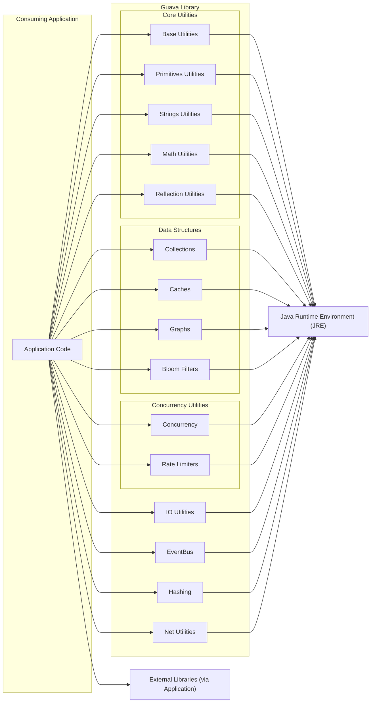
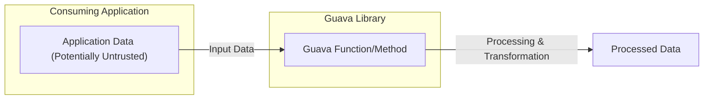

## Project Design Document: Google Guava Library (Improved for Threat Modeling)

**1. Introduction**

This document provides an enhanced high-level design overview of the Google Guava library, an open-source set of core libraries that supplements the Java Development Kit (JDK). This improved document is specifically tailored to facilitate threat modeling activities by providing a detailed understanding of Guava's architecture, components, data flow, and external interactions, with a focus on potential security implications.

**2. Goals**

*   Provide a clear and comprehensive description of the Guava library's architecture, emphasizing aspects relevant to security.
*   Identify the major functional categories and components within Guava, detailing their purpose and potential security considerations.
*   Illustrate the typical data flow patterns when using Guava, highlighting potential points of vulnerability.
*   Outline the external dependencies and interaction points of Guava, considering the security implications of these interactions.
*   Serve as a robust foundation for identifying potential security threats, vulnerabilities, and attack vectors associated with the use of the Guava library.

**3. Non-Goals**

*   In-depth code-level implementation details of specific Guava classes or methods.
*   Performance evaluation, benchmarking, or optimization strategies for Guava.
*   Specific versioning details, release management processes, or the history of Guava development.
*   Comprehensive API documentation (refer to the official Guava documentation for detailed API specifications).
*   Threat modeling of specific applications that *use* Guava (this document focuses on Guava itself).

**4. High-Level Architecture**

Guava is designed as a modular library, integrated into consuming Java applications as a dependency. Its architecture can be broadly categorized into functional areas.

**5. Component Details with Security Considerations**

Guava is organized into several key packages, each providing distinct functionalities. This section highlights potential security considerations for each:

*   **`com.google.common.annotations`**:
    *   **Functionality:** Provides annotations for marking code (e.g., `@Beta`).
    *   **Security Considerations:**  Generally low direct security impact. Misinterpretation of annotations could lead to incorrect assumptions about API stability.

*   **`com.google.common.base`**:
    *   **Functionality:** Fundamental utility classes (e.g., `Optional`, `Preconditions`, `Function`, `Predicate`).
    *   **Security Considerations:**
        *   `Preconditions`:  Improper use might not catch invalid input, potentially leading to unexpected behavior or vulnerabilities in consuming applications.
        *   `Optional`:  While not a direct vulnerability, incorrect handling of `Optional` could lead to null pointer exceptions if not checked properly.

*   **`com.google.common.cache`**:
    *   **Functionality:** In-memory caching functionality.
    *   **Security Considerations:**
        *   **DoS:** Unbounded caches can lead to memory exhaustion and denial-of-service if not configured with appropriate eviction policies.
        *   **Data Sensitivity:** Cached data might contain sensitive information. Ensure appropriate access controls and consider encryption if necessary (though Guava doesn't provide encryption itself).
        *   **Cache Poisoning:** If the loading mechanism is vulnerable, malicious data could be cached.

*   **`com.google.common.collect`**:
    *   **Functionality:** Immutable collections, multisets, multimaps, tables, and other advanced collection types.
    *   **Security Considerations:**
        *   **Immutability:** Generally enhances security by preventing unintended modifications. However, ensure the original data used to create immutable collections is handled securely.
        *   **Data Integrity:**  Using appropriate collection types can help maintain data integrity.

*   **`com.google.common.concurrency`**:
    *   **Functionality:** Concurrency utilities, including `ListenableFuture`, `Service`, and rate limiters.
    *   **Security Considerations:**
        *   **DoS:** Improperly configured or abused rate limiters could lead to denial of service.
        *   **Thread Safety:** While Guava's concurrency utilities are designed to be thread-safe, incorrect usage in consuming applications can still introduce concurrency bugs and vulnerabilities.

*   **`com.google.common.eventbus`**:
    *   **Functionality:** Publish/subscribe event bus.
    *   **Security Considerations:**
        *   **Unauthorized Access:** Ensure proper access control to the event bus to prevent unauthorized publishing or subscribing to sensitive events.
        *   **Information Disclosure:** Events might contain sensitive information. Ensure appropriate handling and filtering of events.
        *   **Malicious Events:**  Untrusted sources publishing events could potentially trigger unintended actions or vulnerabilities.

*   **`com.google.common.graph`**:
    *   **Functionality:** Data structures for modeling graph-like relationships.
    *   **Security Considerations:**
        *   **DoS:**  Large or deeply nested graphs could potentially lead to performance issues or denial of service if not handled carefully.
        *   **Data Integrity:** Ensure the integrity of the graph structure and node/edge data.

*   **`com.google.common.hash`**:
    *   **Functionality:** Hashing utilities, including various hash functions and Bloom filters.
    *   **Security Considerations:**
        *   **Collision Attacks:**  While Guava provides strong hash functions, understanding the potential for collisions is important, especially when using hash-based data structures.
        *   **Cryptographic Use:**  Guava's hashing functions are generally not designed for cryptographic purposes. Use dedicated cryptographic libraries for secure hashing.
        *   **Bloom Filters:**  Understand the possibility of false positives when using Bloom filters, which could have security implications depending on the application.

*   **`com.google.common.io`**:
    *   **Functionality:** I/O utilities for working with streams, files, and byte arrays.
    *   **Security Considerations:**
        *   **Path Traversal:**  Careless handling of file paths could lead to path traversal vulnerabilities.
        *   **Resource Exhaustion:**  Reading large files without proper limits could lead to memory exhaustion.
        *   **Data Integrity:** Ensure data read from or written to I/O streams is handled securely.

*   **`com.google.common.math`**:
    *   **Functionality:** Math utilities beyond those in the JDK, including arithmetic overflow detection.
    *   **Security Considerations:**
        *   **Integer Overflow:**  Guava's math utilities can help prevent integer overflow vulnerabilities. Ensure they are used correctly where overflow is a concern.

*   **`com.google.common.net`**:
    *   **Functionality:** Networking utilities, such as domain name parsing and media type handling.
    *   **Security Considerations:**
        *   **Input Validation:**  Ensure proper validation of network-related inputs to prevent injection attacks or unexpected behavior.

*   **`com.google.common.primitives`**:
    *   **Functionality:** Utility methods for working with primitive types.
    *   **Security Considerations:** Generally low direct security impact.

*   **`com.google.common.reflect`**:
    *   **Functionality:** Reflection utilities.
    *   **Security Considerations:**
        *   **Access Control Bypass:**  Reflection can bypass normal access controls. Ensure its use is restricted and validated to prevent unauthorized access or modification of application state.

*   **`com.google.common.util.concurrent`**:
    *   **Functionality:** Additional concurrency utilities.
    *   **Security Considerations:** Similar to `com.google.common.concurrency` regarding thread safety and potential for DoS.

**6. Data Flow with Security Implications**

Data flow when using Guava typically involves the consuming application providing data to Guava components for processing.

*   **Input:** The consuming application provides data to Guava methods or classes. This data might originate from untrusted sources (e.g., user input, external APIs). **Security Implication:**  Guava methods should be used in a way that mitigates risks associated with processing untrusted data.
*   **Processing:** Guava components perform operations on the input data. **Security Implication:** Vulnerabilities within Guava's processing logic could be exploited.
*   **Output:** Guava returns processed data or modifies the state of objects. **Security Implication:** The processed data might be used in security-sensitive operations within the consuming application.

**Examples of Data Flow and Security:**

*   **Hashing User Input:** An application uses Guava's hashing utilities to hash user passwords. **Security Implication:** While Guava provides the hashing function, the application is responsible for using a strong salt and appropriate hashing algorithm.
*   **Caching API Responses:** An application uses Guava's caching to store responses from an external API. **Security Implication:** If the API is compromised, the cached data could be malicious. Proper validation of API responses before caching is crucial.
*   **Using Collections for Access Control:** An application uses Guava's immutable collections to store authorized users. **Security Implication:** The integrity of this collection is critical for maintaining access control.

**7. External Interactions with Security Implications**

Guava's primary external interaction is with the Java Runtime Environment (JRE). Consuming applications introduce further interaction points.

*   **Java Standard Library (JDK):** Guava relies on the JDK. **Security Implication:** Vulnerabilities in the underlying JDK could affect Guava. Keeping the JRE updated is essential.
*   **Consuming Applications:** Applications use Guava's API. **Security Implication:** The way an application uses Guava can introduce vulnerabilities. Misuse of APIs or improper handling of data passed to Guava are potential risks.
*   **Operating System (via JRE):** Guava, through the JRE, interacts with the OS for tasks like file I/O. **Security Implication:** OS-level vulnerabilities could be exploited if Guava is used for file operations without proper precautions.
*   **External Libraries (via Application):** Consuming applications might use other libraries alongside Guava. **Security Implication:**  Interactions between Guava and other libraries could introduce vulnerabilities if data is not handled securely across library boundaries.

**8. Deployment Considerations with Security Implications**

Guava is deployed as a JAR file included as a dependency.

*   **Dependency Management (Maven, Gradle):** **Security Implication:** Ensure the integrity of the Guava JAR downloaded from repositories. Use dependency checking tools to identify known vulnerabilities in dependencies.
*   **Runtime Environment (JRE):** **Security Implication:** The security of the JRE is paramount. Keep the JRE updated with the latest security patches.
*   **No Standalone Deployment:** Guava's security is inherently tied to the security of the application it is deployed within.

**9. Security Considerations (Detailed)**

This section expands on the initial security considerations, categorizing potential threats:

*   **Dependency Vulnerabilities:**  Guava itself might contain vulnerabilities. Regularly update to the latest stable version.
*   **Denial of Service (DoS):**
    *   Unbounded caches.
    *   Resource exhaustion through file I/O.
    *   Computationally intensive operations (e.g., hashing large amounts of data).
*   **Data Integrity Issues:**
    *   Incorrect use of immutable collections leading to unexpected modifications.
    *   Hash collisions if not handled properly.
*   **Information Disclosure:**
    *   Caching sensitive data without proper controls.
    *   Logging or transmitting sensitive data processed by Guava.
    *   EventBus broadcasting sensitive information to unauthorized listeners.
*   **Input Validation Failures:**
    *   Passing untrusted input to Guava methods without proper sanitization.
    *   Exploiting vulnerabilities in Guava's parsing or validation logic (if any).
*   **Reflection Abuse:**  Using Guava's reflection utilities to bypass security restrictions.
*   **Access Control Issues:**  Improperly securing access to the EventBus or other Guava components.
*   **Path Traversal:**  Vulnerabilities in file I/O operations using Guava.

**10. Threat Modeling Focus**

This design document provides the necessary information to perform a thorough threat model of applications using the Guava library. Key areas to focus on during threat modeling include:

*   **Identifying Trust Boundaries:** Where does data from untrusted sources interact with Guava?
*   **Analyzing Data Flow:** How is data processed by Guava, and what are the potential points of manipulation or interception?
*   **Examining External Interactions:** What are the security implications of Guava's interactions with the JRE and other libraries?
*   **Evaluating Component-Specific Risks:** What are the inherent security risks associated with each Guava component being used?
*   **Considering Deployment Environment:** How does the deployment environment impact the security of applications using Guava?

By understanding Guava's architecture and potential security considerations outlined in this document, security professionals can effectively identify and mitigate threats associated with its use.