# Project Design Document: Hibernate ORM for Threat Modeling (Improved)

**Version:** 2.0
**Date:** October 26, 2023
**Author:** AI Software Architect

## 1. Introduction

This document provides an enhanced and more detailed design overview of the Hibernate Object-Relational Mapping (ORM) framework, specifically tailored for threat modeling activities. Building upon the previous version, this document aims to provide a deeper understanding of Hibernate's internal workings, data flow, and potential security vulnerabilities. It outlines the key components, their interactions, and the security considerations relevant to each. This document is intended for security engineers, developers, and architects who need a comprehensive understanding of Hibernate's architecture to effectively identify and mitigate security risks in applications utilizing it.

## 2. Project Overview

Hibernate ORM is a widely adopted, open-source Java framework that streamlines the interaction between Java applications and relational databases. It abstracts the complexities of mapping Java objects to database tables, enabling developers to interact with data using object-oriented principles. Key features of Hibernate ORM include:

*   **Object Persistence:**  Saving, retrieving, updating, and deleting Java objects in a relational database.
*   **Object-Relational Mapping (ORM):** Defining the mapping between Java entities and database schema using annotations or XML configuration files.
*   **Querying Capabilities:** Executing database queries using Hibernate Query Language (HQL), Java Persistence Query Language (JPQL), and the Criteria API. These are translated into native SQL.
*   **Transaction Management:**  Providing mechanisms for managing database transactions, ensuring ACID properties.
*   **Caching Mechanisms:** Implementing multi-level caching to improve application performance by reducing database access.
*   **Database Schema Generation:**  Automatically generating or updating the database schema based on the defined entity mappings.
*   **Integration with Java Ecosystem:** Seamless integration with Java EE specifications and popular frameworks like Spring.

This document focuses on the internal architecture and data flow of Hibernate ORM, highlighting areas relevant to security analysis.

## 3. System Architecture

Hibernate ORM acts as an intermediary layer within a Java application, bridging the gap between the application's domain model and the relational database.

### 3.1. Key Components and Their Responsibilities

*   **Configuration (org.hibernate.cfg.Configuration):**
    *   **Responsibility:** Reads and parses Hibernate configuration files (`hibernate.cfg.xml`, `persistence.xml`) or processes annotations to build the `SessionFactory`.
    *   **Security Relevance:** Misconfigured settings (e.g., insecure connection details, disabled security features) can introduce vulnerabilities.
*   **SessionFactory (org.hibernate.SessionFactory):**
    *   **Responsibility:** A factory for creating `Session` instances. It is immutable and thread-safe, typically created once per application. Holds compiled mapping metadata and connection pool information.
    *   **Security Relevance:**  If the `SessionFactory` is compromised or improperly secured, it can lead to unauthorized database access.
*   **Session (org.hibernate.Session):**
    *   **Responsibility:** Represents a single-threaded unit of work with the database. Provides methods for CRUD operations on entities. Manages the first-level cache and tracks entity state.
    *   **Security Relevance:**  Improperly managed `Session` lifecycles or lack of proper authorization checks within the application logic using the `Session` can lead to data breaches.
*   **Transaction (org.hibernate.Transaction):**
    *   **Responsibility:** Manages database transactions, ensuring atomicity, consistency, isolation, and durability (ACID). Integrates with underlying JDBC transactions or JTA.
    *   **Security Relevance:**  Incorrect transaction management or lack of proper isolation levels can lead to data corruption or inconsistencies.
*   **Query (org.hibernate.query.Query):**
    *   **Responsibility:** Represents a database query defined using HQL, JPQL, or the Criteria API. Responsible for parsing and validating the query.
    *   **Security Relevance:**  Vulnerable to SQL injection if user input is not properly sanitized before being used in query construction.
*   **Criteria API (org.hibernate.criterion.Criteria):**
    *   **Responsibility:** A programmatic way to define queries using Java objects, offering a type-safe alternative to string-based query languages.
    *   **Security Relevance:** While generally safer than string-based queries, improper use can still lead to vulnerabilities if input parameters are not handled correctly.
*   **Interceptor/Listener (org.hibernate.Interceptor, org.hibernate.event.spi.*):**
    *   **Responsibility:** Allows developers to intercept and react to various events in the Hibernate lifecycle (e.g., before saving, after loading). Used for auditing, validation, and other cross-cutting concerns.
    *   **Security Relevance:**  Malicious interceptors or listeners could be used to bypass security checks, modify data, or leak information.
*   **Cache (org.hibernate.cache.*):**
    *   **Responsibility:** Provides multi-level caching (first-level, second-level, query cache) to improve performance by reducing database hits.
    *   **Security Relevance:**  Insecurely configured or accessed caches can expose sensitive data. Deserialization vulnerabilities in cache providers can also be a risk.
*   **Dialect (org.hibernate.dialect.Dialect):**
    *   **Responsibility:** An abstraction layer that handles database-specific differences in SQL syntax and data types. Ensures Hibernate can generate correct SQL for the target database.
    *   **Security Relevance:** While not directly a security vulnerability, understanding the dialect is important for analyzing the generated SQL and potential database-specific attack vectors.
*   **JDBC Driver (java.sql.Driver):**
    *   **Responsibility:** The underlying driver used by Hibernate to communicate with the specific relational database.
    *   **Security Relevance:** Vulnerabilities in the JDBC driver can be exploited to gain unauthorized access to the database.

### 3.2. Data Flow with Security Considerations

```mermaid
graph LR
    subgraph Application
        A["Application Code"]
    end
    subgraph Hibernate ORM
        B["Session Factory"]
        C["Session"]
        D["Transaction Manager"]
        E["Query Parser (HQL/JPQL/Criteria)"]
        F["SQL Generator"]
        G["Cache (L1/L2/Query)"]
        H["Interceptor/Listener"]
        I["Dialect"]
    end
    subgraph JDBC Driver
        J["JDBC Driver"]
    end
    subgraph Database
        K["Relational Database"]
    end

    A -- "Obtain Session" --> B
    B -- "Create Session" --> C
    C -- "Begin Transaction" --> D
    C -- "Execute Query (HQL/JPQL/Criteria)" --> E
    E -- "Parse and Validate Query" --> F
    F -- "Generate SQL (with Dialect)" --> I
    I -- "Database Specific SQL" --> J
    J -- "Execute SQL" --> K
    K -- "Return Results" --> J
    J -- "Map Results to Objects" --> C
    C -- "Manage Entities & First-Level Cache" --> G
    B -- "Access Second-Level/Query Cache" --> G
    C -- "Trigger Interceptors/Listeners" --> H
    D -- "Commit/Rollback Transaction" --> J

    style A fill:#ccf,stroke:#333,stroke-width:2px
    style B fill:#ccf,stroke:#333,stroke-width:2px
    style C fill:#ccf,stroke:#333,stroke-width:2px
    style D fill:#ccf,stroke:#333,stroke-width:2px
    style E fill:#ccf,stroke:#333,stroke-width:2px
    style F fill:#ccf,stroke:#333,stroke-width:2px
    style G fill:#ccf,stroke:#333,stroke-width:2px
    style H fill:#ccf,stroke:#333,stroke-width:2px
    style I fill:#ccf,stroke:#333,stroke-width:2px
    style J fill:#ccf,stroke:#333,stroke-width:2px
    style K fill:#ccf,stroke:#333,stroke-width:2px
```

**Detailed Data Flow and Security Considerations:**

*   **Application Code to Session Factory (Obtain Session):** The application requests a `Session` from the `SessionFactory`. Security considerations here involve ensuring only authorized parts of the application can obtain sessions.
*   **Session Factory to Session (Create Session):** The `SessionFactory` creates a new `Session`. No direct security concerns at this stage, but the configuration of the `SessionFactory` is crucial.
*   **Session to Transaction Manager (Begin Transaction):** The `Session` interacts with the `Transaction Manager` to start a database transaction. Proper transaction management is vital for data integrity and consistency.
*   **Session to Query Parser (Execute Query):** The application executes a query using HQL, JPQL, or the Criteria API. **Security Hotspot:** This is where SQL injection vulnerabilities can occur if input to the query is not properly sanitized.
*   **Query Parser to SQL Generator (Parse and Validate Query):** Hibernate parses and validates the query. While Hibernate performs some validation, it cannot prevent all forms of malicious input.
*   **SQL Generator to Dialect (Generate SQL):** The `SQL Generator` uses the configured `Dialect` to generate database-specific SQL. Understanding the generated SQL is important for identifying potential database-specific vulnerabilities.
*   **Dialect to JDBC Driver (Database Specific SQL):** The database-specific SQL is passed to the JDBC driver.
*   **JDBC Driver to Database (Execute SQL):** The JDBC driver executes the SQL against the database. **Security Hotspot:** Vulnerabilities in the JDBC driver itself can be exploited at this stage.
*   **Database to JDBC Driver (Return Results):** The database returns the results of the query.
*   **JDBC Driver to Session (Map Results to Objects):** The JDBC driver passes the results back to the `Session`, which maps the data to Java objects.
*   **Session (Manage Entities & First-Level Cache):** The `Session` manages the retrieved entities and stores them in the first-level cache. **Security Hotspot:** Improper access control or serialization issues in the cache could lead to data exposure.
*   **Session Factory to Cache (Access Second-Level/Query Cache):** The `SessionFactory` interacts with the second-level and query caches. **Security Hotspot:**  Insecurely configured or accessed caches can expose sensitive data.
*   **Session to Interceptor/Listener (Trigger Interceptors/Listeners):**  `Interceptors` and `Listeners` are triggered during various stages of the data flow. **Security Hotspot:** Maliciously implemented interceptors or listeners can bypass security checks or modify data.
*   **Transaction Manager to JDBC Driver (Commit/Rollback Transaction):** The `Transaction Manager` commits or rolls back the transaction through the JDBC driver.

## 4. Deployment Model

Hibernate ORM is deployed as a library within a Java application. The deployment environment significantly impacts security considerations:

*   **Standalone Applications:** Simpler deployment, but security relies heavily on the application itself.
*   **Web Applications (Tomcat, Jetty):** Introduces web-related security concerns (e.g., session management, cross-site scripting).
*   **Enterprise Applications (GlassFish, WildFly):** Benefits from application server security features (e.g., JACC authorization).
*   **Spring Framework Applications:** Leverages Spring Security for authentication and authorization.
*   **Cloud Environments (AWS, Azure, GCP):** Introduces cloud-specific security considerations (e.g., IAM roles, network security groups).
*   **Containerized Environments (Docker, Kubernetes):** Requires securing the container image and orchestration platform.

## 5. Security Considerations and Potential Threats

This section details potential security threats associated with Hibernate ORM:

*   **SQL Injection:**
    *   **Threat:** Malicious SQL code injected through user input into HQL/JPQL queries, potentially leading to unauthorized data access, modification, or deletion.
    *   **Example:**  Constructing queries by concatenating strings with user input: `session.createQuery("FROM User WHERE username = '" + userInput + "'")`.
    *   **Mitigation:**  **Always use parameterized queries (placeholders).** Example: `session.createQuery("FROM User WHERE username = :username").setParameter("username", userInput)`.
*   **Data Exposure through Caching:**
    *   **Threat:** Sensitive data stored in the second-level or query cache is accessed without proper authorization or if the cache is compromised.
    *   **Mitigation:** Secure the second-level cache implementation. Consider encrypting cached data. Implement proper authorization checks before accessing cached data. Avoid caching highly sensitive data if not necessary.
*   **Deserialization Vulnerabilities:**
    *   **Threat:** If Hibernate uses serialization for caching or other features, vulnerabilities in the deserialization process can be exploited to execute arbitrary code.
    *   **Mitigation:** Use secure serialization mechanisms. Keep caching provider libraries updated. Consider disabling deserialization if not required.
*   **Insecure Configuration:**
    *   **Threat:** Misconfigured Hibernate settings (e.g., weak database credentials, disabled security features) can create vulnerabilities.
    *   **Mitigation:** Follow security best practices for configuring Hibernate. Secure database credentials using environment variables or secure vaults. Review and understand all configuration options.
*   **Bypass of Security Checks through Interceptors/Listeners:**
    *   **Threat:** Malicious or poorly written interceptors/listeners can bypass security checks or modify data in unintended ways.
    *   **Mitigation:** Carefully review and audit all custom interceptors and listeners. Implement proper access control for deploying and managing these components.
*   **Denial of Service (DoS):**
    *   **Threat:** Maliciously crafted queries or excessive caching can consume resources and lead to DoS attacks.
    *   **Mitigation:** Implement query timeouts and resource limits. Carefully configure caching strategies to prevent excessive memory usage. Implement input validation to prevent overly complex queries.
*   **JDBC Driver Vulnerabilities:**
    *   **Threat:** Known vulnerabilities in the underlying JDBC driver can be exploited.
    *   **Mitigation:** Keep JDBC drivers updated to the latest versions. Use drivers from trusted sources.
*   **Information Leakage through Logging:**
    *   **Threat:** Sensitive information (e.g., SQL queries with sensitive data) logged by Hibernate can be exposed.
    *   **Mitigation:** Configure logging levels appropriately. Avoid logging sensitive data. Secure log files to prevent unauthorized access.

## 6. Dependencies

Hibernate ORM relies on the following key dependencies:

*   **JDBC Driver:**  Essential for database communication. Specific to the database being used.
*   **Bytecode Manipulation Library (ByteBuddy, Javassist):** Used for runtime code generation and proxying.
*   **Logging Framework (SLF4j):** Provides an abstraction layer for logging implementations.
*   **Optional Caching Providers (Ehcache, Hazelcast, Infinispan):** Used for second-level caching.
*   **XML Parsing Libraries (if using XML-based mapping):**

It's crucial to keep these dependencies updated to address potential security vulnerabilities.

## 7. Assumptions and Constraints

*   This document assumes a basic understanding of Java, relational databases, and ORM concepts.
*   The security considerations are general and should be tailored to the specific application and its security requirements.
*   The focus is on the core Hibernate ORM framework, and integrations with other frameworks are not covered in detail.

## 8. Future Considerations

*   Detailed analysis of specific Hibernate features like filters and their security implications.
*   Best practices for secure coding with Hibernate in different deployment environments.
*   Integration with static and dynamic application security testing (SAST/DAST) tools.
*   Security considerations for Hibernate Envers (auditing module).

This improved design document provides a more in-depth understanding of Hibernate ORM's architecture and potential security vulnerabilities, making it a more effective resource for threat modeling activities. The detailed data flow and specific threat examples should aid in identifying and mitigating risks in applications using Hibernate.
