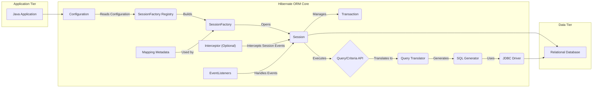
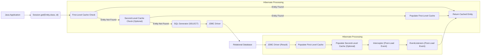

## Project Design Document: Hibernate ORM (Improved)

**1. Introduction**

This document provides an enhanced architectural design overview of the Hibernate ORM (Object-Relational Mapping) framework, specifically tailored for threat modeling activities. It details the key components, interactions, and data flows within Hibernate, offering a comprehensive understanding of its internal workings and potential attack surfaces. This document focuses on core functionalities, common deployment scenarios, and emphasizes aspects relevant to security analysis.

**2. Project Overview**

Hibernate ORM is a robust and widely adopted open-source Java persistence framework. Its primary function is to bridge the gap between object-oriented programming paradigms and relational database systems. By providing an abstraction layer, Hibernate allows developers to interact with databases using Java objects, minimizing the need for manual SQL query construction for standard data access operations. This simplifies development, improves productivity, and enhances code maintainability.

**3. Goals and Objectives**

*   **Facilitate object-relational mapping in Java applications:**  Provide a transparent and efficient mechanism for mapping Java objects to database tables.
*   **Streamline data persistence operations:**  Enable developers to perform CRUD (Create, Read, Update, Delete) operations on database data through intuitive Java object manipulation.
*   **Boost developer efficiency:**  Reduce the amount of boilerplate code typically associated with database interactions, allowing developers to focus on business logic.
*   **Offer a highly configurable persistence framework:**  Support a wide range of database systems, mapping strategies (e.g., annotations, XML), and configuration options.
*   **Provide comprehensive transaction management:**  Ensure data integrity and consistency through robust transaction management capabilities, integrating with JTA or offering local transaction management.
*   **Enable flexible and powerful data querying:**  Offer multiple querying approaches, including the object-oriented HQL (Hibernate Query Language), the standard JPQL (Java Persistence Query Language), and the programmatic Criteria API.

**4. High-Level Architecture**

**5. Key Components (Detailed)**

*   **Configuration:**  The entry point for configuring Hibernate. It reads configuration settings from various sources:
    *   `hibernate.cfg.xml`:  A traditional XML-based configuration file.
    *   `persistence.xml`:  Used in Java EE environments, adhering to the JPA specification.
    *   Programmatic configuration:  Setting properties directly in code.
    This component manages database connection details, mapping information, caching strategies, and other Hibernate-specific properties.
*   **SessionFactory Registry:**  Manages the lifecycle of `SessionFactory` instances. In environments with multiple persistence units, this registry helps manage them.
*   **SessionFactory:** A factory for `Session` objects. It is a heavyweight, thread-safe, immutable object that represents the compiled mapping metadata for a single database. Creating a `SessionFactory` is an expensive operation, so typically only one is created per database.
*   **Session:** A lightweight, non-thread-safe object representing a unit of work with the database. It provides the API for performing CRUD operations on persistent objects. Key responsibilities include:
    *   Managing the first-level cache (session-level cache).
    *   Tracking changes to persistent objects (dirty checking).
    *   Flushing changes to the database.
    *   Managing transactions.
*   **Transaction:**  Defines a unit of work. Hibernate transactions can be managed through:
    *   **JDBC Transactions:**  Directly using the underlying JDBC connection's transaction management.
    *   **JTA (Java Transaction API):**  For managing distributed transactions across multiple resources.
    *   **Programmatic Transaction Management:**  Explicitly starting, committing, or rolling back transactions in code.
    *   **Declarative Transaction Management:**  Using annotations or XML configuration to define transaction boundaries.
*   **Query/Criteria API:**  Provides different ways to retrieve data from the database:
    *   **HQL (Hibernate Query Language):** An object-oriented query language that operates on entities and their properties, abstracting away the underlying database schema.
    *   **JPQL (Java Persistence Query Language):**  A standard query language defined by the JPA specification, offering portability across JPA providers.
    *   **Criteria API:** A programmatic, type-safe way to build queries using Java objects, reducing the risk of syntax errors.
    *   **Native SQL:**  Allows executing raw SQL queries when necessary for database-specific features or complex queries.
*   **Query Translator:**  Takes HQL, JPQL, or Criteria queries and translates them into an abstract syntax tree (AST) representation.
*   **SQL Generator:**  Takes the AST representation of a query and generates the appropriate native SQL query for the target database. This component handles database-specific SQL dialects.
*   **JDBC Driver:**  A vendor-specific driver that enables Hibernate to communicate with the relational database using the JDBC API.
*   **Mapping Metadata:**  Contains information about how Java entities are mapped to database tables. This metadata can be defined through:
    *   **Annotations:**  Decorating entity classes and their properties with JPA or Hibernate-specific annotations.
    *   **XML Mapping Files:**  Defining the mapping in external XML files.
    *   A combination of annotations and XML.
*   **Interceptor (Optional):**  Allows intercepting various Hibernate events (e.g., before saving, after loading) to implement custom logic, such as auditing or data modification.
*   **EventListeners:**  A more powerful mechanism than interceptors for handling Hibernate events. Event listeners can be registered for specific event types and execute custom logic when those events occur.

**6. Data Flow (Detailed)**

**Persisting a New Entity:**

```mermaid
graph LR
    A["Java Application"] --> B("Session.save(entity)");
    B --> C("First-Level Cache Check");
    subgraph "Hibernate Processing"
    direction LR
        C -- "Entity not found" --> D("Entity State Management");
        D --> E("Interceptor (Pre-Save Event)");
        E --> F("EventListeners (Pre-Insert Event)");
        F --> G("SQL Generator (INSERT)");
        G --> H("JDBC Driver");
    end
    H --> I["Relational Database"];
    I --> J("JDBC Driver (Result)");
    subgraph "Hibernate Processing"
        J --> K("Update First-Level Cache");
        K --> L("Interceptor (Post-Save Event)");
        L --> M("EventListeners (Post-Insert Event)");
    end
    M --> N["Java Application (Success)"];
```

**Retrieving an Entity:**

**7. Security Considerations (Elaborated)**

*   **SQL Injection Vulnerabilities:**
    *   Using string concatenation to build HQL/JPQL queries with user-provided input.
    *   Executing native SQL queries with unsanitized user input.
    *   Not using parameterized queries or prepared statements.
*   **Data Breach Risks:**
    *   Insufficient access control at the database level.
    *   Exposing sensitive data in error messages or logs.
    *   Vulnerabilities in the application code that allow bypassing Hibernate's security features.
    *   Insecure configuration of second-level caches, potentially storing sensitive data without proper encryption.
*   **Authentication and Authorization Weaknesses:**
    *   Using default or weak database credentials.
    *   Lack of proper authorization checks within the application logic, allowing unauthorized data access through Hibernate.
    *   Misconfiguration of Hibernate's security features, such as filters or interceptors.
*   **Second-Level Cache Security Issues:**
    *   Storing sensitive data in the second-level cache without encryption.
    *   Unauthorized access to the cache data if not properly secured.
    *   Cache poisoning attacks if an attacker can manipulate cached data.
*   **Configuration Security Flaws:**
    *   Storing database credentials or sensitive configuration details in plain text.
    *   Exposing Hibernate configuration files to unauthorized users.
    *   Using insecure default configurations.
*   **Dependency Vulnerabilities:**
    *   Using outdated versions of Hibernate or its dependencies with known security vulnerabilities.
    *   Not regularly updating dependencies to patch security flaws.
*   **Denial of Service (DoS) Attacks:**
    *   Crafting malicious queries that consume excessive database resources.
    *   Exploiting vulnerabilities in Hibernate's query parsing or execution logic.
    *   Sending a large number of requests to exhaust database connections.
*   **Deserialization Vulnerabilities:** If Hibernate is used in conjunction with features involving object serialization (e.g., second-level caching with certain providers), vulnerabilities related to insecure deserialization could be present.

**8. Deployment Considerations (Security Focused)**

*   **Application Server Security:**
    *   Ensure the application server hosting the Hibernate application is properly secured with the latest security patches.
    *   Configure appropriate access controls and authentication mechanisms for the application server.
    *   Harden the application server against common web application vulnerabilities.
*   **Network Security:**
    *   Segment the network to isolate the database server from the application server and other less trusted networks.
    *   Use firewalls to restrict network access to the database server to only authorized applications.
    *   Encrypt network traffic between the application and the database using TLS/SSL.
*   **Database Security:**
    *   Implement strong authentication and authorization mechanisms for the database.
    *   Follow the principle of least privilege when granting database access to the application.
    *   Regularly audit database access and activities.
    *   Keep the database software up-to-date with the latest security patches.
*   **Connection Pooling Security:**
    *   Securely manage database credentials used for connection pooling. Avoid storing them in plain text.
    *   Configure connection pool settings to prevent resource exhaustion attacks.
*   **Environment Variables and Secrets Management:** Utilize secure methods for managing database credentials and other sensitive information, such as environment variables or dedicated secrets management tools, instead of hardcoding them in configuration files.

**9. Technologies Used**

*   **Java (or Kotlin, Scala):** The primary programming language for Hibernate applications.
*   **JDBC (Java Database Connectivity):** The standard Java API for database interaction.
*   **Relational Database Management Systems (RDBMS):** (e.g., PostgreSQL, MySQL, Oracle Database, Microsoft SQL Server, MariaDB).
*   **XML (Extensible Markup Language):**  Used for configuration and mapping files (optional, annotations are more common).
*   **Annotations (Java Annotations):** Used for metadata mapping within entity classes.
*   **JPA (Java Persistence API):** A specification that Hibernate implements, providing a standard API for object-relational mapping.
*   **JTA (Java Transaction API):** Used for managing distributed transactions.
*   **Caching Providers (Optional):** (e.g., Ehcache, Hazelcast, Infinispan) for implementing second-level caching.
*   **Build Tools (e.g., Maven, Gradle):** For managing dependencies and building the application.
*   **Application Servers (e.g., Tomcat, Jetty, WildFly, GlassFish):**  Common deployment environments for Hibernate applications.

This improved design document provides a more detailed and security-focused overview of Hibernate ORM, making it more suitable for in-depth threat modeling exercises. It highlights key components, data flows, and potential security vulnerabilities, aiding in the identification and mitigation of risks.
