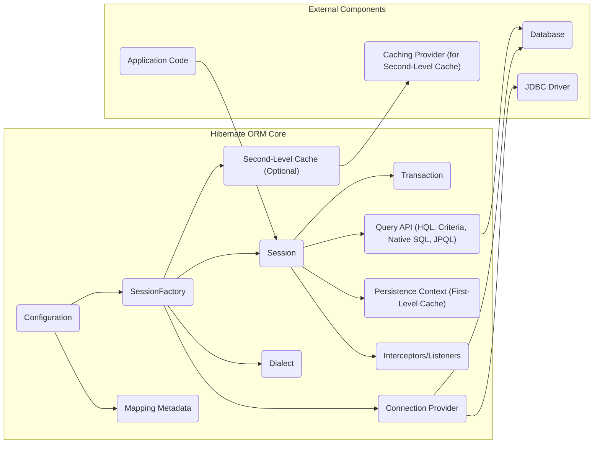
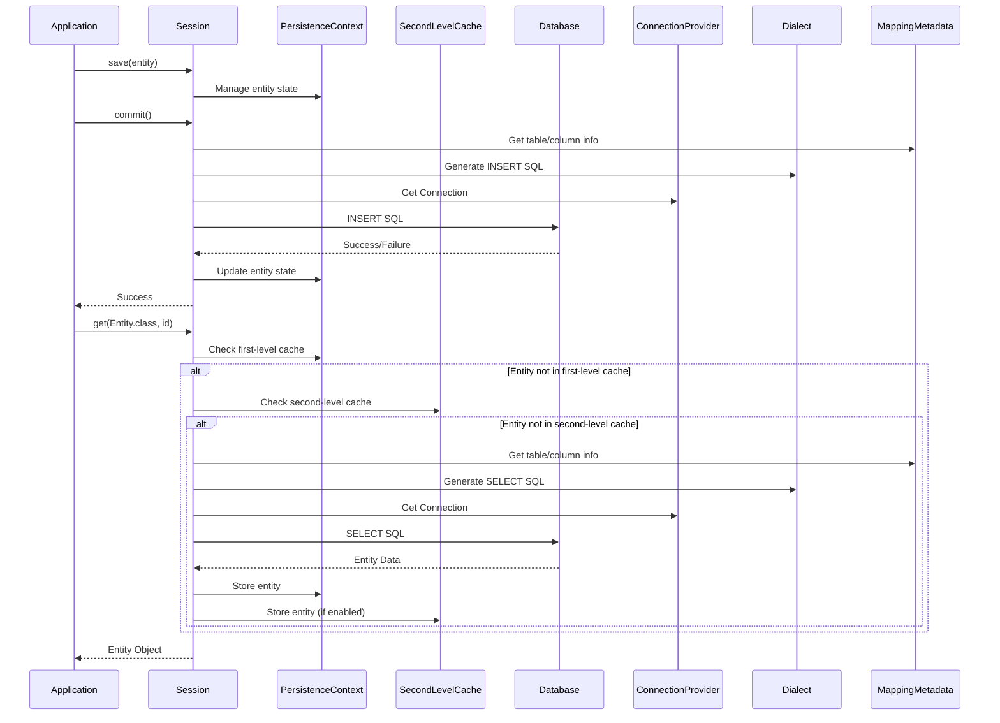

## Project Design Document: Hibernate ORM for Threat Modeling (Improved)

**1. Introduction**

This document provides an enhanced design overview of the Hibernate Object-Relational Mapping (ORM) library, specifically tailored for threat modeling activities. Building upon the previous version, this document offers more granular detail regarding architectural components, data flow, and interactions, with a stronger emphasis on security implications. The target audience includes developers, security analysts, and architects involved in assessing and mitigating potential security risks associated with Hibernate ORM. This document focuses on the core functionalities of Hibernate ORM and deliberately excludes details of specific application server or framework integrations unless they directly impact the core ORM security posture.

**2. Project Overview**

Hibernate ORM remains a widely adopted and robust Java library facilitating object-relational mapping. Its primary function is to abstract the complexities of JDBC and SQL, enabling developers to interact with databases using object-oriented paradigms. This abstraction simplifies data persistence, retrieval, and manipulation, but also introduces potential security considerations that require careful analysis.

**3. Architectural Design**

The following list details the key components within the Hibernate ORM architecture and their interdependencies:

*   **Configuration:**  This component manages Hibernate's operational settings. Configuration sources include `hibernate.cfg.xml`, `persistence.xml` (when used within a JPA context), properties files, and programmatic configuration. It dictates crucial aspects like database connection details, mapping definitions, caching strategies (including eviction policies), transaction management, and connection pooling parameters.
*   **SessionFactory:**  A factory for `Session` instances, representing a compiled form of the mapping metadata for a single database. It's thread-safe and immutable, designed for sharing across an application. Creating a `SessionFactory` is a resource-intensive operation. In a JPA environment, the `EntityManagerFactory` serves a similar purpose and often delegates to Hibernate's `SessionFactory`.
*   **Session:** A single-threaded, short-lived object representing a unit of work with the database. It acts as the primary interface for interacting with persistent data, offering methods for CRUD operations (Create, Read, Update, Delete). The `Session` maintains a first-level cache, also known as the persistence context.
*   **Transaction:**  Manages atomic units of work. Hibernate supports integration with JTA for distributed transactions and also allows for resource-local transactions managed directly by the database connection. Proper transaction management is crucial for data integrity and consistency.
*   **Query API:** Hibernate offers several mechanisms for querying data:
    *   **Hibernate Query Language (HQL):** An object-oriented query language that operates on entities and their properties, abstracting away database-specific SQL syntax.
    *   **Criteria API:** A programmatic, type-safe way to construct queries using Java objects, reducing the risk of syntax errors.
    *   **Native SQL:** Allows execution of raw SQL queries, providing flexibility but requiring careful handling to avoid SQL injection vulnerabilities.
    *   **JPQL (Java Persistence Query Language):** When used within a JPA context, Hibernate supports JPQL, a standardized query language for JPA providers.
*   **Mapping Metadata:** Defines the correspondence between Java entities and database tables. This includes details about table and column names, data types, primary and foreign keys, relationships (one-to-one, one-to-many, many-to-many), inheritance strategies, and lazy loading configurations. Mapping can be defined using annotations, XML files (`hbm.xml`), or a combination.
*   **Persistence Context (First-Level Cache):** A mandatory cache associated with each `Session`. It tracks changes to loaded entities within the current unit of work, ensuring that within a single session, the same database row is represented by the same object instance (identity management). It also optimizes performance by reducing redundant database reads.
*   **Second-Level Cache:** An optional, process-level or cluster-level cache shared across multiple `SessionFactories` or `Sessions`. It significantly improves performance for frequently accessed data. Implementations include Ehcache, Infinispan, Hazelcast, and others. Configuration of cache regions and eviction strategies is critical.
*   **Interceptors and Listeners:** Provide hooks into the Hibernate lifecycle, allowing developers to execute custom logic at various points, such as before saving, after loading, or before deleting entities. This can be used for auditing, validation, security checks, and other cross-cutting concerns.
*   **Connection Provider:** Responsible for obtaining JDBC `Connection` instances. Hibernate typically uses connection pooling mechanisms (either built-in or provided by external libraries like HikariCP or c3p0) to efficiently manage database connections.
*   **Dialect:** A strategy interface that encapsulates database-specific information and functionality. It provides details about SQL syntax variations, data type mappings, sequence generation strategies, and other database-specific behaviors, ensuring Hibernate can generate correct SQL for the target database.

**4. Data Flow**

The following list describes the typical data flow during common database operations initiated through Hibernate:

*   **Saving a New Entity:**
    1. The application creates a new entity object in memory.
    2. The application calls `session.save(entity)` or `session.persist(entity)`.
    3. Hibernate interacts with the `Persistence Context` to manage the entity's state, marking it as "new" or "transient."
    4. When the transaction is committed, Hibernate consults the `Mapping Metadata` and `Dialect` to generate the appropriate SQL `INSERT` statement, taking into account configured column mappings and data types.
    5. The `Connection Provider` obtains a database connection.
    6. Hibernate executes the generated SQL `INSERT` statement against the database via the JDBC driver.
    7. The database executes the insert operation.
    8. The transaction is committed, making the changes permanent in the database. The entity's state in the `Persistence Context` is updated, potentially including generated identifiers.
*   **Loading an Existing Entity:**
    1. The application requests an entity by its identifier using `session.get(Entity.class, id)`, `session.load(Entity.class, id)`, or through a query.
    2. Hibernate first checks the `Persistence Context` (first-level cache) for the entity.
    3. If not found, and a `Second-Level Cache` is configured for the entity's class, Hibernate checks the second-level cache using the entity's identifier and cache region configuration.
    4. If not found in either cache, Hibernate uses the `Mapping Metadata` and `Dialect` to generate the appropriate SQL `SELECT` statement, selecting all mapped columns for the entity.
    5. The `Connection Provider` obtains a database connection.
    6. Hibernate executes the SQL query against the database via the JDBC driver.
    7. The retrieved data from the database is used to populate the entity object. This object is then stored in the `Persistence Context` and potentially in the `Second-Level Cache`, depending on the cache configuration.
    8. The entity object is returned to the application.
*   **Updating an Existing Entity:**
    1. The application retrieves an existing entity from the `Session` (either from the `Persistence Context` or by loading it from the database).
    2. The application modifies the state of the entity object's properties.
    3. When the transaction is committed, Hibernate's dirty checking mechanism compares the current state of the entity in the `Persistence Context` with its original state when it was loaded or attached.
    4. Based on the detected changes, Hibernate uses the `Mapping Metadata` and `Dialect` to generate the appropriate SQL `UPDATE` statement, including only the modified columns (partial updates).
    5. The `Connection Provider` obtains a database connection.
    6. Hibernate executes the SQL `UPDATE` statement against the database via the JDBC driver.
    7. The transaction is committed, persisting the changes to the database. The entity's state in the `Persistence Context` is updated.
*   **Deleting an Entity:**
    1. The application retrieves the entity to be deleted from the `Session`.
    2. The application calls `session.delete(entity)`.
    3. Hibernate interacts with the `Persistence Context` to mark the entity for removal.
    4. When the transaction is committed, Hibernate uses the `Mapping Metadata` and `Dialect` to generate the appropriate SQL `DELETE` statement, typically using the entity's primary key.
    5. The `Connection Provider` obtains a database connection.
    6. Hibernate executes the SQL `DELETE` statement against the database via the JDBC driver.
    7. The transaction is committed, removing the entity from the database. The entity is also removed from the `Persistence Context` and potentially the `Second-Level Cache`.

**5. Key Interactions and Dependencies**

The following list details the crucial interactions and dependencies of Hibernate ORM with external components:

*   **Application Code:** The primary interaction point. Application code uses the `Session` interface to perform all data access operations.
*   **JDBC Driver:**  A fundamental dependency. Hibernate relies on a JDBC driver specific to the target database to establish connections and execute SQL statements. The security and reliability of the JDBC driver are critical.
*   **Database:** The persistent data store. Hibernate manages the interaction with the database based on the configured dialect and mapping metadata.
*   **Caching Providers (Optional):** When a second-level cache is enabled, Hibernate interacts with a chosen caching provider. The security features and configuration of the caching provider become relevant.
*   **Transaction Manager (Optional):** For applications using JTA, Hibernate integrates with a transaction manager (e.g., provided by an application server). The security of the transaction manager is important for maintaining data integrity.
*   **Logging Framework:** Hibernate utilizes a logging framework (e.g., SLF4j, Logback, Log4j) for outputting diagnostic and informational messages. The configuration of the logging framework impacts what information is logged and where it is stored, which has security implications.
*   **JPA Provider (Optional):** When used within a JPA context, Hibernate acts as the JPA provider. The application interacts with JPA interfaces (`EntityManager`, `EntityManagerFactory`), and Hibernate handles the underlying implementation.

**6. Security Considerations (For Threat Modeling)**

The following list provides a more detailed breakdown of potential security considerations for threat modeling, categorized for clarity:

*   **Input Validation and SQL Injection:**
    *   **Threat:**  Improperly sanitized user input incorporated into HQL or native SQL queries can lead to SQL injection attacks, allowing attackers to execute arbitrary SQL commands.
    *   **Mitigation:**  **Always use parameterized queries or prepared statements** when constructing queries with user-provided data. Avoid string concatenation for building SQL. Leverage Hibernate's Criteria API or JPQL, which inherently offer better protection against SQL injection.
*   **Authentication and Authorization:**
    *   **Threat:**  Hibernate itself does not handle user authentication or authorization. These aspects are typically managed at the application level or database level. Misconfigured database permissions or vulnerabilities in the application's authentication/authorization logic can lead to unauthorized data access.
    *   **Mitigation:**  Implement robust authentication and authorization mechanisms within the application. Adhere to the principle of least privilege when granting database permissions to the user Hibernate connects with.
*   **Data Exposure and Information Disclosure:**
    *   **Threat:** Sensitive data might be exposed through excessive logging, inclusion in error messages, or improper caching configurations.
    *   **Mitigation:**  Carefully configure logging levels to avoid logging sensitive information. Sanitize or mask sensitive data before logging. Review error handling to prevent the leakage of internal details. Securely configure and manage the second-level cache, considering encryption and access controls.
*   **Deserialization Vulnerabilities:**
    *   **Threat:** If entities are serialized and deserialized (e.g., for second-level caching or remote communication), vulnerabilities in the deserialization process (like those in libraries like Jackson or XStream) can be exploited to execute arbitrary code.
    *   **Mitigation:**  Keep serialization libraries up-to-date with the latest security patches. Consider alternative serialization mechanisms or carefully configure deserialization settings to mitigate known vulnerabilities.
*   **Dependency Vulnerabilities:**
    *   **Threat:** Hibernate relies on numerous third-party libraries. Vulnerabilities in these dependencies can indirectly affect Hibernate's security.
    *   **Mitigation:**  Regularly scan project dependencies for known vulnerabilities using tools like OWASP Dependency-Check or Snyk. Keep dependencies updated to their latest stable versions.
*   **Configuration Security:**
    *   **Threat:**  Insecurely stored or configured Hibernate settings, such as exposed database credentials in configuration files or overly permissive access to configuration resources, can be exploited.
    *   **Mitigation:**  Store database credentials securely (e.g., using environment variables, secure vaults). Restrict access to Hibernate configuration files. Avoid hardcoding sensitive information.
*   **Bypass of Application-Level Security:**
    *   **Threat:**  Direct database access through Hibernate, if not carefully controlled, might bypass security checks implemented at the application layer.
    *   **Mitigation:**  Design the application architecture to enforce security rules consistently, regardless of the data access method. Use Hibernate interceptors or listeners to enforce security policies at the ORM level.
*   **Denial of Service (DoS):**
    *   **Threat:**  Maliciously crafted or overly complex queries can consume excessive database resources, leading to performance degradation or denial of service.
    *   **Mitigation:**  Implement query timeouts. Analyze and optimize frequently executed queries. Implement input validation to prevent excessively large or complex query parameters.
*   **Mass Assignment Vulnerabilities:**
    *   **Threat:** If entity properties are directly populated from user input without proper validation or whitelisting, attackers might be able to modify unintended fields, potentially leading to privilege escalation or data manipulation.
    *   **Mitigation:**  Avoid directly binding request parameters to entity objects without careful validation. Use Data Transfer Objects (DTOs) to control which properties can be updated.

**7. Deployment Considerations**

The following list outlines security best practices for deploying applications using Hibernate ORM:

*   **Secure Configuration Management:**  Store Hibernate configuration files securely, restricting access to authorized personnel and processes. Use encrypted storage for sensitive configuration data.
*   **Principle of Least Privilege:**  Grant the database user used by Hibernate only the necessary permissions required for the application's operations (e.g., `SELECT`, `INSERT`, `UPDATE`, `DELETE` on specific tables). Avoid granting `DROP` or `ALTER` permissions.
*   **Secure Communication:**  Ensure that communication between the application server and the database server is encrypted using TLS/SSL to protect data in transit.
*   **Regular Updates and Patching:** Keep Hibernate ORM, its dependencies, and the underlying JDBC driver updated to the latest versions to patch known security vulnerabilities.
*   **Monitoring and Logging:** Implement comprehensive monitoring and logging of database interactions and Hibernate operations to detect suspicious activity and potential security breaches. Monitor for unusual query patterns or access attempts.
*   **Secure Classloading:** In environments where untrusted code might be present, ensure secure classloading practices to prevent malicious code from being loaded and executed within the Hibernate context.

**8. Conclusion**

This improved design document provides a more detailed and security-focused overview of Hibernate ORM. It highlights key architectural components, data flow, and crucial security considerations relevant for thorough threat modeling. By understanding these aspects, development and security teams can proactively identify and mitigate potential vulnerabilities, ensuring the secure and reliable operation of applications utilizing Hibernate ORM. This document serves as a valuable resource for conducting detailed threat modeling exercises and implementing appropriate security controls.