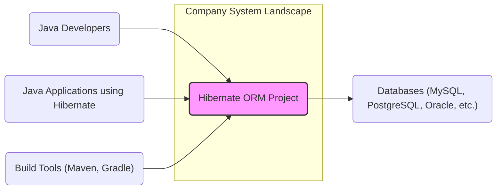
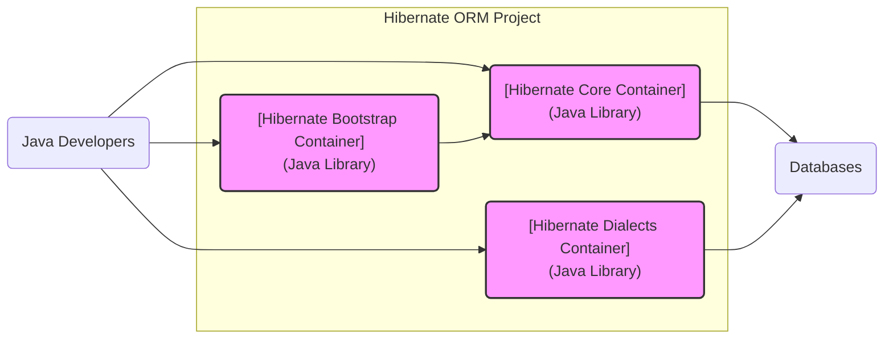
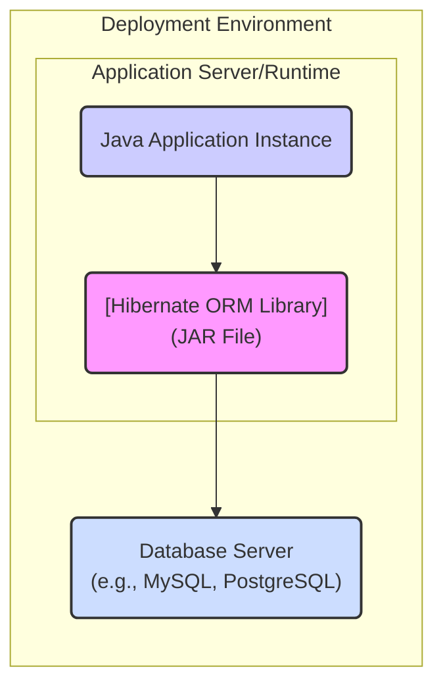
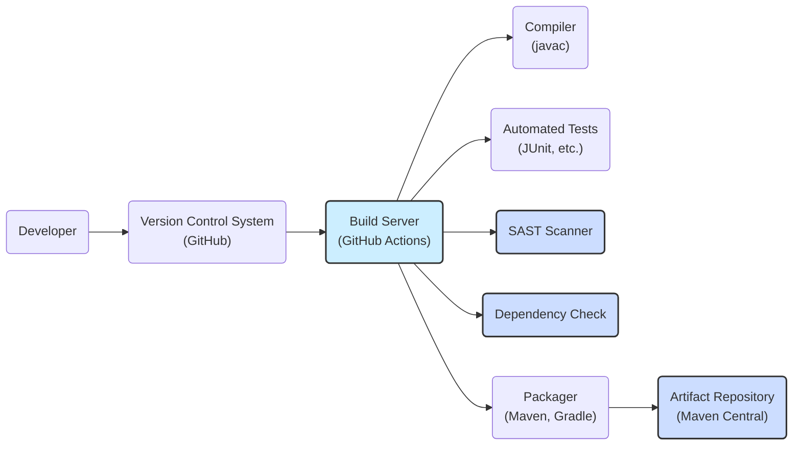

# BUSINESS POSTURE

- Business Priorities and Goals:
  - Provide a robust and performant Object-Relational Mapping (ORM) framework for Java applications.
  - Simplify database interactions for developers, reducing boilerplate code and improving development productivity.
  - Offer a wide range of features and database compatibility to meet diverse application needs.
  - Maintain a stable and reliable framework with backward compatibility to ensure long-term usability.
  - Foster a strong community and provide adequate documentation and support.
- Business Risks:
  - Security vulnerabilities in the Hibernate ORM framework could lead to data breaches or application compromise in systems that depend on it.
  - Performance issues or instability could negatively impact applications using Hibernate, leading to downtime or poor user experience.
  - Lack of compatibility with new database versions or Java platforms could limit adoption and require significant migration efforts.
  - Decreased community support or project abandonment could leave users without necessary updates and security patches.
  - Misuse of Hibernate ORM by developers due to lack of understanding or improper configuration could introduce security vulnerabilities or performance bottlenecks in applications.

# SECURITY POSTURE

- Existing Security Controls:
  - security control: Code reviews are conducted by maintainers as part of the contribution process. (Implemented in: GitHub repository contribution workflow)
  - security control: Unit and integration tests are in place to ensure the correctness and stability of the framework. (Implemented in: GitHub repository test suite)
  - security control: Public vulnerability reporting process via Jira and mailing lists. (Described in: Hibernate ORM project documentation and website)
  - accepted risk: Reliance on developers to use Hibernate ORM securely and configure it properly within their applications.
  - accepted risk: Security of underlying databases and application servers is outside the scope of Hibernate ORM project itself.

- Recommended Security Controls:
  - security control: Implement automated Static Application Security Testing (SAST) tools in the CI/CD pipeline to identify potential vulnerabilities in the code.
  - security control: Integrate Dependency Scanning tools to identify and manage known vulnerabilities in third-party libraries used by Hibernate ORM.
  - security control: Conduct regular penetration testing or security audits of Hibernate ORM by external security experts.
  - security control: Provide security guidelines and best practices documentation for developers using Hibernate ORM to mitigate common security risks.
  - security control: Establish a clear Security Response Plan to handle reported vulnerabilities efficiently and transparently.

- Security Requirements:
  - Authentication:
    - Requirement: Hibernate ORM itself does not handle application user authentication. It relies on the application to establish authenticated database connections.
    - Requirement: Secure storage and management of database credentials used by Hibernate ORM configurations should be ensured by the application using it.
  - Authorization:
    - Requirement: Hibernate ORM should respect database-level authorization and access control mechanisms.
    - Requirement: Applications using Hibernate ORM are responsible for implementing application-level authorization logic to control data access based on user roles and permissions.
  - Input Validation:
    - Requirement: Hibernate ORM should provide mechanisms to prevent SQL injection vulnerabilities by using parameterized queries or prepared statements by default.
    - Requirement: Applications using Hibernate ORM should validate user inputs before using them in queries, even when using ORM features, to prevent potential injection attacks.
  - Cryptography:
    - Requirement: Hibernate ORM should support secure communication protocols (e.g., TLS/SSL) for database connections if required by the underlying database and application environment.
    - Requirement: Hibernate ORM itself does not provide data encryption at rest. Applications requiring data encryption at rest should utilize database-level encryption features or other appropriate encryption mechanisms.

# DESIGN

## C4 CONTEXT

- Context Diagram Elements:
  - - Name: Hibernate ORM Project
    - Type: Software System
    - Description: The Hibernate Object-Relational Mapping (ORM) framework. It simplifies database interactions for Java applications by mapping Java objects to database tables.
    - Responsibilities:
      - Provides APIs and functionalities for object-relational mapping.
      - Handles database interactions, including CRUD operations, transactions, and query execution.
      - Supports various database dialects and features.
    - Security controls:
      - Security controls are primarily focused on secure coding practices and vulnerability management within the Hibernate ORM project itself.

  - - Name: Java Developers
    - Type: Person
    - Description: Software developers who use Hibernate ORM to build Java applications.
    - Responsibilities:
      - Utilize Hibernate ORM to develop data access layers in Java applications.
      - Configure and integrate Hibernate ORM into their projects.
      - Write application code that interacts with Hibernate ORM.
      - Ensure secure and proper usage of Hibernate ORM APIs and configurations.
    - Security controls:
      - Responsible for secure coding practices in their applications that use Hibernate ORM.
      - Implement application-level security controls, such as authentication, authorization, and input validation, in conjunction with Hibernate ORM.

  - - Name: Databases (MySQL, PostgreSQL, Oracle, etc.)
    - Type: External System
    - Description: Relational database management systems that store and manage application data. Hibernate ORM interacts with these databases.
    - Responsibilities:
      - Store and retrieve data for applications using Hibernate ORM.
      - Enforce database-level security controls, such as authentication, authorization, and data encryption.
      - Provide data persistence and transaction management.
    - Security controls:
      - Database-level authentication and authorization mechanisms.
      - Data encryption at rest and in transit (if configured).
      - Database auditing and logging.

  - - Name: Java Applications using Hibernate
    - Type: Software System
    - Description: Java applications that utilize Hibernate ORM for data persistence and database interactions.
    - Responsibilities:
      - Implement business logic and application functionalities.
      - Utilize Hibernate ORM to interact with databases.
      - Manage application-level security, including authentication, authorization, and input validation.
    - Security controls:
      - Application-level authentication and authorization.
      - Input validation and output encoding.
      - Secure session management.
      - Protection against common web application vulnerabilities (e.g., OWASP Top 10).

  - - Name: Build Tools (Maven, Gradle)
    - Type: External System
    - Description: Build automation tools used to manage dependencies, compile, test, and package Java projects, including Hibernate ORM.
    - Responsibilities:
      - Manage project dependencies, including Hibernate ORM library.
      - Compile and package Java code.
      - Execute tests and build artifacts.
    - Security controls:
      - Dependency management and vulnerability scanning (through plugins or integrations).
      - Secure build pipelines and artifact signing (if configured).

## C4 CONTAINER

- Container Diagram Elements:
  - - Name: Hibernate Core Container
    - Type: Java Library
    - Description: Contains the core ORM engine, including session management, transaction handling, query processing, and object-relational mapping functionalities.
    - Responsibilities:
      - Core ORM functionality.
      - Mapping Java objects to database tables.
      - Managing sessions and transactions.
      - Executing queries and interacting with databases.
    - Security controls:
      - Parameterized query generation to prevent SQL injection.
      - Input validation and sanitization within the ORM engine.
      - Secure handling of database connections and credentials (delegated to application configuration).

  - - Name: Hibernate Dialects Container
    - Type: Java Library
    - Description: Provides database-specific dialects that adapt Hibernate Core to different database systems (e.g., MySQL, PostgreSQL, Oracle).
    - Responsibilities:
      - Database-specific SQL generation and optimization.
      - Handling database-specific data types and features.
      - Ensuring compatibility with different database versions.
    - Security controls:
      - Database-dialect specific security considerations are addressed within each dialect implementation.
      - Adherence to secure coding practices in dialect implementations.

  - - Name: Hibernate Bootstrap Container
    - Type: Java Library
    - Description: Provides APIs and functionalities for bootstrapping and configuring Hibernate ORM, including configuration parsing and session factory creation.
    - Responsibilities:
      - Loading and parsing Hibernate configuration files.
      - Creating SessionFactory instances.
      - Managing configuration settings.
    - Security controls:
      - Secure handling of configuration parameters, including database credentials.
      - Validation of configuration inputs to prevent misconfiguration vulnerabilities.

## DEPLOYMENT

- Deployment Options:
  - Option 1: Embedded Library in Java Application (Common Deployment)
  - Option 2: Application Server Deployment (WAR/EAR)
  - Option 3: Cloud-based Deployment (e.g., Spring Boot application in Docker container on AWS, Azure, GCP)

- Detailed Deployment (Option 1: Embedded Library in Java Application):

- Deployment Diagram Elements:
  - - Name: Java Application Instance
    - Type: Software Instance
    - Description: A running instance of a Java application that utilizes Hibernate ORM.
    - Responsibilities:
      - Executes application business logic.
      - Manages application resources and dependencies.
      - Interacts with Hibernate ORM for data persistence.
    - Security controls:
      - Application-level security controls (authentication, authorization, input validation).
      - Secure configuration and deployment of the application instance.
      - Runtime environment security (JVM, OS).

  - - Name: Hibernate ORM Library (JAR File)
    - Type: Library
    - Description: The Hibernate ORM JAR file deployed as a dependency within the Java application.
    - Responsibilities:
      - Provides ORM functionalities to the Java application.
      - Handles database interactions on behalf of the application.
    - Security controls:
      - Security controls are inherited from the Hibernate ORM project's development and build process.
      - No direct deployment-specific security controls for the library itself in this context.

  - - Name: Database Server (e.g., MySQL, PostgreSQL)
    - Type: Infrastructure
    - Description: The database server that the Java application connects to via Hibernate ORM.
    - Responsibilities:
      - Stores and manages application data.
      - Provides database services to the application.
      - Enforces database-level security controls.
    - Security controls:
      - Database server authentication and authorization.
      - Network security controls (firewalls, network segmentation).
      - Database auditing and logging.
      - Data encryption at rest and in transit (if configured).

## BUILD

- Build Process Elements:
  - - Name: Developer
    - Type: Person
    - Description: Software developers contributing code to the Hibernate ORM project.
    - Responsibilities:
      - Write and commit code changes.
      - Perform local testing and code reviews.
      - Adhere to coding standards and security guidelines.
    - Security controls:
      - Secure development environment.
      - Code review process.
      - Security awareness training.

  - - Name: Version Control System (GitHub)
    - Type: Tool
    - Description: GitHub repository used for source code management and collaboration.
    - Responsibilities:
      - Store and manage source code.
      - Track code changes and versions.
      - Facilitate code collaboration and reviews.
    - Security controls:
      - Access control and authentication for repository access.
      - Branch protection and code review enforcement.
      - Audit logging of repository activities.

  - - Name: Build Server (GitHub Actions)
    - Type: Tool
    - Description: Automated build server using GitHub Actions for CI/CD.
    - Responsibilities:
      - Automate the build, test, and packaging process.
      - Execute security checks (SAST, dependency scanning).
      - Publish build artifacts.
    - Security controls:
      - Secure build environment.
      - Access control for build configurations and secrets.
      - Audit logging of build activities.

  - - Name: Compiler (javac)
    - Type: Tool
    - Description: Java compiler used to compile source code into bytecode.
    - Responsibilities:
      - Compile Java source code.
      - Generate bytecode for the Java Virtual Machine (JVM).
    - Security controls:
      - Compiler security is generally assumed to be reliable.
      - No specific security controls directly within the compiler in this context.

  - - Name: Automated Tests (JUnit, etc.)
    - Type: Tool/Process
    - Description: Automated unit and integration tests to verify code functionality.
    - Responsibilities:
      - Execute tests to ensure code correctness and stability.
      - Identify regressions and bugs.
    - Security controls:
      - Tests should include security-related test cases (e.g., input validation, error handling).
      - Test environment should be securely configured.

  - - Name: SAST Scanner
    - Type: Tool
    - Description: Static Application Security Testing tool to analyze source code for potential vulnerabilities.
    - Responsibilities:
      - Scan source code for security weaknesses.
      - Identify potential vulnerabilities (e.g., SQL injection, cross-site scripting).
      - Generate reports of identified vulnerabilities.
    - Security controls:
      - Configuration and maintenance of SAST tool.
      - Remediation of identified vulnerabilities.

  - - Name: Dependency Check
    - Type: Tool
    - Description: Dependency scanning tool to identify known vulnerabilities in third-party libraries.
    - Responsibilities:
      - Scan project dependencies for known vulnerabilities (CVEs).
      - Generate reports of vulnerable dependencies.
      - Facilitate dependency updates and vulnerability mitigation.
    - Security controls:
      - Configuration and maintenance of dependency check tool.
      - Timely updates of dependencies to address vulnerabilities.

  - - Name: Packager (Maven, Gradle)
    - Type: Tool
    - Description: Build automation tools used to package the compiled code and dependencies into distributable artifacts (JAR files).
    - Responsibilities:
      - Package compiled code and dependencies.
      - Create JAR files for distribution.
      - Sign artifacts (optional, for enhanced security).
    - Security controls:
      - Secure packaging process.
      - Artifact signing to ensure integrity and authenticity.

  - - Name: Artifact Repository (Maven Central)
    - Type: Infrastructure
    - Description: Public repository (Maven Central) where Hibernate ORM artifacts are published and distributed.
    - Responsibilities:
      - Host and distribute Hibernate ORM artifacts.
      - Provide access to artifacts for developers and build tools.
    - Security controls:
      - Repository security controls (access control, integrity checks).
      - Artifact signing to ensure authenticity and integrity.

# RISK ASSESSMENT

- Critical Business Processes:
  - Data persistence and retrieval for Java applications using Hibernate ORM.
  - Secure and reliable operation of applications that depend on Hibernate ORM for database interactions.
  - Development productivity and efficiency of Java developers using Hibernate ORM.

- Data to Protect and Sensitivity:
  - Application data managed by Hibernate ORM: Sensitivity depends on the specific application using Hibernate. Could range from publicly accessible data to highly confidential personal or financial information.
  - Database credentials used by Hibernate ORM configurations: Highly sensitive. Compromise could lead to unauthorized database access and data breaches.
  - Hibernate ORM framework code itself: Moderately sensitive. Vulnerabilities in the framework could impact many applications.
  - Build and release artifacts of Hibernate ORM: Moderately sensitive. Compromised artifacts could be distributed to users, leading to supply chain attacks.

# QUESTIONS & ASSUMPTIONS

- Questions:
  - What are the specific security requirements and compliance standards for applications that will use Hibernate ORM? (Assumption: General security best practices are applicable, but specific requirements might exist).
  - What is the risk appetite of organizations using Hibernate ORM? (Assumption: Organizations generally prefer a low risk profile, especially for mature and widely used frameworks).
  - What are the typical deployment environments for applications using Hibernate ORM? (Assumption: Variety of environments, from on-premise application servers to cloud-based containerized deployments).
  - What level of security expertise do developers using Hibernate ORM possess? (Assumption: Varying levels of expertise, requiring clear documentation and security guidelines).

- Assumptions:
  - Hibernate ORM is primarily used in enterprise Java applications that require robust and reliable data persistence.
  - Security is a significant concern for users of Hibernate ORM, given its role in data management.
  - Users expect Hibernate ORM to be developed and maintained with security in mind, including proactive vulnerability management and secure development practices.
  - The provided GitHub repository is the authoritative source for the Hibernate ORM project.
  - The described build process is a general representation and might be simplified for clarity.