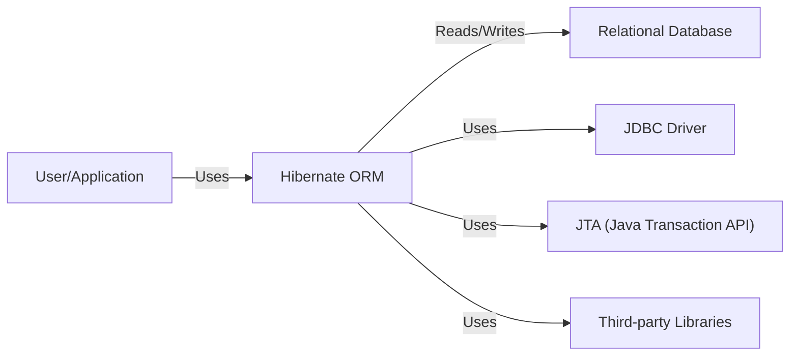
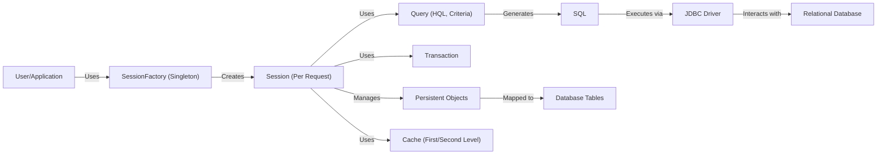
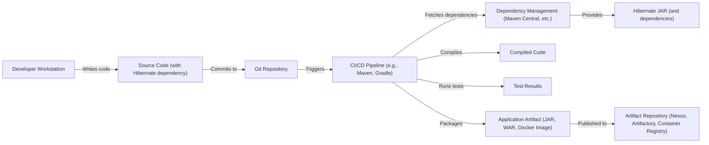

# BUSINESS POSTURE

Hibernate ORM is a mature, widely-used, and critical component for many Java applications, acting as a bridge between object-oriented domain models and relational databases.  The project's primary goal is to simplify database interactions for developers, allowing them to focus on business logic rather than SQL.  It aims to improve developer productivity and application maintainability by providing an abstraction layer over database specifics.

Business priorities:

- Maintainability:  Ensure the codebase remains maintainable and adaptable to evolving database technologies and Java language features.
- Performance:  Provide high-performance data access with minimal overhead.  This includes efficient query generation, caching mechanisms, and connection management.
- Reliability:  Guarantee data integrity and consistency.  This involves robust transaction management, error handling, and exception management.
- Compatibility:  Support a wide range of relational databases and Java environments.
- Community Support:  Foster a strong and active community to contribute to the project's development and provide support to users.
- Ease of Use:  Offer a clear and intuitive API that is easy to learn and use.
- Extensibility: Allow users to customize and extend the framework to meet their specific needs.

Business risks:

- Security Vulnerabilities:  As a widely used library, any security vulnerability in Hibernate could have a significant impact on a large number of applications.  SQL injection, data breaches, and unauthorized access are major concerns.
- Performance Bottlenecks:  Inefficiently configured or used Hibernate mappings can lead to significant performance problems in applications, impacting user experience and potentially causing scalability issues.
- Data Corruption:  Bugs in Hibernate's core functionality, particularly in transaction management or caching, could lead to data corruption or loss.
- Compatibility Issues:  Changes in underlying database systems or Java versions could lead to compatibility problems, requiring significant effort to maintain support.
- Dependency Conflicts:  Hibernate relies on numerous third-party libraries.  Conflicts or vulnerabilities in these dependencies could impact the stability and security of applications using Hibernate.
- Lack of Adoption of New Features/Releases: If users are slow to adopt new versions, they may miss out on important security patches and performance improvements.

# SECURITY POSTURE

Existing security controls:

- security control: Input Validation: Hibernate uses parameterized queries (prepared statements) extensively to prevent SQL injection vulnerabilities. This is a core part of its design and is enforced through the Criteria API and HQL (Hibernate Query Language). Where implemented: Core query generation engine.
- security control: Escaping:  Hibernate performs escaping of special characters in string literals to further mitigate SQL injection risks. Where implemented: Dialect-specific SQL generation.
- security control: Access Control:  Hibernate itself does not directly handle user authentication or authorization.  It relies on the application using it to manage user roles and permissions.  However, it provides mechanisms (like filters) that can be used to implement data-level access control. Where implemented: Application layer using Hibernate, potentially with integration with security frameworks like Spring Security.
- security control: Configuration Security:  Hibernate's configuration (hibernate.cfg.xml or programmatic configuration) can be secured by restricting access to the configuration files and using secure defaults. Where implemented: Application deployment and configuration management.
- security control: Dependency Management: The Hibernate project uses build tools (Maven/Gradle) to manage dependencies and track versions. Where implemented: Build process.
- security control: Regular Security Audits: While not explicitly stated in every release, it's highly likely that a project of Hibernate's size and importance undergoes regular security audits and code reviews. Where implemented: Development lifecycle.
- security control: Exception Handling: Hibernate provides detailed exception handling, allowing applications to gracefully handle database errors and prevent information leakage. Where implemented: API and internal error handling.
- security control: Transaction Management: Hibernate provides robust transaction management, ensuring data consistency and integrity. This helps prevent data corruption in case of errors. Where implemented: Session API and integration with JTA.

Accepted risks:

- accepted risk: Third-Party Library Vulnerabilities:  Hibernate depends on various third-party libraries.  While the project strives to keep these dependencies up-to-date, there's an inherent risk of vulnerabilities in these libraries.
- accepted risk: Misconfiguration:  Incorrectly configuring Hibernate (e.g., disabling security features, using insecure settings) can expose applications to vulnerabilities. This is a user responsibility.
- accepted risk: Lack of Encryption at Rest: Hibernate does not natively encrypt data at rest within the database. This is typically handled by the database system itself or through application-level encryption.
- accepted risk: Denial of Service (DoS): While Hibernate itself isn't directly susceptible to DoS, poorly designed queries or excessive load on the database through Hibernate could lead to a denial of service.

Recommended security controls:

- security control: Implement a robust vulnerability management program: Regularly scan for vulnerabilities in Hibernate and its dependencies using automated tools.
- security control: Provide security hardening guides: Offer clear documentation and best practices for securely configuring and using Hibernate.
- security control: Consider integrating with security frameworks: Provide seamless integration with popular security frameworks like Spring Security to simplify authentication and authorization.
- security control: Explore options for transparent data encryption: Investigate ways to integrate with database-level encryption mechanisms to provide encryption at rest.

Security Requirements:

- Authentication: Hibernate should not handle authentication directly. It should rely on the application or an integrated security framework to manage user authentication.
- Authorization: Hibernate should provide mechanisms (e.g., filters, interceptors) to allow applications to implement fine-grained, data-level authorization based on user roles and permissions.
- Input Validation: Hibernate must continue to use parameterized queries and escaping to prevent SQL injection. Any user-provided input used in queries must be properly validated and sanitized.
- Cryptography:
  - Hibernate should support secure communication with the database (e.g., TLS/SSL).
  - Hibernate should integrate with database-level encryption mechanisms for data at rest.
  - Sensitive data stored in the application's domain model should be encrypted using appropriate cryptographic algorithms before being persisted to the database if required by the application. Hibernate should facilitate this through appropriate hooks or integrations.

# DESIGN

## C4 CONTEXT

Element Descriptions:

-   Name: User/Application
    -   Type: Person/Software System
    -   Description: Represents the user or application that interacts with the database through Hibernate ORM.
    -   Responsibilities:
        -   Initiates database operations (CRUD).
        -   Handles user authentication and authorization.
        -   Provides business logic.
    -   Security controls:
        -   Authentication mechanisms (e.g., username/password, OAuth).
        -   Authorization mechanisms (e.g., role-based access control).
        -   Input validation.

-   Name: Hibernate ORM
    -   Type: Software System
    -   Description: The core Hibernate ORM library, providing object-relational mapping functionality.
    -   Responsibilities:
        -   Maps Java objects to database tables.
        -   Generates SQL queries.
        -   Manages database connections.
        -   Handles transactions.
        -   Provides caching mechanisms.
    -   Security controls:
        -   Parameterized queries.
        -   Escaping of special characters.
        -   Exception handling.

-   Name: Relational Database
    -   Type: Software System
    -   Description: The relational database system (e.g., MySQL, PostgreSQL, Oracle) used to store data.
    -   Responsibilities:
        -   Stores and retrieves data.
        -   Enforces data integrity constraints.
        -   Provides transaction management.
    -   Security controls:
        -   Database user authentication.
        -   Access control lists (ACLs).
        -   Encryption at rest (optional).
        -   Auditing.

-   Name: JDBC Driver
    -   Type: Software System
    -   Description: The JDBC driver specific to the chosen database system, providing a standard interface for Java applications to interact with the database.
    -   Responsibilities:
        -   Establishes connections to the database.
        -   Executes SQL statements.
        -   Returns results to Hibernate.
    -   Security controls:
        -   Secure communication with the database (TLS/SSL).

-   Name: JTA (Java Transaction API)
    -   Type: Software System
    -   Description: An optional API for managing distributed transactions. Hibernate can integrate with JTA for XA transactions.
    -   Responsibilities:
        -   Coordinates transactions across multiple resources.
    -   Security controls:
        -   Transaction isolation levels.

-   Name: Third-party Libraries
    -   Type: Software System
    -   Description: External libraries used by Hibernate for various functionalities (e.g., logging, caching, connection pooling).
    -   Responsibilities:
        -   Provides specific functionalities as required by Hibernate.
    -   Security controls:
        -   Regularly updated to address known vulnerabilities.

## C4 CONTAINER

Element Descriptions:

-   Name: User/Application
    -   Type: Person/Software System
    -   Description: Represents the user or application that interacts with the database through Hibernate ORM.
    -   Responsibilities:
        -   Initiates database operations (CRUD).
        -   Handles user authentication and authorization.
        -   Provides business logic.
    -   Security controls:
        -   Authentication mechanisms (e.g., username/password, OAuth).
        -   Authorization mechanisms (e.g., role-based access control).
        -   Input validation.

-   Name: SessionFactory (Singleton)
    -   Type: Container (Singleton)
    -   Description: A thread-safe, immutable object that is responsible for creating Session objects. It holds all the configuration and mapping information.
    -   Responsibilities:
        -   Creates Session objects.
        -   Caches metadata.
        -   Manages database connection pools.
    -   Security controls:
        -   Secure configuration (e.g., protecting configuration files).

-   Name: Session (Per Request)
    -   Type: Container
    -   Description: A short-lived, non-thread-safe object that represents a single unit of work with the database.
    -   Responsibilities:
        -   Provides methods for CRUD operations.
        -   Manages persistent objects.
        -   Handles transactions.
        -   Uses the first-level cache.
    -   Security controls:
        -   None directly, relies on SessionFactory and application-level security.

-   Name: Query (HQL, Criteria)
    -   Type: Component
    -   Description: Represents a query to be executed against the database, either using HQL (Hibernate Query Language) or the Criteria API.
    -   Responsibilities:
        -   Defines the query logic.
        -   Generates SQL.
    -   Security controls:
        -   Parameterized queries.

-   Name: Transaction
    -   Type: Component
    -   Description: Represents a database transaction.
    -   Responsibilities:
        -   Ensures atomicity, consistency, isolation, and durability (ACID) properties.
    -   Security controls:
        -   Transaction isolation levels.

-   Name: Persistent Objects
    -   Type: Component
    -   Description: Java objects that represent data in the database.
    -   Responsibilities:
        -   Holds data retrieved from or to be persisted to the database.
    -   Security controls:
        -   Application-level encryption of sensitive data (if required).

-   Name: SQL
    -   Type: Data
    -   Description: The SQL statements generated by Hibernate.
    -   Responsibilities:
        -   Interacts with the database.
    -   Security controls:
        -   Generated from parameterized queries.

-   Name: JDBC Driver
    -   Type: Software System
    -   Description: The JDBC driver specific to the chosen database system.
    -   Responsibilities:
        -   Establishes connections to the database.
        -   Executes SQL statements.
        -   Returns results to Hibernate.
    -   Security controls:
        -   Secure communication with the database (TLS/SSL).

-   Name: Relational Database
    -   Type: Software System
    -   Description: The relational database system (e.g., MySQL, PostgreSQL, Oracle).
    -   Responsibilities:
        -   Stores and retrieves data.
        -   Enforces data integrity constraints.
    -   Security controls:
        -   Database user authentication.
        -   Access control lists (ACLs).
        -   Encryption at rest (optional).
        -   Auditing.

-   Name: Database Tables
    -   Type: Data
    -   Description: The tables in the relational database.
    -   Responsibilities:
        -   Stores data.
    -   Security controls:
        -   Database-level security controls.

-   Name: Cache (First/Second Level)
    -   Type: Component
    -   Description: Caching mechanisms used by Hibernate to improve performance. The first-level cache is associated with the Session, while the second-level cache is shared across Sessions.
    -   Responsibilities:
        -   Stores frequently accessed data to reduce database load.
    -   Security controls:
        -   Secure configuration of the second-level cache (if used).

## DEPLOYMENT

Hibernate ORM, being a library, doesn't have a specific deployment model in the same way a standalone application does. It's deployed *as part of* the application that uses it. However, we can describe the deployment of an application *using* Hibernate, and the considerations related to Hibernate within that deployment.

Possible Deployment Solutions:

1.  Traditional Application Server (e.g., JBoss, WebLogic, WebSphere): The application (packaged as a WAR or EAR file) is deployed to a Java EE application server. Hibernate is included as a library within the application's deployment archive.
2.  Embedded Servlet Container (e.g., Tomcat, Jetty): The application is packaged as a self-contained executable JAR file, with an embedded servlet container. Hibernate is included as a library within the JAR.
3.  Standalone Application: The application runs as a standalone Java process. Hibernate is included as a library within the application's classpath.
4.  Cloud-Native (e.g., Kubernetes, Cloud Foundry): The application is containerized (e.g., using Docker) and deployed to a cloud-native platform. Hibernate is included as a library within the container image.

Chosen Deployment Solution (for detailed description): Cloud-Native (Kubernetes)

```mermaid
graph LR
    Developer["Developer Workstation"] -- "Commits code" --> GitRepo["Git Repository"]
    GitRepo -- "Triggers" --> CI["CI/CD Pipeline (e.g., Jenkins, GitLab CI)"]
    CI -- "Builds" --> DockerImage["Docker Image"]
    DockerImage -- "Pushed to" --> ContainerRegistry["Container Registry (e.g., Docker Hub, ECR)"]
    ContainerRegistry -- "Pulled by" --> KubernetesCluster["Kubernetes Cluster"]
    KubernetesCluster -- "Runs" --> Pod["Pod (Application Instance)"]
    Pod -- "Contains" --> AppContainer["Application Container"]
    AppContainer -- "Uses" --> Hibernate["Hibernate ORM"]
    Hibernate -- "Connects to" --> DatabaseService["Database Service (e.g., RDS, Cloud SQL)"]

```

Element Descriptions:

-   Name: Developer Workstation
    -   Type: Node
    -   Description: The developer's local machine where code is written and tested.
    -   Responsibilities:
        -   Code development.
        -   Local testing.
    -   Security controls:
        -   Local security measures (e.g., firewall, antivirus).

-   Name: Git Repository
    -   Type: Node
    -   Description: The version control system (e.g., Git) repository storing the application's source code.
    -   Responsibilities:
        -   Version control.
        -   Collaboration.
    -   Security controls:
        -   Access control (e.g., SSH keys, user authentication).

-   Name: CI/CD Pipeline (e.g., Jenkins, GitLab CI)
    -   Type: Node
    -   Description: The continuous integration and continuous delivery pipeline that automates the build, test, and deployment process.
    -   Responsibilities:
        -   Builds the application.
        -   Runs tests.
        -   Creates container images.
        -   Deploys the application.
    -   Security controls:
        -   Secure access to the pipeline.
        -   Automated security checks (e.g., SAST, DAST).

-   Name: Docker Image
    -   Type: Artifact
    -   Description: The container image containing the application and its dependencies, including Hibernate.
    -   Responsibilities:
        -   Provides a consistent runtime environment.
    -   Security controls:
        -   Vulnerability scanning of the image.
        -   Use of minimal base images.

-   Name: Container Registry (e.g., Docker Hub, ECR)
    -   Type: Node
    -   Description: The registry storing the container images.
    -   Responsibilities:
        -   Stores and manages container images.
    -   Security controls:
        -   Access control.
        -   Image signing.

-   Name: Kubernetes Cluster
    -   Type: Node
    -   Description: The Kubernetes cluster where the application is deployed.
    -   Responsibilities:
        -   Orchestrates containers.
        -   Manages resources.
    -   Security controls:
        -   Network policies.
        -   Role-based access control (RBAC).
        -   Pod security policies.

-   Name: Pod (Application Instance)
    -   Type: Node
    -   Description: A single instance of the application running within the Kubernetes cluster.
    -   Responsibilities:
        -   Runs the application code.
    -   Security controls:
        -   Resource limits.
        -   Security context.

-   Name: Application Container
    -   Type: Container
    -   Description: The container running the application code, including Hibernate.
    -   Responsibilities:
        -   Executes the application logic.
    -   Security controls:
        -   Minimal privileges.
        -   Read-only file system (where possible).

-   Name: Hibernate ORM
    -   Type: Library
    -   Description: The Hibernate ORM library, embedded within the application container.
    -   Responsibilities:
        -   Provides object-relational mapping.
    -   Security controls:
        -   Parameterized queries.
        -   Escaping.

-   Name: Database Service (e.g., RDS, Cloud SQL)
    -   Type: Node
    -   Description: The managed database service provided by the cloud provider.
    -   Responsibilities:
        -   Provides a managed relational database.
    -   Security controls:
        -   Encryption at rest and in transit.
        -   Access control.
        -   Firewall rules.
        -   Regular backups.

## BUILD

The build process for Hibernate ORM itself is complex, involving multiple modules and extensive testing. However, for a typical *application* using Hibernate, the build process focuses on integrating Hibernate as a dependency.

Security Controls in the Build Process:

-   Dependency Management: Using a build tool like Maven or Gradle ensures that Hibernate and its dependencies are managed correctly, with specific versions specified. This helps prevent dependency confusion attacks.
-   Vulnerability Scanning: The CI/CD pipeline should include steps to scan for vulnerabilities in the application's dependencies, including Hibernate. Tools like OWASP Dependency-Check, Snyk, or Nexus IQ can be used.
-   Static Application Security Testing (SAST): SAST tools can be integrated into the build process to analyze the application's source code for potential security vulnerabilities, including those related to Hibernate usage (e.g., improper HQL queries).
-   Software Composition Analysis (SCA): SCA tools analyze the application's dependencies to identify known vulnerabilities and license compliance issues.
-   Build Artifact Signing: The final application artifact (JAR, WAR, or Docker image) can be digitally signed to ensure its integrity and authenticity.
-   Secure Build Environment: The CI/CD pipeline itself should be secured, with access controls and audit logging.

# RISK ASSESSMENT

Critical Business Processes:

-   Data Persistence: Storing and retrieving application data reliably and consistently.
-   Data Integrity: Maintaining the accuracy and validity of data.
-   Application Functionality: Ensuring that the application functions correctly, as Hibernate is a core component for data access.

Data Sensitivity:

-   The data Hibernate handles depends entirely on the application using it. This can range from non-sensitive public data to highly sensitive personally identifiable information (PII), financial data, or health information. The sensitivity level must be determined by the specific application.
-   Hibernate itself does not inherently "know" the sensitivity of the data. It's the application's responsibility to classify and protect data appropriately.

# QUESTIONS & ASSUMPTIONS

Questions:

-   What specific database systems are intended to be supported? This impacts dialect selection and testing.
-   What is the expected load and performance requirements for applications using Hibernate? This influences caching strategies and connection pool configuration.
-   What is the security posture of the applications that will be using Hibernate? This helps determine the level of security hardening required.
-   Are there any specific compliance requirements (e.g., GDPR, HIPAA) that need to be considered?
-   What level of logging and monitoring is required for Hibernate's operations?
-   What is the process for reporting and addressing security vulnerabilities discovered in Hibernate?

Assumptions:

-   BUSINESS POSTURE: The organization deploying applications using Hibernate has a moderate to high risk aversion, given the potential impact of data breaches or data corruption.
-   SECURITY POSTURE: The organization has a mature security program with established processes for vulnerability management, incident response, and secure coding practices.
-   DESIGN: Applications using Hibernate will be designed with security in mind, including proper input validation, authentication, and authorization. The database used with Hibernate will be configured securely, with appropriate access controls and encryption. The deployment environment will also be secured, with network segmentation and monitoring.